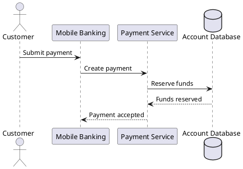

# AGENTS.md

## Mission

Help create and maintain **Architecture Modelling: A Practical Beginner’s Handbook** as a reliable, beginner-friendly and technically accurate book. The repository, not the conversation, is the source of truth.

## Mandatory reading order before any task

1. `BOOK_PLAN.md`
2. `STATUS.md`
3. `STYLE_GUIDE.md`
4. `SOURCE_POLICY.md`
5. `DECISIONS.md`
6. `GLOSSARY.md`
7. The target chapter
8. The preceding and following chapter, where they exist
9. Relevant research notes and diagram-register entries

Do not ask the author to repeat information that already exists in these files.

## Task execution rules

- Work only on the requested scope unless a small adjacent correction is essential.
- Preserve approved structure and terminology unless the task explicitly changes them.
- Never mark a chapter `Approved`; only the author may do that.
- Never fabricate a standard, BIAN concept, quotation, version number or source.
- For unstable or current factual claims, use current primary sources and record them.
- Prefer official sources: OMG for UML/BPMN/DMN, The Open Group for ArchiMate, official C4 documentation, and BIAN for BIAN material.
- Separate established facts, interpretation and author recommendations.
- Keep the beginner explanation accurate; do not simplify it into falsehood.
- Do not equate a BIAN Service Domain with one microservice unless the design explicitly justifies it.
- Do not mix business-process, application and infrastructure detail on one diagram without a stated reason.
- Do not insert copyrighted standards text or diagrams verbatim. Paraphrase and create original diagrams.

## Chapter workflow

For a new or revised chapter:

1. Confirm its purpose and reader outcomes from the chapter file.
2. Check dependencies and glossary terms.
3. Research missing facts using `SOURCE_POLICY.md`.
4. Add source notes under `research/<topic>/`.
5. Draft using `templates/chapter-template.md` or `templates/modelling-topic-template.md`.
6. Add required diagram entries to `DIAGRAM_REGISTER.md` before producing diagrams.
7. Keep examples consistent with `examples/simple-online-store/` and `examples/horizon-bank/`.
8. Run the relevant review checklist.
9. Update `STATUS.md`.
10. Add a concise entry to `CHANGELOG.md`.
11. Add significant choices to `DECISIONS.md`.

## Required end-of-task report

At the end of a Codex task, report:

- Files changed
- What was completed
- Checks run and their results
- New sources added
- Decisions recorded
- Remaining work or risks

## Status rules

Allowed chapter statuses:

- Planned
- Researching
- Outlined
- Drafting
- Diagramming
- Under Review
- Revision Required
- Ready for Author Approval
- Approved
- Published

Update status only when the definition in `WORKFLOW.md` has been met.

## Writing rules

- Use British English.
- Explain simply first, introduce formal language second, and demonstrate third.
- Define an acronym at first use in every standalone chapter.
- Use short paragraphs and informative headings.
- Use tables when they improve comparison, not merely decoration.
- Avoid unexplained jargon, marketing language and vague claims.
- Avoid em dashes; use commas, parentheses or full stops.
- Use consistent terms from `GLOSSARY.md`.
- Every modelling chapter should answer:
  - What is it?
  - What question does it answer?
  - Who uses it?
  - What are its key elements?
  - When should it be used?
  - When should it not be used?
  - How does it compare with alternatives?
  - What mistakes are common?

## Diagram rules

- Give every diagram an ID in the form `FIG-<chapter>-<sequence>`.
- Record it in `DIAGRAM_REGISTER.md`.
- Store editable sources under `diagrams/source/`.
- Store publication exports under `diagrams/exported/svg/` and, only when needed, `diagrams/exported/png/`.
- Prefer SVG for publication.
- Include title, purpose, audience, notation, scope, legend where needed, and a meaningful caption.
- Label important relationships and direction.
- Use colour sparingly and never as the only carrier of meaning.
- Maintain accessibility through sufficient contrast and textual explanation.

## Diagram tooling policy

Use PlantUML as the primary diagram generator.

Codex should create editable `.puml` files for:

- UML diagrams
- C4 diagrams
- Sequence diagrams
- State machines
- Component diagrams
- Deployment diagrams
- Simple entity relationship diagrams
- Many ArchiMate-style explanatory diagrams

Recommended VS Code extension:

```text
Ctrl+P
ext install jebbs.plantuml
```

The PlantUML extension supports live preview with `Alt+D` and exports diagrams from individual files or the whole workspace. It supports SVG and local or server rendering. For local rendering, Java is required. On Windows, the extension normally includes its PlantUML JAR and a Graphviz copy.

PlantUML should be the main tool for this book.

Example:



Codex writes this source file, and the extension renders it.

Use Mermaid as a secondary tool only for simpler diagrams:

- Basic flowcharts
- Simple sequence diagrams
- Timelines
- Git graphs
- Small relationship diagrams
- Diagrams embedded directly inside Markdown

Optional VS Code extension:

```text
Ctrl+P
ext install MermaidChart.vscode-mermaid-chart
```

The Mermaid extension supports `.mmd` files, Markdown Mermaid blocks, live previews, error highlighting and SVG or PNG export.

For repeatable command-line rendering, Mermaid CLI may be installed inside the repository:

```powershell
npm install --save-dev @mermaid-js/mermaid-cli
```

Render Mermaid files with:

```powershell
npx mmdc `
  -i diagrams/source/mermaid/example.mmd `
  -o diagrams/exported/svg/example.svg
```

The official Mermaid CLI generates SVG, PNG and PDF from Mermaid source files.

Do not use Mermaid as the only tool. It is excellent for fast and simple diagrams, but it is less suitable for:

- Detailed UML
- Formal BPMN
- Detailed C4 diagrams
- Formal ArchiMate notation
- Large diagrams requiring precise layout
- Complex banking processes

Use Draw.io integration for manual diagrams when automatic layout is not good enough, especially for:

- Capability maps
- Heat maps
- Architecture roadmaps
- Complex application landscapes
- Detailed cloud and infrastructure diagrams
- Highly formatted book illustrations
- Diagrams needing precise manual placement

Recommended VS Code extension:

```text
Ctrl+P
ext install hediet.vscode-drawio
```

The Draw.io extension is free, works inside VS Code, supports `.drawio` files and can operate offline. Codex can create or modify Draw.io XML, but final visual adjustment may occasionally require manual placement.

Use Camunda Desktop Modeler for formal business-process and decision diagrams.

Camunda Desktop Modeler is installed separately from VS Code, but `.bpmn` and `.dmn` files remain inside the Git repository. It supports BPMN, DMN and forms, and can be associated with those file types on Windows.

Use Camunda Modeler for:

- Customer onboarding
- Loan origination
- Payments
- Fraud investigations
- Know Your Customer (KYC) and Anti-Money Laundering (AML)
- Business decision models
- Exceptions, timers and escalation processes

Codex can generate the initial BPMN XML, but formal BPMN diagrams should be opened and visually reviewed in Camunda Modeler.

### Diagram tool mapping

| Diagram type | Primary tool |
|---|---|
| UML | PlantUML |
| C4 | C4-PlantUML |
| Sequence diagrams | PlantUML |
| State machines | PlantUML |
| Component diagrams | PlantUML |
| Deployment diagrams | PlantUML |
| Simple ERDs | PlantUML |
| Simple flowcharts | Mermaid |
| Timelines | Mermaid |
| BPMN | Camunda Modeler |
| DMN | Camunda Modeler |
| Capability maps | Draw.io |
| Heat maps | Draw.io |
| Roadmaps | Draw.io |
| Complex infrastructure views | Draw.io |
| Formal reusable C4 model | Structurizr later, if needed |

### Codex diagram workflow

When creating diagrams, Codex should:

1. Read the diagram specification.
2. Create `.puml`, `.mmd`, `.bpmn`, `.dmn` or `.drawio` source.
3. Run a preview or rendering command when available.
4. Generate SVG output.
5. Add the diagram reference to the chapter.
6. Update `DIAGRAM_REGISTER.md`.

### Recommended initial installation

Install only these two VS Code extensions now:

- `jebbs.plantuml`
- `hediet.vscode-drawio`

Optionally add:

- `MermaidChart.vscode-mermaid-chart`

Install Camunda Desktop Modeler when work begins on the BPMN chapter.

### Repository source format

Use this source and export structure:

```text
diagrams/
├── source/
│   ├── plantuml/      # UML, C4, sequence, state, deployment
│   ├── mermaid/       # Simple flows and timelines
│   ├── bpmn/          # Camunda BPMN files
│   ├── dmn/           # Camunda decision models
│   └── drawio/        # Capability maps and manual layouts
│
└── exported/
    ├── svg/           # Primary book output
    └── png/           # Preview or fallback
```

For the book, SVG should be the final output format because it stays sharp in PDF, print and web versions.

## Source and citation rules

- Create one source note per meaningful source using `templates/source-note-template.md`.
- Register major sources in `SOURCE_REGISTER.md`.
- Record access date and the standard or framework version.
- Never cite a search-results page when the original source is available.
- Do not rely on blogs for normative definitions when an official specification exists.
- Keep quotations minimal and compliant with copyright.

## Git safety

- Do not run destructive commands such as `git reset --hard`, force push or branch deletion unless explicitly instructed.
- Do not push, merge, tag or create releases unless explicitly instructed.
- Prefer focused commits with a clear purpose.
- Do not commit generated temporary files, local caches or secrets.

## Required repository checks

Run these before completing a substantial task:

```text
python scripts/check-structure.py
python scripts/check-links.py
python scripts/check-terminology.py
python scripts/word-count.py
```

## Quality gates

A chapter is not ready for author approval until:

- Required sections are complete.
- Claims requiring sources have citations or source notes.
- Required diagrams exist or are explicitly deferred.
- Repository structure check passes.
- Terminology checks pass.
- Links check passes.
- Technical, beginner, consistency and source reviews are complete.
- Open issues are documented.

Last updated: 2026-06-28
