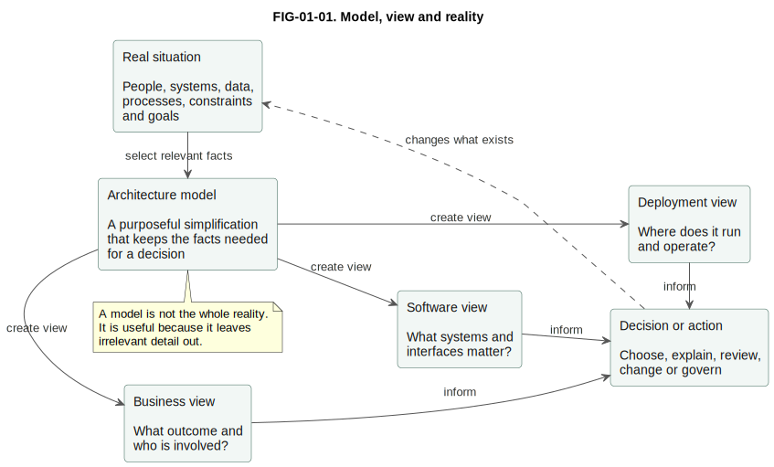

# 1. What Is Architecture Modelling?

## Chapter purpose

Introduce architecture modelling, why it matters, and how models support communication, analysis and decision-making.

## Reader outcomes

By the end of this chapter, the reader should be able to:

- Explain why architecture modelling is useful.
- Distinguish architecture, model, diagram, view, viewpoint, notation and framework.
- Explain why every model is a deliberate simplification.
- Identify the audience and question for a model before choosing a diagram.
- Recognise common mistakes when people use diagrams as if they were complete architecture.
- Apply the idea to a simple online store and to Horizon Bank.

## Prerequisites and dependencies

- No specialist prerequisite. Read Part I first when new to architecture modelling.

## Required models and artefacts

- Conceptual model, view and reality diagram
- Stakeholder-to-view table

## Worked examples

- Simple Online Store
- Horizon Bank

## Source requirements

- `[ISO-42010]` supports vocabulary for architecture descriptions, stakeholders, concerns, views and viewpoints.
- Chapter examples are original and use the repository's Simple Online Store and Horizon Bank case studies.

## Why architecture needs models

Architecture deals with more detail than one person can hold in their head at once. A real organisation has people, software systems, data, processes, infrastructure, security controls, suppliers, regulations, budgets and deadlines. If a team tries to discuss all of that at the same time, the conversation becomes vague or confused.

Architecture modelling helps by selecting the details that matter for a question. A model does not try to copy the whole world. It leaves out irrelevant detail so that the reader can see a structure, relationship, risk or choice more clearly.

For example, imagine a simple online store. A customer wants to browse products, place an order and track delivery. The business owner wants to know whether returns are supported. A developer wants to know which system calls the payment provider. An operations engineer wants to know where the order service runs and how it is monitored. These are all valid questions, but they do not need the same diagram.

Architecture modelling is therefore not drawing for decoration. It is a disciplined way of answering questions:

- What are we talking about?
- Who needs to understand it?
- Which facts matter for this decision?
- What can we safely leave out?
- What should the reader do after seeing the model?

This is why a useful architecture model normally has a title, purpose, scope, audience and explanation. Without those, a diagram can look impressive while still failing to help anyone make a better decision.

## Architecture, model, diagram, view, viewpoint, notation and framework

The words around architecture modelling are often used loosely. This book uses them carefully because later chapters depend on the distinction.

| Term | Plain explanation | Practical caution |
|---|---|---|
| Architecture | The important structure, relationships and principles that shape a system or enterprise. | Do not use architecture as a synonym for one diagram. |
| Model | A purposeful abstraction of part of reality. | A model may be shown through several diagrams or views. |
| Diagram | A visual representation of selected model content. | A diagram is not automatically the whole model. |
| View | A representation prepared for particular stakeholder concerns. | State the audience and question. |
| Viewpoint | A reusable convention for creating a type of view. | Distinguish the recipe from the specific view. |
| Notation | A defined set of symbols and rules. | UML, BPMN and ArchiMate are notations or modelling languages. |
| Framework | A structured body of concepts, methods and guidance. | TOGAF is a framework; C4 is a modelling approach for software architecture. |

The official architecture-description vocabulary uses concepts such as stakeholders, concerns, architecture views and architecture viewpoints [ISO-42010]. This chapter does not reproduce the standard. It uses the same core ideas and explains them in the practical language used throughout this book.

An **architecture** is the subject matter. It is the shape of a system or enterprise: what parts exist, how they relate, what rules guide them and why those choices matter.

A **model** is a selected representation of that subject matter. It might describe the business capabilities of a bank, the main software systems in an online store, the lifecycle of customer data or the deployment of an application across environments.

A **diagram** is one way to show part of a model. Diagrams are powerful because people can see relationships quickly, but they are also dangerous when labels are vague or scope is unclear. A diagram without surrounding explanation often invites guesswork.

A **view** is a representation for a particular audience and set of concerns. A security reviewer, a developer and a business sponsor may all look at the same system but need different views.

A **viewpoint** is the pattern used to create a view. For example, a system context viewpoint tells the modeller to show the system of interest, the people who use it and the external systems around it. A specific online store context diagram is a view created using that kind of viewpoint.

A **notation** gives visual or textual rules. Business Process Model and Notation (BPMN) has events, activities, gateways and flows. Unified Modeling Language (UML) has many diagram types. The C4 model uses a small vocabulary for software architecture views.

A **framework** is broader. It may include concepts, method guidance, roles, processes and governance. Some frameworks include or recommend modelling languages, but the framework and the notation are not the same thing.

## A model is a deliberate simplification

The most important modelling habit is to simplify deliberately. A model is useful because it leaves things out. The skill is knowing what to omit and being honest about the omission.

Figure FIG-01-01. Model, view and reality. It shows how an architecture model selects relevant facts from reality and supports different views for different decisions.

The real situation contains many facts. The model selects the facts needed for a decision. Different views then present those facts for different readers. A business view may focus on outcomes and roles. A software view may focus on systems and interfaces. A deployment view may focus on runtime placement and operational responsibility.

This does not make one view more truthful than another. It means each view is useful for a different question. A returns-process view of the Simple Online Store may show a customer, a support agent, a refund decision and handover to a delivery partner. A software structure view may show the web application, API application, order database, payment provider and delivery partner. Both can be correct, but they answer different questions.

The same principle applies to Horizon Bank. A senior stakeholder may need a landscape view showing digital channels, onboarding, payments, core deposits, financial crime and data platforms. A delivery team may need a container view for the Payments Platform. An operations team may need a production deployment view. These views should be consistent, but they should not all be forced into one large diagram.

## Stakeholders and their information needs

A stakeholder is a person, group or organisation with an interest in the architecture. Stakeholders have concerns. A concern is something they need the architecture description to address, such as cost, risk, usability, security, integration, delivery speed, resilience or maintainability.

Architecture modelling starts badly when the modeller asks "which diagram should I draw?" before asking "who needs to know what?" The notation should serve the question, not the other way round.

| Stakeholder | Typical question | Useful view |
|---|---|---|
| Business sponsor | What outcome are we enabling, and what is in scope? | Context view, capability view or value-stream view |
| Product owner | Which users and external systems are involved? | System context view or user journey |
| Developer | Which software parts own which responsibilities? | Container, component or package view |
| Data specialist | Where does important data originate, move and change? | Conceptual data model, data-flow view or lineage view |
| Security reviewer | Where do trust boundaries and sensitive flows exist? | Threat-model data-flow view or security architecture view |
| Operations engineer | Where does it run, and how is it supported? | Deployment or runtime operations view |
| Enterprise architect | How does this fit the wider estate? | System landscape, capability map or roadmap |

The table is not a rigid rule. It is a starting point. A product owner may sometimes need a process model. A developer may sometimes need a deployment view. The point is to connect the model to the stakeholder's concern.

For the Simple Online Store, a stakeholder-to-view conversation might start like this: the business sponsor needs a simple context and returns process, the development team needs software structure, and the operations engineer needs deployment. If a single diagram tries to satisfy all three groups at once, it will probably become too crowded.

For Horizon Bank, the need for separation is stronger. A banking transformation involves business capabilities, regulatory controls, customer journeys, legacy systems, APIs, events, data, deployment and migration. Good modelling does not hide this complexity. It breaks it into views that can be reviewed one at a time and then connected.

## Structural and behavioural models

Many architecture models fall into two broad families: structural and behavioural. The distinction is simple, but it prevents many confusing diagrams.

A **structural model** shows what exists and how parts relate. It might show applications, databases, interfaces, components, capabilities or deployment nodes. A C4 Container diagram and an application landscape are structural views.

A **behavioural model** shows what happens over time. It might show a customer journey, business process, event flow, decision flow or runtime interaction. A BPMN process model and a UML sequence diagram are behavioural views.

The same subject may need both. In the online store, a structural view can show that the API Application calls the Payment Provider System. A behavioural view can show the sequence of steps when a customer pays for an order. One says what is connected. The other says what happens.

Do not mix structure and behaviour carelessly. A diagram that shows systems, database tables, human workflow, cloud nodes, class names and process decisions all at once is difficult to review. Sometimes a hybrid view is justified, but the reason should be stated.

## Conceptual, logical and physical levels

Architecture models also differ by level of detail. Three common levels are conceptual, logical and physical.

A **conceptual model** explains ideas in business or domain language. It avoids implementation detail. A conceptual data model might show Customer, Order and Product without database columns or indexes.

A **logical model** adds structure and responsibility without binding every choice to a product or runtime. A logical application model might show Web Application, API Application and Order Database, and the main responsibilities of each.

A **physical model** shows implementation choices. It may include cloud regions, network segments, database engines, message brokers, deployment nodes, product names or runtime instances.

These levels are not moral ranks. Conceptual is not less serious than physical. A conceptual model can prevent expensive mistakes by helping people agree what the business terms mean. A physical model can prevent operational mistakes by showing where a system actually runs.

The risk is jumping to the wrong level too early. If the team has not agreed what a "customer" means, a physical database schema will not solve the problem. If the team has already agreed the logical design and is planning production support, a purely conceptual sketch will not be enough.

## Current, transition and target states

Architecture models often describe time as well as structure. A team may need to show the current state, one or more transition states and the target state.

The **current state** is what exists now. It may be messy, inconsistent or poorly documented, but it is the starting point. A good current-state model does not shame the organisation. It makes reality visible enough to change.

The **target state** is the intended future architecture. It should show the desired direction, but it should not pretend that every detail is already known. A target-state model is useful when it guides decisions and exposes trade-offs.

A **transition state** is an intermediate architecture between current and target. It matters because real organisations rarely move in one step. A bank may need to keep a legacy core system while introducing new digital channels, payment orchestration and event publication. Modelling the transition helps the team discuss risk, sequencing and temporary complexity.

For Horizon Bank, a current-state view might show digital channels calling legacy payment functions directly. A target-state view might show a dedicated Payments Platform coordinating validation, screening, posting and events. A transition view might show both patterns running while products migrate. Without transition models, the target can look simple while the migration remains dangerously vague.

## How to choose the first model

When in doubt, start with the question and audience. The first model should make the next conversation easier.

Use this sequence:

1. State the decision or discussion.
2. Identify the audience.
3. Define the boundary.
4. Choose the abstraction level.
5. Select the notation or diagram type.
6. Add only the detail needed for that audience.
7. Write down what the model deliberately omits.

For a small online store, the first view is often a system context sketch. It shows customers, support staff, the online store, the payment provider and the delivery partner. That helps the team agree scope before discussing internal design.

For a bank-wide transformation, the first view may be a system landscape or capability map. It shows where the initiative sits in the wider organisation. That helps senior stakeholders see dependencies before a delivery team zooms into a specific platform.

The key point is that there is no universally correct first diagram. There is only a useful first diagram for the current question.

## Common mistakes

The first mistake is treating a diagram as the architecture. A diagram is one representation. The architecture is the real set of structures, relationships and decisions that shape the system or enterprise.

The second mistake is drawing before deciding the audience. A diagram for everyone usually becomes a diagram for no one. It either contains too much detail or hides the detail that one group needs.

The third mistake is mixing abstraction levels. If a diagram shows business outcomes, class names, database tables and cloud subnets together, the reader has to guess what kind of model it is.

The fourth mistake is using notation as decoration. UML, BPMN, C4, ArchiMate and other approaches are useful when they answer a question. They are not badges of maturity.

The fifth mistake is omitting labels and boundaries. Arrows without labels are ambiguous. Boxes without boundaries leave scope unclear. A good beginner model should make the relationship and direction visible.

The sixth mistake is hiding uncertainty. If part of the architecture is assumed, planned or not yet decided, say so. A model that pretends uncertainty does not exist can create false confidence.

## Chapter cheat sheet

| Question | Useful modelling response |
|---|---|
| What are we trying to understand? | Write the architecture question before drawing. |
| Who is the model for? | Identify stakeholders and concerns. |
| What should be included? | Set the boundary and abstraction level. |
| Is this about parts or sequence? | Choose a structural or behavioural view. |
| Is this business, logical or implementation detail? | Choose conceptual, logical or physical level. |
| Are we describing now or later? | State current, transition or target state. |
| What does the diagram omit? | Record exclusions in the caption or prose. |

## Key takeaways

- Architecture modelling helps people reason about complex systems by using purposeful simplifications.
- A model is not the whole reality. It is useful because it selects relevant facts.
- A diagram is a visual representation, not the complete architecture.
- Views should be created for specific stakeholders and concerns.
- Viewpoints are reusable patterns for creating views.
- Structural models show what exists; behavioural models show what happens.
- Conceptual, logical and physical models answer different levels of question.
- Current, transition and target views help teams plan change realistically.

## Practical exercise

You are asked to help with a new returns feature for the Simple Online Store. Customers can request a return. Customer Support Agents can approve exceptions. The Online Store may call the Payment Provider System for refunds and the Delivery Partner System for collection.

Create a small modelling plan:

1. Who are the first three stakeholders you would consider?
2. What question does each stakeholder need answered?
3. Which first model or view would you create?
4. What would you deliberately exclude from that first view?

Suggested answer:

- The business sponsor needs to know what outcome and scope the returns feature covers.
- The product owner needs to know which people and external systems are involved.
- The development team needs to know where returns responsibility might sit inside the software.
- Start with a simple context view because the first question is scope and external collaboration.
- Exclude database tables, class names, cloud infrastructure and detailed exception workflow from the first view. Add later views only when those questions become active.

## Review checklist

- [ ] The model has a clear question.
- [ ] The intended audience is named.
- [ ] The boundary is explicit.
- [ ] The abstraction level is clear.
- [ ] Structural and behavioural detail are not mixed without a stated reason.
- [ ] Important relationships have labels and direction.
- [ ] The model says what it deliberately omits.
- [ ] The model supports a decision, explanation or review.

## References and further reading

Chapter source notes are maintained in the repository under `research/fundamentals/` and registered in `SOURCE_REGISTER.md`. Appendix H, [Glossary and Source Notes](../appendices/appendix-h-glossary-sources.md), is the intended publication location for the final source-key index once the appendix is completed.

- `[ISO-42010]`: ISO/IEC/IEEE 42010:2022, architecture-description vocabulary and concepts.
