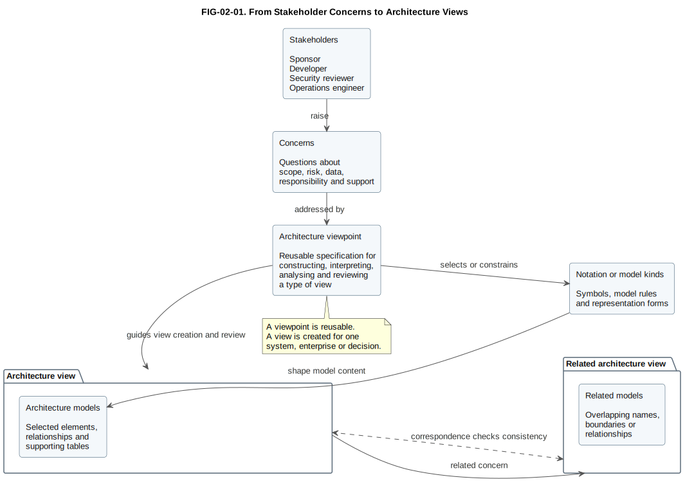

# 2. Model, View and Viewpoint

## Chapter purpose

Build a precise vocabulary for describing architecture representations and selecting stakeholder-oriented views.

## Reader outcomes

By the end of this chapter, the reader should be able to:

- Explain the difference between a model, a view and a viewpoint.
- Connect stakeholders and concerns to the views they need.
- Use a viewpoint specification to guide modelling work.
- Maintain consistency between related views.
- Create a small viewpoint map and cross-view traceability matrix.
- Apply the ideas to the Simple Online Store and Horizon Bank examples.

## Prerequisites and dependencies

- Chapter 1: What Is Architecture Modelling?

## Required models and artefacts

- Viewpoint map
- Cross-view traceability matrix
- FIG-02-01: From Stakeholder Concerns to Architecture Views

## Worked examples

- Online store viewpoints
- Banking transformation viewpoints

## Source requirements

- `[ISO-42010]` supports vocabulary for architecture descriptions, stakeholders, concerns, architecture views, architecture viewpoints, architecture models, model kinds and correspondences.
- Chapter examples are original and use the repository's Simple Online Store and Horizon Bank case studies.

## Why these terms are often confused

Chapter 1 introduced architecture, model, diagram, view, viewpoint, notation, method and framework. This chapter does not restart that whole explanation. It slows down on the three terms that cause the most confusion in daily architecture work: model, view and viewpoint.

People often use model, view, viewpoint and diagram as if they mean the same thing. In casual conversation that may seem harmless. In architecture work it causes practical problems because people stop asking which audience, question and level of detail a representation is meant to serve.

A developer may ask for "the architecture diagram" and expect software responsibilities. A business sponsor may hear the same phrase and expect outcomes, capabilities and scope. A security reviewer may expect trust boundaries and sensitive data flows. If the modeller responds with one crowded picture, every stakeholder receives a partial answer and several important questions remain hidden.

This chapter uses the terms in the following practical way:

| Term | Plain explanation | Practical test |
|---|---|---|
| Model | A purposeful abstraction of part of reality. | What facts has it selected and omitted? |
| View | A representation prepared for stakeholder concerns. | Who is it for, and what question does it answer? |
| Viewpoint | A reusable specification for a type of view. | What rules guide construction, interpretation, analysis and review? |
| Diagram | A visual representation of selected model content. | Is this one picture, or the whole representation package? |

The official architecture-description vocabulary includes stakeholders, concerns, architecture views and architecture viewpoints [ISO-42010]. This book uses those ideas in practical language. The aim is not to turn every beginner into a standards specialist. The aim is to help the reader ask better questions before drawing or reviewing a model.

## What is a model?

A model is a deliberate representation of something more complex than the representation itself. Chapter 1 explained why a model must simplify reality. Here the extra point is that one model may support several views.

A model of the Simple Online Store may include Customer, Online Store, Payment Provider System and Delivery Partner System. A context view may use those elements to discuss scope. A security view may use the same elements to discuss trust boundaries. A deployment view may add runtime detail later.

A model can be expressed through diagrams, tables, text, catalogues and decision records. For example, a software architecture model may include a C4 Container diagram, an interface catalogue, a list of ownership responsibilities and notes about known constraints.

The first discipline of modelling is selection. A modeller chooses which facts matter for the question. The second discipline is honesty. The modeller says what the model includes, what it excludes and what is still uncertain.

## What is a view?

A view is a representation of a system or enterprise from the perspective of related stakeholder concerns. It is not just a drawing style. It is a prepared answer for one or several stakeholders whose concerns overlap.

Consider the Simple Online Store. The product owner may need a context view that shows customers, support agents, the store and external partners. The development team may need a logical software structure view that shows the web application, API application, order database and integration points. The operations engineer may need a deployment view that shows runtime environments, monitoring and support ownership.

Those views can all describe the same store. They should not contain identical detail. If they did, at least two of them would be poorly designed. A useful view selects the model content that addresses the concerns of its readers, even when the readership spans more than one role.

A view may contain one diagram, several diagrams, tables, explanatory prose and open issues. For example, a security view may include a data-flow diagram, a table of trust boundaries, a short list of assumptions and a review checklist. Calling all of that "the diagram" hides the work needed to make the representation useful.

## What is a viewpoint?

A viewpoint is a reusable specification for constructing, interpreting, analysing and reviewing a type of architecture view. If a view is the specific answer prepared for a situation, a viewpoint is the reusable specification for preparing and judging that kind of answer.

A context viewpoint might say:

- Show the system or enterprise area of interest.
- Show the people, organisations and external systems around it.
- Label the relationships that cross the boundary.
- Exclude internal components unless they are needed to explain scope.
- Explain how to interpret relationship labels.
- Review whether the boundary, actors and external dependencies are clear.

Using that viewpoint, the team can create a specific context view for the Simple Online Store or for Horizon Bank's Payments Platform. The resulting views are different because the subjects differ, but the construction rules are similar.

Mature architecture work also separates viewpoint from notation, method and framework. A viewpoint says what kind of view is needed and how to judge it. A notation provides symbols and rules for expression. A method explains how the work is carried out. A framework may include viewpoints, methods, governance guidance and recommended modelling languages. The same viewpoint can sometimes be expressed in more than one notation.

This distinction matters when teams reuse good practice. A viewpoint can be standardised inside an organisation. A view is created for a specific system, project, date and audience. Confusing the two leads to weak governance: teams may copy a diagram without understanding the rules that made it useful.

## Practical viewpoint specification template

The following template is deliberately compact. It is enough for a team to define a repeatable viewpoint without turning the work into a standards manual.

| Field | What to write |
|---|---|
| Name | The viewpoint name, such as Context Viewpoint or Deployment Viewpoint. |
| Purpose | The question this type of view answers. |
| Stakeholders | The roles that normally use the view. |
| Concerns | The stakeholder concerns the view is intended to address. |
| Model content | The kinds of elements and relationships included. |
| Notation or model kinds | The notation, model kind or representation form used. |
| Construction rules | Rules for scope, boundaries, naming, relationship direction and required labels. |
| Interpretation and analysis guidance | How readers should interpret the view and what analysis it supports. |
| Consistency rules | How this view must correspond with related views. |
| Exclusions | Detail that should normally be left out. |
| Sources | Source keys, standards, framework guidance or local repository conventions. |

For example, a context viewpoint for the Simple Online Store might include customers, support agents, the Online Store, the Payment Provider System and the Delivery Partner System. It would exclude classes, database columns and cloud runtime nodes because those belong to more detailed views.

## Expert note: ISO 42010 terminology

ISO/IEC/IEEE 42010:2022 is the source behind several formal terms used in this chapter [ISO-42010]. The book paraphrases the terms rather than reproducing the standard.

| Formal term | Beginner-friendly meaning |
|---|---|
| Architecture description | The set of work products used to express an architecture for stakeholders. |
| Architecture view | A representation within the architecture description that addresses one or more stakeholder concerns. |
| Architecture viewpoint | A specification that governs how to construct, interpret, analyse and review a type of architecture view. |
| Architecture model | A model used within an architecture description, often as part of one or more views. |
| Model kind | A convention for a type of model, including the concepts, relationships, notation or rules it uses. |
| Correspondence between views | A recorded relationship that helps show how elements in different views agree or relate. |

The practical lesson is simple: a view should not stand alone as an isolated picture. It should be tied to concerns, guided by a viewpoint, supported by models and checked against related views.

Figure FIG-02-01. From stakeholder concerns to architecture views. It shows how stakeholders raise concerns, a viewpoint guides the creation and review of an architecture view, model kinds or notation shape the models, and correspondence checks keep related views consistent.

## Stakeholders, concerns and viewpoints

Chapter 1 introduced the stakeholder-to-view idea. This chapter adds the viewpoint step between the concern and the view.

Concerns are best written as questions. "Security" is a topic. "Where does customer data cross a trust boundary?" is a concern that can guide a model. "Cost" is a topic. "Which legacy systems must remain during the first migration release?" is a concern.

The viewpoint map below is a practical way to connect stakeholders, concerns, viewpoints and views before drawing anything.

| Stakeholder | Concern written as a question | Useful viewpoint | Typical view content |
|---|---|---|---|
| Business sponsor | What outcome is in scope, and which external parties are involved? | Context viewpoint | System boundary, customers, partners, major external systems |
| Product owner | Which users and journeys are affected? | User interaction viewpoint | Actors, goals, journeys, channels and major handovers |
| Developer | Which software parts own which responsibilities? | Software structure viewpoint | Containers, components, interfaces and dependencies |
| Data specialist | Where does important data originate and move? | Data viewpoint | Data entities, ownership, stores, flows and lineage |
| Security reviewer | Where do trust boundaries and sensitive flows exist? | Security viewpoint | Trust zones, identities, data classifications and controls |
| Operations engineer | Where does it run, and who supports it? | Deployment viewpoint | Environments, runtime nodes, monitoring and operational ownership |
| Enterprise architect | How does this change fit the wider estate? | Landscape or capability viewpoint | Systems, capabilities, dependencies, lifecycle and roadmap position |

The table is not a universal rule. It is a thinking aid. In real work, one stakeholder may need several views and one view may serve several stakeholders whose concerns overlap. The important habit is to state the concern first, then choose the viewpoint.

## Abstraction and decomposition

Chapter 1 introduced conceptual, logical and physical levels. Here the focus is on using those levels inside a viewpoint.

Abstraction means leaving out lower-level detail so that a higher-level question can be answered. Decomposition means breaking a subject into smaller parts so that responsibilities and relationships can be understood. A viewpoint should say which level it expects.

Use this quick check before choosing notation:

| Level | Main question | Example content | Detail to avoid at this level |
|---|---|---|---|
| Conceptual | What ideas, outcomes or business concepts matter? | Customer, Order, Payment, Account, onboarding capability | Database columns, classes, pods, server names |
| Logical | What responsibilities and relationships should exist? | Web application, API application, account service, payment orchestration | Product-specific deployment settings unless needed |
| Physical | How is it implemented or operated? | Cloud region, cluster, database product, network zone, runtime instance | Broad business motivation unless it explains a design choice |

Good decomposition preserves context. If a container view shows an Online Store API Application, a component view may decompose that API into Order Component, Payment Component and Customer Component. The child view should still make clear which parent it belongs to. Otherwise the reader sees fragments without knowing how they fit.

## Consistency between views

Different views may show different facts, but they should not contradict each other without explanation. Consistency is not the same as duplication. A context view and a deployment view do not need the same detail, but they should use compatible names, boundaries and assumptions.

Common consistency checks include:

- The same element has the same name unless there is a stated reason.
- A system shown as external in one view is not silently treated as internal in another.
- A relationship shown in a detailed view is traceable to a higher-level dependency.
- Current-state, transition-state and target-state views are labelled.
- Security boundaries, data ownership and operational ownership are not contradicted across views.

A cross-view traceability matrix helps teams manage this without forcing every detail into every diagram. Keep it narrow enough to read on a book page.

| Element or concern | Where it appears | Consistency question |
|---|---|---|
| Customer identity | Context, data and security views | Is the same customer identity concept used across the views? |
| Order submission | Context, software structure and security views | Does the software responsibility match the external interaction shown in context? |
| Payment authorisation | Context, software structure, data, deployment and security views | Are provider dependency, payment status, runtime path and trust boundary compatible? |
| Delivery handover | Context, software structure, data and security views | Is shared delivery data consistent with the integration and privacy explanation? |

The matrix does not replace views. It helps reviewers see whether important subjects are covered by the right views and whether the views agree. For a larger programme, this matrix can become a repository artefact with links to the relevant diagrams, model files and decisions.

## Viewpoint catalogue

A viewpoint catalogue is a reusable list of common viewpoint types. It helps teams avoid starting every modelling conversation from a blank page.

| Viewpoint | Main question | Typical form |
|---|---|---|
| Context | What is in scope, and what surrounds it? | C4 context or simple box-and-line view |
| Capability | What abilities does the organisation need? | Capability map |
| Process | What happens over time to produce an outcome? | BPMN, swimlane or activity view |
| Software structure | Which software parts own which responsibilities? | C4 container, C4 component or UML component view |
| Interaction | How do participants collaborate at runtime? | Sequence diagram or C4 dynamic view |
| Data | What information exists, moves and changes? | Conceptual data model, data-flow view or lineage view |
| Deployment | Where does the system run? | C4 deployment, UML deployment or cloud view |
| Security | Where are threats, controls and trust boundaries? | Threat-model data-flow or trust-boundary view |
| Migration | How do we move from current to target? | Roadmap, transition architecture or dependency map |

Common mistakes are usually viewpoint mistakes before they are notation mistakes. Context views become cluttered when they add internal design too early. Capability views become misleading when they describe process steps. Software structure views become confusing when they mix logical components with deployment nodes. Security views become weak when colour is used without labelled controls or trust boundaries.

This catalogue is intentionally modest. Later chapters expand the individual notations. At this stage, the reader should focus on matching the viewpoint to the concern.

## Worked mapping exercise

Imagine the Simple Online Store is adding returns. Customers can request a return, support agents can approve exceptions, the store may trigger a refund through the payment provider and the delivery partner may collect the parcel.

A sensible first modelling plan might be:

| Step | Modelling choice | Reason |
|---|---|---|
| 1 | Create a context view | Establish customers, support agents, payment provider and delivery partner before internal design detail. |
| 2 | Create a process view | Show how a return request moves through approval, refund and collection. |
| 3 | Create a software structure view | Allocate responsibilities between web application, API application, order data and integrations. |
| 4 | Create a data view | Clarify which return, refund and delivery data is stored or shared. |
| 5 | Create a security view if sensitive data or refund controls are material | Review trust boundaries, authorisation and fraud risk. |

For Horizon Bank, consider a digital onboarding transformation. The stakeholder set is wider, so the viewpoint map becomes more important:

| Stakeholder | First concern | First useful view |
|---|---|---|
| Retail banking sponsor | Which customer outcome and channels are in scope? | Capability or context view |
| Compliance team | Where are Know Your Customer and Anti-Money Laundering checks performed? | Process and control view |
| Data office | Which party, identity and account data is mastered where? | Conceptual data and lineage view |
| Solution architecture team | Which systems collaborate during onboarding? | System landscape and container views |
| Security team | Where are identity proofing, consent and sensitive data protected? | Trust-boundary and authentication views |
| Operations team | Which services must be monitored and supported? | Deployment and operations view |

No single view should carry all of that detail. The modelling task is to create a coherent set of views, each with a clear purpose, and then maintain traceability between them.

## Chapter summary and knowledge check

The central idea of this chapter is straightforward: a model selects facts, a view presents selected model content for stakeholder concerns, and a viewpoint guides how a type of view should be constructed, interpreted, analysed and reviewed.

Use these scenario-based questions to test understanding:

| Scenario question | Good answer should include |
|---|---|
| A sponsor asks whether the returns feature includes delivery collection. Which view comes first? | A context or process view, with the scope and external delivery partner visible. |
| A developer asks where refund logic belongs. Which viewpoint helps next? | A software structure viewpoint, probably container or component level, after scope is agreed. |
| A security reviewer asks where customer data crosses a boundary. What should the viewpoint require? | Trust boundaries, sensitive data movement, control points and interpretation guidance. |
| A data view says Payment Status, but a process view says Refund State. What should be checked? | A correspondence or traceability check between the related concepts. |
| A diagram shows capabilities, classes and cloud subnets together. What is the likely problem? | Mixed abstraction levels and an unclear viewpoint. |

If the reader can answer those questions, later chapters on UML, C4, BPMN, ArchiMate, data and BIAN will be easier to understand.

## Key takeaways

- A model selects facts for a purpose.
- A view addresses one or more stakeholder concerns.
- A viewpoint specifies how to construct, interpret, analyse and review a type of view.
- Concerns work best as concrete questions.
- Model kinds and notations shape how model content is expressed.
- Correspondence checks keep related views consistent.
- A viewpoint catalogue makes view selection repeatable.

## Practical exercise

You are helping Horizon Bank plan a new mobile payment feature. Customers can submit payments through the mobile app. The bank must validate the payment, check fraud and sanctions rules, post to accounts, notify the customer and support operations after release.

Create a modelling plan with four views:

1. Identify the stakeholder for each view.
2. Write one concern as a question for each stakeholder.
3. Choose a viewpoint for each concern.
4. State one thing each view should deliberately exclude.

Suggested answer:

| Stakeholder | Concern | Viewpoint | Deliberate exclusion |
|---|---|---|---|
| Retail banking sponsor | Which customer and business outcome is in scope? | Context or capability viewpoint | Internal class or database detail |
| Compliance reviewer | Where are sanctions and fraud checks performed? | Process and control viewpoint | Cloud node names unless relevant to control operation |
| Solution architect | Which systems collaborate during payment submission? | System landscape or container viewpoint | Detailed user-interface screens |
| Operations engineer | Where does the payment capability run and how is it supported? | Deployment viewpoint | Business capability taxonomy unless needed for ownership |

The exact answer can vary. A strong answer connects each view to a stakeholder concern and explains what is intentionally left out.

## Review checklist

- [ ] The model has a clear purpose and stated omissions.
- [ ] Each view names its stakeholder audience.
- [ ] Each stakeholder concern is written as a question.
- [ ] The chosen viewpoint fits the concern and abstraction level.
- [ ] The viewpoint specification covers construction, interpretation, analysis and review.
- [ ] Conceptual, logical and physical details are not mixed accidentally.
- [ ] Decomposed views identify the parent element they explain.
- [ ] Cross-view names, boundaries and relationships are consistent.
- [ ] Current, transition and target states are labelled when time matters.
- [ ] Tables, diagrams and prose agree with each other.
- [ ] Source keys are preserved for normative vocabulary.

## References and further reading

Chapter source notes are maintained in the repository under `research/fundamentals/` and registered in `SOURCE_REGISTER.md`. Appendix H, [Glossary and Source Notes](../appendices/appendix-h-glossary-sources.md), is the intended publication location for the final source-key index once the appendix is completed.

- `[ISO-42010]`: ISO/IEC/IEEE 42010:2022, architecture-description vocabulary and concepts.
