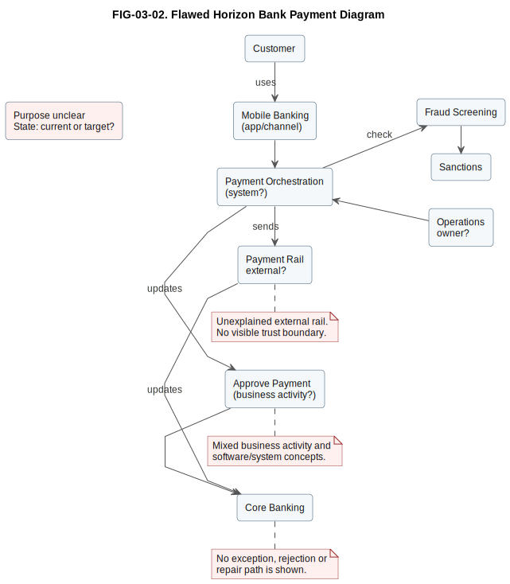
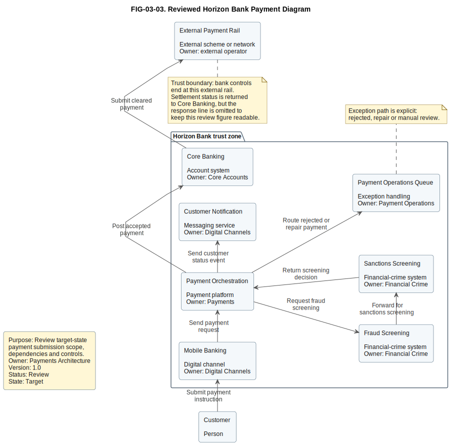

# 3. How to Read Architecture Diagrams

## Chapter purpose

Teach a repeatable method for interpreting architecture diagrams accurately and reviewing their quality.

## Reader outcomes

By the end of this chapter, the reader should be able to:

- Read a diagram by starting with its title, purpose, audience and viewpoint.
- Identify scope, boundary, actors, systems, responsibilities and relationship direction.
- Use notation, legends and labels without guessing.
- Separate logical, physical, ownership and trust-boundary information.
- Spot omissions, assumptions and common quality problems.
- Apply a diagram-reading checklist to the Simple Online Store and Horizon Bank.

## Prerequisites and dependencies

- Chapter 2: Model, View and Viewpoint

## Required models and artefacts

- FIG-03-01: Annotated online store context diagram
- FIG-03-02: Flawed Horizon Bank Payment Diagram
- FIG-03-03: Reviewed Horizon Bank Payment Diagram
- Diagram-reading checklist

## Worked examples

- Online store diagram
- Bank payment diagram

## Source requirements

- `[ISO-42010]` supports the vocabulary of views, viewpoints, stakeholders and concerns.
- `[C4-OFFICIAL]` supports the C4 model (Context, Containers, Components and Code) System Context style used in the Simple Online Store example.
- Chapter examples are original and use the repository's Simple Online Store and Horizon Bank case studies.

## Start with title, purpose and audience

A diagram should be read like an answer to a question, not like a picture to admire. Before looking at boxes and arrows, ask three things:

1. What is the diagram called?
2. What question is it trying to answer?
3. Who is expected to use it?

If those three things are missing, the reader is forced to guess the viewpoint. A developer may assume the diagram explains software structure. A business sponsor may assume it explains scope. A security reviewer may search for trust boundaries that the diagram never intended to show.

A useful diagram should also carry enough metadata to stop readers treating an old sketch as a current decision. At minimum, check for:

| Metadata item | Reader question |
|---|---|
| Owner | Who is accountable for keeping the diagram correct? |
| Last-updated date | How fresh is the information? |
| Version | Which revision is being discussed or reviewed? |
| Review or approval status | Is this draft, review, approved or superseded? |
| Current, transition or target state | Is the diagram describing now, an interim state or the intended future? |

Chapters 1 and 2 used the terms model, view and viewpoint. Apply them when reading diagrams. The diagram is a view or part of a view. It should address stakeholder concerns. A viewpoint should explain what belongs in this kind of view and how to interpret it [ISO-42010].

For example, a Simple Online Store context diagram should answer a scope question: who uses the store, and which external systems does it depend on? It should not be judged as if it were a database model or deployment topology. The first reading habit is to identify the intended question before judging detail.

## Find the scope and boundary

The next step is to find the boundary. A boundary says what is inside the subject being described and what is outside it. Without a boundary, readers may disagree about ownership, responsibility and risk.

In a system context diagram, the main boundary may be the software system being discussed. In a business process diagram, the boundary may be a process, department or customer journey. In a deployment diagram, the boundary may be an environment, network zone or runtime platform.

Look for words such as system, platform, process, domain, environment, organisation, current state or target state. If the diagram does not use those words, ask the modeller to state the scope in the title, caption or surrounding prose.

Figure FIG-03-01. Annotated online store context diagram. It shows how a reader can inspect a context diagram by checking title and purpose, system boundary, actors, external systems, relationship labels, omissions and review questions. Payment response detail is deliberately omitted; the delivery request and tracking update are shown as separate directional relationships.

In Figure FIG-03-01, the Online Store is the system in scope. The Customer and Customer Support Agent are outside the system because they are people who interact with it. The Payment Provider System and Delivery Partner System are outside because they are external systems. That separation is more important than the exact drawing style.

## Identify actors, systems and responsibilities

After finding the boundary, identify the things shown on the diagram. Do not read every box as the same kind of thing. A person, team, software system, database, business capability and cloud node mean different things.

Useful questions are:

- Is this element a person, organisation, software system, container, component, data store, process step or runtime node?
- Who owns it?
- What responsibility does it have?
- Is it inside or outside the boundary?
- Is it current, planned or target-state?

For the Simple Online Store, the Customer places orders and tracks delivery. The Customer Support Agent handles support and return exceptions. The Online Store owns catalogue, basket, order and return interactions at this level of abstraction. The Payment Provider System receives authorisation or refund requests. Detailed payment responses are omitted from this context view. The Delivery Partner System receives delivery requests and sends tracking updates.

The same reading habit applies to Horizon Bank. If a diagram shows Mobile Banking, Payment Orchestration, Core Banking, Fraud Screening and Sanctions Screening, do not assume they are all the same kind of thing. Some may be channels, some may be platforms, some may be external services and some may be logical responsibilities that are not separately deployed.

## Read relationships and direction

Arrows are often the most misunderstood part of architecture diagrams. An arrow may mean "calls", "uses", "depends on", "sends data to", "is deployed on", "is part of", "triggers" or "reports to". Direction matters only when the viewpoint defines what direction means.

When reading an arrow, ask:

- What does the relationship label say?
- Which way does the relationship point?
- Is the direction request, response, dependency, data movement, control flow or ownership?
- Is the relationship synchronous, asynchronous or not specified?
- Is this a current relationship or a planned target relationship?

Avoid filling in missing relationship meaning from memory. If an arrow from Online Store to Payment Provider System is labelled "authorises payment", the reader can infer a payment interaction. If the arrow is unlabelled, the reader does not know whether the store sends card details, receives status, redirects the customer or reconciles settlements.

For Horizon Bank, relationship labels become even more important. "Screens payment" is not the same as "owns payment decision". "Publishes event" is not the same as "calls synchronously". "Replicates customer data" is not the same as "masters customer data". Good diagrams reduce guessing.

Do not infer runtime sequence or dependency direction from spatial position alone. A box placed above another box is not automatically earlier in a process, more important, more trusted or a parent component. Position may be chosen only to make the page readable. Direction and meaning should come from the viewpoint, relationship labels, arrowheads and prose.

## Understand legends and notation

Notation is helpful only when the reader knows what it means. Some diagrams use formal notations such as Unified Modeling Language (UML), Business Process Model and Notation (BPMN), C4, ArchiMate or Decision Model and Notation (DMN). Others use informal boxes and arrows.

When a diagram uses a formal notation, read the notation according to its rules. A BPMN gateway is not a decorative diamond. A UML actor is not always a human person. A C4 model (Context, Containers, Components and Code) container is a separately runnable or deployable unit or a data store, not automatically a Docker container [C4-OFFICIAL].

When a diagram uses an informal notation, it should include a legend or enough labels to make the meaning clear. Colour should never be the only way to understand the diagram. If red boxes mean high risk, the label should say so. If dashed lines mean planned relationships, the legend should say so.

A good reader does not need to memorise every notation before reading a diagram. The first skill is to notice when the notation matters and ask for the rules that the diagram depends on.

## Distinguish logical and physical elements

Many confusing diagrams mix logical and physical detail. Logical elements describe responsibilities and relationships. Physical elements describe implementation, runtime placement or infrastructure.

An API Application is usually a logical software element unless the diagram says it is a running instance. A Kubernetes pod is a physical or runtime element. A Customer capability is a business concept. A Customer table is a physical data structure. These things can be related, but they should not be treated as interchangeable.

Use this quick reading test:

| If the diagram shows | Ask |
|---|---|
| Capability or process language | Is this a business or operating view? |
| Applications, systems or components | Is this logical software structure? |
| Tables, entities or data flows | Is this conceptual, logical or physical data detail? |
| Nodes, regions, networks or clusters | Is this deployment or infrastructure? |
| Controls, identities or zones | Is this a security view? |

The problem is not that a diagram ever combines ideas. Sometimes an operations view needs application names and runtime nodes together. The problem is mixing viewpoints without telling the reader why.

## Look for trust and ownership boundaries

Some boundaries are about scope. Others are about trust, ownership or control. These boundaries are easy to miss, but they often matter more than the boxes.

A trust boundary exists where trust assumptions or trust levels change. It is not automatically the same as every system boundary, team boundary or organisational boundary. The question is whether the reader needs to understand a change in control, identity, assurance, data sensitivity, exposure or responsibility.

The boundary between the Online Store and Payment Provider System may be a trust boundary if payment data, authorisation responsibility or security assumptions change at that point. It should not be labelled as a trust boundary merely because the provider is another box. In Horizon Bank, trust boundaries may exist between customer-facing channels, internal bank platforms, financial-crime services, core banking and external payment schemes, but the modeller should state the reason.

Ownership boundaries answer a different question: who is responsible for change, operation, support or data quality? A diagram may show that one team owns a customer platform while another owns core deposits. If ownership is hidden, review decisions become slower because nobody knows who can approve change.

When reading a diagram, ask:

- Which boundaries are scope boundaries?
- Which boundaries are trust boundaries?
- Which boundaries are team, supplier or operational ownership boundaries?
- Which data crosses those boundaries?
- Which controls or responsibilities are shown at the crossing?

If the diagram handles sensitive data but shows no trust boundary, it is probably incomplete for security review.

## Check omissions and assumptions

Every diagram omits something. That is not a weakness. It becomes a weakness only when the omission is hidden.

Good diagrams state what they leave out. A context view may deliberately omit internal components. A process view may omit technical retry behaviour. A deployment view may omit business motivation. A current-state view may omit target changes.

Look for hidden assumptions:

- Does the diagram assume one environment or several?
- Does it show current state, target state or a mixture?
- Does it omit failure paths?
- Does it omit users, support teams or external systems?
- Does it show data movement but omit ownership or sensitivity?
- Does it show dependencies without indicating direction?

For Horizon Bank payment diagrams, omissions can be critical. A high-level payment landscape may omit sanction-screening detail because another view covers it. That is acceptable when the omission is stated. It is risky when the diagram appears to show the whole payment process but leaves out fraud, sanctions, exceptions and reconciliation.

## Review questions

Use review questions before arguing about style. A visually attractive diagram can still be weak. A rough diagram can still answer the right question.

| Review area | Questions to ask |
|---|---|
| Purpose | What question does this diagram answer? Who is it for? |
| Scope | What is inside the boundary? What is outside? |
| Viewpoint | What kind of view is this, and what should it include? |
| Elements | Are the element types clear? Are names consistent with other views? |
| Relationships | Are arrows labelled? Is direction meaningful? |
| Notation | Is the notation formal, informal or mixed? Is there a legend? |
| Abstraction | Are business, logical and physical details mixed deliberately? |
| Boundaries | Are scope, trust and ownership boundaries visible where needed? |
| Omissions | What has been deliberately left out? |
| Action | What decision, review or conversation should this diagram support? |

These questions are not only for reviewers. They are also useful while drawing. If the modeller cannot answer them, the diagram is not ready for review.

## Worked banking review

Figure FIG-03-02 is intentionally flawed. It is not a recommended design. It is a realistic example of the kind of payment diagram that appears in workshops when the team has not yet agreed the viewpoint, state, ownership or level of abstraction.

Figure FIG-03-02. Flawed Horizon Bank Payment Diagram. It deliberately includes unclear purpose, ambiguous current or target state, vague or missing relationship labels, mixed business and software concepts, hidden trust boundary, ambiguous ownership, an unexplained external payment rail and missing exception information.

A reviewer should not start by redrawing it. The first step is to identify the problems precisely:

- The purpose and state are unclear, so the reader cannot tell whether the diagram is current, transition or target.
- Some relationships are vague or unlabelled, so arrow direction does not explain meaning.
- A business activity, "Approve Payment", is mixed with software-system concepts.
- The external payment rail is not explained, even though it changes control and trust assumptions.
- Ownership is ambiguous for operations and several systems.
- Exception, rejection, repair and manual-review paths are absent.

Figure FIG-03-03 shows one corrected or annotated version. It is still a simplified teaching diagram, not a complete payment architecture.

Figure FIG-03-03. Reviewed Horizon Bank Payment Diagram. It adds purpose, owner, version, review status, target-state metadata, system ownership, labelled relationship direction, a visible trust boundary for the external payment rail and an explicit exception path. The settlement-status response is stated in a note rather than drawn as a parallel arrow, to keep the review figure readable.

The corrected version does not show everything. It still omits detailed fraud rules, sanctions list sources, message schemas, deployment nodes and operational runbooks. That is acceptable because the diagram states its purpose and keeps the omitted detail out of scope.

## Guided practice: Online Store

Re-read Figure FIG-03-01 and answer these questions:

1. What is the system in scope?
2. Which elements are people?
3. Which elements are external systems?
4. Which relationships are shown with direction?
5. Which response detail is deliberately omitted?
6. Which relationship would need more detail for security review?

Suggested answer:

- The Online Store is the system in scope.
- Customer and Customer Support Agent are people.
- Payment Provider System and Delivery Partner System are external systems.
- The diagram shows Customer to Online Store, Customer Support Agent to Online Store, Online Store to Payment Provider System, Online Store to Delivery Partner System and Delivery Partner System to Online Store.
- Detailed payment responses are deliberately omitted.
- Payment authorisation and refund interactions may need more detail for security review if payment data, authorisation responsibility or trust assumptions change at the provider boundary.

## Key takeaways

- Read the title, purpose and audience before reading the boxes.
- Check owner, date, version, review status and current, transition or target state.
- Find the boundary before judging responsibilities.
- Identify element types instead of treating every box as the same thing.
- Relationship labels and arrow direction carry meaning only when the viewpoint defines them.
- Spatial position does not automatically show runtime sequence or dependency direction.
- Notation needs either formal rules or a clear legend.
- Logical, physical, ownership and trust-boundary detail should not be mixed accidentally.
- A trust boundary exists where trust assumptions or trust levels change.
- Omissions are acceptable when they are explicit.
- A diagram is useful when it supports a decision, explanation or review.

## Practical exercise

Review Figure FIG-03-02 independently before looking back at Figure FIG-03-03. Treat it as a diagram you have received for an architecture review.

Write a review note with:

1. Three questions you would ask before trusting the diagram.
2. Two labels you would ask the modeller to add or refine.
3. One boundary that should be made visible.
4. One ownership issue that should be resolved.
5. One omission that may be acceptable if it is stated.

Suggested answer:

- Ask whether the diagram is current state or target state, who the audience is and whether it is showing runtime interaction or logical dependency.
- Replace vague labels such as "uses", "updates", "check" and "sends" with labels such as "submit payment instruction", "request fraud screening", "return screening decision" or "post accepted payment".
- Make the trust boundary visible where payment data crosses from bank-controlled systems to the external payment rail, if trust assumptions or control levels change there.
- Clarify which team owns Payment Orchestration, Operations and the external payment rail relationship.
- It may be acceptable to omit deployment nodes if this is a logical interaction view and a separate deployment view exists.

## Review checklist

- [ ] The diagram title states the subject and viewpoint.
- [ ] The purpose and audience are clear.
- [ ] Owner, date, version, review status and state are clear enough for the intended use.
- [ ] The scope boundary is visible or explained.
- [ ] People, systems, data stores, processes and runtime nodes are not confused.
- [ ] Relationships are labelled and direction is meaningful.
- [ ] Spatial position is not being mistaken for runtime sequence or dependency direction.
- [ ] The notation or legend is sufficient for the intended reader.
- [ ] Logical and physical detail are not mixed without explanation.
- [ ] Trust boundaries are visible where trust assumptions or trust levels change.
- [ ] Ownership boundaries are visible where responsibility matters.
- [ ] Omissions and assumptions are stated.
- [ ] The diagram supports a decision, explanation or review.

## References and further reading

Chapter source notes are maintained in the repository under `research/` and registered in `SOURCE_REGISTER.md`. Appendix H, [Glossary and Source Notes](../appendices/appendix-h-glossary-sources.md), is the intended publication location for the final source-key index once the appendix is completed.

- `[ISO-42010]`: ISO/IEC/IEEE 42010:2022, architecture-description vocabulary and concepts.
- `[C4-OFFICIAL]`: Official C4 model documentation for context-diagram vocabulary used in the Simple Online Store example.
