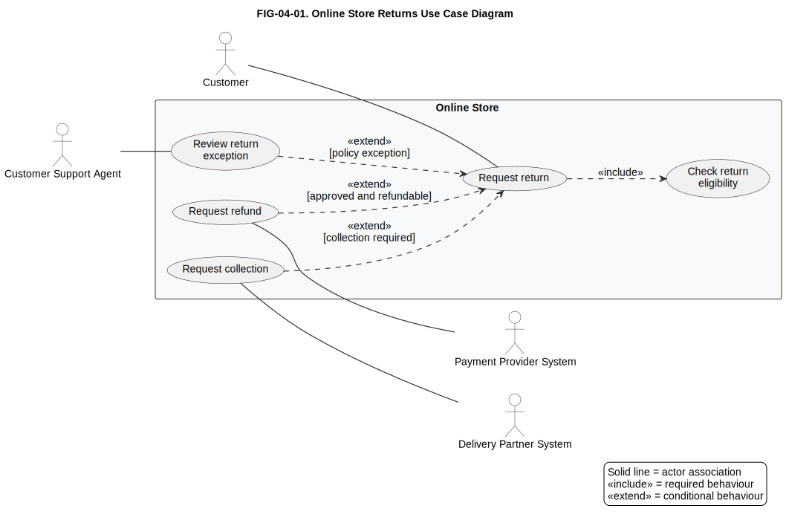
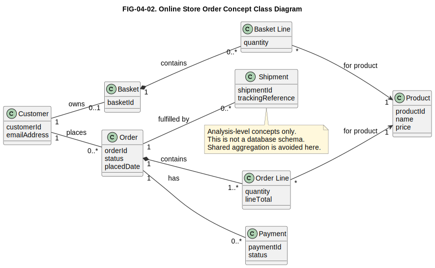
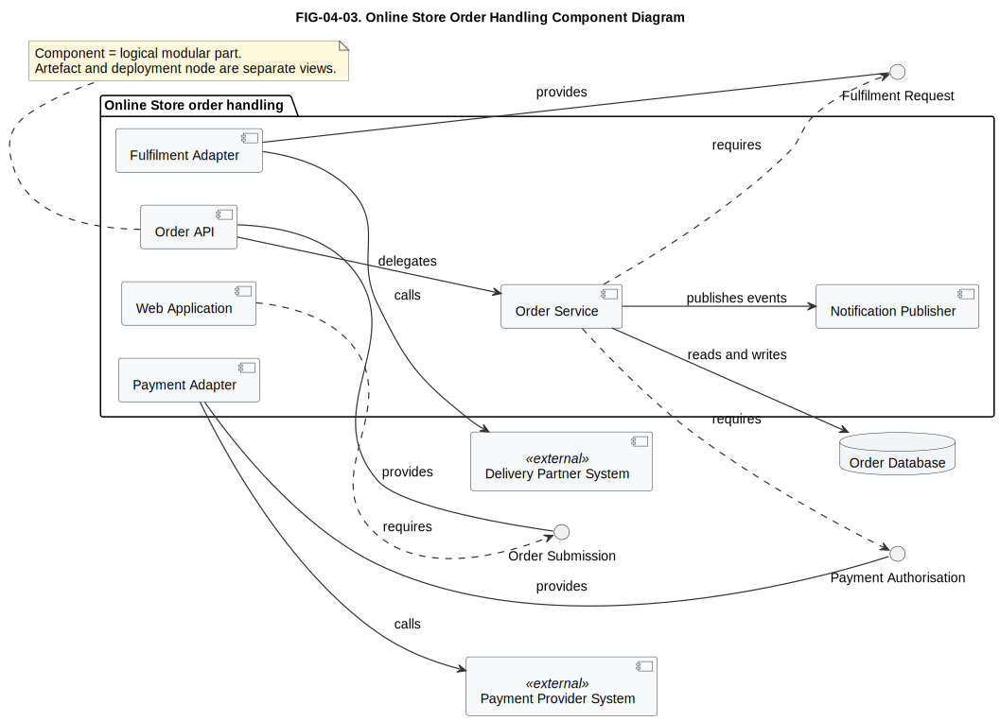
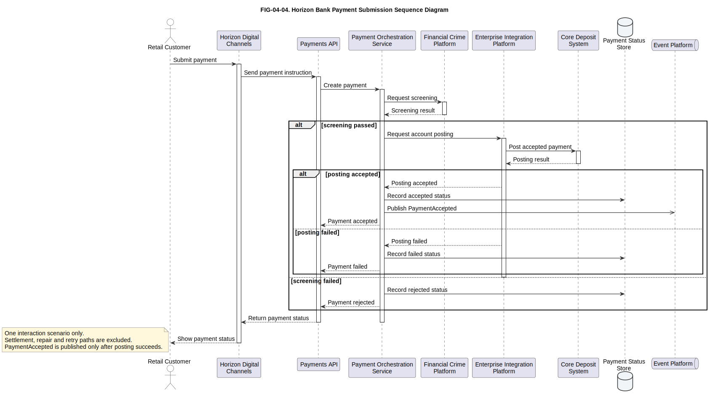
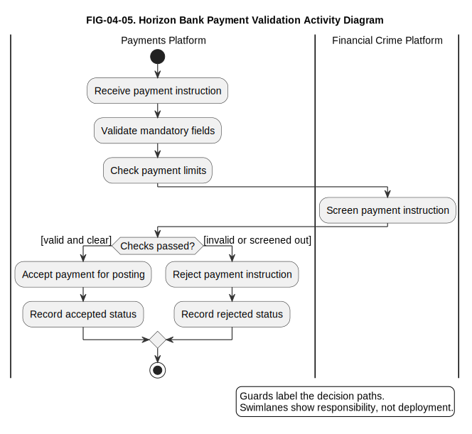
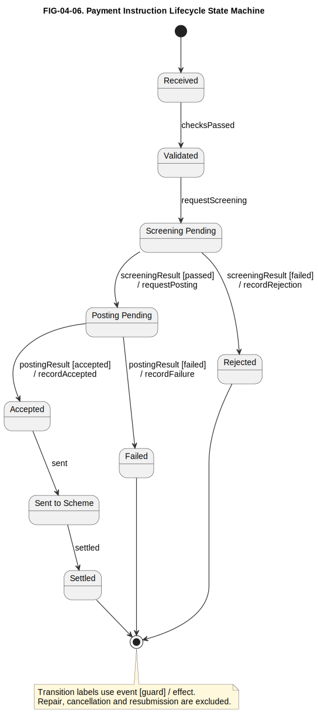
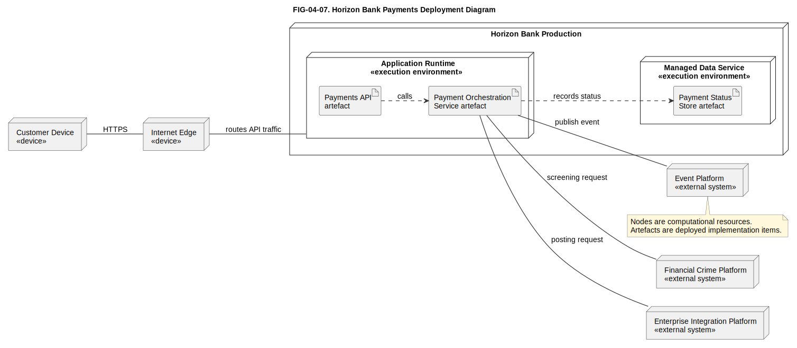

# 4. UML: Unified Modeling Language

## Chapter purpose

Explain the UML diagram families and teach the UML diagrams most useful in architecture work.

## Reader outcomes

By the end of this chapter, the reader should be able to:

- Explain what Unified Modeling Language (UML) is and where it helps architecture work.
- Distinguish structure diagrams, behaviour diagrams and interaction diagrams.
- Choose between use case, class, component, sequence, activity, state machine and deployment diagrams.
- Read common UML notation without guessing what boxes and arrows mean.
- Apply UML selectively to the Simple Online Store and Horizon Bank examples.
- Avoid common UML mistakes, especially over-detail, mixed abstraction and confusing UML with process or enterprise-architecture modelling.

## Prerequisites and dependencies

- Chapter 3: How to Read Architecture Diagrams

## Required models and artefacts

- FIG-04-01: UML use case diagram for online store returns
- FIG-04-02: UML class diagram for online store order concepts
- FIG-04-03: UML component diagram for online store order handling
- FIG-04-04: UML sequence diagram for Horizon Bank payment submission
- FIG-04-05: UML activity diagram for payment validation
- FIG-04-06: UML state machine diagram for payment instruction lifecycle
- FIG-04-07: UML deployment diagram for Horizon Bank payments runtime

## Worked examples

- Online order
- Customer onboarding
- Payment execution

## Source requirements

- `[OMG-UML]` supports UML 2.5.1 terminology and diagram taxonomy.
- Chapter guidance is the author's practical interpretation for beginner architecture work.
- Diagrams are original teaching examples and must not reproduce OMG specification diagrams.

## What UML is and is not

Unified Modeling Language (UML) is a modelling language for describing software-intensive systems. In plain terms, it gives teams a shared set of diagram types for talking about structure, behaviour, interaction and deployment. It is useful when ordinary boxes and arrows are too vague, but it should still be used to answer a clear question.

The formal UML specification is broad [OMG-UML]. It covers many model elements and diagram types. This chapter does not try to teach the whole specification. It focuses on the UML diagrams that most often help architecture and solution-design conversations: use case, class, component, sequence, activity, state machine and deployment diagrams.

UML is not a project method. It does not tell a team which requirements to gather first, how to run delivery or how to govern architecture decisions. It is also not a complete enterprise architecture framework. For business capabilities, value streams and enterprise layers, later chapters use other approaches. For detailed business processes, Business Process Model and Notation (BPMN) is often a better fit. UML is strongest when the architecture question is about software structure, object concepts, interactions, state changes or runtime placement.

Use UML selectively. A good UML model is not one that uses every diagram type. It is one that makes a design question easier to discuss, review and change.

## Structural, behavioural and interaction diagrams

UML diagrams can be grouped by the kind of question they answer. For a beginner, the useful split is:

| Family | Plain question | Common diagrams |
|---|---|---|
| Structure | What things exist, and how are they related? | Class, Component, Deployment |
| Behaviour | What happens over time or through a lifecycle? | Activity, State Machine, Use Case |
| Interaction | How do participants communicate in one scenario? | Sequence |

The official UML taxonomy is more precise than this teaching table. For example, interaction diagrams are a kind of behaviour diagram in UML [OMG-UML]. The simpler grouping is still useful because it helps the reader choose the right view.

If the question is "what are the main software parts?", start with a structure diagram. If the question is "what steps happen?", start with a behaviour diagram. If the question is "who sends what message to whom?", use an interaction diagram. Do not force one diagram to answer all three questions.

## Use case diagrams

A use case diagram answers: **who interacts with the subject, and what goals do they pursue?**

It is useful early in analysis because it separates user goals from internal design. The main elements are actors, use cases, the subject boundary and relationships. An actor may be a person, role, organisation or external system. A use case describes a goal or service the subject provides.

For the Simple Online Store, useful use cases include Browse catalogue, Place order, Track delivery and Handle return. The Customer actor participates in the first three. The Customer Support Agent participates in Handle return. Payment Provider System and Delivery Partner System may appear as supporting external actors when the diagram needs to show dependencies.

For Horizon Bank, a use case diagram for customer onboarding might show Retail Customer, Relationship Manager, Compliance Officer and Customer Onboarding Platform. Use cases could include Submit application, Capture identity evidence, Review Know Your Customer (KYC) exceptions and Open customer profile. This is not a business-process diagram. It does not show the order of every task or exception path. It shows scope and goal-level interaction.

Use case diagrams become weak when teams use them as screen maps or as lists of internal functions. "Click submit button" is usually too detailed. "Validate field" is usually an internal behaviour, not a user goal. Keep the diagram at the level of outcomes the actor cares about.

### How to read use case notation

| Notation element | How to read it |
|---|---|
| Actor | A person, role, organisation or external system that interacts with the subject. |
| Use case | A goal or service the subject provides to an actor. |
| Subject boundary | The box that shows what is inside the system or subject being described. |
| Association | A line showing that an actor participates in a use case. |
| Include | A required sub-behaviour reused by another use case. Read it as "always uses this". |
| Extend | Optional or conditional behaviour that adds to a base use case. Read it with the condition. |
| Generalisation | A specialised actor or use case inherits the meaning of a more general one. |

Figure FIG-04-01. Online Store returns use case diagram. It shows actor goals and system scope for returns, not screens, classes or process sequence.

Notice the subject boundary first. The Customer and Customer Support Agent are outside the Online Store because they interact with it. Payment Provider System and Delivery Partner System are also outside because they support refund and collection goals. The figure deliberately excludes the order of work, refund failure handling and deployment detail.

Only Check return eligibility is included because every return request must use that behaviour. Refund, collection and exception review are modelled as conditional extensions, with guards showing when they are added to the base Request return use case.

## Class diagrams

A class diagram answers: **what important concepts exist, what information or behaviour do they have, and how are they related?**

Class diagrams can be used at different levels. An analysis class diagram describes domain concepts. A design class diagram describes software classes and interfaces. A generated class diagram may describe the codebase. Those are different views. The diagram title and caption should say which one is intended.

For the Simple Online Store, an analysis-level class diagram might show Customer, Product, Basket, Order, Payment and Shipment. Relationships can show that a Customer places Orders, an Order contains Order Lines, and a Shipment fulfils an Order. This helps readers reason about concepts before discussing database tables or service APIs.

For Horizon Bank, a simple conceptual class diagram might show Party, Customer, Product, Agreement, Account and Payment Instruction. That view can support information architecture discussion, but it should not pretend to be a complete banking data model. It should also avoid implying that every class maps directly to one table, one API resource or one BIAN Service Domain.

The most common class-diagram problem is too much detail. Attributes, operations, visibility markers and multiplicities are useful only when they support the question. If the reader needs conceptual relationships, a small diagram with names and cardinality may be enough. If the reader needs implementation design, add operations and interfaces deliberately.

### How to read class notation

| Notation element | How to read it |
|---|---|
| Class compartments | A class box may show a name, attributes and operations in separate compartments. |
| Attributes | Named data held by instances of the class, such as `orderId` or `status`. |
| Operations | Behaviour offered by the class, such as `calculateTotal()`. |
| Association | A structural relationship between classes. |
| Multiplicity | Numbers such as `1`, `0..1` or `1..*` that show how many instances may participate. |
| Generalisation | An inheritance relationship from a specialised class to a more general class. |
| Dependency | A weaker "uses" relationship where one class depends on another. |
| Aggregation | A weak whole-part relationship. Shared aggregation has weak semantics, so a plain association is usually clearer unless whole-part meaning is important. |
| Composition | A strong whole-part relationship where the part belongs to the whole's lifecycle. |

Figure FIG-04-02. Online Store order concept class diagram. It shows analysis-level order concepts, selected attributes and relationships, not a database schema or code design.

Notice the difference between association and composition. A Customer places many Orders, an Order is composed of Order Lines, and a Basket is composed of Basket Lines. Each Basket Line references one Product. The figure avoids shared aggregation because its meaning is often weak; the product reference is clearer as a simple association. The figure deliberately avoids private fields, persistence annotations and implementation methods because the reader is learning domain structure, not code.

## Component diagrams

A UML component diagram answers: **which modular system parts provide or require interfaces?**

Component diagrams are useful when a team needs to discuss software responsibilities and interfaces without dropping into class-level detail. In UML, a component is a modular, encapsulated and replaceable system part that defines provided and required interfaces [OMG-UML]. It is not automatically a deployable service. Deployment is a separate concern, represented with artefacts and deployment nodes.

Keep four terms separate. A **component** is the logical modular part. An **interface** is the contract it provides or requires. An **artefact** is a physical implementation item, such as a package, executable or deployable file. A **deployment node** is the computational resource or execution environment where artefacts run. One component may be realised by one or more artefacts, and one artefact may be deployed to one or more nodes, but those are modelling choices, not automatic rules.

This is related to, but not identical with, a C4 component. Chapter 5 uses C4 component diagrams for parts inside one C4 container. UML component diagrams can be more formal about provided and required interfaces.

For the Online Store, a component diagram might show Web Application, Order API, Payment Adapter, Fulfilment Adapter and Notification Publisher. The useful part is not the box layout. It is the interface conversation: which component exposes order submission, which component requires payment authorisation, and which component publishes order events?

For Horizon Bank, a Payments Platform component diagram might show Payments API, Payment Orchestration, Screening Adapter, Account Posting Adapter and Payment Status Store. It can also show dependencies on Financial Crime Platform, Enterprise Integration Platform and Event Platform. That still does not mean each component is a microservice. Physical deployment choices need separate justification.

Use component diagrams when interfaces and replaceability matter. If the conversation is about enterprise systems and their relationships, a C4 System Landscape or ArchiMate application view may be clearer. If the conversation is about internal classes, a class diagram may fit better.

### How to read component notation

| Notation element | How to read it |
|---|---|
| Component | A modular, encapsulated and replaceable part of a system. |
| Provided interface | A contract the component offers to other parts. Often shown as a lollipop symbol or interface element. |
| Required interface | A contract the component needs from another part. Often shown as a socket or dependency to an interface. |
| Dependency | A dashed arrow showing that one element depends on another. |
| Port | An explicit interaction point on a component boundary. |
| Artefact distinction | A component is logical. An artefact is a physical implementation item that may realise or package it. |

Figure FIG-04-03. Online Store order handling component diagram. It shows logical components and interfaces for order handling, not deployment nodes or microservice boundaries.

Notice that Web Application, Order API, Order Service, Payment Adapter, Fulfilment Adapter and Notification Publisher are shown as components inside the logical Online Store order handling boundary. Payment Adapter and Fulfilment Adapter isolate external dependencies. The component diagram helps discuss provided and required interfaces. It deliberately excludes runtime placement, Kubernetes detail and class-level implementation.

## Sequence diagrams

A sequence diagram answers: **in one scenario, which participant sends which message, and in what order?**

The main elements are lifelines and messages. A lifeline represents a participant in the interaction, such as a person, system, component or object. Messages are drawn in time order, usually from top to bottom. Sequence diagrams are good for reviewing responsibility, ordering, synchronous calls, asynchronous messages and important alternatives.

For the Online Store, a sequence diagram for Place order might show Customer, Web Application, Order API, Payment Provider System, Order Database and Delivery Partner System. The scenario can show the customer submitting an order, the API reserving or recording the order, the payment provider authorising payment and the delivery partner receiving a fulfilment request.

For Horizon Bank, a payment submission sequence might show Retail Customer, Horizon Digital Channels, Payments API, Payment Orchestration Service, Financial Crime Platform, Enterprise Integration Platform and Core Deposit System. The diagram can expose important review questions: does screening happen before posting, where is payment status recorded, and what happens if a downstream system rejects the request?

Do not use one sequence diagram for every possible path. Draw the main path when it helps, then add separate diagrams or notes for important alternatives. If the real question is a human workflow with hand-offs, timers and exceptions, BPMN will usually be more suitable.

### How to read sequence notation

| Notation element | How to read it |
|---|---|
| Lifeline | A participant in the interaction, read from left to right across the top. |
| Activation | A narrow bar showing when a participant is carrying out work. |
| Synchronous message | A call where the sender waits for the receiver. |
| Asynchronous message | A signal or message where the sender does not wait in the same way. |
| Return | A response from receiver to sender, often shown with a dashed arrow. |
| `alt` | Alternative paths, such as success or rejection. |
| `opt` | Optional behaviour that happens only if a condition is true. |
| `loop` | Repeated behaviour. |
| `par` | Parallel behaviour. |

Figure FIG-04-04. Horizon Bank payment submission sequence diagram. It shows one target-state payment submission interaction, including screening, posting, status recording and event publication.

Read the messages from top to bottom. The outer alternative separates screening passed from screening failed. If screening fails, the orchestration service records a rejected status. If screening passes, a nested alternative separates posting accepted from posting failed. `PaymentAccepted` is published only after posting succeeds; posting failure records a failed status. The figure deliberately excludes settlement, sanctions casework, retry rules and the full business process.

## Activity diagrams

An activity diagram answers: **what flow of actions, decisions and parallel work leads to an outcome?**

Activity diagrams are useful for algorithm-like flows, system logic and simple business workflows. They can show actions, decision points, forks, joins and object flows. They are less formal for business-process collaboration than BPMN, but they are often enough when a team wants to explain logic inside a system or service.

For the Online Store, an activity diagram for returns could show Receive return request, Check order status, Decide eligibility, Request refund, Request collection and Notify customer. If the activity includes both customer support work and system processing, the modeller should make that scope explicit.

For Horizon Bank, an activity diagram might show high-level payment validation inside the Payments Platform: receive instruction, validate mandatory fields, check limits, request screening, decide whether to continue, post payment and publish status. This would be a system-behaviour view, not a complete operational process for payment repair, sanctions investigation or reconciliation.

The main mistake is treating an activity diagram as a universal process model. For regulated banking processes with pools, message flows, events, timers and exception handling, BPMN should normally be used. Use UML activity diagrams when the flow is close to system logic or when the team already uses UML for design.

### How to read activity notation

| Notation element | How to read it |
|---|---|
| Initial and final nodes | The start and end of the activity flow. |
| Action | A step of work or behaviour. |
| Control flow | An arrow showing the order in which actions may occur. |
| Decision and merge | A diamond that splits or rejoins alternative paths. |
| Guards | Conditions on outgoing flows, such as `[valid]` or `[failed]`. |
| Fork and join | Thick bars that split work into parallel flows or wait for parallel flows to complete. |
| Swimlanes | Partitions that show responsibility, such as a platform or external service. |

Figure FIG-04-05. Horizon Bank payment validation activity diagram. It shows system-level validation and screening flow inside the Payments Platform, not the complete operational payments process.

Notice the guards on decision paths. They tell the reader why one path accepts the payment instruction while another rejects it. The figure deliberately excludes BPMN pools, human repair work, sanctions investigation and reconciliation.

## State machine diagrams

A state machine diagram answers: **what states can something be in, and what events move it from one state to another?**

State machine diagrams are useful when lifecycle rules matter. The subject might be an Order, Payment, Account Application, Fraud Case or Loan Application. States should be meaningful conditions, not merely task names. Transitions should be triggered by events or conditions.

For the Online Store, an Order might move through Draft, Submitted, Paid, Fulfilment Requested, Shipped, Delivered, Return Requested and Refunded. That diagram helps the team discuss which transitions are allowed and which states customers or support agents can see.

For Horizon Bank, a Payment Instruction might move through Received, Validated, Screening Pending, Rejected, Posting Pending, Accepted, Sent to Scheme, Settled or Failed. This can help architects identify missing events, unclear ownership and inconsistent status handling across channels and operations.

Do not use a state machine when a simple checklist would do. It is useful when an entity can remain in a state, receive events, reject invalid transitions or trigger different behaviour depending on its current state.

### How to read state machine notation

| Notation element | How to read it |
|---|---|
| State | A meaningful condition in the lifecycle of the subject. |
| Initial and final pseudostates | Mark where the lifecycle starts and where this simplified view ends. |
| Transition | An arrow showing a valid movement between states. |
| Event | Something that triggers a transition. |
| Guard | A condition in square brackets that must be true. |
| Effect | Behaviour after the slash that happens when the transition fires. |
| `event [guard] / effect` | Read as: when the event occurs, if the guard is true, perform the effect and move state. |

Figure FIG-04-06. Payment instruction lifecycle state machine. It shows a simplified payment-instruction lifecycle and the events that move the instruction between states.

Notice that states are conditions, not task names. The initial transition is unlabelled because it marks entry into this simplified lifecycle, not an external business event. `Screening Pending` and `Posting Pending` are useful because the payment can wait there and react differently to later events. The diagram deliberately excludes repair, resubmission, cancellation and detailed payment-scheme status codes.

## Deployment diagrams

A deployment diagram answers: **where software artefacts run, and what runtime nodes they depend on?**

UML deployment diagrams show nodes, execution environments, communication paths and deployed artefacts. They are useful when the discussion is about runtime placement rather than logical software structure. A UML node is a computational resource, usually a device or an execution environment. A device may be physical or virtual hardware. An execution environment is a runtime that hosts software, such as an application server, container platform or database service. A UML artefact is a physical piece of implementation, such as an application package, executable or deployable file.

For the Online Store, a simple deployment diagram might show a customer browser, web application runtime, API application runtime, managed database and external payment and delivery systems. It can support questions about network paths, environments and operational ownership.

For Horizon Bank, a deployment diagram might show an internet edge, application runtime for Payments API and Payment Orchestration Service, managed data store for payment status, and communication paths to Financial Crime Platform, Enterprise Integration Platform and Event Platform. Keep the diagram at the level needed for the architecture decision. If firewall rules, subnets and availability zones matter, a more detailed infrastructure diagram may be required.

Deployment diagrams are often confused with component or container diagrams. The difference is the question. Component and container views ask what the software parts are. Deployment views ask where those parts run.

### How to read deployment notation

| Notation element | How to read it |
|---|---|
| Node | A computational resource that can host artefacts or other nodes. |
| Device | A node representing physical or virtual hardware. |
| Execution environment | A node representing runtime software that hosts artefacts. |
| Artefact | A physical implementation item, such as an application package or executable. |
| Communication path | A line showing that nodes can communicate. |
| Deployment relationship | A relationship showing that an artefact is deployed to a node or execution environment. |

Figure FIG-04-07. Horizon Bank payments deployment diagram. It shows simplified runtime placement for payment artefacts, execution environments and neighbouring systems.

Notice the distinction between artefacts and nodes. Payments API and Payment Orchestration Service are artefacts; the application runtime and managed data service are execution environments. The figure deliberately excludes subnet design, firewall rules, availability zones and disaster-recovery topology.

## Less commonly used UML diagrams

UML contains more diagram types than this chapter teaches in detail. They are useful in the right setting, but beginners should not feel that every architecture document needs them.

| Diagram | When it may help |
|---|---|
| Object diagram | Show an example snapshot of objects and links at one moment. |
| Package diagram | Group classes, components or model elements into packages and dependencies. |
| Composite structure diagram | Show internal parts and connectors of a structured classifier. |
| Communication diagram | Show interactions with emphasis on links between participants. |
| Interaction overview diagram | Combine interaction fragments into a higher-level flow. |
| Timing diagram | Show state or value changes over time. |
| Profile diagram | Define UML extensions for a specialised modelling context. |

These diagrams are not second-class diagrams. They are simply less common in beginner architecture communication. Add them when their specific question appears.

## UML diagram selection guide

Choose the UML diagram by question, not by habit.

| If the question is... | Start with... | Watch for... |
|---|---|---|
| Who uses this system and for what goals? | Use case diagram | Do not list internal functions as user goals. |
| What domain concepts relate to each other? | Class diagram | State whether it is conceptual, logical or code-level. |
| What software parts expose or require interfaces? | Component diagram | Do not imply every component is separately deployed. |
| What messages happen in one scenario? | Sequence diagram | Keep to one scenario or a small set of alternatives. |
| What flow of actions and decisions occurs? | Activity diagram | Use BPMN if business-process collaboration is the main concern. |
| What lifecycle states are valid? | State machine diagram | Use states, not merely task names. |
| Where do deployable artefacts run? | Deployment diagram | Keep logical structure separate from runtime placement. |

If more than one question matters, use more than one view. A payment design may need a use case diagram for scope, a sequence diagram for one payment submission path, a state machine for payment status and a deployment diagram for production runtime placement. That is better than one unreadable diagram that tries to show everything.

## UML versus other approaches

UML overlaps with several approaches in this book, but the overlap is about questions, not replacement.

| Approach | UML is useful when... | The alternative is often better when... |
|---|---|---|
| C4 | The team needs formal interaction, state, class or deployment notation. | The team needs lightweight software architecture communication across context, container and component levels. |
| BPMN | The flow is close to system logic or a simple activity flow. | The process has business roles, events, message flows, timers and exceptions. |
| ArchiMate | The model needs software design detail. | The model needs enterprise layers, capabilities, motivation or implementation planning. |
| Data modelling | The class diagram explains conceptual domain structure. | The question is logical data design, keys, normalisation, lineage or physical schemas. |
| BIAN | UML helps explain one bank-specific scenario or implementation design. | The question is BIAN reference capability, Service Domain semantics or business scenario alignment. |

UML is not more professional merely because it is formal. C4, BPMN, ArchiMate, data models and BIAN each answer different questions. The architect's job is to choose the smallest set of views that lets the audience understand and decide.

## Common mistakes

The first mistake is drawing UML because a document "needs UML". A UML diagram should exist because it answers a concrete question.

The second mistake is over-detailing too early. A class diagram full of private attributes and operations may distract a business or architecture audience that only needs domain concepts. A sequence diagram with every technical call may hide the important responsibilities.

The third mistake is mixing abstraction levels. A diagram that combines business goals, classes, database tables, Kubernetes nodes and user screens is hard to review because the viewpoint is unclear.

The fourth mistake is confusing UML with implementation truth. A class on a conceptual diagram is not automatically a Java class. A component is not automatically a microservice. A deployment node is not automatically a cloud account or Kubernetes pod.

The fifth mistake is using unlabelled arrows. UML relationships have different meanings, such as association, dependency, generalisation, message, transition and communication path. If the notation is unfamiliar to the audience, add a legend or explanatory prose.

The sixth mistake is copying specification-style complexity into beginner documentation. The UML specification is a precise technical source. A handbook chapter should teach the subset that helps readers make and review practical models.

## Chapter cheat sheet

| Diagram | Main question | Typical audience | Use when | Avoid when |
|---|---|---|---|---|
| Use case | Who uses the subject and for what goals? | Analysts, product owners, architects | Establishing scope and actor goals | You need process sequence or internal design |
| Class | What concepts or classes relate to each other? | Architects, developers, analysts | Explaining domain concepts or design structure | You only need a data schema or process flow |
| Component | What software parts expose or require interfaces? | Architects and development teams | Reviewing modular structure and interfaces | The view is really enterprise landscape or deployment |
| Sequence | What messages happen in one scenario? | Architects, developers, testers | Reviewing interaction order and responsibility | You need a full business process |
| Activity | What actions and decisions form a flow? | Analysts, architects, developers | Explaining system logic or simple workflows | BPMN-level collaboration and events are needed |
| State machine | What lifecycle states and transitions are valid? | Architects, developers, testers, operations | Status and lifecycle rules matter | The work is only a linear task sequence |
| Deployment | Where do artefacts run? | Architects, platform, operations, security | Runtime placement affects the decision | Logical software structure is the current question |

## Key takeaways

- UML is a modelling language, not a delivery method or enterprise framework.
- Start with the architecture question before choosing a UML diagram.
- Structure diagrams explain things and relationships; behaviour diagrams explain what happens.
- Sequence diagrams are best for one interaction scenario, not every possible path.
- Class diagrams must state whether they are conceptual, design-level or code-level.
- UML component diagrams focus on modular parts and interfaces, not automatically microservices.
- UML components are not automatically deployable; artefacts and nodes handle deployment questions.
- State machine diagrams are valuable when lifecycle rules and valid transitions matter.
- Deployment diagrams answer runtime placement questions, not logical decomposition questions.

## Practical exercise

You are modelling the Simple Online Store returns feature. A Customer requests a return. A Customer Support Agent may approve an exception. The Online Store may request a refund from the Payment Provider System and a collection from the Delivery Partner System.

Choose three UML diagrams that would help the team, and state the question each one answers.

Suggested answer:

1. Use case diagram: shows Customer, Customer Support Agent, Payment Provider System and Delivery Partner System, and the goals Request return, Approve return exception, Request refund and Request collection.
2. Sequence diagram: shows one return request scenario, including the Online Store, Payment Provider System and Delivery Partner System interactions.
3. State machine diagram: shows the lifecycle of a Return Request, such as Requested, Under Review, Approved, Rejected, Refund Requested, Collection Requested and Closed.

A deployment diagram is not the best first choice unless the team is making runtime-placement decisions. A class diagram may help later if the team needs to define Return Request, Order, Payment and Shipment relationships.

## Review checklist

- [ ] The question answered by each model is explicit.
- [ ] The audience and abstraction level are clear.
- [ ] Formal terms are introduced after a plain-language explanation.
- [ ] The simple and banking examples are consistent with repository example files.
- [ ] Comparisons do not imply that one notation is universally superior.
- [ ] Common mistakes are concrete and actionable.
- [ ] Required sources and diagrams are registered.
- [ ] Terminology, link and word-count checks pass.

## References and further reading

Chapter source notes are maintained in the repository under `research/uml/` and registered in `SOURCE_REGISTER.md`. Appendix H, [Glossary and Source Notes](../appendices/appendix-h-glossary-sources.md), is the intended publication location for the final source-key index once the appendix is completed.

- `[OMG-UML]`: Object Management Group, Unified Modeling Language specification, version 2.5.1.
