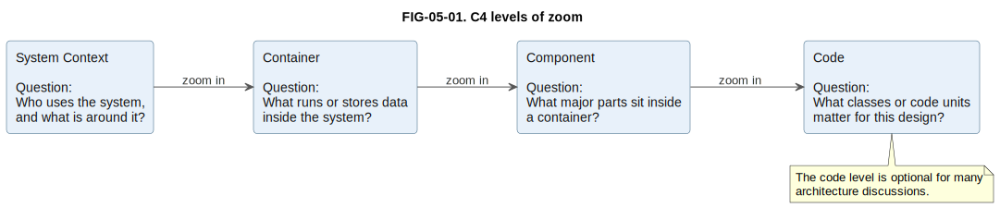
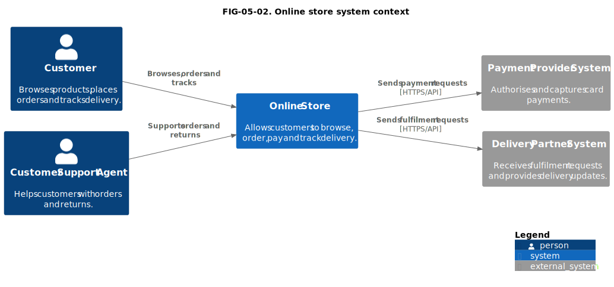
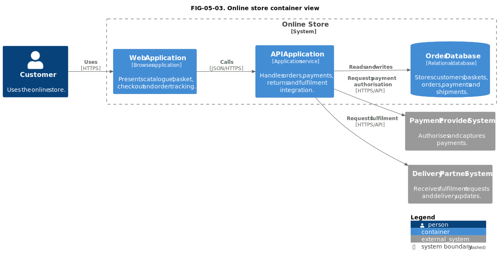
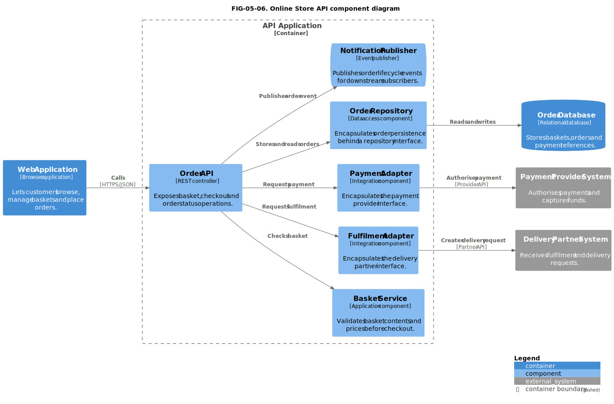
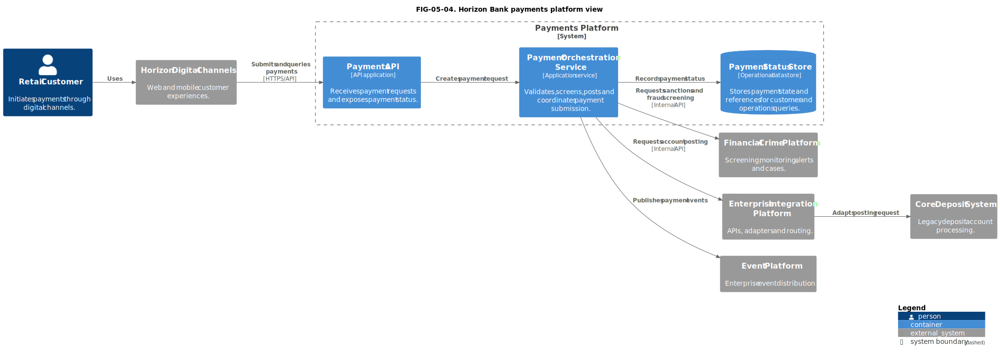
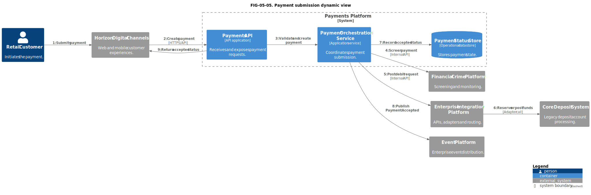
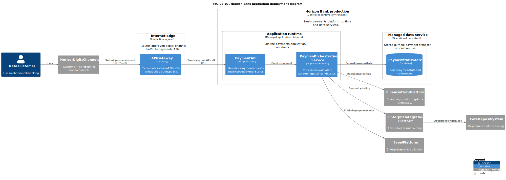
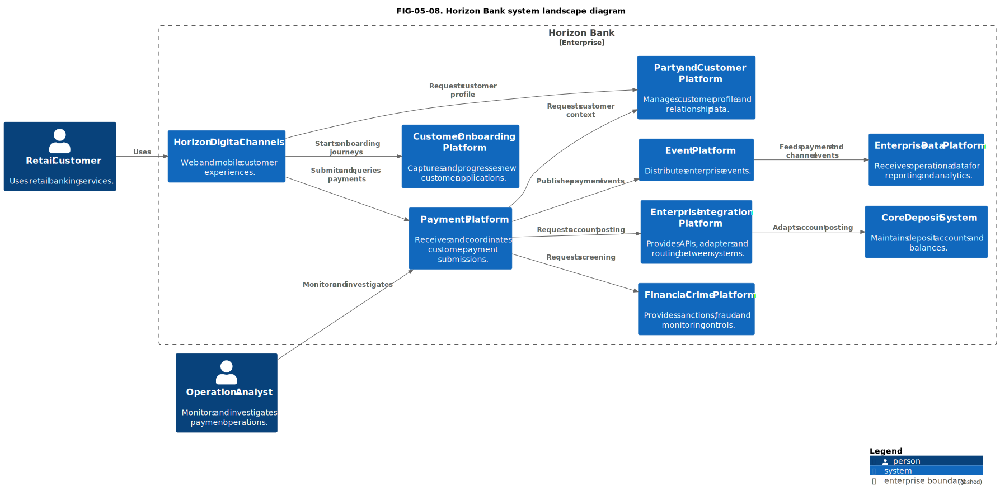

# 5. The C4 Model

## Chapter purpose

Teach software architecture at four levels of zoom and show how to create clear context, container, component and code views.

## Reader outcomes

By the end of this chapter, the reader should be able to:

- Explain the purpose of the C4 model in plain language.
- Distinguish a person, software system, container and component.
- Choose between System Context, Container, Component, Code, Dynamic, Deployment and System Landscape views.
- Read a C4 diagram without confusing abstraction levels.
- Avoid the common mistake of treating a C4 container as a Docker container.
- Apply C4 to both a simple online store and a Horizon Bank payments platform.

## Prerequisites and dependencies

- Chapter 4: UML: Unified Modeling Language

## Required models and artefacts

- C4 System Context
- C4 Container
- C4 Component
- C4 Dynamic
- C4 Deployment
- C4 System Landscape

## Worked examples

- Simple Online Store system context and container views
- Simple Online Store API component view
- Horizon Bank payments platform container, dynamic and deployment views
- Horizon Bank system landscape view

## Source requirements

- `[C4-OFFICIAL]` supports C4 terminology and diagram types.
- `[STRUCTURIZR-C4]` supports practical tooling and diagrams-as-code context.
- `[C4-PLANTUML-2.9.0]` supports the local rendering dependency used for figures.

## What C4 is

C4 is a simple way to explain software architecture by zooming in. Instead of trying to show every detail on one diagram, C4 asks the modeller to start with the big picture and then move to more detailed views only when the audience needs them. The name comes from the four main levels: Context, Containers, Components and Code [C4-OFFICIAL].

The basic idea is familiar. If you look at a city map, you might first want to know where the city sits in the country. Later, you might zoom into districts, streets and buildings. C4 applies the same idea to software. A System Context diagram shows the software system and its surroundings. A Container diagram shows the main runnable or data-storing parts inside the system. A Component diagram shows the major parts inside one container. A Code view, when useful, shows classes or other code-level structures.

Figure FIG-05-01. C4 levels of zoom. It shows the movement from broad context to implementation detail, not a runtime sequence.

C4 is best treated as a communication model for software architecture. It is not a replacement for every modelling language in this book. It does not try to describe a full business process like Business Process Model and Notation (BPMN), and it does not try to provide the full range of formal structural and behavioural diagrams found in Unified Modeling Language (UML). Its strength is that many readers can understand it quickly because it uses a small set of concepts and asks each diagram to stay at one level of abstraction.

The most important habit in C4 is to state the question before drawing. A good C4 diagram is not "the architecture". It is one view of the architecture, prepared for a particular audience and decision. A product owner may need a context view. A development team may need a container or component view. An operations team may need a deployment view. The model is useful when the view matches the conversation.

## Core concepts: person, system, container and component

C4 uses a small vocabulary. The vocabulary is simple, but the terms must be used carefully.

| C4 term | Plain explanation | Practical caution |
|---|---|---|
| Person | A human role or group that interacts with the software system. | Use roles, not individual names, unless the person is genuinely unique. |
| Software system | A software product or system that delivers value to people or other systems. | Set the boundary clearly. Do not show every application in the organisation as one system. |
| Container | A separately runnable or deployable unit, or a data store, inside a software system. | A C4 container is not automatically a Docker container. |
| Component | Related functionality inside one container, encapsulated behind a well-defined interface. | A component is not separately deployable. The containing container is the deployable unit. |

A **person** is normally a user, operator, administrator or external role. In the Simple Online Store example, `Customer` and `Customer Support Agent` are people. In Horizon Bank, `Retail Customer`, `Operations Analyst` and `Compliance Officer` are people or business roles.

A **software system** is the thing being described as a whole. In a context diagram, the system of interest is often shown in the middle, with people and neighbouring systems around it. The Simple Online Store is one software system. Horizon Digital Channels and the Payments Platform are separate software systems in the Horizon Bank landscape.

A **container** is one of the most misunderstood C4 words. In C4, a container means something that runs code or stores data, such as a web application, mobile app, API application, database, message broker or batch process [C4-OFFICIAL]. It may be deployed using Docker, but it does not have to be. If a team says "container" in a C4 workshop, ask whether they mean a C4 container or a containerisation technology.

A **component** sits inside one container. It groups related functionality and hides that functionality behind a well-defined interface [C4-OFFICIAL]. In an API application, components might include an order controller, payment adapter, fulfilment service and notification publisher. These components are not separately deployable services in the C4 sense. The API Application is the deployable container; the components are internal parts of that container. Components are useful when a container is large enough that developers need a finer structural view.

## Level 1: System Context

A System Context diagram answers a broad question: **who uses this software system, and what external systems does it interact with?**

This is often the best first C4 diagram because it sets the boundary. It tells the reader what is inside the system of interest and what is outside it. It also avoids a common early mistake: jumping straight into APIs, databases and deployment nodes before anyone has agreed what system is being discussed.

Figure FIG-05-02. Online store system context. It shows the Online Store as one software system surrounded by people and external systems.

In the online store context view, the Online Store is the system of interest. The Customer browses products, places orders and tracks delivery. The Customer Support Agent supports orders and returns. The Payment Provider System and Delivery Partner System are outside the Online Store boundary because they are separate systems, even though the online store depends on them.

This diagram is useful for business stakeholders, product owners, architects and developers because it avoids internal implementation detail. It does not show the order database, the checkout module or the cloud environment. Those details matter later, but not when the reader is asking "what is this system connected to?"

A good context diagram has clear relationship labels. An arrow labelled "uses" is sometimes enough, but more specific labels are better when they clarify the responsibility. "Sends payment requests" tells more than "integrates with". Direction also matters. If the Online Store sends a fulfilment request to the Delivery Partner System, the arrow should point towards the Delivery Partner System.

## Level 2: Container

A Container diagram answers a more technical question: **what are the main runnable units and data stores inside the software system?**

This view is useful when a team needs to discuss responsibilities, technology choices, data ownership or integration points. It is normally read by architects, developers, testers, operations staff and technical product owners. It should still be understandable to a non-technical stakeholder if the labels are clear, but it is more technical than the context view.

Figure FIG-05-03. Online store container view. It shows the main executable and data-storing units inside the Online Store, not individual classes.

The online store container view decomposes the Online Store into a Web Application, API Application and Order Database. The Customer uses the Web Application. The Web Application calls the API Application. The API Application reads and writes the Order Database, then calls external systems for payment and fulfilment.

This is enough detail for several useful architecture conversations. A developer can see where the main responsibilities sit. A tester can see where integration testing may be needed. An operations engineer can ask whether the API Application and database have suitable monitoring and backup. A security reviewer can identify where customer and payment data cross boundaries.

The container view should not become a deployment diagram by accident. It may mention technologies, such as "browser application", "application service" or "relational database", but it should not show every virtual machine, subnet, Kubernetes pod or firewall rule. Those belong in a deployment or infrastructure view.

## Level 3: Component

A Component diagram answers: **what are the major internal parts of one container, and what responsibilities do they have?**

Use a component view when a container is large enough that its internal structure affects design decisions. For the online store API Application, a component view might show an Order API, Basket Service, Payment Adapter, Fulfilment Adapter and Notification Publisher. Each component should have a clear purpose and should be meaningful to the team that builds or maintains the container.

Component diagrams are not always necessary. If a container is small and understood by the team, a component view can become busy documentation with little value. The question is not "can we decompose this?" The question is "does this decomposition help someone make or review a design decision?"

Figure FIG-05-06. Online Store API component diagram. It shows components inside the API Application container, not separately deployable services.

In this component view, the Web Application calls the Order API. The Order API coordinates basket checks, order persistence, payment authorisation, fulfilment requests and notification publication. The Payment Adapter and Fulfilment Adapter are useful because they hide external system details behind clear interfaces. That does not make them independent microservices. They are components inside the API Application container.

In a banking environment, component views can be valuable for containers that coordinate several controls. A Payment Orchestration Service might have components for validation, screening orchestration, account posting, status management and event publication. That view would help a development team reason about responsibilities and dependencies. It would not be the right diagram for a business audience trying to understand the end-to-end payment process.

## Level 4: Code

The Code level answers: **which code-level structures matter for this design discussion?**

C4 deliberately treats the Code level as optional [C4-OFFICIAL]. Many architecture discussions do not need class diagrams or code structure. When code detail is useful, the team may use UML class diagrams, package diagrams or generated diagrams from the codebase. The important point is that the Code view should be selective. It should explain a design issue, not reproduce the whole codebase.

Use a Code view when a class structure, package boundary or internal dependency pattern is important enough to discuss outside the code editor. For example, if a team is introducing a payment adapter interface to separate the API Application from multiple payment providers, a small code-level diagram may help. If the team only needs to understand that the API Application talks to the Payment Provider System, a container view is enough.

For beginners, the safest rule is: do not draw the Code level first. Start with context. Move to containers. Add components if needed. Add code only when there is a specific code-level question.

## Horizon Bank payments platform example

The Horizon Bank payments example applies the same C4 thinking to a more realistic enterprise context. The target payments platform is not the whole bank. It is one software system in a wider landscape. It receives payment requests from Horizon Digital Channels, coordinates validation and screening, posts to the Core Deposit System through the Enterprise Integration Platform, records payment status and publishes payment events.

Figure FIG-05-04. Horizon Bank payments platform view. It shows the main containers inside the Payments Platform and the neighbouring systems they depend on.

This is a C4 Container view, so it deliberately does not show the full business process for a payment. It also does not show a BIAN Service Domain mapping. Those views may be useful later, but they answer different questions. Here the question is software structure: what are the main containers, and which systems do they call?

The Payments API is the entry point for digital channels. The Payment Orchestration Service coordinates the main payment submission responsibilities. The Payment Status Store keeps operational state so customers and operations teams can query payment progress. Financial Crime Platform, Enterprise Integration Platform, Core Deposit System and Event Platform remain outside the Payments Platform boundary because they are neighbouring systems.

This separation helps prevent a common enterprise architecture error: mixing business process, application structure and infrastructure in one diagram without saying why. A payment process model should show tasks, decisions, roles and exceptions. A container view should show software responsibilities and dependencies. A deployment view should show runtime placement. These views can be connected, but they should not be blurred.

## Dynamic diagrams

Static C4 diagrams show structure. Sometimes the reader also needs to understand a runtime interaction. A C4 Dynamic diagram answers: **how do these people, systems, containers or components collaborate for one scenario?**

A dynamic view is not a full business-process model. It does not replace BPMN when the problem is about human work, decisions, handovers, timers and exceptions. It is better for showing a selected technical interaction path through existing C4 elements.

Figure FIG-05-05. Payment submission dynamic view. It shows one payment submission path across Horizon Bank systems and containers, not the complete payments process.

In the Horizon Bank example, the Retail Customer submits a payment through Horizon Digital Channels. The Payments API receives the request and asks the Payment Orchestration Service to create the payment. The orchestration service requests screening, requests account posting through the Enterprise Integration Platform, records status and publishes an event.

This view is useful for architects and developers because it shows the runtime collaboration without changing the structural model. It also exposes review questions. What happens if screening fails? What happens if the Core Deposit System is unavailable? Are payment events published only after a durable status update? Those exception paths may need separate diagrams or prose, but the dynamic view gives the team a shared starting point.

## Deployment diagrams

A C4 Deployment diagram answers: **where do the containers run, and how are they connected in an environment?**

Deployment views are useful when the architecture discussion moves from logical software structure to runtime environment. They may show deployment nodes, infrastructure boundaries, environments, container instances, networking paths and operational responsibilities. The audience is usually architects, platform engineers, operations teams, security reviewers and sometimes delivery managers.

Keep the distinction between a Container diagram and a Deployment diagram clear. The Container diagram says that the Online Store has a Web Application, API Application and Order Database. The Deployment diagram says where those things run, for example in a cloud region, Kubernetes cluster, managed database service or on-premises environment.

Figure FIG-05-07. Horizon Bank production deployment diagram. It shows a simplified production placement for the main payments containers and neighbouring systems.

The Horizon Bank deployment view places the Payments API and Payment Orchestration Service on an application runtime node and places the Payment Status Store on a managed data service. It also shows an internet edge before the Payments API and the neighbouring systems reached from production. This view helps platform and security teams discuss runtime placement without turning the figure into a full cloud network diagram.

Do not put every network component into a C4 deployment view unless the reader needs it. A useful deployment view shows enough infrastructure to answer the current question. If the question is about resilience across availability zones, show the zones. If the question is about firewall rules, a more detailed infrastructure or security diagram may be better.

## System landscape diagrams

A System Landscape diagram answers: **which software systems exist in a wider enterprise landscape, and how do they relate?**

The landscape view sits above a single system context. It is useful when an organisation needs to understand many systems at once. In Horizon Bank, a landscape view might show Horizon Digital Channels, Customer Onboarding Platform, Party and Customer Platform, Payments Platform, Core Deposit System, Financial Crime Platform, Enterprise Integration Platform, Event Platform and Enterprise Data Platform.

Figure FIG-05-08. Horizon Bank system landscape diagram. It shows the wider software estate around digital channels and payments.

The landscape view makes the Payments Platform visible as one system among several. Horizon Digital Channels depend on customer, onboarding and payments systems. The Payments Platform depends on customer context, financial-crime screening, account posting through integration and event publication. This is useful before zooming into one system context because it shows where ownership and dependencies cross system boundaries.

This view is helpful for enterprise architecture because it reveals ownership, dependencies, duplication and migration opportunities. It is not the place for detailed process steps or class structure. If the diagram becomes too crowded, split it by domain, audience or decision. A payments-focused landscape may be more useful than one diagram containing the whole bank.

## C4 versus UML

C4 and UML overlap, but they are not the same kind of tool.

UML is a broad modelling language with many diagram types. It can model structure, behaviour, interactions, activities, states and deployment. It is useful when the team needs a more formal or detailed notation. A UML sequence diagram can show interaction detail. A UML class diagram can show code-level structure. A UML deployment diagram can show deployed artefacts and nodes.

C4 is narrower and more deliberately focused on communicating software architecture through a small number of abstractions. It is often easier for mixed audiences because the notation is lighter. The trade-off is that C4 does not give the same formal range as UML.

| Question | C4 often fits when... | UML often fits when... |
|---|---|---|
| What surrounds this software system? | A System Context diagram is enough. | You need formal use cases or actor relationships. |
| What are the main runnable parts? | A Container diagram explains responsibilities and dependencies. | You need detailed component interfaces or deployment artefacts. |
| How does one scenario run? | A Dynamic diagram shows a selected interaction path. | A Sequence diagram needs precise lifelines, messages and alternatives. |
| What is inside a module? | A Component diagram gives team-level structure. | A Class or package diagram is needed for code-level design. |

Do not choose C4 because it is fashionable, and do not choose UML because it looks more formal. Choose the view that answers the question for the audience.

## Common mistakes

The first common mistake is drawing one large diagram that mixes every concern. A C4 context diagram should not also contain classes, database tables, Kubernetes nodes and detailed process steps. If several questions exist, create several views.

The second mistake is using the word container carelessly. In C4, a container is a runnable unit or data store. It is not automatically a Docker image, Kubernetes pod or cloud container service [C4-OFFICIAL]. If a C4 container is implemented using Docker, state that as an implementation choice.

The third mistake is showing internal details too early. A stakeholder who wants to know which external systems are involved does not need a component diagram. A development team discussing module boundaries does not need a system landscape. Match the diagram to the decision.

The fourth mistake is leaving relationships unlabelled. Boxes without labelled arrows force readers to guess. A label such as "submits payment", "publishes event" or "requests screening" explains the responsibility and direction.

The fifth mistake is treating the diagram as complete documentation. A C4 diagram needs a title, purpose, scope, audience, assumptions and supporting prose. The diagram carries the shape of the architecture, but the text explains why the view exists and what it omits.

## Chapter cheat sheet

| View | Main question | Typical audience | Use when | Avoid when |
|---|---|---|---|---|
| System Context | Who uses the system, and what surrounds it? | Business and technical stakeholders | Establishing scope and external dependencies | You need internal design detail |
| Container | What runs or stores data inside the system? | Architects, developers, operations | Discussing responsibilities, technologies and integration | You need process, code or infrastructure detail |
| Component | What are the major parts inside one container? | Development team and technical reviewers | A container is complex enough to need internal structure | The container is simple or the view adds no decision value |
| Code | Which code structures matter? | Developers | Class, package or code dependency detail affects design | The issue can be handled in code review or source navigation |
| Dynamic | How does one scenario run? | Architects and developers | Showing one runtime collaboration path | Human workflow and exception handling require BPMN |
| Deployment | Where does it run? | Platform, operations, security | Runtime environment affects the decision | Logical structure is the current question |
| System Landscape | What systems exist in the wider estate? | Enterprise architects and senior stakeholders | Understanding many systems and dependencies | One focused system context is enough |

## Key takeaways

- C4 explains software architecture through levels of zoom.
- Start with the question and audience before choosing the C4 view.
- A System Context diagram defines the system boundary and external relationships.
- A Container diagram shows runnable units and data stores, not Docker containers by default.
- A Component diagram is useful only when a container's internal structure matters.
- Code-level diagrams are optional and should be selective.
- Dynamic and deployment views complement static structure views.
- C4 and UML are alternatives for some questions, but they also work well together.

## Practical exercise

You are asked to model a new returns feature for the Simple Online Store. Customers can request a return, Customer Support Agents can approve an exception, the Online Store sends refund requests to the Payment Provider System and sends collection requests to the Delivery Partner System.

Create a small modelling plan before drawing anything:

1. Which C4 view would you draw first, and why?
2. Which people and external systems would appear in that view?
3. When would you add a Container view?
4. What detail would you deliberately exclude from the first diagram?

Suggested answer:

- Start with a System Context diagram because the first question is scope and external collaboration.
- Include Customer, Customer Support Agent, Online Store, Payment Provider System and Delivery Partner System.
- Add a Container view when the team needs to decide where returns logic, refund integration and delivery collection integration sit inside the Online Store.
- Exclude database tables, classes, deployment nodes and detailed approval workflow from the first view. Use later views if those questions become important.

## Review checklist

- [ ] The diagram has a title, purpose and audience.
- [ ] The architecture question is clear before the notation is chosen.
- [ ] The system boundary is explicit.
- [ ] People, systems, containers and components are not mixed carelessly.
- [ ] Every important relationship has a label and direction.
- [ ] A C4 container is not described as Docker unless that is the implementation.
- [ ] Static structure and runtime interaction are separated unless the diagram states why.
- [ ] The diagram is simple enough to read at book-page width.
- [ ] The diagram text explains what has been omitted.

## References and further reading

Chapter source notes are maintained in the repository under `research/c4/` and registered in `SOURCE_REGISTER.md`. Appendix H, [Glossary and Source Notes](../appendices/appendix-h-glossary-sources.md), is the intended publication location for the final source-key index once the appendix is completed.

- `[C4-OFFICIAL]`: Official C4 model documentation.
- `[STRUCTURIZR-C4]`: Structurizr documentation for practical C4 tooling and diagrams-as-code context.
- `[C4-PLANTUML-2.9.0]`: Local C4-PlantUML library used for Chapter 5 diagrams.
