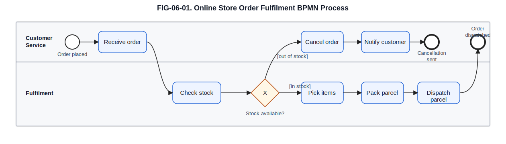
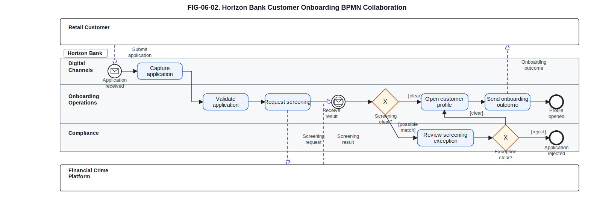
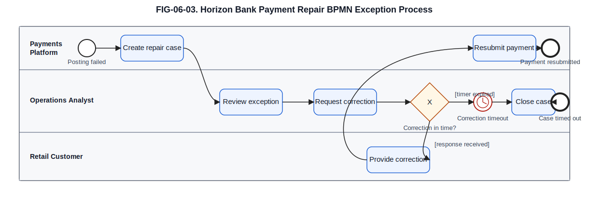

# 6. BPMN: Business Process Model and Notation

## Chapter purpose

Explain how to model end-to-end business processes, participants, decisions, events, exceptions and collaboration.

## Reader outcomes

By the end of this chapter, the reader should be able to:

- Explain what Business Process Model and Notation (BPMN) is and where it helps architecture work.
- Read common BPMN symbols without confusing process flow, message exchange and system structure.
- Distinguish events, activities, gateways, sequence flows, message flows, pools and lanes.
- Choose between a BPMN process diagram, a BPMN collaboration diagram and nearby alternatives such as UML activity diagrams.
- Apply BPMN to the Simple Online Store and Horizon Bank examples.
- Avoid common BPMN mistakes, especially over-detail, unclear ownership and mixing process models with software structure diagrams.

## Prerequisites and dependencies

- Chapter 5: The C4 Model

## Required models and artefacts

- FIG-06-01: BPMN process diagram for online store order fulfilment
- FIG-06-02: BPMN collaboration diagram for Horizon Bank customer onboarding
- FIG-06-03: BPMN exception and timer collaboration for Horizon Bank payment repair

## Worked examples

- Order fulfilment
- Customer onboarding
- Cross-border payment

## Source requirements

- `[OMG-BPMN]` supports BPMN 2.0.2 terminology and notation.
- `[BPMN-TOOL-GUIDANCE-2026]` supports practical BPMN modelling tool guidance.
- Chapter guidance is the author's practical interpretation for beginner architecture work.
- Diagrams are original teaching examples and must not reproduce OMG specification diagrams.

## What BPMN is and is not

Business Process Model and Notation (BPMN) is a standard notation for showing business process behaviour. In plain language, it helps a team describe who does the work, what happens next, what decisions are made, what messages cross organisational boundaries and what exceptions may interrupt the normal path.

The official BPMN specification is broad [OMG-BPMN]. It defines many elements for process modelling, collaboration modelling, choreography and execution detail. This chapter does not try to teach the whole specification. It focuses on the BPMN elements that most often help architects and analysts explain business processes: events, activities, gateways, sequence flows, message flows, pools, lanes, subprocesses, data objects and common exception patterns.

BPMN is not a software structure notation. It does not replace a C4 container diagram, a UML component diagram or a deployment diagram. If the question is "which systems exist?", use a structure view. If the question is "what happens in the business process, who participates, and where do exceptions occur?", BPMN is often a strong fit.

BPMN is also not a guarantee of automation. A BPMN task may be manual, user-assisted, system-executed or a call to another process. The modeller must say what level of abstraction is intended. A process used for architecture discussion is usually less detailed than a workflow model used to configure an execution engine.

Use BPMN when process order, responsibility, decisions, waiting, messages and exceptions matter. Do not use it merely because a team wants a flowchart that looks formal.

## How to create BPMN diagrams in practice

BPMN diagrams can be created in two different kinds of tools, and the difference matters.

A **semantic BPMN modeller** understands BPMN elements as model objects. A start event is not just a circle. A task is not just a rounded rectangle. The tool can usually save BPMN XML, preserve BPMN Diagram Interchange layout, validate some modelling rules and exchange the model with other BPMN-aware tools. This matters when the process may be analysed, simulated, reviewed in a process repository or prepared for an execution engine.

A **generic drawing tool** lets the modeller draw shapes that look like BPMN. That can be useful for workshops, teaching illustrations or quick communication, but the diagram is not necessarily a valid BPMN model. A drawing tool may not know whether a sequence flow crosses a pool boundary or whether an event-based gateway is used correctly.

Useful BPMN tool options include:

| Tool | Practical use | Caution |
|---|---|---|
| Camunda Desktop Modeler | Free desktop modelling of BPMN, Decision Model and Notation (DMN) and related Camunda artefacts. Recommended in this book when BPMN XML interoperability and execution semantics matter. | Best when the team is comfortable storing and reviewing BPMN XML files. |
| Bizagi Modeler | Free BPMN-oriented process modelling and documentation for analysts and process teams. | Check export and collaboration needs before treating it as the repository of record. |
| diagrams.net | General diagramming and illustration with BPMN shapes. | Suitable for illustrations, but it does not replace a semantic BPMN modeller when BPMN XML or execution semantics matter. |
| SAP Signavio | Enterprise process modelling, collaboration and process-management tooling. | A broader paid platform; choose it for process governance, not only for drawing a single diagram. |
| Camunda Web Modeler | Browser-based modelling and collaboration in the Camunda ecosystem. | Best when the organisation uses Camunda's platform workflow and collaboration model. |
| Visual Paradigm | Modelling suite with BPMN support alongside other architecture and software modelling features. | Tool breadth is useful, but teams still need modelling conventions and repository discipline. |

This repository stores `.bpmn` files as the editable source for Chapter 6 figures. SVG is the primary publication export because it stays sharp in PDF and web output. PNG previews are stored for quick visual inspection and review workflows. The rule is simple: edit the BPMN source, then regenerate the publication exports, rather than treating an exported image as the source of truth.

## Core BPMN ideas

For a beginner, BPMN can be read through five questions:

| Question | BPMN elements that help |
|---|---|
| Where does the process start and end? | Start events, end events |
| What work happens? | Activities, tasks, subprocesses |
| What choices or splits exist? | Gateways and guards |
| Who owns or performs the work? | Pools and lanes |
| What crosses a participant boundary? | Message flows |

The most important distinction is between **sequence flow** and **message flow**. A sequence flow shows the order of work inside one process. A message flow shows communication between separate participants, usually separate pools. Mixing those two arrows is one of the fastest ways to make a BPMN diagram misleading.

## Events

An event answers: **what happens at a point in the process?**

Events are shown as circles. A start event marks where a process begins. An intermediate event marks something that happens during the process, such as receiving a message, waiting for a timer or catching an error. An end event marks an outcome of the process.

For the Simple Online Store, a start event might be Order received. An intermediate message event might be Payment confirmation received. An end event might be Order dispatched or Order cancelled.

For Horizon Bank, a customer onboarding process might start when an application is submitted. It may wait for identity evidence, receive screening results and end when the customer profile is opened or the application is rejected. In a payments process, a timer event may show that a repair case is created if a payment is not corrected within a defined period.

An intermediate message catch event is a waiting point. It means the process is waiting until a message arrives, such as a screening result or corrected customer information. It is different from a task because no work is being performed while the process waits.

Do not use events for every ordinary task. "Check address" is an activity, not an event. "Address evidence received" can be an event because it is something that happens and may trigger later work.

## Activities and task types

An activity answers: **what work is performed?**

Activities are shown as rounded rectangles. A task is an atomic unit of work at the chosen modelling level. A subprocess is an activity that hides more detailed internal flow. BPMN also defines task types, such as user task, service task, manual task, script task and business rule task [OMG-BPMN].

For beginner architecture diagrams, task type matters only when it changes the conversation. If the reader needs to know that a customer support agent does the work, show a user or manual task and place it in the right lane. If the reader needs to know that a system calls a screening service, show a service task. If the distinction is not useful, a plain task is enough.

In the Online Store, Pick items, Pack parcel and Dispatch parcel are useful activities in an order fulfilment process. In Horizon Bank, Capture application, Verify identity evidence and Review screening exception are activities in customer onboarding.

Avoid turning BPMN into a user-interface script. "Click Next" and "Open tab" are rarely process activities at architecture level. Use activities that describe meaningful business work.

## Gateways

A gateway answers: **where does the process branch, merge or run work in parallel?**

Gateways are shown as diamonds. An exclusive gateway chooses one path from several alternatives. A parallel gateway starts or joins paths that all happen. Inclusive gateways are useful when one or more paths may be taken, but they are harder for beginners and should be used sparingly.

An event-based gateway is different from an exclusive gateway. It waits to see which event happens first, such as "correction received" or "correction deadline reached". Use it when the process is waiting for competing events, not when a worker or system is evaluating data.

Guards on outgoing flows explain the decision. For example, a gateway after Check stock might have `[in stock]` and `[out of stock]` paths. A gateway after Screening result might have `[clear]` and `[possible match]` paths.

Use gateways for decisions or synchronisation, not as decoration. If a process always moves from one task to the next, a sequence flow is enough. If a condition matters, label it. An unlabelled gateway forces the reader to guess the rule.

## Sequence flows and message flows

A sequence flow answers: **what is the order of work inside one process?**

A message flow answers: **what communication crosses between participants?**

Sequence flows stay inside one pool. They are the normal solid arrows from one event, activity or gateway to the next. They should not cross from one organisation or system participant into another pool.

Message flows cross between pools. They are used when one participant sends information, a request or a response to another participant. In a collaboration diagram, a Retail Customer might send an application to Horizon Digital Channels, and the Customer Onboarding Platform might send a screening request to the Financial Crime Platform.

This difference matters architecturally. A sequence flow implies one process owns the order of work. A message flow implies interaction between separate participants. If a bank and an external identity provider collaborate, do not draw a single sequence flow through both as if one process controls both organisations.

## Pools and lanes

A pool answers: **which participant owns this process or collaboration participant?**

A lane answers: **which role, team or system area is responsible within a pool?**

Pools are often used for organisations, major external participants or independently owned process participants. Lanes divide work inside a pool. For example, a Horizon Bank pool might contain lanes for Digital Channels, Onboarding Operations and Compliance. A separate Financial Crime Platform pool can show message exchange without implying that the onboarding team controls the financial-crime platform's internal process.

For architecture work, pools and lanes are useful because they reveal ownership and hand-offs. A process with five lanes and many back-and-forth paths may be telling the team that responsibilities are unclear or that automation boundaries need attention.

Do not create one lane for every job title or application unless the distinction matters. Too many lanes make the model harder to read and encourage ownership debates that the diagram may not need to settle.

## Data objects and annotations

Data objects answer: **what information is produced, used or changed by this process?**

Text annotations answer: **what assumption or rule should the reader notice?**

Data objects are not database tables. They are process-level information items, such as Return request, Payment instruction, Identity evidence or Screening result. Use them when the information changes the process discussion. If a data object does not help explain the flow, omit it.

Annotations are useful for rules, assumptions and exclusions. For example, an annotation may say "Refund settlement and reconciliation are outside this view." This is better than making the diagram large enough to show every downstream process.

## Subprocesses

A subprocess answers: **which part of the process is complex enough to hide or expand separately?**

Subprocesses keep a diagram readable. A top-level customer onboarding process may show Capture application, Verify identity, Screen customer and Open profile. The Screen customer subprocess can later expand into sanctions screening, politically exposed person checks, adverse media checks and exception review.

Collapsed subprocesses are useful for architecture chapters because they support the same discipline as C4 levels of zoom. Start at the level that answers the reader's question. Expand only the part that needs more detail.

Avoid hiding important risk or control behaviour inside a subprocess if the current audience needs to review it. If the question is compliance traceability, the screening and exception paths should be visible.

## Exceptions, timers and escalations

BPMN is strong when the process does not follow a happy path. It can show that something interrupts work, waits for a time limit, escalates to another role or leads to a different outcome.

Common exception patterns include:

| Pattern | BPMN idea | Example |
|---|---|---|
| Possible screening match | Gateway or conditional business outcome | A screening result is `[possible match]`, so the process goes to review before it can continue or reject the application. |
| Technical activity failure | Boundary error event | A posting task fails because a downstream system rejects or cannot complete the operation. |
| Overdue work | Boundary timer event | A customer does not provide correction information within the requested period. |
| Higher-level intervention | Escalation | Operations asks a senior role or compliance team to intervene without pretending that the original task simply succeeded. |

For Horizon Bank, a payment repair process may start when posting fails. Operations reviews the exception, requests correction, waits for a response and either resubmits the payment or closes the case. The timer matters because the process may need an explicit timeout path rather than an implied "someone will chase it".

A boundary timer event sits on the edge of an activity and means the activity is interrupted or redirected when a deadline is reached. A boundary error event also sits on an activity boundary, but it catches a technical or process error from that activity. Both are useful when the exception belongs to a specific task rather than to the whole process. Escalation is for higher-level intervention, where another role or process must be alerted while the business situation is still being handled.

## BPMN process diagrams

A BPMN process diagram answers: **what is the flow inside one process owner or participant?**

Figure FIG-06-01. Online Store order fulfilment BPMN process. It shows the main fulfilment flow inside the Online Store, not payment authorisation, delivery-provider internals or software component design.

Read the diagram from left to right. The message start event shows that the Online Store begins fulfilment when the order is received. The Customer Service lane receives the order. The Fulfilment lane checks stock, picks, packs and dispatches the parcel. The process branches when stock is unavailable and ends with either dispatch or cancellation notice. The figure deliberately excludes payment capture, warehouse-system internals, delivery partner processing and return handling.

This kind of process diagram is useful when the team needs to agree the business flow before discussing application design. It is less useful when the question is which API, database or deployment node supports fulfilment.

## BPMN collaboration diagrams

A BPMN collaboration diagram answers: **which participants exchange messages while their own processes remain separate?**

Figure FIG-06-02. Horizon Bank customer onboarding BPMN collaboration. It shows message exchange between the customer, Horizon Bank and the Financial Crime Platform, not the internal architecture of those systems.

Notice that message flows cross between pools, while sequence flows stay inside the Horizon Bank process. Retail Customer and Financial Crime Platform are black-box participants, so their internal tasks are not shown. Horizon Bank starts when it receives the application, requests screening, waits for the screening result and then evaluates Screening clear? only after the result has arrived. If the result is a possible match, Compliance reviews the exception and a second guarded decision chooses either `[clear]` or `[reject]`. The diagram deliberately excludes user-interface screens, data model detail, integration protocols and the full financial-crime investigation process.

Collaboration diagrams are valuable in regulated environments because they make hand-offs visible. They show where the bank depends on an external participant or platform, and they help reviewers ask whether status, evidence, ownership and exception handling are clear.

## BPMN exception and timer views

Exception views answer: **what happens when the normal process cannot continue?**

Figure FIG-06-03. Horizon Bank payment repair BPMN exception collaboration. It shows a simplified repair path after payment posting failure, including an operations review, customer correction request, corrected-information message and timeout outcome.

The event-based gateway is the important part of this view. It shows that the Horizon Bank process waits for whichever event happens first: corrected information arrives from the Retail Customer, or the correction deadline is reached. If the customer responds in time, operations validates the correction and the Payments Platform resubmits the payment. If the timer fires, the case is closed as timed out. Sequence flow stays inside the Horizon Bank pool, while the correction request and corrected information are message flows across the customer boundary. The figure deliberately excludes detailed payment scheme rules, sanctions casework, accounting reconciliation and system deployment.

## BPMN versus UML Activity

BPMN and UML activity diagrams can both show flow, but they are optimised for different conversations.

| Question | BPMN often fits when... | UML activity often fits when... |
|---|---|---|
| Who participates? | Pools, lanes and message flows need to show collaboration. | Responsibility is simple or internal to one system. |
| What process outcome occurs? | The reader cares about business process, hand-offs and exceptions. | The reader cares about algorithm-like logic or system behaviour. |
| What crosses boundaries? | Message flows between participants are important. | The flow stays inside one system or component. |
| How formal should it be? | Analysts, process owners and operations teams need process notation. | Architects and developers need a compact behavioural view. |

Chapter 4 used a UML activity diagram to show payment validation logic inside the Payments Platform. That was a system-behaviour view. BPMN is the better fit when the question expands to customer, operations, compliance, external platforms, timers and exception ownership.

Do not choose BPMN just because the process involves people. Choose it when the notation helps the audience reason about business flow and collaboration. Do not choose a UML activity diagram merely because it is quicker to draw if the collaboration and message boundaries are the real topic.

## Common mistakes

The first mistake is mixing sequence flow and message flow. Sequence flow should not jump from a bank pool into a customer or provider pool. Use message flow across participant boundaries.

The second mistake is using BPMN as a system architecture diagram. A pool named "Payments API" may be useful in a technical process, but BPMN should not become a container or component diagram. If the question is software structure, use C4 or UML.

The third mistake is modelling at inconsistent levels. A process that mixes "Open account" with "Click submit button" is hard to review. Keep activities at one level of abstraction.

The fourth mistake is hiding every exception. A process that shows only the happy path may be fine for a first sketch, but architecture review usually needs at least the important rejection, timeout and escalation paths.

The fifth mistake is creating too many lanes. Lanes should clarify responsibility. If they merely make the diagram wide and crowded, use fewer lanes and explain the detail in supporting prose.

The sixth mistake is treating a BPMN diagram as complete procedure documentation. A useful architecture process model needs a title, purpose, scope, audience, exclusions and source context. The diagram should be accompanied by prose that states what the reader should notice and what the diagram deliberately omits.

## Chapter cheat sheet

| BPMN element | Plain meaning | Use when | Watch out for |
|---|---|---|---|
| Start event | Where the process begins | A trigger matters | Do not turn ordinary tasks into events |
| End event | A process outcome | Different outcomes matter | Label important endings |
| Activity or task | Work performed | The work changes state or responsibility | Avoid user-interface click detail |
| Gateway | Branch, merge or parallel split | The process has choices or synchronisation | Label outgoing conditions |
| Sequence flow | Order inside one process | Showing what happens next | Do not cross pool boundaries |
| Message flow | Communication between participants | Showing hand-offs or requests | Do not use for internal task order |
| Pool | Participant or process owner | Collaboration matters | Do not use as a software container by default |
| Lane | Responsibility inside a pool | Ownership matters | Too many lanes reduce readability |
| Data object | Process-level information item | Data affects the process | Do not model database schema |
| Timer event | Wait or timeout | Deadlines matter | State what happens when time expires |

## Key takeaways

- BPMN models business process behaviour, not software structure.
- Start with the process question before choosing the level of detail.
- Use sequence flows inside one process and message flows between participants.
- Pools show participants; lanes show responsibility within a participant.
- Gateways should have clear conditions when they branch.
- Exceptions, timers and escalations are often the most valuable part of a BPMN model.
- BPMN collaboration diagrams are useful when ownership and message exchange matter.
- UML activity diagrams remain useful for compact system logic, while BPMN is stronger for business process collaboration.

## Practical exercise

You are asked to model a return process for the Simple Online Store. A Customer requests a return. The Online Store checks eligibility. If the return is eligible, the store requests a refund from the Payment Provider System and may request collection from the Delivery Partner System. If the return is outside policy, a Customer Support Agent reviews the exception.

Create a small BPMN modelling plan before drawing:

1. Which participants should be pools?
2. Which responsibilities inside the Online Store might be lanes?
3. Which paths need gateways?
4. Which details should be excluded from the first process model?

Suggested answer:

- Use separate pools for Customer, Online Store, Payment Provider System and Delivery Partner System if the message exchange is important.
- Inside the Online Store, lanes might include Customer Service and Fulfilment or Returns Operations, if that responsibility split matters.
- Use an exclusive gateway for eligibility and another conditional branch for collection required.
- Exclude database tables, API design, deployment nodes, payment settlement internals and delivery-provider internals from the first process model.

## Review checklist

- [ ] The diagram title states whether it is a process or collaboration view.
- [ ] The process question, audience and abstraction level are clear.
- [ ] Sequence flows stay inside one pool.
- [ ] Message flows cross between pools and represent communication.
- [ ] Gateways have readable conditions.
- [ ] Pools and lanes clarify ownership without overcrowding the page.
- [ ] Important exception, timer or escalation paths are shown or explicitly excluded.
- [ ] Data objects are process information, not database tables.
- [ ] The diagram text explains what has been omitted.
- [ ] Terminology, link, diagram-register and manuscript checks pass.

## References and further reading

Chapter source notes are maintained in the repository under `research/bpmn/` and registered in `SOURCE_REGISTER.md`. Appendix H, [Glossary and Source Notes](../appendices/appendix-h-glossary-sources.md), is the intended publication location for the final source-key index once the appendix is completed.

- `[OMG-BPMN]`: Object Management Group BPMN 2.0.2 specification.
- `[BPMN-TOOL-GUIDANCE-2026]`: Official BPMN tool source note for practical modeller and drawing-tool guidance.
