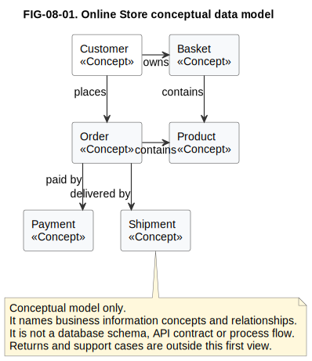
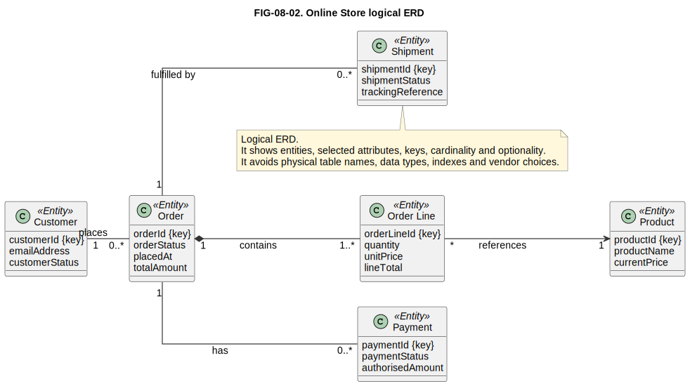
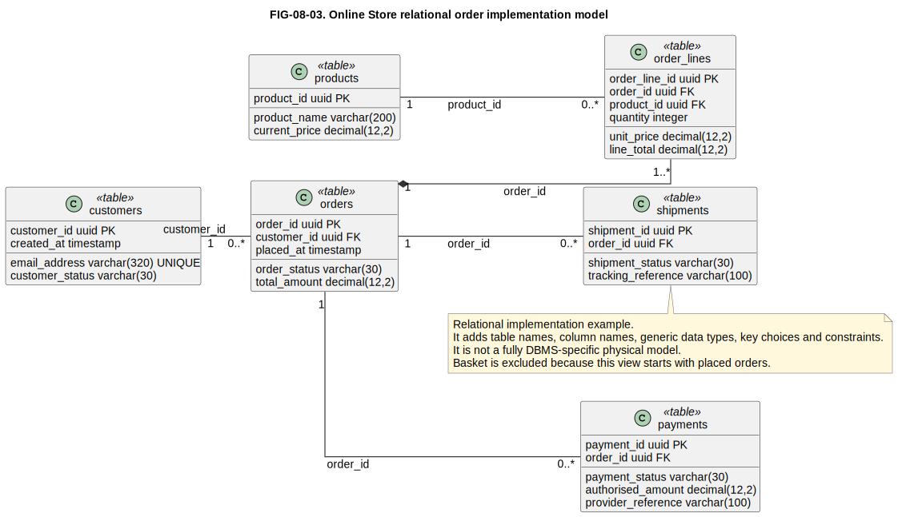
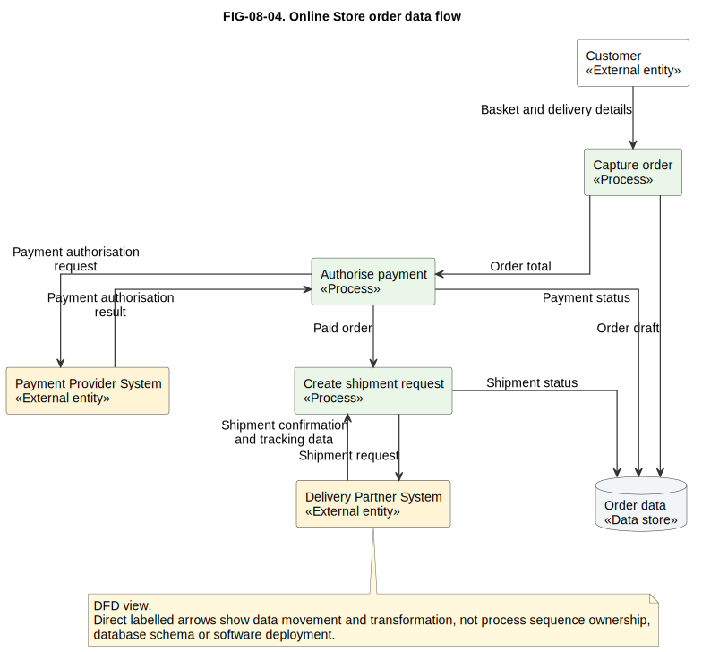
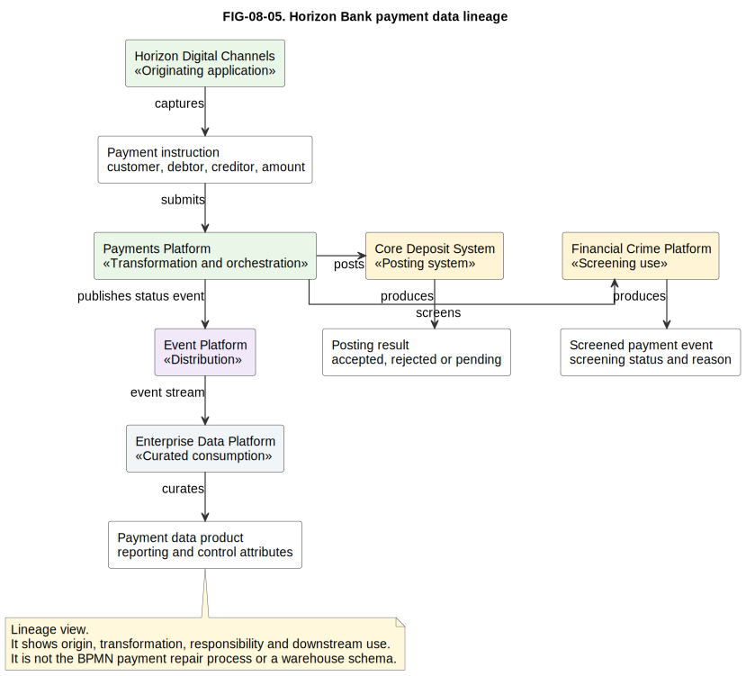
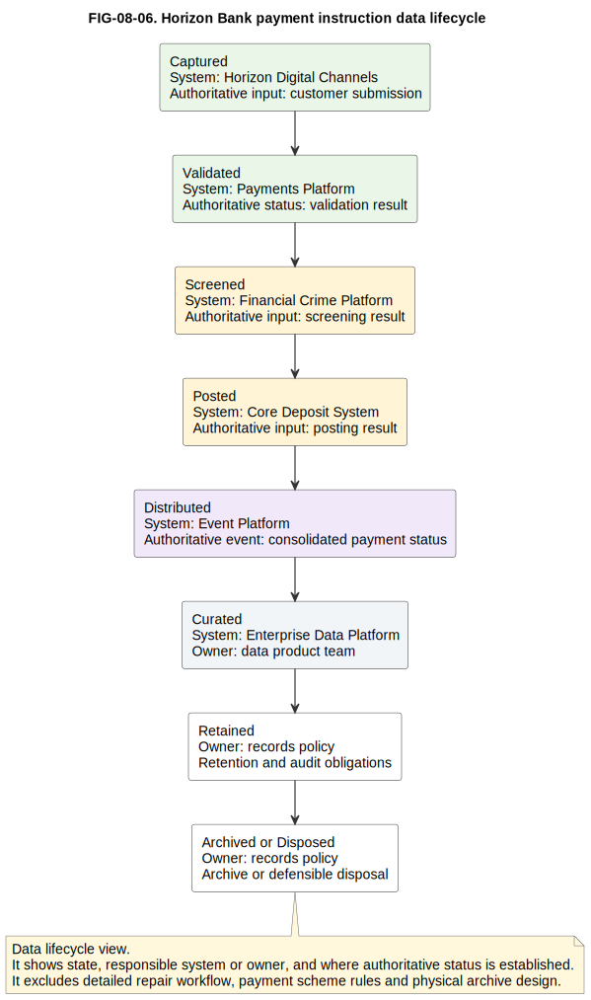

# 8. Data Modelling

## Chapter purpose

Teach conceptual, logical and physical data modelling, entity relationship diagrams, data flows, lineage and lifecycle views.

## Reader outcomes

By the end of this chapter, the reader should be able to:

- Explain why data often needs its own models alongside process, software and enterprise architecture views.
- Distinguish conceptual, logical and physical data models.
- Read a simple entity relationship diagram (ERD), including entities, attributes, keys, cardinality and optionality.
- Distinguish an ERD from a data flow diagram (DFD), a data lineage view and a lifecycle view.
- Decide when to use canonical, shared or local data models.
- Apply data modelling ideas to the Simple Online Store and Horizon Bank examples.
- Avoid common data modelling mistakes, especially mixing business meaning, database design and process flow in one view.

## Prerequisites and dependencies

- Chapter 7: ArchiMate

## Required models and artefacts

- FIG-08-01: Online Store conceptual data model, specification created, source created and rendered for review.
- FIG-08-02: Online Store logical ERD, specification created, source created and rendered for review.
- FIG-08-03: Online Store relational order implementation model, specification created, source created and rendered for review.
- FIG-08-04: Online Store order data flow, specification created, source created and rendered for review.
- FIG-08-05: Horizon Bank payment data lineage, specification created, source created and rendered for review.
- FIG-08-06: Horizon Bank payment instruction data lifecycle, specification created, source created and rendered for review.

## Worked examples

- Online customer, basket, order, product, payment and shipment data.
- Horizon Bank payment data movement, screening, posting and reporting lineage.

## Source requirements

- `[CHEN-ER-1976]` supports the entity, relationship and attribute basis for ER modelling.
- `[CODD-RELATIONAL-1970]` supports the separation between logical relational thinking and physical storage detail.
- `[W3C-PROV-DM-2013]` supports provenance and lineage concepts such as origin, activity and responsible agent.
- `[DAMA-DMBOK2-2017]` provides practitioner context for wider data management, data modelling and lifecycle concerns.
- `[DEMARCO-STRUCTURED-ANALYSIS-1979]` supports DFDs as a structured analysis technique.
- Chapter guidance is the author's practical interpretation for beginner architecture work.
- Diagrams are original teaching examples and do not reproduce source diagrams.

## Why data needs separate models

Architecture diagrams often show processes, applications, interfaces and technology. Those views are useful, but they can hide a basic question: **what information does the organisation need to understand, govern, move and trust?**

Data modelling answers that question. In plain language, a data model explains the important things the organisation knows about, the facts it records about those things and the relationships between them.

This matters because many architecture problems are really data problems. A process may be slow because different teams ask for the same customer information several times. A system landscape may be fragile because each application uses a different meaning for "customer". A reporting platform may be distrusted because nobody can explain where a value came from or how it was transformed.

Data models do not replace process models, C4 diagrams, ArchiMate views or security models. They complement them. Use a data model when the architecture question is about business meaning, structure, ownership, movement, lineage or lifecycle of information.

For beginners, the first discipline is separation:

| View | Main question | Do not confuse it with |
|---|---|---|
| Conceptual data model | What business information concepts matter? | Database schema |
| Logical data model or ERD | What entities, attributes, keys and relationships are required? | Vendor-specific implementation |
| Physical data model | How is the logical model implemented in a database or store? | Business concept map |
| DFD | Where does data move and transform? | Entity relationship structure |
| Lineage view | Where did data originate, how did it change and where is it used? | General integration diagram |
| Lifecycle view | What states does data pass through from creation to retention or disposal? | Full business process |

## Conceptual data model

A conceptual data model answers: **what are the important business concepts and relationships?**

It is the simplest useful data model. It avoids physical implementation detail and focuses on meaning. A conceptual model might say that a Customer places Orders, an Order contains Products and an Order may be paid by Payments. It does not need column names, data types, indexes or table names.

This kind of model is useful with business stakeholders because it exposes vocabulary. If one team says "customer" and means a registered person, while another team means a delivery recipient, the conceptual model should make that difference visible. If the terms are the same but the meanings differ, the architecture has a semantic risk.

The classic entity-relationship approach introduced the idea of modelling entities, relationships and attributes as a separate view of data [CHEN-ER-1976]. This chapter uses that foundation in a practical beginner way. The aim is not to teach every ER modelling variation. The aim is to help the reader separate business meaning from later database design.

Figure FIG-08-01. Online Store conceptual data model. The model names the business information concepts and relationships, but it deliberately avoids database tables, keys, data types and process sequence.

Basket appears here because a conceptual model can show the wider business vocabulary around ordering. The later logical and relational examples deliberately narrow their scope to placed orders, so Basket is left out once the order has been placed.

In Horizon Bank, a conceptual model might include Party, Customer, Account, Payment Instruction, Product, Agreement and Screening Case. That is not yet a schema. It is a shared conversation about meaning.

## Logical data model

A logical data model answers: **what information structure is needed, independent of a specific database product?**

It usually adds more precision than a conceptual model. It identifies entities, attributes, keys, relationships, cardinality and optionality. It may still be technology-independent. For example, the logical model can say that one Order contains one or more Order Lines and that each Order Line references one Product. It does not need to say whether the database is PostgreSQL, Oracle, SQL Server, a document store or a graph database.

An entity represents something the organisation needs to distinguish over time. An attribute records a fact about an entity. A key identifies an entity instance. A relationship connects entity instances. Cardinality explains how many instances may participate. Optionality explains whether the relationship must exist.

Logical models are useful when analysts, architects and developers need a shared structure before implementation. They are also useful for reviewing integration contracts, event schemas and reporting definitions because they reveal whether the data meaning is coherent.

Figure FIG-08-02. Online Store logical ERD. The diagram adds selected attributes, keys, cardinality and optionality. It is more precise than the conceptual model but still avoids physical database choices.

The Online Store logical ERD starts after an order has been placed. It therefore focuses on Order, Order Line, Product, Payment and Shipment rather than Basket. A separate basket model could be useful for shopping-session behaviour, but it would answer a different question.

For Horizon Bank, a logical model may show that a Party can play several roles, such as Retail Customer, Corporate Customer or Beneficial Owner. It may show that an Account is held under an Agreement and that a Payment Instruction has debtor, creditor, amount, currency, status and requested execution date. That model helps prevent each application from inventing a different local meaning for the same banking facts.

## Physical data model

A physical data model answers: **how will the data be implemented in a specific storage technology?**

It adds choices that matter to implementation: table or collection names, column names, data types, primary keys, foreign keys, indexes, constraints, partitioning, retention choices and sometimes storage-specific features. These details are important, but they should not appear too early.

The relational model is important because it separated a logical view of data from physical storage dependence [CODD-RELATIONAL-1970]. A beginner does not need to learn relational theory in depth to benefit from the lesson. The lesson is this: do not treat every business concept as if it is already a table, and do not treat every table as if it explains the full business meaning.

Figure FIG-08-03. Online Store relational order implementation model. The view adds table names, columns, generic data types, primary keys, foreign keys and constraints for placed orders. It is not yet a fully database-management-system-specific physical model.

The figure uses relational implementation detail, but it deliberately avoids PostgreSQL-specific storage parameters, partitioning syntax, indexing strategy and operational tuning. Basket is excluded for the same reason it is excluded from the logical ERD: this example has narrowed to placed orders.

Physical models are useful for database design, performance review, security review and implementation planning. They are less useful for early business alignment because the implementation detail can distract from the meaning. Use them when the reader needs to make or review implementation decisions.

## Entities, attributes and keys

An entity answers: **what kind of thing must we identify and remember?**

A Customer, Order, Product, Payment Instruction or Account may be an entity. Not every noun deserves to be an entity. A model should include entities that matter to the architecture question.

An attribute answers: **what fact do we record about the entity?**

For an Order, useful attributes might include order status, placed date and total amount. For a Payment Instruction, useful attributes might include amount, currency, debtor account, creditor account, requested execution date and payment status.

A key answers: **how do we distinguish one instance from another?**

A logical key may be a stable business identifier, such as an account number, or a technical identifier used internally. A physical model may add surrogate keys, natural keys, unique constraints and indexes. Beginners should be careful with identifiers. A customer's email address may look unique, but people can change email addresses, share addresses or use different addresses across channels. A good model states what an identifier means and who governs it.

In banking, the difference between Party and Customer is important. A party is a person or organisation known to the bank. A customer is usually a party in a customer relationship with the bank. A beneficial owner, signatory or power-of-attorney holder may be a party without being the same thing as the product customer. A data model should make those distinctions visible instead of hiding them behind one vague `customer` table.

## Relationships, cardinality and optionality

A relationship answers: **how do entity instances relate?**

Cardinality answers: **how many?** Optionality answers: **must the relationship exist?**

In the Simple Online Store:

- One Customer may place zero or more Orders.
- One Order must contain one or more Order Lines.
- Each Order Line references one Product.
- One Order may have zero or more Payments.
- One Order may have zero or more Shipments.

The optional relationships are not mistakes. They reflect real lifecycle timing. An order may exist before payment is authorised. A payment may be declined. A shipment may not exist until fulfilment begins. Cardinality and optionality help the model express these facts without turning the ERD into a process diagram.

In Horizon Bank, one Party may hold several Accounts, and one Account may have several related Parties with different roles. A Payment Instruction may have one debtor and one creditor, but a batch payment file may contain many payment instructions. These relationship details affect application design, integration contracts, reporting and controls.

## Data Flow Diagrams

A data flow diagram answers: **where does data move, where is it transformed and where is it stored?**

A DFD is different from an ERD. An ERD shows the structure of data. A DFD shows movement and transformation. Common DFD elements are external entities, processes, data stores and labelled data flows. Structured analysis popularised this way of focusing on data movement separately from program structure [DEMARCO-STRUCTURED-ANALYSIS-1979].

Figure FIG-08-04. Online Store order data flow. The diagram shows directional data movement between the Customer, Online Store processes, Order data store and external systems. Payment authorisation request and result are separate flows, and shipment request and confirmation are separate flows. It is not a database schema, BPMN process or deployment view.

DFDs are useful when integration and responsibility are unclear. If payment details move from the Online Store to the Payment Provider System, the data flow label should say whether the data is a payment authorisation request or an authorisation result. If shipment data moves to or from the Delivery Partner System, the diagram should distinguish the shipment request from shipment confirmation and tracking data.

Use DFDs for data movement and transformation. Do not use them to define database tables. Do not use them to replace BPMN when the real question is business process sequence, waiting, exceptions and ownership.

## Data lineage

Data lineage answers: **where did this data come from, how was it changed, who or what was involved and where is it used?**

Lineage is especially important when data supports reporting, compliance, risk decisions or customer communication. A report value is not trustworthy merely because it appears in a dashboard. A reviewer may need to know which source system created it, which transformation changed it, which control checked it and which data product published it.

The W3C PROV data model is a useful formal source for provenance concepts. It describes provenance through entities, activities and agents involved in producing or influencing data [W3C-PROV-DM-2013]. Chapter 8 does not teach full PROV notation, but it uses the same underlying idea: lineage should show origin, transformation, responsibility and use.

Figure FIG-08-05. Horizon Bank payment data lineage. The view follows payment information from digital capture through screening, posting, consolidation, event distribution and curated data consumption. Screening result and posting result become explicit inputs to the consolidated payment status event. It does not replace the BPMN payment repair process or a warehouse schema.

For Horizon Bank, lineage matters because payment data may feed customer notifications, financial crime monitoring, operational dashboards, regulatory reporting and reconciliation. If the same payment has different statuses in different systems, lineage helps the team find which system is authoritative for each status and how updates travel. In this example, the final Payment data product can be traced back to the original payment instruction, the screening result, the posting result and the consolidated payment status event.

## Data lifecycle

A data lifecycle view answers: **what happens to data from creation to archival or disposal?**

Typical lifecycle states include create, validate, use, update, share, archive, retain and dispose. Not every model needs every state. The useful states are the ones that affect architecture decisions.

For a payment instruction, the lifecycle might include:

1. Captured by Horizon Digital Channels.
2. Validated by the Payments Platform.
3. Screened by the Financial Crime Platform.
4. Posted by the Core Deposit System.
5. Published through the Event Platform.
6. Curated in the Enterprise Data Platform.
7. Retained according to policy.
8. Archived or disposed according to policy.

Figure FIG-08-06. Horizon Bank payment instruction data lifecycle. The view shows lifecycle states, responsible systems or owners, and where authoritative status is established. It excludes detailed payment repair workflow, payment scheme rules and physical archive design.

Lifecycle modelling is useful for ownership, retention, privacy, audit and operational support. It should answer practical questions: who may update the data, which system is authoritative at each state, which controls apply and when may the data be archived or deleted?

Do not confuse lifecycle with a process model. A lifecycle view focuses on the state and governance of data. A BPMN process focuses on activities, participants, sequence and exceptions.

## Canonical and local models

A canonical model answers: **what shared meaning should multiple systems use when they exchange or interpret data?**

A local model answers: **what meaning and structure does one application or bounded area use internally?**

Both are useful. A canonical model can reduce translation work and semantic confusion across an enterprise. A local model can fit one system's purpose, performance and ownership. The mistake is assuming one model should do every job.

For Horizon Bank, a shared payment message or event schema might use canonical concepts such as Payment Instruction, Debtor, Creditor, Amount, Currency and Payment Status. The Payments Platform may have a local model optimised for orchestration and repair. The Enterprise Data Platform may have a curated model optimised for reporting and analytics.

The architecture decision is not "canonical good, local bad". The decision is where shared meaning is necessary and where local autonomy is acceptable. Overly broad canonical models become slow to change. Uncontrolled local models create inconsistent meaning and expensive mappings.

## ERD versus DFD

An ERD and a DFD answer different questions:

| Question | ERD | DFD |
|---|---|---|
| Main concern | Structure of data | Movement and transformation of data |
| Main nouns | Entity, attribute, key, relationship | External entity, process, data store, data flow |
| Best for | Meaning, cardinality, optionality, schema design | Integration, hand-offs, processing responsibility |
| Weak for | Showing sequence or transformation steps | Defining precise attributes and keys |
| Common mistake | Treating it as a process flow | Treating it as a database model |

Use an ERD when the team needs to agree what the data means and how concepts relate. Use a DFD when the team needs to see how data enters, moves, changes and leaves a scope. Use lineage when the team needs traceability from origin to use. Use a lifecycle view when the concern is state, ownership, retention or disposal.

## Common mistakes

The first mistake is starting with physical tables before agreeing business meaning. A schema can be technically valid and still encode the wrong concept.

The second mistake is using one vague entity for several different meanings. In banking, Party, Customer, Account Holder, Signatory and Beneficial Owner are not automatically the same thing.

The third mistake is hiding optionality. If a payment, shipment, screening result or posting result may not exist yet, the model should show that.

The fourth mistake is mixing ERD, DFD, BPMN and deployment detail on one diagram. A diagram that shows table columns, process gateways, message brokers and network nodes usually answers no question clearly.

The fifth mistake is treating lineage as a simple arrow from source to report. Useful lineage explains origin, transformation, responsibility and downstream use.

The sixth mistake is assuming a canonical model removes the need for local models. Shared meaning is useful, but each application still needs a model that fits its responsibility and constraints.

The seventh mistake is ignoring ownership. Data that nobody owns becomes difficult to correct, govern and trust.

## Chapter cheat sheet

| Model | Question answered | Useful elements | Watch out for |
|---|---|---|---|
| Conceptual data model | What business concepts matter? | Entity names and plain relationships | Do not add table detail too early |
| Logical ERD | What entities, attributes, keys and relationships are required? | Attributes, keys, cardinality and optionality | Do not bind it to one database product |
| Physical model | How is data implemented? | Tables, columns, types, constraints and indexes | Do not mistake implementation for business meaning |
| DFD | Where does data move and transform? | External entities, processes, stores and flows | Do not use it as an ERD or BPMN model |
| Lineage view | Where did data originate and where is it used? | Source, transformation, responsible system and consumer | Do not stop at a source-to-report arrow |
| Lifecycle view | What states and governance apply over time? | Capture, validate, screen, post, distribute, curate, retain and archive or dispose | Do not model every process step |
| Canonical model | What shared meaning should be reused? | Enterprise terms and shared message concepts | Do not make it too broad to change |
| Local model | What structure fits one application or bounded area? | System-specific entities and constraints | Do not let local meanings drift unmanaged |

## Key takeaways

- Data modelling explains information meaning, structure, movement, lineage and lifecycle.
- Conceptual models are for business meaning, logical models are for precise structure and physical models are for implementation.
- ERDs show entities and relationships; DFDs show data movement and transformation.
- Cardinality and optionality are architecture facts, not decorative notation.
- Lineage is essential when data supports reporting, risk, compliance or customer decisions.
- Canonical models and local models solve different problems and should be governed deliberately.
- Data ownership must be explicit, especially where several systems create, transform or consume the same information.

## Practical exercise

Horizon Bank wants to improve trust in payment status reporting. Digital channels capture payment instructions, the Payments Platform validates and orchestrates them, the Financial Crime Platform screens them, the Core Deposit System posts them and the Enterprise Data Platform publishes a reporting data product.

Before drawing, choose the right model for each question:

1. Which model would show Party, Account and Payment Instruction business meaning?
2. Which model would show Payment Instruction attributes, keys and relationships?
3. Which model would show data moving between the Payments Platform, Financial Crime Platform and Core Deposit System?
4. Which model would show how a reporting value was produced?
5. Which details should be excluded from the first architecture-level data model?

Suggested answer:

- Use a conceptual model to agree Party, Account and Payment Instruction meanings.
- Use a logical ERD to show attributes, keys, cardinality and optionality.
- Use a DFD to show movement between systems and transformations.
- Use a lineage view to explain origin, transformation and downstream reporting use.
- Exclude database tuning, user-interface screens, BPMN exception detail, network deployment and full warehouse physical schema from the first architecture-level model.

## Review checklist

- [ ] The question answered by each model is explicit.
- [ ] The audience and abstraction level are clear.
- [ ] Conceptual, logical and physical models are not confused.
- [ ] Entity, attribute, key, relationship, cardinality and optionality are explained simply before formal use.
- [ ] ERDs are distinguished from DFDs, lineage and lifecycle views.
- [ ] The simple and banking examples are consistent with repository example files.
- [ ] Canonical and local models are presented as complementary, not as universally superior alternatives.
- [ ] Common mistakes are concrete and actionable.
- [ ] Required sources and diagrams are registered.
- [ ] Terminology, link, diagram-register and manuscript checks pass.

## References and further reading

Chapter source notes are maintained in the repository under `research/data/` and registered in `SOURCE_REGISTER.md`. Appendix H, [Glossary and Source Notes](../appendices/appendix-h-glossary-sources.md), is the intended publication location for the final source-key index once the appendix is completed.

- `[CHEN-ER-1976]`: Peter Pin-Shan Chen, entity-relationship modelling source.
- `[CODD-RELATIONAL-1970]`: E. F. Codd, relational model source.
- `[W3C-PROV-DM-2013]`: W3C PROV Data Model Recommendation.
- `[DAMA-DMBOK2-2017]`: DAMA-DMBOK second edition practitioner source.
- `[DEMARCO-STRUCTURED-ANALYSIS-1979]`: Structured analysis and data flow diagram source.
