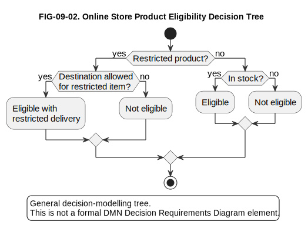
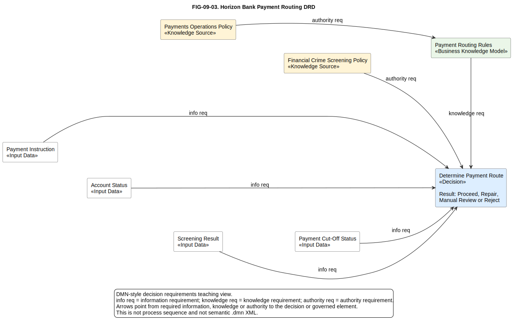
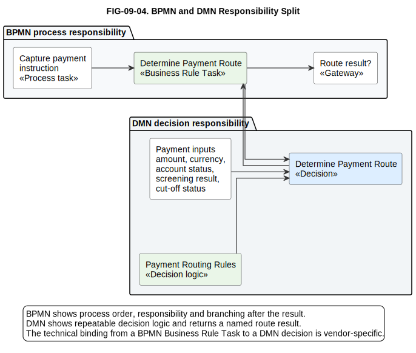

# 9. Decision Modelling and DMN

## Chapter purpose

Show how business decisions and rules can be separated from process flow and modelled transparently.

## Reader outcomes

By the end of this chapter, the reader should be able to:

- Explain why repeatable business decisions should often be modelled separately from process flow.
- Distinguish a policy, business rule, decision, decision logic, decision result and downstream action.
- Read a simple decision table, decision tree and Decision Model and Notation (DMN) Decision Requirements Diagram (DRD).
- Distinguish the decision requirements level from the decision logic level.
- Explain the basic structure of a DMN decision table, including hit policy, input clauses, unary tests, output clauses, rules and annotations.
- Recognise common DMN hit policies and why they matter.
- Understand beginner-level Friendly Enough Expression Language (FEEL) examples for comparisons, ranges, lists, strings and dates.
- Decide when to use DMN with Business Process Model and Notation (BPMN).
- Avoid common decision modelling mistakes, especially hiding process sequence inside decision logic.

## Prerequisites and dependencies

- Chapter 8: Data Modelling

## Required models and artefacts

- FIG-09-01: Online Store Delivery Decision Table, specification created, PlantUML source created and rendered for review.
- FIG-09-02: Online Store Product Eligibility Decision Tree, specification created, PlantUML source created and rendered for review.
- FIG-09-03: Horizon Bank Payment Routing DRD, specification created, PlantUML source created and rendered for review.
- FIG-09-04: BPMN and DMN Responsibility Split, specification created, PlantUML source created and rendered for review.

## Worked examples

- Online Store delivery decision.
- Online Store product eligibility decision tree.
- Horizon Bank payment routing decision.
- BPMN and DMN split for payment handling.

## Source requirements

- `[OMG-DMN-1.5]` is the current formal Object Management Group source for DMN terminology and notation.
- OMG currently lists later beta material, but beta material is informational and not the formal compliance baseline for this chapter.
- `[CAMUNDA-DMN-1.3-DOCS-2026]` supports the practical tooling caution that current Camunda documentation describes DMN 1.3 modelling.
- `[TRISOTECH-DMN-DOCS-2026]` supports practical tooling guidance for Trisotech's DMN-oriented modelling environment.
- Chapter guidance distinguishes official DMN terminology from the author's practical beginner recommendations.
- Diagrams and examples are original teaching material and do not reproduce OMG, Camunda or Trisotech diagrams.

## Why model decisions separately

Decision modelling answers: **what repeatable decision must be made, what information does it need and how is the answer derived?**

Processes and decisions are related, but they are not the same thing. A process model shows the order of work: receive an application, check identity, assess eligibility, notify the customer. A decision model shows the logic used at a decision point: is the customer eligible, which product terms apply, should the payment be routed normally or referred for review?

Separating them helps beginners avoid crowded diagrams. If a BPMN model contains every policy threshold, exception condition and scoring rule, the process becomes hard to read. If a decision model contains every human task and hand-off, the decision logic becomes hard to govern. Use process models for flow and responsibility. Use decision models for repeatable logic.

Decision modelling is useful when the organisation needs transparency. A team can review why an order is eligible for free delivery, why a loan application needs manual review, or why a payment instruction is routed to enhanced screening. The model does not remove accountability. It makes the logic visible enough for business, risk, compliance and technology people to discuss.

In the Simple Online Store, a decision might determine which delivery option applies to an order. In Horizon Bank, a decision might determine whether a payment can proceed, needs repair, needs financial-crime review or must be rejected.

## Policy, rule, decision, result and action

Begin with the vocabulary. These words are often used loosely, but the distinction matters when a team separates process flow from decision logic.

| Term | Plain meaning | Example |
|---|---|---|
| Policy | A governing statement or constraint approved by an authority. | Domestic orders of GBP 50 or more qualify for free standard delivery when all items are in stock. |
| Business rule | A specific rule derived from policy or operating practice. | If order value is at least GBP 50, all items are in stock and destination is domestic, return `Free standard delivery`. |
| Decision | A named question that produces an answer. | Determine delivery option. |
| Decision logic | The expression, table or model that derives the answer. | A decision table with four delivery rules. |
| Decision result | The answer produced by the decision. | `Paid standard delivery`. |
| Downstream action | The process step or system behaviour that uses the result. | Offer the selected delivery option to the customer. |

A decision result is not the same thing as the action that follows it. `Manual Review` may be a result. Assigning a case to an operations analyst is a downstream action. Keeping that distinction clear prevents a decision table from turning into a hidden process model.

## Decision requirements level and decision logic level

DMN separates two useful levels [OMG-DMN-1.5].

The **decision requirements level** answers: **which decisions exist and what do they depend on?** It shows decisions, input data, business knowledge models and knowledge sources. A DRD belongs at this level. It helps a team see that `Determine Payment Route` depends on `Payment Instruction`, `Account Status`, `Screening Result` and `Payment Cut-Off Status`.

The **decision logic level** answers: **how is one decision result calculated?** It may use a decision table, literal expression, boxed expression or other DMN expression. In this beginner chapter, the decision table is the main logic form.

Use the requirements level to discuss dependency and governance. Use the logic level to discuss the actual rules. A common mistake is to argue about rule thresholds before everyone agrees which inputs and decisions are in scope.

## Decision tables

A decision table answers: **which output applies for a combination of input conditions?**

It is a table of rules. Columns describe inputs and outputs. Rows describe rule cases. A business stakeholder can review the policy. A tester can derive test cases. A developer can implement the logic without discovering rules from scattered prose.

The Simple Online Store delivery table uses the Unique hit policy, written as `U`. Unique means no more than one rule should match for any valid set of inputs. The rules are deliberately non-overlapping. The dash `-` means any value for that input.

| U | Order value | All items in stock? | Destination | Delivery decision |
|---|---|---|---|---|
| 1 | `>= 50` | Yes | Domestic | Free standard delivery |
| 2 | `< 50` | Yes | Domestic | Paid standard delivery |
| 3 | `-` | No | `-` | Stock exception review |
| 4 | `-` | Yes | International | Obtain international delivery quote |


Figure FIG-09-01. Online Store Delivery Decision Table. The table uses Unique hit policy and non-overlapping rules. The dash means any value, so the stock exception rule applies whenever stock is unavailable regardless of order value or destination.

Read the figure by checking the hit policy first, then each input column, then the output. The model is a teaching table, not an implementation contract for tax, carrier selection, delivery pricing or international customs handling.

Accessibility text: A five-column decision table shows hit policy `U`, order value, stock availability, destination and delivery decision. Four rules cover free domestic delivery, paid domestic delivery, stock exception review and international quote.

For Horizon Bank, a payment routing decision table might use amount band, currency, screening result, account status and cut-off-time status to decide whether the payment proceeds, waits for repair, routes to manual review or is rejected. The table should not describe the operational steps taken after that outcome. Those steps belong in BPMN or another process view.

## DMN decision-table structure

A DMN decision table has a small set of parts that beginners should learn before reading detailed tables [OMG-DMN-1.5].

| Part | Plain meaning | Beginner review question |
|---|---|---|
| Hit-policy indicator | The symbol that says how matching rules are handled. | Is the table Unique, First, Collect or something else? |
| Input clause | A column describing one input. | What information is tested? |
| Input expression | The expression that reads or derives the input value. | Is the input name understandable and available? |
| Unary test | The condition in a rule cell. | Does this condition match the input type? |
| Output clause | A column describing the decision output. | What answer does the table produce? |
| Output value | The result in a rule row. | Is the result one of the allowed values? |
| Rule | One row of conditions and outputs. | Can the rule match, and what does it return? |
| Annotation | Optional explanatory text for review or traceability. | Does it explain policy intent without hiding logic? |

For example, `Order value` is an input clause. `>= 50` is a unary test. `Free standard delivery` is an output value. The row that combines those cells is a rule.

Annotations are helpful when they explain why a rule exists, such as "domestic free-delivery threshold approved by retail operations". They should not contain hidden extra rules. If a condition changes the answer, put it in the decision logic, not only in an annotation.

## A beginner introduction to FEEL

Friendly Enough Expression Language (FEEL) is DMN's expression language [OMG-DMN-1.5]. It is designed so business-readable expressions can be used in decision models. A beginner does not need the full language to read simple tables, but a few patterns are useful.

Simple comparisons test a value:

```text
>= 50
< 50
= "Domestic"
```

Ranges describe values between boundaries:

```text
[18..65]
(1000..5000]
```

The square bracket means the boundary is included. The round bracket means it is excluded.

Lists describe a set of allowed values:

```text
["Domestic", "International"]
["Clear", "Possible match", "Blocked"]
```

A FEEL list literal uses square brackets to create a list value, while comma-separated alternatives in a decision-table input entry are unary tests that match any one of the listed alternatives.

Strings are text values, usually written in quotation marks:

```text
"Free standard delivery"
"Manual Review"
```

Dates can be expressed as date values rather than plain text:

```text
date("2026-06-30")
```

Missing or null values need care. A missing input is not the same thing as a normal value. If a table assumes `Account Status` is present but the process sometimes lacks it, the decision model should say what happens. Options include rejecting the decision request, routing to repair, or adding an explicit rule for missing information. Do not let missing values fall through accidentally.

## Hit policies

A hit policy answers: **what should happen when one or more decision-table rules match the same inputs?**

This matters because a decision table may have overlapping rules. If a payment is both high value and international, more than one rule might apply. The model must state whether only one rule is expected to match, whether the first matching rule wins, whether several outputs are collected, or whether matching several rules is an error.

DMN defines formal hit-policy notation for decision tables [OMG-DMN-1.5]. The beginner summary is:

| Hit policy | Name | Plain meaning |
|---|---|---|
| U | Unique | No more than one rule may match. |
| A | Any | Several rules may match, but they must produce the same output. |
| P | Priority | Several rules may match, and the output with highest priority is returned. |
| F | First | The first matching rule in table order is returned. |
| R | Rule order | All matching outputs are returned in rule order. |
| O | Output order | All matching outputs are returned in output-priority order. |
| C | Collect | All matching outputs are collected. |
| C+ | Collect sum | Matching numeric outputs are summed. |
| C< | Collect minimum | The smallest matching numeric output is returned. |
| C> | Collect maximum | The largest matching numeric output is returned. |
| C# | Collect count | The number of matching rules is returned. |

For beginner architecture work, the most important lesson is not to leave the hit policy implicit. Reviewers should know whether a table expects a single answer or multiple applicable rules.

Use Unique when the rules should be mutually exclusive, as in FIG-09-01. Use First only when the business deliberately wants table order to decide the outcome. Use Collect variants when several applicable rules are meaningful, such as collecting applicable warnings or adjustment items.

## Decision-table quality checks

A decision table should be reviewed as a model, not only as a convenient table.

| Check | Question |
|---|---|
| Completeness | Does every valid input combination lead to a defined result? |
| Gaps | Are there input combinations that match no rule? |
| Overlaps | Can more than one rule match when the hit policy does not allow it? |
| Contradictions | Do matching or near-matching rules produce incompatible results? |
| Unreachable rules | Is a rule hidden by an earlier or broader rule? |
| Undefined inputs | Does the table refer to input values that are not defined or not available? |
| Missing inputs | What happens if a required value is missing or null? |

For FIG-09-01, the table covers the intended simplified scope: domestic and international destinations, stock available or unavailable, and order values above or below GBP 50. The stock exception rule deliberately ignores order value and destination because stock availability is the first business concern. The domestic rules split order value into `>= 50` and `< 50`, so they do not overlap.

Real decision tables need stronger testing. A production table should have examples for boundary values, missing values and expected rejection or repair paths.

## Decision trees

A decision tree answers: **which path through a set of questions leads to a decision?**

It represents the logic as a branching sequence. Each branch asks a question or checks a condition. Each leaf gives an outcome. A tree can be easier than a table when the decision has a natural order, such as checking whether a product can be sold before checking delivery options.

A decision tree is a general decision-modelling technique. It is not a formal DMN DRD element. A DRD shows decision dependencies. A decision tree shows a branching path through conditions. Both can be useful, but they are different views.



Figure FIG-09-02. Online Store Product Eligibility Decision Tree. The tree checks stock for both restricted and unrestricted products, while restricted products also require destination eligibility. It is a general decision-modelling technique, not a formal DMN DRD element.

Read the figure from the top. The tree first checks whether the product is restricted, then whether the destination is allowed, then stock status. It returns one of three outcomes: eligible, eligible with restricted delivery, or not eligible. The figure deliberately excludes pricing, fulfilment allocation, carrier rules and returns policy.

Accessibility text: A branching decision tree starts with restricted product status. Restricted products check destination allowance and stock before returning eligible with restricted delivery or not eligible. Unrestricted products check stock and return eligible or not eligible.

For a beginner, the main benefit of a decision tree is readability. It can show the story of the decision. The main risk is that a tree can hide duplicated or inconsistent logic when it grows large. If several branches repeat the same condition, a decision table or DMN model may be easier to govern.

## Introduction to DMN

DMN answers: **how can a business decision be modelled with standard concepts for decision requirements and decision logic?**

DMN is an Object Management Group standard for modelling repeatable business decisions [OMG-DMN-1.5]. The current formal version used by this chapter is DMN 1.5. OMG also lists later beta material, but the beta material is informational rather than the formal compliance baseline for this book.

In plain language, DMN gives teams a standard way to separate decision logic from process flow. A BPMN task may say "Assess application". A DMN model can show which decision is being made, which input data it needs, which supporting knowledge it uses and, where appropriate, the decision table or expression that produces the result.

DMN is most useful when the decision is repeatable, reviewable and important enough to govern. Product eligibility, pricing rules, routing choices, risk bands, benefit entitlement and policy decisions are common examples. It is less useful for one-off expert judgement, creative design choices or informal conversations where the rules are not stable enough to model.

This chapter uses DMN as a beginner architecture technique. It does not teach every DMN expression feature. The goal is to help readers understand what belongs in a decision model, how it relates to BPMN, and how to review it critically.

## Decision Requirements Graphs and Diagrams

A Decision Requirements Graph (DRG) answers: **what are all the decision requirement relationships in the model?**

A DRD answers: **which selected parts of that graph are shown in one diagram?**

The distinction is useful because one model may contain more decisions and relationships than a single readable diagram should show. The DRG is the underlying network of decisions, input data, knowledge and authorities. A DRD is a view that selects the part needed for a stakeholder concern.

The core DRD elements for this chapter are:

| Element | Plain meaning | Example |
|---|---|---|
| Decision | A question that produces an answer. | Determine payment route |
| Input Data | Information supplied to the decision. | Payment instruction, account status |
| Business Knowledge Model | Reusable decision logic or function. | Payment routing rules |
| Knowledge Source | Authority for the logic. | Payments operations policy |
| Decision Service | An optional boundary for exposing one or more decisions as a service. | Payment routing decision service |

The key relationship types are:

| Relationship | Plain meaning | Direction to read |
|---|---|---|
| Information requirement | A decision needs input data or another decision result. | From required information to the decision that uses it. |
| Knowledge requirement | A decision uses a business knowledge model. | From knowledge model to the decision that invokes it. |
| Authority requirement | A knowledge source has authority over a decision or knowledge model. | From authority source to governed element. |

Relationship direction matters. If `Screening Result` points to `Determine Payment Route`, the payment route decision requires the screening result. If the arrow is reversed, the diagram implies the wrong dependency.



Figure FIG-09-03. Horizon Bank Payment Routing DRD. The view shows input data, a reusable business knowledge model, policy authority and the payment routing decision. It is a DMN-style teaching view over decision requirements, not a process sequence.

Read the figure by following arrows into the decision. Payment instruction, account status, screening result and cut-off-time status provide information. Payment routing rules provide reusable logic. Payments operations policy and financial-crime screening policy provide authority. The result is a named payment route, such as `Proceed`, `Repair`, `Manual Review` or `Reject`.

Accessibility text: A DMN-style decision requirements diagram shows four input data elements and one business knowledge model feeding the Determine Payment Route decision, with policy knowledge sources governing the decision logic.

Do not use a DRD as a process sequence. It does not show which team performs work first or how long a task waits. It shows logical dependency: this decision needs this input, this decision uses this reusable knowledge, and this policy authority shapes the model.

## Inputs, decisions and knowledge models

Inputs, decisions and knowledge models answer: **what information is known, what answer is needed and what reusable logic supports it?**

An **Input Data** element represents information supplied to the decision. It might be an order value, customer segment, payment amount, country, account status or identity verification result.

A **Decision** represents a question that produces an output. Good decision names are phrased around the answer being produced, such as `Determine Delivery Option`, `Assess Product Eligibility` or `Determine Payment Route`.

A **Business Knowledge Model** represents reusable decision logic. It may contain a decision table, formula or other expression. Use it when the same logic is shared, or when naming the logic separately makes governance clearer.

A **Knowledge Source** represents an authority behind the decision logic. It might be a policy, regulation, product rulebook, risk appetite statement or operations standard. This matters because decision logic often changes when policy changes. A model that names the authority is easier to govern than one that hides the policy inside code or prose.

Keep the modelling level consistent. Do not mix raw database columns, senior policy goals and low-level implementation functions unless the view explains why. A beginner DRD should usually show business-level inputs and decisions first, then leave implementation mapping to later design work.

## DMN with BPMN

DMN with BPMN answers: **where does process flow call decision logic, and what happens with the result?**

BPMN is useful for activities, participants, events, gateways, messages and exceptions. DMN is useful for repeatable decision logic. They work well together when the process needs a decision result but should not carry all the rule detail inside the process diagram.

A BPMN process may include a Business Rule Task named `Determine Payment Route`. A workflow platform may configure that task to invoke a DMN decision. The technical binding between the BPMN task and a DMN decision is platform-specific. It is not standardised directly by OMG as a universal executable binding between every BPMN engine and every DMN engine.

The process should then use the decision result, such as `Proceed`, `Repair`, `Manual Review` or `Reject`, to choose the next path.



Figure FIG-09-04. BPMN and DMN Responsibility Split. BPMN owns process order and responsibility, while DMN owns repeatable decision logic. The technical invocation from a BPMN Business Rule Task to a DMN decision is configured by the chosen platform.

Read the figure from left to right. The BPMN side captures the payment instruction, calls a named decision and branches on the result. The DMN side receives inputs, applies payment routing rules and returns the route. The figure deliberately excludes API binding, engine configuration, queueing, retries and detailed payment repair workflow.

Accessibility text: A two-area responsibility split shows BPMN process tasks and DMN decision logic separately. A Business Rule Task invokes a DMN decision and then branches on the returned route.

This separation keeps both models readable. The BPMN model shows who does the work and what happens next. The DMN model shows how the decision result is derived. Reviewers can inspect process ownership separately from decision logic.

The common mistake is to duplicate the same decision in both places. If the BPMN gateway says "amount over GBP 10,000 and non-domestic and customer high risk", while the DMN table says something slightly different, the architecture now has two competing sources of truth. Prefer a gateway that branches on the named decision result, not on a copied version of the full rule logic.

## How to create DMN models in practice

DMN models can be created in semantic DMN tools, general drawing tools or diagrams-as-code tools. These categories are not interchangeable.

A **semantic DMN modeller** stores DMN elements and decision logic as model content, usually in DMN XML. This matters when the model may be validated, executed, exchanged with a decision engine or governed as a reusable decision asset.

A **general drawing tool** can draw boxes and arrows that look like DMN. It is useful for workshops and illustrations, but it does not prove the model is valid DMN.

A **diagrams-as-code tool** stores diagram source as text. It is useful for reproducible publication figures and code review. It is not automatically a semantic DMN repository.

Useful options include:

| Tool | Practical use | Caution |
|---|---|---|
| Camunda Desktop Modeler | Free desktop modelling for BPMN and DMN in the Camunda ecosystem. | Current Camunda documentation describes DMN 1.3 modelling [CAMUNDA-DMN-1.3-DOCS-2026]. Opening or rendering a file in Camunda should not be claimed as DMN 1.5 conformance. |
| Trisotech Decision Modeler | DMN-oriented modelling in Trisotech's Digital Enterprise Suite, useful where decision modelling, simulation or governance justify a semantic tool [TRISOTECH-DMN-DOCS-2026]. | Confirm the product edition, supported standard version and export needs before treating it as the repository of record. |
| diagrams.net | General drawing tool for DMN-like illustrations. | Suitable for explanatory drawings, not semantic DMN validation. |
| PlantUML | Text-based reproducible diagram source. | Useful for original teaching figures in this repository, but the Chapter 9 PlantUML figures are not semantic `.dmn` files. |

This chapter uses PlantUML for publication figures because the repository can render SVG and PNG outputs repeatably in the current environment. The figures teach DMN concepts and decision modelling boundaries. They are not executable DMN XML models and should not be treated as proof of conformance to DMN 1.5.

When a team needs semantic DMN XML, choose a DMN-aware tool, record the tool version, record the DMN file version, validate warnings, confirm that elements remain editable and test FEEL expressions. If the tool supports only an earlier DMN version, record that fact rather than silently treating the file as current DMN 1.5.

## Decision governance

Decision governance answers: **who owns the decision logic, how is it changed and how can it be audited?**

Decision models often sit between business policy and software implementation. That makes ownership important. A product owner may own commercial eligibility rules. A risk team may own risk scoring policy. Operations may own routing thresholds. Compliance may own controls that must not be changed without review.

Good governance records:

- Decision owner.
- Policy owner.
- Effective date.
- Review or expiry date.
- Approval record.
- Version.
- Test cases.
- Reason codes returned with outcomes.
- Override authority.
- Human-review conditions.
- Audit data.
- Input lineage.
- Implementation traceability.

For Horizon Bank, a payment routing decision should have traceability from policy to model to implementation and test cases. If the cut-off time changes, the team should know which decision table, process path, API contract and operational procedure are affected.

Reason codes matter because a decision result may need explanation. A payment routed to `Manual Review` should record whether the reason was screening, amount, account status or missing information. Override authority matters because some decisions may allow a human reviewer to override the result, while others may not.

Governance should be proportionate. A small internal reporting filter may not need a formal DMN model. A credit, fraud, payment, pricing or eligibility decision that affects customers, risk or compliance usually deserves stronger traceability.

## Common mistakes

The first mistake is hiding decision logic inside a process diagram. The process becomes unreadable and the rules become hard to govern.

The second mistake is modelling every judgement as if it were a stable rule. Some decisions rely on expert assessment, negotiation or incomplete evidence. Those may need guidance and audit trails rather than a rigid decision table.

The third mistake is leaving hit policies implicit. If several rules can match, the table must say how the result is chosen or combined.

The fourth mistake is copying the same rules into BPMN gateways, code, spreadsheets and policy documents without traceability. Duplicate rules drift apart.

The fifth mistake is naming inputs too technically too early. A decision model for business review should usually say `Customer risk rating`, not `cust_rsk_cd`, unless the purpose is implementation mapping.

The sixth mistake is ignoring data availability. A decision may require an input that the process does not yet have. The DRD and BPMN model should agree on when the input becomes available.

The seventh mistake is treating a decision tree as a DMN DRD. A tree is useful for ordered branching logic, but it is not the same notation as a DMN decision requirements view.

The eighth mistake is claiming tool conformance too broadly. A tool that can open or draw a decision model does not automatically prove DMN 1.5 conformance, especially when the vendor documentation states a different supported DMN version.

## Chapter cheat sheet

| Topic | Question answered | Useful for | Watch out for |
|---|---|---|---|
| Policy | What authority governs the rules? | Ownership and approval | Vague or outdated authority |
| Decision | What answer is needed? | Naming the business question | Mixing it with downstream action |
| Decision requirements level | What does the decision depend on? | DRDs and governance | Treating dependencies as process sequence |
| Decision logic level | How is the answer calculated? | Tables and expressions | Hiding unavailable inputs |
| Decision table | Which output applies for these input conditions? | Explainable rules and test cases | Unclear hit policy or duplicated rules |
| Decision tree | Which path through questions leads to the outcome? | Branching logic with a natural order | Treating it as a formal DMN DRD element |
| FEEL | How are expressions written in DMN? | Comparisons, ranges, lists, strings and dates | Missing or null inputs |
| BPMN plus DMN | Where does a process call a decision? | Separating flow from rule logic | Assuming vendor-specific binding is an OMG standard |
| Decision governance | Who owns, approves and audits the logic? | Controlled change and traceability | Missing reason codes or override rules |

## Key takeaways

- Decision models explain repeatable decision logic; process models explain flow and responsibility.
- A policy governs behaviour, a business rule expresses a specific condition, a decision produces a result, and a downstream action uses that result.
- DMN separates the decision requirements level from the decision logic level.
- Decision tables need explicit hit policies, clear inputs, clear outputs and quality checks for gaps, overlaps and missing values.
- FEEL supports business-readable expressions, but missing or null inputs must be handled deliberately.
- A decision tree is a useful general decision-modelling technique, not a formal DMN DRD element.
- A DRD shows decision dependencies, not process sequence.
- BPMN and DMN work well together when process tasks call governed decision logic, but technical binding is platform-specific.
- Tool version and DMN version should be recorded before claiming semantic validation or conformance.

## Practical exercise

Horizon Bank wants to decide how to route an outgoing payment instruction. The routing outcome can be `Proceed`, `Repair`, `Manual Review` or `Reject`. The available inputs are payment amount, currency, account status, screening result and cut-off-time status.

Before drawing, choose the right model for each question:

1. Which model would show the rules that map input conditions to the routing outcome?
2. Which model would show that `Determine Payment Route` depends on account status, screening result and cut-off-time status?
3. Which model would show the operational steps after the routing outcome is known?
4. What must be stated if two routing rules could match the same payment?
5. Which detail should be excluded from the first business-level decision model?

Suggested answer:

- Use a decision table for the routing rules.
- Use a DMN DRD to show decision dependencies and policy knowledge sources.
- Use BPMN for operational steps after the decision result.
- State the hit policy so rule conflicts are resolved deliberately.
- Exclude low-level database column names, user-interface screens, network routing and detailed exception handling from the first business-level decision model.

## Review checklist

- [ ] The question answered by each model is explicit.
- [ ] The audience and abstraction level are clear.
- [ ] Policy, business rule, decision, decision logic, decision result and downstream action are distinguished.
- [ ] Formal DMN terms are introduced after a plain-language explanation.
- [ ] The decision requirements level and decision logic level are not confused.
- [ ] Decision tables state the hit policy and handle gaps, overlaps, contradictions, unreachable rules and missing inputs.
- [ ] FEEL examples are accurate enough for beginner reading and do not imply full FEEL coverage.
- [ ] Decision trees are not presented as formal DMN DRD elements.
- [ ] BPMN and DMN integration avoids claiming standardised OMG executable binding.
- [ ] Tool guidance records current Camunda DMN 1.3 documentation and does not claim Camunda proves DMN 1.5 conformance.
- [ ] The simple and banking examples are consistent with repository example files.
- [ ] Required sources and diagrams are registered.
- [ ] Terminology, link, diagram-register and manuscript checks pass.

## References and further reading

Chapter source notes are maintained in the repository under `research/dmn/` and registered in `SOURCE_REGISTER.md`. Appendix H, [Glossary and Source Notes](../appendices/appendix-h-glossary-sources.md), is the intended publication location for the final source-key index once the appendix is completed.

- `[OMG-DMN-1.5]`: Object Management Group Decision Model and Notation 1.5 formal specification.
- `[CAMUNDA-DMN-1.3-DOCS-2026]`: Official Camunda DMN modelling documentation, used for current practical tooling guidance and DMN 1.3 version caution.
- `[TRISOTECH-DMN-DOCS-2026]`: Official Trisotech DMN product documentation, used for practical semantic DMN modelling tool guidance.
