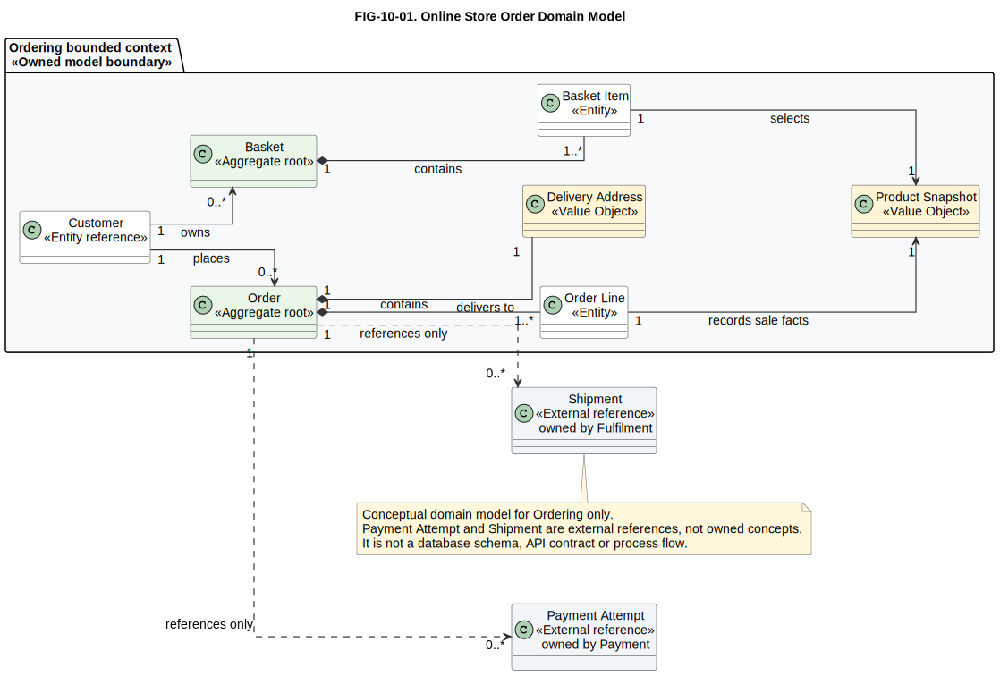
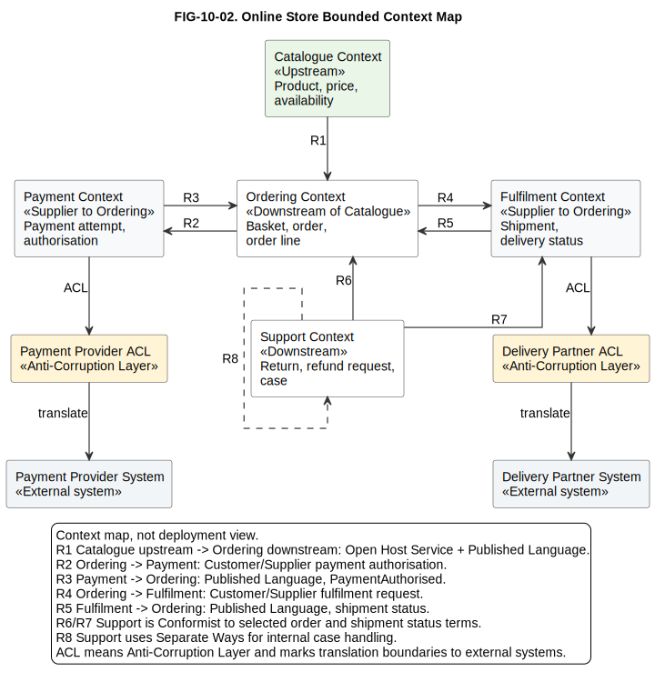
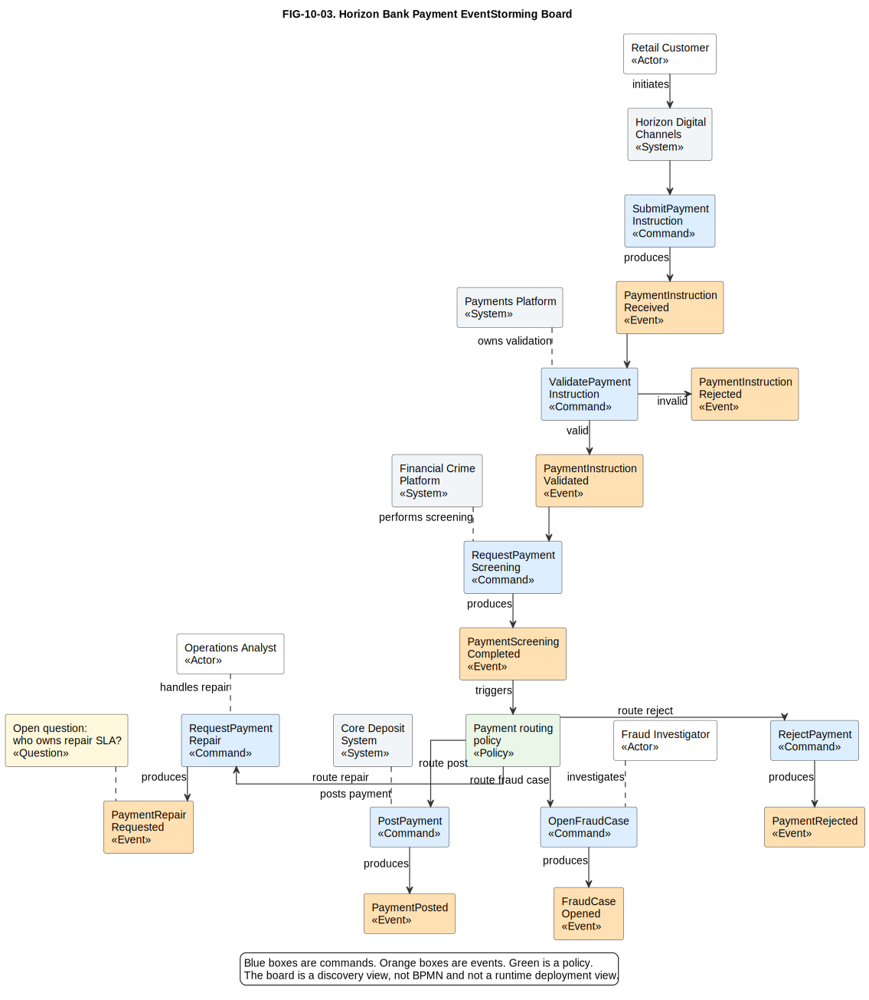
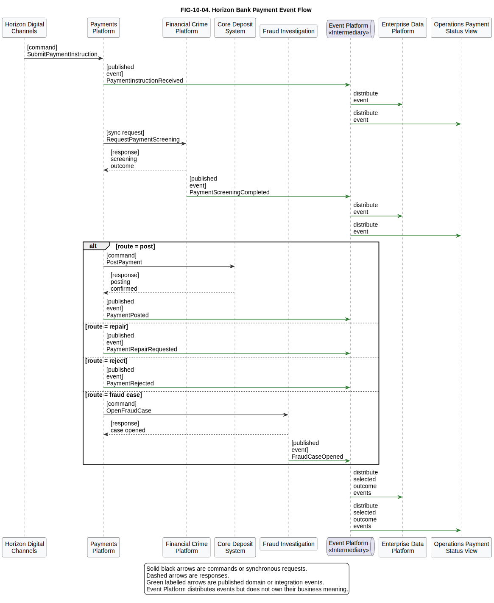

# 10. Domain and Event Modelling

## Chapter purpose

Introduce domain-driven design, bounded contexts, EventStorming and event-driven architecture models as practical ways to understand a business domain before choosing software, data or integration structures.

## Reader outcomes

By the end of this chapter, the reader should be able to:

- Explain domain models, Domain-Driven Design (DDD), bounded contexts, domain events and event-driven architecture in plain language.
- Distinguish strategic DDD from tactical DDD.
- Identify the architecture question answered by a domain model, context map, EventStorming board, event flow and event catalogue.
- Distinguish a domain event from a command, technical notification, integration event and database change.
- Use simple examples to identify entities, value objects, aggregates, aggregate roots, repositories, domain services, commands, events, policies and read models.
- Recognise runtime concerns in event-driven architecture, including duplicate events, idempotency, ordering, retries, replay and schema compatibility.
- Explain how event-driven architecture differs from Event Sourcing and Command Query Responsibility Segregation (CQRS).
- Review domain and event models for unclear language, missing ownership, weak boundaries and over-technical detail.

## Prerequisites and dependencies

- Chapter 9: Decision Modelling and DMN

## Required models and artefacts

- FIG-10-01: Online Store Order Domain Model, specification created, PlantUML source created and rendered for review.
- FIG-10-02: Online Store Bounded Context Map, specification created, PlantUML source created and rendered for review.
- FIG-10-03: Horizon Bank Payment EventStorming Board, specification created, PlantUML source created and rendered for review.
- FIG-10-04: Horizon Bank Payment Event Flow, specification created, PlantUML source created and rendered for review.

## Worked examples

- Simple Online Store Ordering bounded context.
- Simple Online Store bounded-context map.
- Horizon Bank payment and fraud domains.
- Horizon Bank `PaymentPosted` event-catalogue entry.

## Source requirements

- `[DDD-REFERENCE-2015]` is the primary source for DDD vocabulary used in this chapter.
- `[EVENTSTORMING-BRANDOLINI-2026]` is the primary source for EventStorming provenance and method framing.
- `[CNCF-CLOUDEVENTS-1.0.2]` is the verified CloudEvents source for event envelope terminology.
- `[ASYNCAPI-3.1.0]` is the verified AsyncAPI source for message-driven application programming interface (API) contract terminology.
- `[DOMAIN-EVENT-TOOL-GUIDANCE-2026]` supports practical tooling guidance for Context Mapper, Miro or physical workshop boards, PlantUML, diagrams.net, AsyncAPI Studio, AsyncAPI CLI and EventCatalog.
- Chapter guidance distinguishes primary terminology, official specifications and the author's practical beginner recommendations.

## Why domain and event modelling matter

Domain and event modelling answers: **what does this part of the business mean, what changes over time and which boundaries should shape the solution?**

Many architecture problems start badly because the team jumps straight to screens, databases, APIs or message topics. Those things matter, but they are not the business problem itself. Before designing a solution, a team needs shared language for orders, baskets, payments, shipments, payment instructions, screening results and fraud cases.

A **domain** is the area of knowledge or activity being modelled. In the Simple Online Store, the order domain includes baskets, orders, order lines and delivery addresses. In Horizon Bank, the payment domain includes payment instructions, validation, screening, routing, posting, repair and rejection.

A **domain model** describes the important concepts, rules and relationships in that area. It is not the same thing as a database schema. It may later influence classes, tables, APIs and events, but its first job is shared understanding.

Event modelling adds time. It asks what happened and why that occurrence matters. `OrderPlaced`, `PaymentAuthorised`, `PaymentInstructionReceived`, `PaymentScreeningCompleted` and `PaymentPosted` are examples of business-significant events. Events help teams understand lifecycles, integration points, audit trails and eventual consistency.

## Domain models

A domain model answers: **which business concepts are important, how do they relate and what language should the team use?**

For a beginner, a domain model is a map of meaning. It names the business things that matter and shows the most important relationships between them. It should be understandable to domain experts, analysts, architects and developers. If only database specialists can read it, it is probably too technical for an early domain model.

In the Simple Online Store, the first order-domain model should stay inside the Ordering bounded context. That context owns concepts such as `Basket`, `Basket Item`, `Order`, `Order Line` and `Delivery Address`. It may hold a product reference or snapshot, but it does not own the full product catalogue. It may refer to payment attempts and shipments, but those are externally owned by Payment and Fulfilment contexts.

| Concept | Plain meaning | Ownership note |
|---|---|---|
| Customer | A person who places orders. | Ordering may refer to the customer, but a wider customer profile may be owned elsewhere. |
| Basket | A temporary collection of intended purchases. | Owned inside Ordering. |
| Basket Item | A selected product and quantity in a basket. | Owned inside Ordering. |
| Order | A confirmed request to buy products. | Owned inside Ordering. |
| Order Line | A product reference, quantity and agreed sale detail in an order. | Owned inside Ordering. |
| Product Snapshot | The product facts Ordering needs at the time of sale. | A local snapshot or reference, not the full Catalogue model. |
| Delivery Address | Address value used for the order. | A value object inside Ordering. |
| Payment Attempt | A payment attempt or result for an order. | Externally owned reference. |
| Shipment | A fulfilment or delivery reference for an order. | Externally owned reference. |

Figure FIG-10-01. Online Store Order Domain Model. The model stays within the Ordering bounded context. Payment Attempt and Shipment are shown only as externally owned references, while Basket Item, Order Line, Product Snapshot and Delivery Address belong to the Ordering model.

Read the figure from the Ordering boundary first. Basket contains one or more Basket Items. Order contains one or more Order Lines. Order may relate to zero or more Payment Attempts and zero or more Shipments, but those references do not make Payment or Fulfilment part of the Ordering model.

Accessibility text: A conceptual domain model shows Customer, Basket, Basket Item, Order, Order Line, Product Snapshot and Delivery Address inside the Ordering bounded context. Payment Attempt and Shipment sit outside the boundary as externally owned references. Cardinalities show Basket to Basket Item and Order to Order Line as one or more, and Order to Payment Attempt and Shipment as zero or more.

The model should stay at the right level. `Order` and `Delivery Address` belong in this conceptual view. `orders.order_id`, `payment_gateway_response_code` and database indexes belong later in logical or physical data modelling. Chapter 8 covers those levels.

## Domain-Driven Design vocabulary

DDD answers: **how can a team keep software design closely connected to the business domain and its language?**

DDD is an approach to software and architecture design associated with Eric Evans. The DDD Reference provides pattern summaries and vocabulary for concepts such as domain, model, ubiquitous language, bounded context, entity, value object, aggregate and domain event [DDD-REFERENCE-2015]. It is not a standards-body notation like Unified Modeling Language (UML), Business Process Model and Notation (BPMN) or Decision Model and Notation (DMN).

The practical idea is straightforward: the model should use the language of the business area it represents. If operations staff say "payment repair", risk staff say "screening alert" and developers say "exception queue", the team must decide whether those are three names for one concept or three different concepts.

DDD is commonly discussed in two groups:

| DDD area | Main concern | Typical concepts |
|---|---|---|
| Strategic DDD | Boundaries, language and relationships between models. | Subdomains, bounded contexts, ubiquitous language and context maps. |
| Tactical DDD | Internal model design inside a bounded context. | Entities, value objects, aggregates, aggregate roots, repositories, domain services and domain events. |

Strategic DDD is usually more important for architecture. It helps decide where one model stops, which teams need translation, which concepts are core to the business and where a shared language is possible. Tactical DDD helps inside those boundaries, where the team must protect rules and design the model responsibly.

Use DDD vocabulary when domain language and boundaries influence design. Do not use it as decoration. A model is not more useful because every box uses a DDD label. It is useful when the labels reveal ownership, rules and change boundaries.

## Strategic DDD: subdomains, language and boundaries

Strategic DDD answers: **how should the problem space be divided, and where does one language stop being reliable?**

A **subdomain** is a part of the wider business domain. It is a problem-area distinction. In the Simple Online Store, ordering, payment, fulfilment and customer support may be different subdomains. In Horizon Bank, payments, financial crime, customer data, account processing and operations case management may be different subdomains.

Three subdomain types are useful for architecture planning:

| Subdomain type | Plain meaning | Example |
|---|---|---|
| Core subdomain | The part that creates distinctive business advantage or carries the highest strategic value. | Horizon Bank payment routing and repair experience may be core if it supports better digital payment service. |
| Supporting subdomain | Business-specific work that is necessary but not the main differentiator. | Online Store support case handling may be supporting. |
| Generic subdomain | Work that many organisations need and can often buy, standardise or outsource. | Email notification, identity tooling or generic reporting may be generic. |

A **bounded context** is a boundary within which a particular model and language are consistent [DDD-REFERENCE-2015]. It is a design boundary, not automatically a microservice, database, team or deployment unit. A bounded context may be implemented by one service, several services or a module inside a larger system, depending on design constraints.

The **ubiquitous language** is the shared language used by domain experts and delivery teams inside one bounded context. Ubiquitous language does not mean one word must have the same meaning everywhere in the organisation. In Horizon Bank, `customer` might mean a legal party in the Party and Customer Platform, a product relationship in a lending context and a channel user in Horizon Digital Channels. The architecture should expose those differences rather than hide them.

For the Online Store, a simple context split might be:

| Bounded context | Main language | Main responsibility |
|---|---|---|
| Catalogue | Product, price, availability | Present products for sale. |
| Ordering | Basket, order, order line, delivery address | Capture and confirm a purchase. |
| Payment | Payment attempt, authorisation, settlement | Take and track payment. |
| Fulfilment | Shipment, carrier, delivery status | Dispatch and deliver goods. |
| Support | Return, refund request, case | Handle post-order issues. |

The same word may cross contexts with changed meaning. `Available` in Catalogue may mean visible for sale. `Available` in Fulfilment may mean physically pickable in a warehouse. A good model makes those differences reviewable.

## Context maps

A context map answers: **how do bounded contexts relate, depend on each other and exchange meaning?**

A context map is useful when one model is not enough. It shows relationships between contexts, not the internal details of each context. The aim is to expose dependency, translation and ownership.

Start with two basic relationship directions:

- **Upstream:** The context whose model, API or event language influences another context.
- **Downstream:** The context that consumes, conforms to or translates another context's model.

Then add pattern language where it helps. The DDD Reference summarises context-map patterns such as Customer/Supplier, Conformist, Anti-Corruption Layer, Open Host Service, Published Language and Separate Ways [DDD-REFERENCE-2015].

| Pattern | Plain meaning | Beginner example |
|---|---|---|
| Customer/Supplier | A downstream customer depends on an upstream supplier, and the relationship is actively negotiated. | Ordering depends on Payment for payment authorisation. |
| Conformist | The downstream context follows the upstream model because changing or negotiating it is not practical. | Support conforms to selected order-status terms from Ordering. |
| Anti-Corruption Layer | A translation layer protects one model from another model's language. | Payment protects its model from a payment provider's gateway codes. |
| Open Host Service | An upstream context exposes a stable service for others to use. | Catalogue exposes product reference lookup. |
| Published Language | A shared language or contract is published for integration. | Catalogue publishes product reference terms used by Ordering. |
| Separate Ways | Contexts deliberately avoid integration because coordination is not worth the cost. | Support has internal case notes that do not change Ordering's model. |

Figure FIG-10-02. Online Store Bounded Context Map. The map shows explicit upstream and downstream direction, Customer/Supplier relationships, Conformist use, Anti-Corruption Layers, Open Host Service, Published Language and Separate Ways. It does not imply that each bounded context must be one microservice.

Read the figure by following relationship direction. Catalogue is upstream of Ordering for product references. Ordering is downstream and uses a published product language without owning catalogue data. Payment and Fulfilment protect their models from external provider systems through Anti-Corruption Layers.

Accessibility text: A context map places Ordering in the centre, Catalogue upstream, Payment and Fulfilment as neighbouring contexts, Support downstream, and external Payment Provider and Delivery Partner systems beyond translation boundaries. Relationship labels name Customer/Supplier, Conformist, Anti-Corruption Layer, Open Host Service, Published Language and Separate Ways.

In Horizon Bank, the Payments Platform should not silently adopt every internal term from the Core Deposit System. It may need an adapter or Anti-Corruption Layer so payment concepts remain stable while legacy account-processing terms are contained. That is a modelling decision before it is a coding decision.

## Tactical DDD: aggregates, entities and value objects

Tactical DDD answers: **how should the model inside one bounded context protect identity, values and consistency rules?**

An **entity** is a domain object with an identity that matters over time [DDD-REFERENCE-2015]. An `Order` remains the same order even if its status changes. A Horizon Bank `Payment Instruction` remains identifiable as it moves from received to validated, screened, posted, repaired or rejected.

A **value object** is defined by its values rather than a long-running identity. `Delivery Address` may be a value object in the Ordering context. If the customer changes the address before dispatch, the order now contains a different address value. The old address does not need its own identity inside Ordering unless there is a business reason to track it separately.

An **aggregate** is a consistency boundary around related objects [DDD-REFERENCE-2015]. It protects rules that must be enforced together. In the Online Store, `Order` may be an aggregate. A rule might say an order cannot be submitted without at least one order line and a delivery address.

An **aggregate root** is the object through which the outside world accesses the aggregate. If `Order` is the aggregate root, other parts of the system should not modify Order Lines directly. They ask the Order to make a change so the Order can protect its rules.

A **repository** provides a collection-like way to retrieve and store aggregates. A repository is not just any database access object. It belongs to the domain model when it expresses how aggregates are obtained or persisted without exposing storage details.

A **domain service** contains domain behaviour that does not naturally belong to one entity or value object. For example, a payment routing calculation may need several inputs and policies. Use domain services sparingly. If every rule becomes a service, the entities may become empty data holders.

A **domain event** records something meaningful that happened in the domain. It may be raised by an aggregate, a domain service or an application workflow, depending on the design.

Do not turn tactical DDD into a database exercise too early. An aggregate is not automatically one table, one object-relational mapping class, one API resource or one microservice. It is a domain consistency boundary. Implementation choices come later.

For Horizon Bank, a `Payment Instruction` aggregate might protect rules about status transitions, repair information and idempotent submission. But sanctions screening, fraud case investigation and account posting may belong to other contexts. Combining all of them into one large aggregate would create a model that is hard to own and hard to change.

## Domain events

A domain event answers: **what meaningful thing happened in the domain that other work may need to know about?**

A domain event records an occurrence. It should be named in the past tense because it is a fact, not a request. Good examples include `OrderPlaced`, `PaymentAuthorised`, `ShipmentDispatched`, `PaymentInstructionReceived`, `PaymentScreeningCompleted` and `FraudCaseOpened`.

A **command** is different. A command asks for something to happen, such as `PlaceOrder`, `AuthorisePayment` or `ScreenPayment`. A command may be accepted, rejected or ignored. An event says that something has happened.

| Item | Plain meaning | Naming pattern | Example |
|---|---|---|---|
| Command | Request to do work. | Imperative verb phrase. | `SubmitPaymentInstruction` |
| Domain event | Business-significant fact. | Past-tense phrase. | `PaymentInstructionReceived` |
| Technical notification | System-level signal. | Operational phrase. | `FileTransferCompleted` |
| Database change event | Record that data changed. | Table or record oriented. | `payment_row_updated` |

A technical notification or database change can be useful, but it is not automatically a domain event. `payment_row_updated` tells a consumer that a row changed. It does not tell the consumer whether a payment was posted, rejected or sent for repair. A domain event should carry business meaning.

Domain events are also not always integration events. A team may use domain events inside one bounded context. If an event crosses a system or organisational boundary, the team may publish an **integration event** with a stable contract, security classification and versioning policy. That integration event may be derived from one or more internal domain events.

CloudEvents defines a common way to describe event data across services, platforms and transports [CNCF-CLOUDEVENTS-1.0.2]. In CloudEvents 1.0.2, the required context attributes are `id`, `source`, `specversion` and `type`. The `time` attribute is optional. CloudEvents standardises envelope and context metadata, not the business meaning of the payload. A team still needs a domain model and event catalogue to define what `PaymentPosted` means.

## EventStorming

EventStorming answers: **what happens in this business process or domain, and what do people disagree about?**

EventStorming is a collaborative modelling technique originated by Alberto Brandolini and associated with DDD and collaborative modelling [EVENTSTORMING-BRANDOLINI-2026]. In a workshop, participants place domain events on a timeline and then add related commands, actors, policies, external systems, questions and problems.

The important feature is not the sticky notes. The important feature is shared discovery. Domain experts, architects, developers, testers, operations and risk people can see the same sequence and challenge unclear assumptions.

For Horizon Bank payment handling, the corrected command-event-policy chain is:

| Command or policy | Event produced or command issued |
|---|---|
| `SubmitPaymentInstruction` | `PaymentInstructionReceived` |
| `ValidatePaymentInstruction` | `PaymentInstructionValidated` or `PaymentInstructionRejected` |
| `RequestPaymentScreening` | `PaymentScreeningCompleted` |
| Payment routing policy | `PostPayment`, `RequestPaymentRepair`, `RejectPayment` or `OpenFraudCase` |
| `PostPayment` | `PaymentPosted` |
| `RequestPaymentRepair` | `PaymentRepairRequested` |
| `RejectPayment` | `PaymentRejected` |
| `OpenFraudCase` | `FraudCaseOpened` |

Figure FIG-10-03. Horizon Bank Payment EventStorming Board. The board shows commands, events and the payment routing policy as a discovery view. The screening event is named `PaymentScreeningCompleted` because the event records completion of the payment-screening activity in business language.

Read the figure from left to right. Commands request work. Events record what happened. The payment routing policy reacts after screening and issues one of four commands: post, repair, reject or open a fraud case. The board is a teaching synthesis, not a formal BPMN process or a copied workshop board.

Accessibility text: An EventStorming-style board shows command-event pairs for payment submission, validation and screening. A payment routing policy branches to PostPayment, RequestPaymentRepair, RejectPayment or OpenFraudCase, producing PaymentPosted, PaymentRepairRequested, PaymentRejected or FraudCaseOpened.

Avoid treating EventStorming as a formal publication notation. Colours and layout conventions are useful, but the method is a workshop approach rather than an Object Management Group style standard. The book uses original teaching diagrams to explain the idea.

## Commands, events, policies and read models

Commands, events, policies and read models answer: **what causes work, what records the result, what reacts to it and what view is built for reading?**

This vocabulary helps beginners separate concerns:

| Concept | Plain meaning | Online Store example | Horizon Bank example |
|---|---|---|---|
| Actor | Person or system that asks for work. | Customer | Retail Customer |
| Command | Request to perform an action. | `PlaceOrder` | `SubmitPaymentInstruction` |
| Event | Fact that something happened. | `OrderPlaced` | `PaymentInstructionReceived` |
| Policy | Rule that reacts to an event. | When payment is authorised, start fulfilment. | After screening, choose post, repair, reject or fraud-case action. |
| Read model | A view optimised for query or display. | Order status page | Payment status view |

A policy is not the same thing as a governance policy in Chapter 9, although both express rules. In event modelling, a policy often means reactive behaviour: when this event happens and these conditions hold, issue this command or start this process.

Read models matter in event-driven designs because the data a user wants to see may be assembled from several events or contexts. The Online Store order status page may combine order, payment and shipment information. Horizon Bank's payment status view may combine validation, screening, posting and repair information.

Do not overuse this pattern. If the system is small and one transaction can reliably update the needed state, a direct request and response may be easier. Event-driven architecture is valuable when loose coupling, auditability, asynchronous processing, integration or independent scaling justifies the extra operational complexity.

## Event-driven architecture diagrams

An event-driven architecture diagram answers: **which producers publish events, which consumers use them and how event messages move through the architecture?**

Event-driven architecture is an architecture style in which systems publish and react to events. It can reduce point-to-point coupling, but it does not remove design responsibility. Someone still owns each event, schema, topic, retention rule, consumer contract and failure path.

At beginner level, distinguish four views:

| View | Question answered | Typical audience |
|---|---|---|
| Event flow | What happens, in what order, for one scenario? | Analysts, architects and developers |
| Event producer-consumer view | Who publishes and who consumes each event? | Integration architects and application owners |
| Event contract view | What does each event message contain? | Developers, testers and data governance |
| Operational event view | How are retries, dead letters, monitoring and recovery handled? | Platform and operations teams |

Figure FIG-10-04. Horizon Bank Payment Event Flow. The flow distinguishes commands or synchronous requests, responses and published events. The Event Platform distributes events but does not own their business meaning.

Read the figure by checking arrow labels first. Commands and synchronous requests ask another system to do work. Responses return the result of that request. Published events originate from the context that owns the occurrence. For example, Payments Platform publishes `PaymentPosted`, while Financial Crime Platform publishes `PaymentScreeningCompleted` and the fraud investigation responsibility publishes `FraudCaseOpened`.

Accessibility text: A sequence-style event-flow diagram shows Horizon Digital Channels, Payments Platform, Financial Crime Platform, Core Deposit System, Event Platform, Enterprise Data Platform, Operations payment status view and Fraud Investigation. Distinct arrow labels identify commands or requests, responses and published events. Event Platform sits between producers and consumers as an intermediary.

Keep event-flow diagrams separate from detailed BPMN process models unless the view states why both are shown. A BPMN model is better for human tasks, gateways and process responsibility. An event-flow model is better for publish-subscribe relationships and asynchronous reactions. A C4 or deployment model is better for software and runtime structure.

AsyncAPI describes message-driven APIs in a machine-readable, protocol-agnostic format, including applications, channels, operations and messages [ASYNCAPI-3.1.0]. It is useful when event contracts need documentation, governance or tooling. It should not be confused with EventStorming, which is used for discovery and shared understanding.

## Runtime guidance for event-driven systems

Runtime event design answers: **what must be true for event consumers to behave correctly when delivery is imperfect?**

Event diagrams often look tidy. Real event platforms are less tidy. Networks retry, consumers fail, brokers redeliver messages and schemas evolve. A beginner model should at least name the operational assumptions.

| Concern | Practical guidance |
|---|---|
| At-least-once delivery | Many event systems prefer at-least-once delivery, which means an event may be delivered more than once. |
| Duplicate events | Consumers should expect duplicates unless the platform and design prove otherwise. |
| Idempotent consumers | A consumer should handle the same event more than once without applying the business effect twice. |
| Ordering | State whether ordering is required per payment, per account, per topic, or not required. Avoid assuming global ordering. |
| Correlation identifiers | Use a correlation identifier to group events and requests that belong to one business conversation. |
| Causation identifiers | Use a causation identifier to record which command or event caused the new event. |
| Retries | Define retry limits, backoff and which errors are retryable. |
| Dead letters | Route repeatedly failing messages to a dead-letter area with ownership, monitoring and repair procedure. |
| Replay safety | Confirm whether old events can be replayed safely into each consumer, especially when commands or notifications may be reissued. |
| Schema compatibility | Version event schemas and define which changes are backward compatible. |
| Eventual consistency | Explain where users may see temporary differences between systems and how status is reconciled. |
| Sensitive-data minimisation | Publish only the data consumers need. Avoid putting unnecessary personal, financial or security-sensitive data into broad event streams. |

For Horizon Bank, `PaymentPosted` should not cause a downstream data product to double-count a payment if the event is delivered twice. The consumer can store the CloudEvents `id`, or another stable event identifier, and ignore repeat delivery. It may also use a correlation identifier to link `PaymentInstructionReceived`, `PaymentScreeningCompleted` and `PaymentPosted` to the same payment journey.

Privacy matters because event streams are easy to reuse. An event should not carry full customer identity, account details or screening reasons unless the consumers are authorised and the data is necessary. The event catalogue should record classification and allowed consumers.

## Event-driven architecture, Event Sourcing and CQRS

These terms are related, but they are not the same.

| Technique | Plain meaning | Beginner caution |
|---|---|---|
| Event-driven architecture | Systems publish and react to events. | Does not require storing every state change as the source of truth. |
| Event Sourcing | The system stores state changes as an ordered event history and rebuilds current state from those events. | Strong design choice with replay, migration and audit implications. |
| CQRS | Command Query Responsibility Segregation separates write models from read models. | It can be used with or without Event Sourcing. |

An event-driven architecture might publish `PaymentPosted` after a conventional payment database transaction. That is not automatically Event Sourcing. Event Sourcing would mean the payment state itself is derived from stored events such as received, validated, screened and posted.

CQRS may be useful when the write model and read model have different needs. Horizon Bank might use a payment command model to protect posting rules and a separate payment status read model for channels and operations. That separation does not require Event Sourcing, although the techniques are often combined.

Do not introduce Event Sourcing or CQRS because the architecture uses events. Use them only when the audit, consistency, query or history requirements justify their complexity.

## Event catalogues

An event catalogue answers: **what events exist, who owns them, what they mean and who depends on them?**

Without a catalogue, event-driven systems become difficult to govern. Teams may publish similar events with different names, change schemas without warning, expose sensitive data or create consumers that nobody knows about.

A practical event catalogue should record:

| Field | Purpose |
|---|---|
| Event name | Stable business name, usually past tense. |
| Event type or identifier | Machine-readable event type used in contracts. |
| Owning context | The bounded context responsible for meaning and lifecycle. |
| Producer | The system or component that publishes the event. |
| Consumers | Known systems or teams that use the event. |
| Business meaning | Plain-language description of what happened. |
| Trigger | What causes the event to be produced. |
| Schema version | Version of the message structure. |
| Data classification | Privacy, security or regulatory sensitivity. |
| Retention and replay policy | How long the event is retained and whether replay is allowed. |
| Compatibility rules | What changes are allowed without breaking consumers. |
| Correlation and causation | How the event links to the wider business conversation and the event or command that caused it. |
| Ordering | Which ordering guarantee consumers may rely on. |
| Support owner | Team responsible for operational support and consumer questions. |

CloudEvents can help standardise envelope metadata. AsyncAPI can help document message-driven contracts. Neither replaces domain ownership. The catalogue should still answer the business question: what does this event mean, and who is allowed to change it?

### Worked event-catalogue entry: PaymentPosted

| Field | Value |
|---|---|
| Event name | `PaymentPosted` |
| Ownership | Payments bounded context |
| Business meaning | A payment instruction has been accepted for posting and the Core Deposit System has confirmed posting or accepted posting responsibility. |
| Producer | Payments Platform |
| Consumers | Enterprise Data Platform, Operations payment status view, customer notification service where authorised |
| Version | `1.0.0` |
| CloudEvents type | `com.horizonbank.payments.payment-posted.v1` |
| Classification | Confidential banking event; minimise customer and account data in the payload. |
| Retention | Retain on the event platform according to the payment event retention policy; keep long-term audit in governed payment records, not only in the broker. |
| Replay | Replay only to consumers declared replay-safe. Notification consumers must suppress duplicate customer messages. |
| Compatibility | Add optional fields only in minor versions; do not rename or remove required fields without a new major version. |
| Correlation | `paymentJourneyId` links instruction receipt, screening and posting events. |
| Causation | `causationId` refers to the `PostPayment` command or prior routing decision event that caused posting. |
| Ordering | Consumers may rely only on ordering by `paymentInstructionId`, not global event ordering. |
| Support owner | Payments Platform support team, with Enterprise Data Platform support for downstream analytical use. |

This entry is deliberately business-oriented. It does not list every payload field. The payload belongs in an event contract, which may be documented with AsyncAPI. The catalogue explains meaning, ownership, consumers and operational expectations.

## How to create domain and event models in practice

Tool choice answers: **what kind of model are you creating, and what do you need to do with it afterwards?**

Different tools support different work:

| Tool or medium | Useful for | Caution |
|---|---|---|
| Context Mapper | Text-based DDD context maps and related strategic design models [DOMAIN-EVENT-TOOL-GUIDANCE-2026]. | Good for structured DDD modelling, but the team still needs domain agreement. |
| Miro or physical workshop boards | Collaborative EventStorming discovery with domain experts [DOMAIN-EVENT-TOOL-GUIDANCE-2026]. | Workshop boards need synthesis before becoming architecture documentation. |
| PlantUML | Version-controlled explanatory diagrams and repeatable SVG or PNG exports. | Useful for this book's figures, not automatically a semantic DDD repository. |
| diagrams.net | Manual drawings where precise layout matters. | Drawing shapes does not validate the model. |
| AsyncAPI Studio | Creating or editing AsyncAPI descriptions for message-driven contracts [ASYNCAPI-3.1.0] [DOMAIN-EVENT-TOOL-GUIDANCE-2026]. | Contract tooling does not discover the domain model for you. |
| AsyncAPI CLI | Validation, generation and automation around AsyncAPI descriptions [DOMAIN-EVENT-TOOL-GUIDANCE-2026]. | Generated artefacts are only as good as the contract and governance. |
| EventCatalog | Event catalogue and event-driven architecture documentation [DOMAIN-EVENT-TOOL-GUIDANCE-2026]. | Keep ownership and lifecycle information current, not just event names. |

For this book, PlantUML is used for the four Chapter 10 figures because the repository can store editable text source and render publication SVG and PNG outputs. That is a publication workflow. In a real architecture repository, a team may combine workshop boards, structured context maps, AsyncAPI contracts and an event catalogue.

## How domain and event modelling compare with nearby techniques

Domain and event models overlap with earlier chapters, but they answer different questions.

| Technique | Main question | Use it for | Do not use it for |
|---|---|---|---|
| Domain model | What concepts and rules matter in this business area? | Shared language and conceptual relationships | Physical database design |
| Context map | Where do model boundaries and dependencies sit? | Ownership, translation and upstream/downstream relationships | Detailed process sequence |
| EventStorming | What happens over time, and where are the disagreements? | Discovery workshops and lifecycle exploration | Formal publication notation |
| Event flow | Who publishes and consumes events in one scenario? | Asynchronous integration and reactions | Human task ownership |
| BPMN | What is the process flow and who performs work? | Tasks, gateways, events, message flows and exceptions | Message contract detail |
| DMN | How is a repeatable decision derived? | Decision logic and decision dependencies | Business object lifecycle |
| Data model | What information is stored, related and governed? | Conceptual, logical and physical data views | Runtime event sequencing |

The models should support each other. An EventStorming workshop may reveal domain events. A domain model may define the concepts those events refer to. A context map may show where the events cross boundaries. A BPMN model may show the operational process that reacts to a payment exception. A DMN model may define the payment routing decision that leads to `PaymentRepairRequested`.

## Common mistakes

The first mistake is treating a domain model as a database schema. A domain model should explain business meaning before physical storage.

The second mistake is forcing one language across all contexts. Shared enterprise terms are useful, but a bounded context exists because meaning can legitimately differ.

The third mistake is equating bounded context with microservice. A bounded context is a model boundary. Physical service boundaries require separate design reasoning.

The fourth mistake is ignoring upstream and downstream direction. Without direction, a context map hides who depends on whom.

The fifth mistake is naming commands as events. `ApprovePayment` is a request. `PaymentApproved` is a fact.

The sixth mistake is publishing technical changes as if they were business events. `payment_table_updated` rarely gives consumers the meaning they need.

The seventh mistake is drawing event flows without ownership. Every event needs a producer, owner, meaning, schema and compatibility rule.

The eighth mistake is hiding process logic inside event diagrams. If the concern is human workflow, responsibility, waiting, escalation or exception handling, BPMN is usually clearer.

The ninth mistake is assuming event-driven architecture is automatically better. It can improve loose coupling and auditability, but it also introduces eventual consistency, replay concerns, monitoring needs and contract governance.

The tenth mistake is confusing event-driven architecture with Event Sourcing or CQRS. They can be combined, but they are separate design choices.

The eleventh mistake is using EventStorming output as final architecture without synthesis. Workshop boards are discovery artefacts. They need review, pruning and translation into appropriate models.

## Chapter cheat sheet

| Topic | Question answered | Useful for | Watch out for |
|---|---|---|---|
| Strategic DDD | Where are the boundaries and language differences? | Architecture scope and ownership | Jumping too quickly to code structure |
| Tactical DDD | How does the model protect rules inside a context? | Entities, values and aggregate design | Turning every pattern into boilerplate |
| Core subdomain | What differentiates the business? | Investment focus | Calling everything core |
| Supporting subdomain | What is business-specific but not differentiating? | Sensible custom design | Over-engineering |
| Generic subdomain | What can be standardised or bought? | Reuse and simplification | Customising without need |
| Domain model | What concepts and rules matter? | Shared meaning | Turning it into a database design too early |
| Ubiquitous language | What words does this context use? | Reducing misunderstanding | Pretending one term means the same thing everywhere |
| Bounded context | Where is a model consistent? | Boundary design | Equating it with one microservice |
| Context map | How do contexts depend on each other? | Ownership and translation | Hiding upstream/downstream direction |
| Entity | What has identity over time? | Lifecycles and rules | Treating every table as an entity |
| Value object | What is defined by values? | Small descriptive concepts | Giving it artificial identity |
| Aggregate root | What controls access to an aggregate? | Protecting consistency | Bypassing it with direct updates |
| Domain event | What meaningful thing happened? | Lifecycles and integration | Publishing vague technical updates |
| EventStorming | What happens over time? | Discovery and shared understanding | Treating workshop notation as a formal standard |
| Event catalogue | What events exist and who owns them? | Governance and reuse | Maintaining only a broker-topic list |

## Key takeaways

- Domain modelling starts with business meaning, not implementation structure.
- Strategic DDD covers subdomains, bounded contexts, ubiquitous language and context maps.
- Tactical DDD covers entities, value objects, aggregates, aggregate roots, repositories, domain services and domain events.
- A bounded context is a consistency boundary for a model and language, not automatically a team, microservice or database.
- Domain events record meaningful facts in the past tense. Commands request action.
- EventStorming is useful for discovering events, commands, policies, actors and open questions with domain experts.
- Event-driven architecture needs ownership, contracts, versioning, observability, idempotency, privacy and failure handling.
- CloudEvents requires `id`, `source`, `specversion` and `type`; `time` is optional.
- CloudEvents helps with envelope metadata, and AsyncAPI helps with message-driven API contracts. Neither replaces domain modelling.
- Event-driven architecture, Event Sourcing and CQRS are related but separate design choices.

## Practical exercise

Horizon Bank wants to improve outgoing retail payment handling. A Retail Customer submits a payment instruction through Horizon Digital Channels. The Payments Platform validates it, asks the Financial Crime Platform for screening, posts to the Core Deposit System when allowed, and publishes status updates through the Event Platform. Some payments require repair or fraud investigation.

Choose the right model for each question:

1. Which model would identify `Payment Instruction`, `Payment Screening`, `Payment Repair` and `Fraud Case` as business concepts?
2. Which model would show that Payments Platform, Financial Crime Platform and Core Deposit System use different models and need translation at their boundaries?
3. Which workshop technique would help domain experts agree what happens from instruction receipt to posting or rejection?
4. Which model would show `PaymentInstructionReceived`, `PaymentScreeningCompleted`, `PaymentPosted` and `FraudCaseOpened` moving between systems?
5. Which artefact would record event owner, schema version, consumers, data classification and retention policy?
6. Which term describes `SubmitPaymentInstruction`: command or event?
7. Which term describes `PaymentInstructionReceived`: command or event?
8. Which CloudEvents attributes are required in version 1.0.2?
9. What should a consumer do if `PaymentPosted` is delivered twice?

Suggested answer:

- Use a domain model for the business concepts and their relationships.
- Use a context map for bounded contexts and translation boundaries.
- Use EventStorming for collaborative discovery of the timeline, events, commands, policies and open questions.
- Use an event flow for system-to-system event movement.
- Use an event catalogue for event ownership, contracts, consumers and governance.
- `SubmitPaymentInstruction` is a command because it requests work.
- `PaymentInstructionReceived` is an event because it records that something happened.
- The required CloudEvents 1.0.2 attributes are `id`, `source`, `specversion` and `type`.
- The consumer should be idempotent, for example by recording the event identifier and ignoring duplicate delivery.

## Review checklist

- [ ] The question answered by each model is explicit.
- [ ] The audience and abstraction level are clear.
- [ ] DDD terms are introduced after plain-language explanations.
- [ ] Strategic DDD and tactical DDD are distinguished.
- [ ] Core, supporting and generic subdomains are explained.
- [ ] Aggregate root is defined.
- [ ] DDD is not presented as a standards-body notation.
- [ ] Domain models are not reduced to database schemas.
- [ ] Bounded contexts are not equated with microservices, teams or databases.
- [ ] Context maps show upstream/downstream direction and translation boundaries.
- [ ] Commands and events are named distinctly.
- [ ] Domain events are distinguished from technical notifications and database changes.
- [ ] EventStorming is presented as a collaborative method, not a formal publication notation.
- [ ] `PaymentScreeningCompleted` is used consistently as the payment-screening event.
- [ ] CloudEvents required attributes and optional `time` are stated correctly.
- [ ] CloudEvents and AsyncAPI are used only for their appropriate contract and metadata roles.
- [ ] Event-driven architecture is distinguished from Event Sourcing and CQRS.
- [ ] Runtime guidance covers delivery, duplicates, idempotency, ordering, correlation, causation, retries, dead letters, replay, schema compatibility, eventual consistency and privacy.
- [ ] The `PaymentPosted` event-catalogue entry includes ownership, meaning, producer, consumers, version, CloudEvents type, classification, retention, replay, compatibility, correlation, causation, ordering and support owner.
- [ ] The simple and banking examples are consistent with repository example files.
- [ ] Required sources, diagram specifications, sources and exports are registered.
- [ ] Terminology, link, structure, diagram-register and word-count checks pass.

## References and further reading

Chapter source notes are maintained in the repository under `research/domain-event/` and registered in `SOURCE_REGISTER.md`. Appendix H, [Glossary and Source Notes](../appendices/appendix-h-glossary-sources.md), is the intended publication location for the final source-key index once the appendix is completed.

- `[DDD-REFERENCE-2015]`: Eric Evans / Domain Language, Domain-Driven Design Reference.
- `[EVENTSTORMING-BRANDOLINI-2026]`: Alberto Brandolini / Avanscoperta, official EventStorming book information page.
- `[CNCF-CLOUDEVENTS-1.0.2]`: CloudEvents specification, version 1.0.2.
- `[ASYNCAPI-3.1.0]`: AsyncAPI Specification, version 3.1.0.
- `[DOMAIN-EVENT-TOOL-GUIDANCE-2026]`: Official public documentation pages for Context Mapper, Miro, PlantUML, diagrams.net, AsyncAPI Studio, AsyncAPI CLI and EventCatalog.
