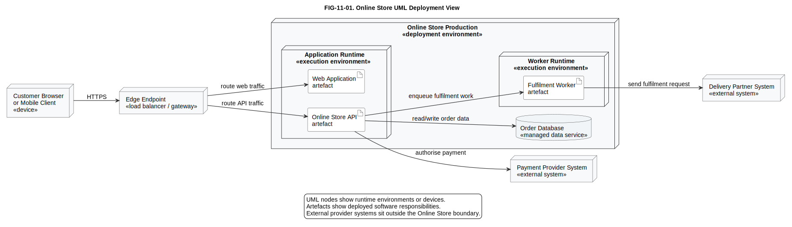
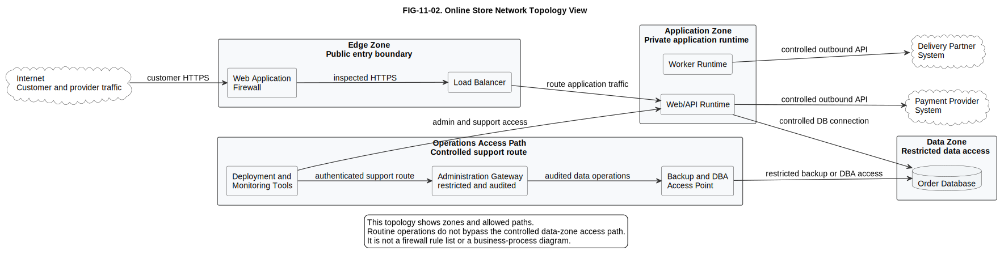
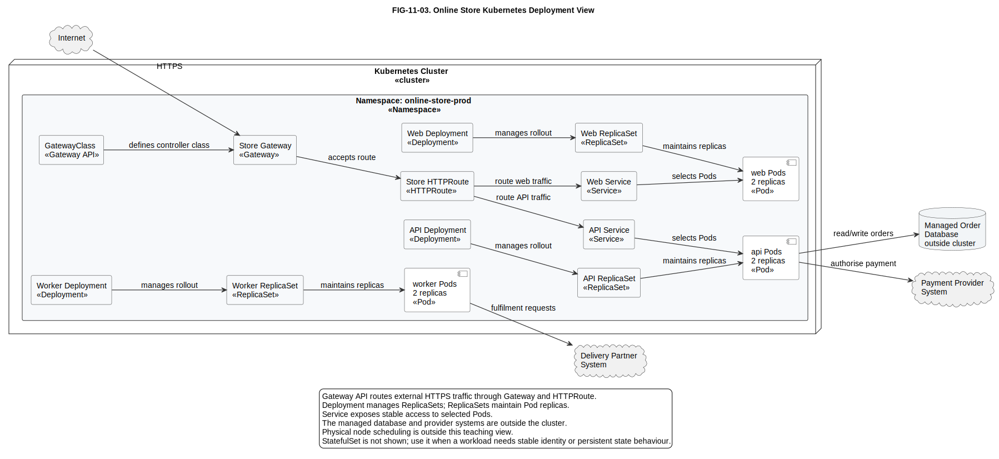
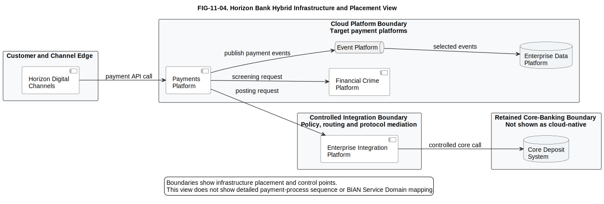
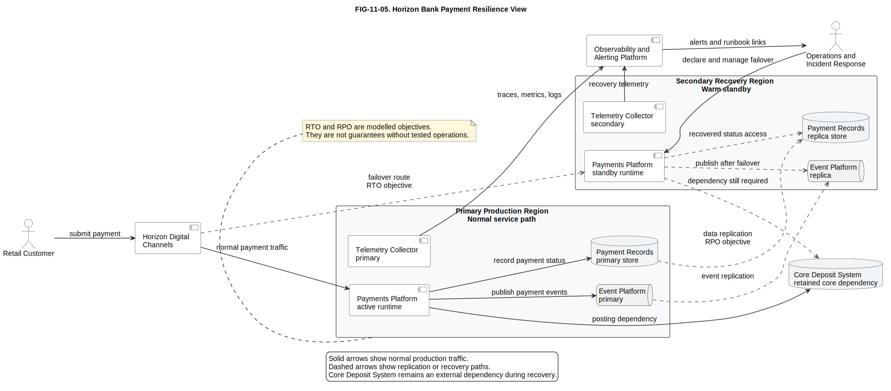
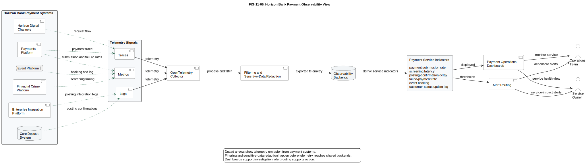

# 11. Infrastructure and Deployment Modelling

## Chapter purpose

Explain how to model runtime nodes, networks, cloud services, Kubernetes, resilience and environments without mixing them with business process, application structure or security design detail.

## Reader outcomes

By the end of this chapter, the reader should be able to:

- Explain infrastructure, deployment, runtime environment, network topology, cloud deployment, Kubernetes deployment, availability, resilience, disaster recovery and observability in plain language.
- Identify the architecture question answered by a deployment diagram, network topology, cloud architecture view, Kubernetes view, environment view, resilience view and observability view.
- Distinguish logical deployment from physical infrastructure detail.
- Recognise when to use Unified Modeling Language (UML) deployment diagrams, C4 deployment diagrams, cloud views, Kubernetes views and network topology diagrams.
- Review infrastructure and deployment models for unclear boundaries, missing dependencies, mixed abstraction, weak recovery assumptions and operational gaps.
- Apply the ideas to both the Simple Online Store and Horizon Bank examples.

## Prerequisites and dependencies

- Chapter 4: UML
- Chapter 5: C4 Model
- Chapter 10: Domain and Event Modelling
- Chapter 3: How to Read Architecture Diagrams is useful background for diagram review, but not required.

## Required models and artefacts

- FIG-11-01: Online Store UML Deployment View, specification created, PlantUML source created and rendered for review.
- FIG-11-02: Online Store Network Topology View, specification created, PlantUML source created and rendered for review.
- FIG-11-03: Online Store Kubernetes Deployment View, specification created, PlantUML source created and rendered for review.
- FIG-11-04: Horizon Bank Hybrid Infrastructure and Placement View, specification created, PlantUML source created and rendered for review.
- FIG-11-05: Horizon Bank Payment Resilience View, specification created, PlantUML source created and rendered for review.
- FIG-11-06: Horizon Bank Payment Observability View, specification created, PlantUML source created and rendered for review.

## Worked examples

- Simple Online Store production deployment.
- Simple Online Store network topology.
- Simple Online Store Kubernetes deployment.
- Horizon Bank hybrid payment deployment.
- Horizon Bank payment resilience and recovery view.
- Horizon Bank payment observability view.

## Source requirements

- `[OMG-UML]` is the primary source for UML deployment-diagram terminology.
- `[C4-OFFICIAL]` is the source for C4 deployment-diagram framing.
- `[NIST-SP-800-145]` supports cloud computing and cloud deployment-model terminology.
- `[KUBERNETES-DOCS-2026]` supports Kubernetes terminology for Pods, Deployments, ReplicaSets, StatefulSets, Services, Nodes, Namespaces, Gateway API and Ingress.
- `[AWS-WA-RELIABILITY-2026]` supports cloud reliability concerns used as practical guidance, without making the chapter AWS-specific.
- `[NIST-SP-800-34R1]` is historical official NIST guidance used informatively for Recovery Time Objective (RTO), Recovery Point Objective (RPO) and contingency-planning terminology. It is not presented here as a current banking regulation or as an unqualified current normative source.
- `[OPENTELEMETRY-DOCS-2026]` supports observability terminology for traces, metrics, logs, instrumentation, collection and export.
- `[INFRA-DIAGRAM-TOOL-GUIDANCE-2026]` supports practical infrastructure diagram tool and icon-library guidance.

## Infrastructure versus deployment views

Infrastructure and deployment modelling answers: **where does the solution run, how is it connected and what must operate correctly for it to keep serving users?**

Beginners often start by drawing boxes called "server", "database", "cloud" and "network". That can be useful, but it is not yet a reliable architecture model. A useful infrastructure or deployment model must say what question it answers. Is the question about runtime placement, traffic flow, cloud service choice, Kubernetes objects, environments, failover, capacity, monitoring or operational ownership?

An **infrastructure view** focuses on the technology foundation: networks, compute platforms, storage, cloud services, data centres, regions, availability zones, platform services and operational tooling. It is useful for platform teams, operations teams, security reviewers and service owners.

A **deployment view** focuses on how software and data stores are placed on runtime environments. It shows which executable or deployable units run where, and which runtime dependencies matter. A UML deployment diagram and a C4 deployment diagram are both deployment views, but they use different notation and levels of formality.

The distinction matters because each view has a different audience. A developer may need to know that the Online Store API runs in an application runtime and connects to the order database. A network engineer may need to know which zones can communicate. An operations team may need to know which components fail over together. A risk reviewer may need to know whether a payment service has a recovery target and an owner.

Do not put all of that on one diagram unless the purpose is explicitly to show cross-cutting dependency. A single page that mixes business process steps, application components, subnets, firewall rules, Kubernetes Pods and disaster recovery can look impressive, but it usually becomes hard to review.

### Logical and physical deployment

Logical and physical deployment views answer related but different questions.

| View | Plain meaning | Example | Typical use |
|---|---|---|---|
| Logical deployment | Where the runtime responsibilities sit, without fixing every physical detail. | Web/API runtime, worker runtime, order database and provider systems. | Early design review, stakeholder alignment and dependency discussion. |
| Physical deployment | The concrete places, products and instances used to run the logical design. | A specific region, availability zones, node pools, managed database service, load balancer and private endpoint. | Implementation planning, operations, capacity, resilience and security review. |

One logical model can have several physical implementations. The same Online Store logical deployment could run on virtual machines, a managed container platform or Kubernetes. The logical view still helps because it explains the runtime responsibilities and dependencies before the team debates every subnet, instance type or managed service option.

For example, the Online Store logical deployment might show a customer browser, an edge endpoint, a web/API runtime, a worker runtime, an order database, a payment provider and a delivery partner. One physical implementation might use two virtual machines, a managed relational database and a cloud load balancer. Another might use Kubernetes Deployments, Services and Gateway API in a managed cluster, with the same managed database outside the cluster. A third might use a Platform as a Service (PaaS) web app, a managed background worker and a managed database. The logical responsibilities stay stable, while the physical hosting and operational responsibilities change.

Keep the labels honest. If a diagram says "application runtime", it is probably logical. If it says "Kubernetes node pool in region A, zone 1", it is physical or implementation-specific. Mixing both levels is allowed only when the diagram states why the mixed level is useful.

## UML and C4 deployment diagrams

A deployment diagram answers: **which software artefacts or containers run on which nodes or execution environments?**

In UML, a deployment diagram is part of the official language and is used to show deployment relationships between artefacts and nodes [OMG-UML]. For beginner architecture work, the useful idea is simpler than the full specification: show runtime nodes, show what is deployed to them, and show important communication paths.

A **node** in UML represents a computational resource that can host deployed artefacts. UML distinguishes **Device** nodes, such as physical or virtual hardware, from **ExecutionEnvironment** nodes, such as an application server, container runtime, database runtime or managed execution platform. A **component** may describe a software responsibility, but the deployable thing is normally an **Artifact**, such as an application package, container image or executable. A **deployment relationship** shows that an artifact is deployed to a node or execution environment. A **communication path** shows that nodes can communicate at runtime.

A node is not automatically a Kubernetes Node, and it is not automatically a network device. The diagram should say what meaning is intended.

C4 also supports deployment diagrams as supplementary diagrams for showing how software containers are mapped to infrastructure [C4-OFFICIAL]. In C4, remember that a **container** means a separately runnable or deployable unit or data store. It does not automatically mean Docker. A C4 deployment diagram is often easier for software teams because it starts from the software architecture introduced in Chapter 5 and then maps those containers to deployment nodes.

For the Simple Online Store, a first deployment view might show:

| Runtime element | Plain meaning | Why it appears |
|---|---|---|
| Customer device | Browser or mobile client. | Shows the user entry point. |
| Edge endpoint | Load balancer or gateway. | Shows how traffic enters the system. |
| Online Store web/API runtime | Hosts customer-facing application behaviour. | Shows where the main application runs. |
| Worker runtime | Runs background work such as fulfilment messages. | Shows non-interactive processing. |
| Order database | Stores order and payment-status data. | Shows the important data dependency. |
| Payment Provider System | External payment dependency. | Shows outbound integration. |
| Delivery Partner System | External fulfilment dependency. | Shows outbound integration. |

FIG-11-01 uses this example as a UML deployment teaching view. It shows runtime placement and important runtime dependencies. It does not show process sequence, database structure or Kubernetes object detail.

Figure FIG-11-01. Online Store UML Deployment View. The diagram separates customer device, edge endpoint, application runtime, worker runtime, managed data service and external provider systems. It uses UML deployment-style nodes and artefacts to show where software responsibilities run.

Read the figure from left to right. Customer traffic enters through the edge endpoint. The edge routes web and API traffic to the application runtime. The API reads and writes order data, calls the payment provider and queues work for the fulfilment worker, which sends requests to the delivery partner.

Accessibility text: A UML deployment teaching diagram shows a customer browser or mobile client connected to an edge endpoint, then to an Online Store production environment. Inside production are an application runtime with web and API artefacts, a worker runtime with a fulfilment worker artefact, and an order database. The API connects to the order database and payment provider. The worker connects to the delivery partner system.

The point is not to show every process step. A deployment view should not explain how the order is placed, authorised, packed and shipped. Chapter 6 uses Business Process Model and Notation (BPMN) for process flow. Chapter 10 uses event flows for event-driven collaboration. This chapter asks where runtime parts sit and which runtime dependencies matter.

## Network topology

A network topology answers: **which network zones, connections and traffic paths are allowed or important?**

Network diagrams are sometimes drawn as if they were deployment diagrams. They are related, but their concerns differ. A deployment diagram says where software runs. A network topology says how network segments are connected, which paths traffic follows and where boundaries exist.

For the Simple Online Store, a useful beginner network topology might show:

| Zone | Purpose | Typical contents |
|---|---|---|
| Internet | External customer and provider traffic. | Customer clients, provider endpoints. |
| Edge zone | Controlled public entry point. | Load balancer, web application firewall, gateway. |
| Application zone | Runtime for application services. | Web/API runtime, workers. |
| Data zone | Restricted data storage. | Order database or managed database endpoint. |
| Operations path | Controlled administration and support access. | Monitoring, deployment and support tooling. |

The diagram should label traffic direction. Customer traffic enters through the edge zone. The edge zone routes traffic to the application zone. The application zone connects to the data zone through a controlled path. Outbound calls to the Payment Provider System and Delivery Partner System should be explicit.

Do not turn a beginner topology into a firewall rule inventory. If the purpose is to review firewall rules, a table may be better. If the purpose is to show trust boundaries and attack paths, Chapter 12 will introduce security modelling. FIG-11-02 is a topology teaching view, not a full security design.

Network topology is also a place where physical and logical language can become confused. A "zone" on a teaching diagram may represent a logical security or routing boundary. A cloud provider subnet, route table, virtual network and security group are implementation details. Include them only when the audience needs that level.

Figure FIG-11-02. Online Store Network Topology View. The diagram shows zones and allowed traffic paths rather than software responsibilities or process steps. It separates customer traffic, controlled outbound provider calls and operations access.

Read the figure by following boundary crossings. Customer HTTPS traffic enters from the internet through the edge zone. The edge routes inspected traffic to the application zone. The application zone reaches the data zone through a controlled database path and reaches external providers through controlled outbound paths. Operations access is shown as a separate route.

Accessibility text: A network topology diagram shows internet traffic entering an edge zone with a web application firewall and load balancer. Traffic then reaches an application zone containing web/API and worker runtimes. The application zone connects to a restricted data zone containing the order database, and to payment provider and delivery partner systems through controlled outbound paths. Deployment and monitoring tools use a separate operations access path.

## Kubernetes deployment

A Kubernetes deployment view answers: **how are application workloads represented inside a Kubernetes cluster, and how do they reach each other and external dependencies?**

Kubernetes has precise terms. A **Pod** is the basic runtime unit for one or more containers. A **Deployment** manages declarative updates and usually manages ReplicaSets. A **ReplicaSet** maintains the required number of replica Pods. A **Service** provides stable network access to a changing set of Pod endpoints. A **Node** is a worker machine in the cluster. A **Namespace** groups resources. **Gateway API** is the current Kubernetes project API family for extensible, role-oriented traffic routing, often using Gateway and HTTPRoute resources. **Ingress** is still generally available and common, but the Kubernetes project recommends Gateway API for new designs, says the Ingress API is frozen, and states that there are no plans to remove Ingress from Kubernetes [KUBERNETES-DOCS-2026].

Use the right workload controller. A Deployment is generally suitable for replaceable workloads that do not need stable identity, such as stateless web, application programming interface (API) and worker replicas. A **StatefulSet** is for workloads that need stable identity, ordered behaviour or persistent state behaviour, such as some databases, clustered brokers or stateful platform components. Do not use a Deployment box to mean every workload in the cluster.

Those terms should not be used interchangeably. "Deploy the API" is ordinary speech. "Kubernetes Deployment" is a specific Kubernetes workload object. A diagram that labels every runtime box "deployment" teaches the wrong lesson.

For the Simple Online Store, a useful Kubernetes view might show:

| Kubernetes concept | Online Store example | Beginner caution |
|---|---|---|
| Cluster | Production Kubernetes cluster. | Do not assume the cluster is the whole architecture. |
| Namespace | `online-store-prod`. | Namespaces group resources but are not full security boundaries by themselves. |
| Gateway API | GatewayClass, Gateway and HTTPRoute for public HTTPS routing. | Gateway API usually needs installed custom resources and a controller implementation. |
| Ingress | Existing HTTP and HTTPS entry for store traffic. | Ingress remains generally available and is not planned for removal, but the API is frozen and Gateway API is preferred for new designs. |
| Service | Stable endpoint for web or API Pods. | A Kubernetes Service is not a business service. |
| Deployment | Desired state and rollout control for web, API or worker workloads. | A Kubernetes Deployment is not the same as a UML deployment diagram. |
| ReplicaSet | Required number of web, API or worker Pod replicas. | Usually managed by a Deployment rather than edited directly. |
| Pod | Running replica of the workload. | Pods are replaceable and should not be treated as permanent servers. |
| StatefulSet | Stable identity and persistent state behaviour for stateful workloads. | Do not use it for ordinary replaceable web or API replicas unless stable identity is required. |
| Managed database | Order database outside the cluster. | Not everything must run inside Kubernetes. |

FIG-11-03 shows this mapping. It deliberately excludes YAML, autoscaling policy, service mesh detail, physical node scheduling and security policy. Those topics are important, but a first architecture view should teach the relationship between Kubernetes objects before adding operational complexity.

Figure FIG-11-03. Online Store Kubernetes Deployment View. The diagram shows a Kubernetes cluster and production namespace containing Gateway API routing, Services, Deployments, ReplicaSets and Pods. It keeps the managed database and provider systems outside the cluster boundary, and leaves physical node scheduling outside this first teaching view.

Read the figure by following Kubernetes responsibility. Gateway and HTTPRoute receive HTTPS traffic and route it to Services. Services provide stable access to Pods. Deployments manage ReplicaSets. ReplicaSets maintain the desired Pod replicas. API Pods connect to the managed order database and payment provider. Worker Pods support fulfilment requests to the delivery partner.

Accessibility text: A Kubernetes deployment teaching diagram shows an internet client reaching a Kubernetes cluster. Inside the cluster is the `online-store-prod` namespace, containing Gateway API resources, Web Service, API Service, Web Deployment, API Deployment, Worker Deployment, their ReplicaSets and representative web, API and worker Pods. The managed order database, payment provider and delivery partner systems are outside the cluster.

Kubernetes diagrams are easy to overdraw. If the audience is reviewing capacity, show replicas, autoscaling boundaries and resource constraints. If the audience is reviewing application ownership, a C4 container view may be clearer. If the audience is reviewing security, show trust boundaries and identity flows. The notation should follow the question.

## Cloud architecture

A cloud architecture view answers: **which cloud services, deployment model and managed platform responsibilities shape the solution?**

The National Institute of Standards and Technology (NIST) definition of cloud computing describes cloud through essential characteristics, service models and deployment models such as public, private, community and hybrid cloud [NIST-SP-800-145]. For this book, the most useful beginner lesson is that "cloud" is not one box. It can mean different levels of managed responsibility, different deployment models and different resilience assumptions.

A cloud view can show:

- Regions and availability zones.
- Managed compute or container platforms.
- Managed databases and storage.
- Load balancing and edge services.
- Identity, secrets and configuration services.
- Event, queue or streaming platforms.
- Observability and logging services.
- Links to retained data-centre systems.

Keep the view vendor-neutral when the decision is conceptual. Use provider-specific names only when they are part of the architecture decision. For example, "managed relational database" is enough when teaching deployment concepts. A real design may need a specific cloud database service, replication mode and support contract.

### Cloud responsibility boundaries

Cloud service models change responsibility boundaries. A useful cloud view should show who is responsible for infrastructure, operating system, runtime, application, configuration, identity and access, and data. Do not draw one identical provider boundary for all cloud services.

| Deployment or service model | Infrastructure | Operating system | Runtime | Application | Configuration | Identity and access | Data |
|---|---|---|---|---|---|---|---|
| On-premises | Organisation | Organisation | Organisation | Organisation | Organisation | Organisation | Organisation |
| Infrastructure as a Service (IaaS) | Provider for physical facilities and virtualisation; organisation for selected network and instance design. | Organisation. | Organisation. | Organisation. | Organisation. | Shared, with organisation accountable for access design. | Organisation. |
| Platform as a Service (PaaS) | Provider. | Provider. | Shared or provider-managed, depending on the platform. | Organisation. | Organisation. | Shared. | Organisation remains accountable for data content, classification and access. |
| Software as a Service (SaaS) | Provider. | Provider. | Provider. | Provider for product behaviour; organisation for usage and integration choices. | Shared tenant configuration. | Shared, often integrated with the organisation's identity provider. | Shared, with organisation accountable for lawful use, retention and classification. |
| Managed database, event platform or Kubernetes | Provider manages more platform infrastructure; organisation still models networking, configuration, scaling, access, backup, monitoring and recovery assumptions. | Shared or provider-managed. | Shared. | Organisation for workloads and schemas. | Organisation for workload settings and policies. | Shared. | Organisation remains accountable for business data and recovery expectations. |

The model should expose what the organisation must configure, secure, monitor, recover and govern. For a managed Kubernetes service, the provider may operate parts of the control plane, but the architecture still needs node pools or runtime choices, namespaces, workload configuration, identity, network policy, secrets, capacity, observability and disaster recovery decisions.

Horizon Bank is a good example of why cloud architecture should not hide the rest of the estate. A Payments Platform might run on a cloud platform, while the Core Deposit System remains in a retained core-banking environment. The Enterprise Integration Platform may sit between them during transition. The Event Platform and Enterprise Data Platform may be cloud-hosted target capabilities. FIG-11-04 shows that hybrid placement at a high level.

Figure FIG-11-04. Horizon Bank Hybrid Infrastructure and Placement View. The diagram separates customer channels, cloud-hosted platforms, controlled integration and retained core banking. It shows infrastructure placement and integration control points, not detailed payment-process sequence.

Read the figure by starting at Horizon Digital Channels. Channels call the Payments Platform in the cloud platform boundary. The Payments Platform calls Financial Crime Platform, publishes events to Event Platform, and uses Enterprise Integration Platform to reach Core Deposit System in the retained core-banking boundary. Event Platform supplies selected events to the Enterprise Data Platform.

Accessibility text: A hybrid deployment view shows Horizon Digital Channels at the channel edge. The cloud platform boundary contains Payments Platform, Financial Crime Platform, Event Platform and Enterprise Data Platform. A controlled integration boundary contains Enterprise Integration Platform. A retained core-banking boundary contains Core Deposit System. Arrows show the payment API call, screening request, posting request, controlled core call and selected event flow.

Cloud reliability guidance, such as the AWS Well-Architected Reliability Pillar, usefully reminds architects to consider foundations, workload architecture, change management and failure management [AWS-WA-RELIABILITY-2026]. In a vendor-neutral beginner chapter, treat that as practical guidance rather than a prescription to use one provider. The model should expose assumptions about zones, capacity, dependencies, monitoring and recovery.

## Capacity and scalability

A capacity and scalability view answers: **can the design handle expected demand, and how can it grow when demand changes?**

**Capacity** is the amount of work the current design can handle within acceptable limits. **Scalability** is the ability to increase that capacity without redesigning everything. They are related, but they are not the same. A system can have spare capacity today and still be hard to scale tomorrow.

| Concept | Plain meaning | Modelling question |
|---|---|---|
| Normal workload | The expected day-to-day demand. | What user, order, payment, event or query volume is normal? |
| Peak workload | The demand during sales, incidents, payroll days, cut-off periods or campaigns. | What volume must be handled for the peak window, and for how long? |
| Capacity headroom | Spare capacity above expected load. | How much room exists before latency, error rate or saturation becomes unacceptable? |
| Vertical scaling | Increasing the size of one runtime or data store. | Can a larger instance, node or database tier help, and where is the upper limit? |
| Horizontal scaling | Adding more runtime instances or replicas. | Can more application instances or Pods share the work safely? |
| Autoscaling | Adjusting capacity automatically from signals. | Which signals trigger scaling, and what prevents noisy or unsafe scaling? |
| Replica count | The number of workload instances expected to run. | How many Pods, instances or workers are needed for normal and peak demand? |
| Resource requests and limits | Declared compute and memory expectations or caps. | What resource assumptions shape scheduling, throttling and failure behaviour? |
| Queue-driven scaling | Scaling workers from backlog or message age. | Does a queue depth, lag or oldest-message age indicate worker demand? |

Capacity models should name likely bottlenecks. Application replicas may scale horizontally while the database, connection pool, shared file store, event partition, provider rate limit or retained core system does not. A Kubernetes view may show Pod replicas, but the architecture still needs to show whether resource requests and limits, node capacity, managed database throughput, external payment-provider limits and delivery-partner limits support the same load.

Avoid vague claims such as "scales automatically". Say what scales, what signal is used, what dependency might saturate first and who owns the limit. For Horizon Bank, scaling payment submission capacity is not enough if screening, posting, event publication or Core Deposit System access becomes the constraint.

## Environment views

An environment view answers: **which environments exist, what is deployed in each one and how does change move safely toward production?**

Most systems have several environments: local development, shared development, test, integration, staging, performance, disaster recovery and production. Names vary. The model should not pretend they are identical unless that is true.

An environment view is useful when release, test, configuration or operational differences matter. It can show:

- Which applications or services exist in each environment.
- Which external systems are mocked, stubbed or shared.
- Which data is synthetic, masked or production-derived.
- Which environment is connected to real customers or real money movement.
- Which deployment pipeline promotes artefacts.
- Which approvals or controls apply before production.

Good environment guidance separates the deployable artifact from environment-specific configuration. The same immutable artifact should be promoted from build to test, staging and production where practical. Environment-specific configuration, such as endpoints, feature flags, capacity settings and routing policy, should be injected at deployment time. Secrets, such as passwords, keys and tokens, should be managed separately from artifacts and should not be baked into a package, container image or repository.

Integration availability also varies by environment. Some integrations are real, such as a shared test payment-provider sandbox. Some are simulated, such as a stubbed delivery partner. Some are unavailable, such as a retained core-banking interface that cannot safely be exposed to lower environments. Data varies too. Test data may be synthetic, masked from production or production-derived under strict controls. The environment view should make those differences visible so test evidence is not overstated.

For the Online Store, a small team might use development, test and production. Payment Provider System integration in test may use a sandbox endpoint. Delivery Partner System integration may be stubbed until a later test stage. The production database must not be copied casually into lower environments.

For Horizon Bank, environment modelling is more important. A payment platform may need controlled integration testing with the Core Deposit System, financial crime screening, customer channels and event consumers. Some environments may not be able to connect to real payment networks or real customer data. The environment model should make those limitations visible so testing evidence is interpreted correctly.

Environment views overlap with deployment views, but they answer a different question. Deployment views ask where software runs. Environment views ask where the release exists, what dependencies it has in each stage, and which differences affect confidence.

## Availability and resilience

An availability or resilience view answers: **what keeps the service usable, and what happens when part of the infrastructure fails?**

**Availability** is the ability of a service to be usable when needed. **Resilience** is the ability to absorb, recover from or adapt to disruption while continuing to provide acceptable service. A resilience model should show more than duplicate boxes. It should show dependencies, failure assumptions, recovery paths and operational responsibilities.

Cloud reliability guidance commonly emphasises foundations, workload architecture, change management and failure management [AWS-WA-RELIABILITY-2026]. In practical modelling terms, that means asking:

- Which components are replicated?
- Which zones, regions or sites are involved?
- Which dependency is still a single point of failure?
- What happens if the database is available but the event platform is delayed?
- What happens if payment screening is unavailable?
- Who receives alerts, and what action do they take?
- Which part of the service degrades rather than fails completely?

For the Online Store, a resilience view may show multiple application instances behind a load balancer, a managed database with backup, and retry handling for provider calls. For Horizon Bank, the model needs more care. Payment acceptance, screening, posting, status visibility and customer notification may have different resilience requirements. The bank may decide that payment submission can be accepted but held if downstream posting is temporarily unavailable, or it may decide that some payment types must be rejected until the dependency recovers.

Do not use availability numbers casually. A diagram cannot prove that a service is highly available. It can show the design assumptions that make an availability target plausible, such as redundant runtime placement, health checks, replication, failover automation, capacity headroom, observability and support ownership.

## Disaster recovery

A disaster recovery view answers: **how will the service be restored after a serious disruption, and what loss of time or data is acceptable?**

Disaster recovery is not the same as ordinary high availability. High availability tries to keep service running through expected component failures. Disaster recovery deals with larger disruption, such as loss of a region, site, major platform, data store or operational facility.

NIST contingency-planning guidance uses terms such as Recovery Time Objective and Recovery Point Objective [NIST-SP-800-34R1]. A **Recovery Time Objective (RTO)** is the target maximum time to restore a service after disruption. A **Recovery Point Objective (RPO)** is the target maximum acceptable data loss measured as time. These are objectives, not guarantees. They must be supported by design, operations, testing and governance.

A disaster recovery model should show:

| Concern | Question to answer |
|---|---|
| Scope | Which service, capability or platform is being recovered? |
| Recovery target | What RTO and RPO are intended? |
| Recovery site | Where can the workload run if the primary site fails? |
| Data recovery | How is data replicated, backed up, restored or reconciled? |
| Dependency recovery | Which external dependencies must also be available? |
| Failover | How is traffic moved to the recovery location? |
| Failback | How does the service return to normal after recovery? |
| Ownership | Who declares, runs and closes the recovery process? |
| Testing | How is the recovery plan validated? |

FIG-11-05 is a Horizon Bank payment resilience view for one warm-standby scenario. It shows primary and secondary placement, replication, failover trigger, failback, data reconciliation, dependency readiness, operations ownership, Recovery Time Objective (RTO) and Recovery Point Objective (RPO) labels, and the Core Deposit System dependency. It does not claim a regulatory requirement or a guaranteed recovery time.

Figure FIG-11-05. Horizon Bank Payment Resilience View. The diagram shows one warm-standby recovery scenario. RTO and RPO are shown as modelled objectives, and the retained Core Deposit System is shown as a dependency that must be ready before end-to-end recovery is credible.

Read the solid arrows as the normal path. The customer submits through Horizon Digital Channels to the active Payments Platform, which records payment status, publishes payment events and depends on Core Deposit System for posting. Read the dashed arrows as replication or recovery paths. Payment records and event data replicate to the secondary region, a declared incident can trigger failover to the standby runtime, and failback requires data reconciliation. Replication is not a backup, and redundant boxes alone do not prove resilience.

Accessibility text: A resilience view shows a retail customer and Horizon Digital Channels connected to a primary production region with active Payments Platform, primary payment records and primary Event Platform. A secondary recovery region contains standby Payments Platform, replica payment records and replica Event Platform. Dashed arrows show data replication, event replication, a failover trigger, failback and data reconciliation. Core Deposit System is shown as a retained core dependency that must be ready for posting during recovery. Notes state that replication is not a backup and redundancy alone does not prove resilience.

For beginners, the important lesson is that disaster recovery is a model of behaviour and responsibility, not just a second set of infrastructure. If nobody knows when to fail over, who approves it, how data is reconciled, how dependencies are checked and how customers are informed, the diagram is incomplete.

## Observability architecture

An observability architecture view answers: **how will teams understand what the system is doing in production?**

Observability is often reduced to dashboards. That is too narrow. OpenTelemetry describes telemetry signals such as traces, metrics and logs, and supports instrumentation, collection, processing and export [OPENTELEMETRY-DOCS-2026]. A useful architecture view should show the full telemetry chain: workload or platform emits telemetry, instrumentation or an agent captures it, a collector receives it, processing or export prepares it, an observability backend stores and analyses it, and alerts or views reach an operational consumer.

Three telemetry signals are especially useful:

| Signal | Plain meaning | Example use |
|---|---|---|
| Trace | Follows one request or transaction through multiple components. | Find where a payment-status request slowed down. |
| Metric | Numeric measurement over time. | Monitor error rate, latency, queue depth or resource saturation. |
| Log | Timestamped event or message. | Investigate a failed provider call or rejected payment update. |

For the Simple Online Store, observability might show the web/API runtime, worker runtime, database and provider integration emitting telemetry to a collector, which sends data to a monitoring and log-analysis platform. Alerts route to the support team when checkout error rate rises or payment-provider latency crosses a threshold.

For Horizon Bank, observability should connect technical telemetry to business service monitoring. It is not enough to know that a container is running. Operations may need to know whether outgoing payment submissions are accepted, whether screening responses are delayed, whether posting confirmations are stuck, and whether customer status updates are lagging.

Observability models should also show ownership and data sensitivity. Logs and traces can contain personal, financial or security-sensitive data if instrumentation is careless. Chapter 12 covers security modelling, but Chapter 11 can still show where telemetry crosses platform boundaries, trust boundaries or data-residency boundaries.

FIG-11-06 applies this to Horizon Bank payments.

Figure FIG-11-06. Horizon Bank Payment Observability View. The diagram shows payment systems emitting traces, metrics and logs to an OpenTelemetry Collector. Filtering and sensitive-data redaction protect telemetry before observability backends feed dashboards, alert routing, the Operations Team and the Service Owner.

Read the figure from left to right. Horizon Digital Channels, Payments Platform, Financial Crime Platform, Enterprise Integration Platform, Event Platform and Core Deposit System emit telemetry. The OpenTelemetry Collector receives traces, metrics and logs. Filtering and sensitive-data redaction happen before telemetry reaches observability backends. Dashboards show operational indicators such as payment submission rate, screening latency, posting-confirmation delay, failed-payment rate, event backlog and customer-status update lag. Alert routing sends actionable alerts to operations and service ownership.

Accessibility text: An observability view shows six Horizon Bank systems on the left: Horizon Digital Channels, Payments Platform, Financial Crime Platform, Enterprise Integration Platform, Event Platform and Core Deposit System. All emit traces, metrics and logs to an OpenTelemetry Collector. Telemetry then passes through filtering and sensitive-data redaction to observability backends. Dashboards show payment submission rate, screening latency, posting-confirmation delay, failed-payment rate, event backlog and customer-status update lag. Alert routing sends alerts to the Operations Team and Service Owner.

## How to create infrastructure and deployment diagrams in practice

Infrastructure and deployment diagrams can be created with drawing tools, model-based tools or diagrams-as-code. Choose the tool by the review question, not by habit.

| Tool or approach | Type | Useful when | Caution |
|---|---|---|---|
| PlantUML | Diagrams-as-code | You need repeatable UML deployment, component, sequence or simple infrastructure figures in version control. | Layout can need iteration for large infrastructure views. |
| C4-PlantUML | Diagrams-as-code | You are using C4 context, container, component or deployment views and want text source. | Store a version-pinned local library for publication diagrams. |
| Structurizr | Model-based C4 tooling | You want a reusable C4 model with multiple generated views. | It is more than a drawing canvas; model governance matters. |
| diagrams.net | General drawing tool | You need manual layout, icons and accessible diagram editing without a heavy repository tool. | Drawing shapes do not automatically create a governed model. |
| Official Kubernetes icons | Icon library | You need recognisable Kubernetes visual language for clusters, Pods, Services and controllers. | Do not let icons replace labels or accurate Kubernetes relationships. |
| Official AWS, Azure and Google Cloud icon libraries | Provider icon libraries | You are documenting provider-specific architectures and need current service icons. | Use current official icon sets and keep product names near icons. |
| Microsoft Visio | General drawing tool | Your organisation already uses Visio stencils, reviews and Office workflows. | Treat it as a diagramming tool unless connected to governed model data. |
| Lucidchart | General drawing tool | Teams need collaborative web-based diagramming and comments. | Keep source ownership and export discipline clear. |
| Provider-specific cloud architecture tool | Provider-specific modelling or design tool | A team is designing or validating one provider's infrastructure in that provider's ecosystem, such as AWS Infrastructure Composer for AWS resources. | These tools can be useful for implementation design but may be too provider-specific for an early conceptual chapter view. |

General drawing tools are best when layout, discussion and quick review matter. Model-based tools are best when the same architecture facts must support multiple views and reports. Diagrams-as-code is best when reproducibility, version control and review diffs matter. In this repository, PlantUML is the default for Chapter 11 publication figures, with C4-PlantUML available for C4 views and diagrams.net appropriate for manually placed infrastructure landscapes where automatic layout is not good enough.

## Deployment versus infrastructure diagrams

The easiest way to choose the right diagram is to ask the question first.

| Model | Main question | Best audience | Do not use it for |
|---|---|---|---|
| UML deployment diagram | Which artefacts are deployed to which nodes? | Architects, developers, operations | Business process sequence |
| C4 deployment diagram | How do C4 containers map to infrastructure? | Software and platform teams | Full network rule design |
| Network topology | Which zones and traffic paths matter? | Network, platform and security teams | Internal application responsibilities |
| Cloud architecture view | Which managed services, regions and platform responsibilities are used? | Cloud architects, platform teams, reviewers | Vendor marketing diagrams |
| Kubernetes deployment view | How do workloads map to cluster objects? | Developers and platform engineers | Domain modelling or process flow |
| Environment view | What differs across development, test and production? | Delivery, test, operations and risk teams | Runtime failure behaviour by itself |
| Capacity and scalability view | What load is expected, and how does the design grow? | Architects, platform teams, service owners | Promising scale without bottleneck evidence |
| Resilience view | What happens when dependencies or sites fail? | Operations, platform, resilience and risk teams | Detailed incident runbook text |
| Observability view | How is production behaviour seen and acted on? | Operations, service owners, platform teams | Complete business reporting design |
| Tooling workflow | How will the diagram be created and maintained? | Authors, architects and repository maintainers | Choosing icons before deciding the model question |

These models can support each other. A C4 container view may identify the software units. A deployment diagram maps them to runtime nodes. A network topology shows permitted connectivity. A Kubernetes view shows platform-specific runtime objects. A resilience view shows failure and recovery. An observability view shows how teams will know whether the design is working.

The models should not contradict each other. If the deployment view says the Online Store API connects directly to the database, the network topology should not imply that the application zone has no data-zone access. If the resilience view says failover depends on event replication, the cloud architecture view should show where the event platform sits.

## Common mistakes

The first mistake is drawing "the cloud" as one vague box. Cloud views should name the services, regions, boundaries or responsibilities that matter to the question.

The second mistake is mixing logical deployment and physical infrastructure without labels. A logical runtime node and a physical server are not the same thing.

The third mistake is treating a C4 container as a Docker container. C4 container means a separately runnable or deployable unit or data store.

The fourth mistake is confusing Kubernetes Deployment, ReplicaSet, Pod, Service, Node, Namespace, Gateway API and Ingress. These terms have specific meanings in Kubernetes.

The fifth mistake is using a network topology to explain business process. Network diagrams should show zones, paths and boundaries, not customer journey steps.

The sixth mistake is drawing redundant boxes without explaining failover. Resilience needs triggers, dependencies, replication, recovery objectives and ownership.

The seventh mistake is hiding external dependencies. Payment providers, delivery partners, retained core systems, identity providers and event platforms may shape availability more than the application runtime itself.

The eighth mistake is omitting environments. A production-like diagram can mislead reviewers if lower environments use different integrations, data or controls.

The ninth mistake is claiming scalability without naming the bottleneck. More application replicas do not remove database, connection-pool, storage, provider or retained-core limits.

The tenth mistake is treating observability as an afterthought. If a model does not show how telemetry reaches collectors, backends, alerts and owners, operations teams cannot review it properly.

The eleventh mistake is using colour as the only meaning carrier. Labels, boundaries, captions and relationship names must carry the meaning so the diagram remains accessible.

## Chapter cheat sheet

| Topic | Question answered | Useful for | Watch out for |
|---|---|---|---|
| Deployment view | Where does software run? | Runtime placement and dependency review | Turning it into process flow |
| Infrastructure view | What technology foundation supports the system? | Platform, operations and resilience review | Drawing vendor boxes without purpose |
| UML deployment diagram | Which artefacts run on which nodes? | Formal deployment modelling | Overusing specification detail for beginners |
| C4 deployment diagram | How do C4 containers map to infrastructure? | Software teams using C4 | Confusing C4 container with Docker |
| Network topology | Which zones and paths connect? | Network and boundary review | Listing every firewall rule on one page |
| Cloud architecture | Which cloud services and deployment model shape the solution? | Cloud platform decisions | Hiding retained systems or dependencies |
| Kubernetes deployment | Which cluster objects host workloads? | Platform-specific runtime review | Mixing Pods, ReplicaSets, Services, Nodes, Gateways and Deployments |
| Environment view | What differs between development, test and production? | Release and testing confidence | Pretending all environments are production-like |
| Capacity and scalability | What demand can the design handle, and how can it grow? | Sizing, scaling and bottleneck review | Saying "autoscaling" without a signal or limit |
| Resilience view | What happens when things fail? | Availability and recovery review | Drawing duplicates without failover behaviour |
| Disaster recovery view | How is service restored after major disruption? | RTO, RPO, recovery and ownership review | Treating objectives as guarantees |
| Observability view | How will behaviour be seen in production? | Operations and support readiness | Showing dashboards but no telemetry path |

## Key takeaways

- Infrastructure and deployment models answer runtime, connectivity, platform, environment, resilience and operations questions.
- A deployment view shows where software runs. A network topology shows connectivity and zones.
- UML and C4 deployment diagrams are useful, but they use different modelling vocabularies.
- Cloud architecture views should show managed services, regions, boundaries and dependencies rather than one vague cloud box.
- Kubernetes terms such as Deployment, ReplicaSet, Pod, Service, Node, Namespace, Gateway API and Ingress have specific meanings.
- Environment views reveal differences between development, test, staging, production and recovery environments.
- Capacity and scalability views should name assumptions, indicators, scaling approach and bottlenecks.
- Resilience and disaster recovery views need recovery behaviour, dependencies, RTO, RPO and ownership.
- Observability architecture should show telemetry production, collection, processing, export, alerting and ownership.

## Practical exercise

Horizon Bank is preparing a target deployment for outgoing retail payments. Horizon Digital Channels call the Payments Platform. The Payments Platform screens payments through the Financial Crime Platform, posts allowed payments to the Core Deposit System through the Enterprise Integration Platform, publishes payment events to the Event Platform and supplies downstream data to the Enterprise Data Platform. The bank wants to understand production placement, network boundaries, Kubernetes runtime detail, failover and operational monitoring.

Choose the right model for each question:

1. Which model should show whether the Payments Platform runs in cloud while the Core Deposit System remains in a retained core-banking environment?
2. Which model should show customer traffic, edge zone, application zone, data zone and controlled outbound paths?
3. Which model should show Kubernetes Deployments, ReplicaSets, Services, Pods, Namespaces and Gateway API routing for the Payments Platform?
4. Which model should show RTO, RPO, primary site, secondary site, replication and operations ownership?
5. Which model should show traces, metrics, logs, collectors, monitoring tools and alert routing?
6. Which model should show how C4 containers map onto infrastructure nodes?
7. Which model should show expected payment volume, queue depth, database connection limits and autoscaling triggers?
8. Which model would be the wrong choice for showing detailed payment-repair process steps?

Suggested answer:

- Use a hybrid deployment or cloud architecture view for cloud and retained core placement.
- Use a network topology for zones and traffic paths.
- Use a Kubernetes deployment view for cluster objects and workload placement.
- Use a resilience or disaster recovery view for RTO, RPO, replication and recovery ownership.
- Use an observability architecture view for telemetry flow and alert routing.
- Use a C4 deployment diagram when the starting point is C4 software containers.
- Use a capacity and scalability view for demand, bottlenecks, scaling signals and scaling limits.
- A network topology or deployment diagram is the wrong choice for detailed payment-repair process steps. Use BPMN for that process concern.

## Review checklist

- [ ] The question answered by each model is explicit.
- [ ] The audience and abstraction level are clear.
- [ ] Formal terms are introduced after a plain-language explanation.
- [ ] UML deployment, C4 deployment, network topology, cloud architecture, Kubernetes deployment, environment, resilience and observability views are distinguished.
- [ ] C4 containers are not confused with Docker containers.
- [ ] Kubernetes Deployment, ReplicaSet, Pod, Service, Node, Namespace, Gateway API and Ingress are used consistently.
- [ ] Cloud deployment wording is grounded in NIST terminology where formal cloud models are discussed.
- [ ] Cloud responsibility boundaries are clear for IaaS, PaaS, SaaS and managed platform services.
- [ ] Capacity and scalability guidance names assumptions, indicators, scaling approach and bottlenecks.
- [ ] RTO and RPO are defined as objectives, not guarantees.
- [ ] Resilience guidance includes dependencies, failover, recovery paths, monitoring and ownership.
- [ ] Observability guidance covers traces, metrics, logs, instrumentation, collection, processing, export, backend, alerting and ownership.
- [ ] Practical tooling guidance distinguishes drawing tools, model-based tools and diagrams-as-code.
- [ ] The simple and banking examples are consistent with repository example files.
- [ ] Comparisons do not imply that one notation is universally superior.
- [ ] Common mistakes are concrete and actionable.
- [ ] Required sources, diagram specifications, sources and exports are registered.
- [ ] Diagram sources and SVG or PNG exports exist for `FIG-11-01` through `FIG-11-06`.
- [ ] Terminology, link and word-count checks pass.

## References and further reading

Chapter source notes are maintained in the repository under `research/infrastructure/` and registered in `SOURCE_REGISTER.md`. Appendix H, [Glossary and Source Notes](../appendices/appendix-h-glossary-sources.md), is the intended publication location for the final source-key index once the appendix is completed.

- `[OMG-UML]`: Object Management Group, Unified Modeling Language specification, version 2.5.1.
- `[C4-OFFICIAL]`: Official C4 model documentation.
- `[NIST-SP-800-145]`: National Institute of Standards and Technology, The NIST Definition of Cloud Computing.
- `[NIST-SP-800-34R1]`: National Institute of Standards and Technology, Contingency Planning Guide for Federal Information Systems.
- `[KUBERNETES-DOCS-2026]`: Kubernetes official documentation for core concepts.
- `[AWS-WA-RELIABILITY-2026]`: AWS Well-Architected Framework, Reliability Pillar.
- `[OPENTELEMETRY-DOCS-2026]`: OpenTelemetry official documentation.
- `[INFRA-DIAGRAM-TOOL-GUIDANCE-2026]`: Official tool and icon-library pages for infrastructure diagram creation.
