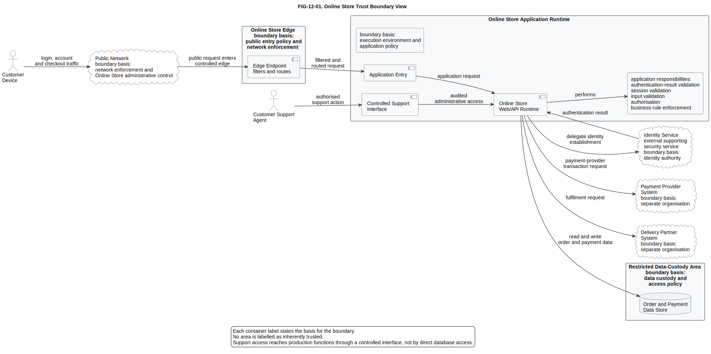
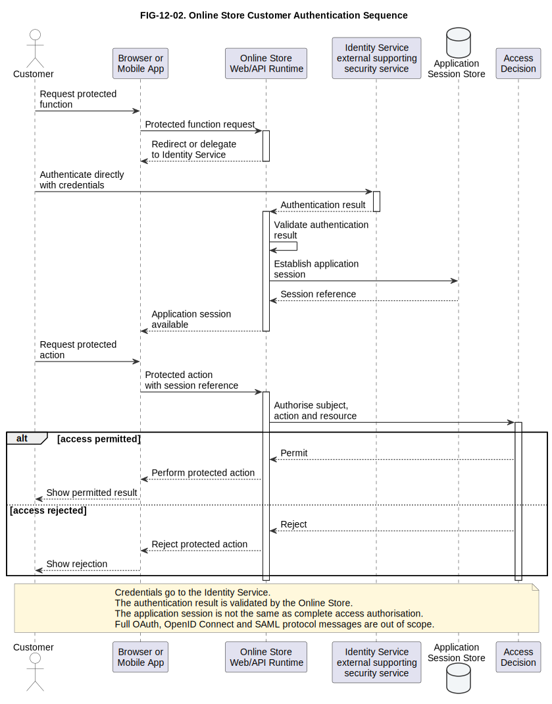
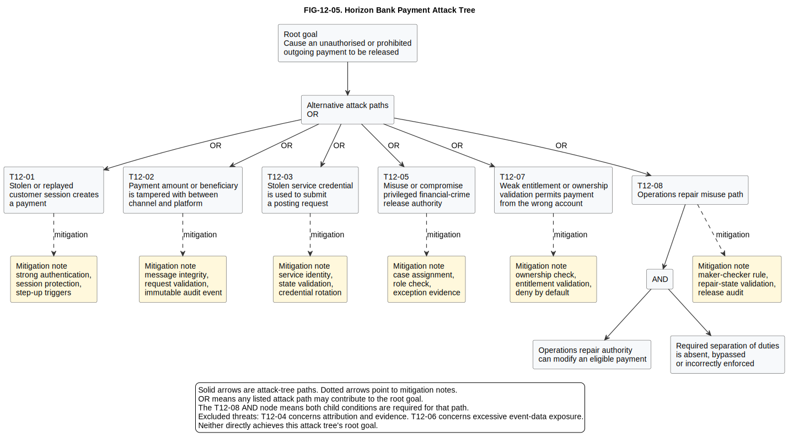
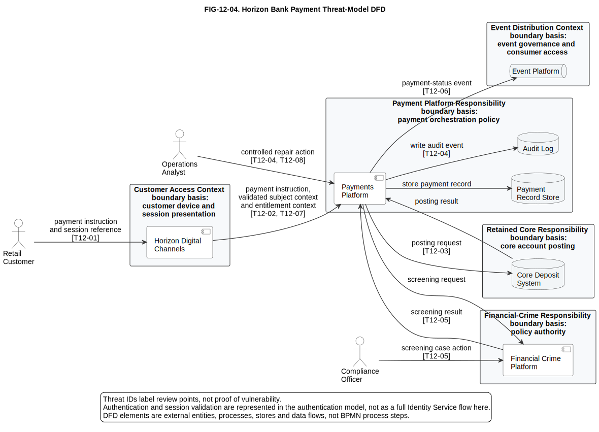

# 12. Security Modelling

## Chapter purpose

Teach practical modelling of trust boundaries, identity, access authorisation, threats, controls, privacy concerns and security flows without turning every architecture diagram into a security diagram.

## Reader outcomes

By the end of this chapter, the reader should be able to:

- Explain security viewpoints, trust boundaries, authentication, access authorisation, threat modelling, STRIDE, attack trees, threat-model Data Flow Diagrams (DFDs), control mapping, privacy modelling and data classification in plain language.
- Identify the architecture question answered by each security model.
- Distinguish authentication from access authorisation, access authorisation from business approval, and business approval from payment-provider authorisation.
- Connect assets, security objectives, threat scenarios, controls, evidence and residual risk.
- Review simple security models for missing assets, unclear trust assumptions, weak access decisions, hidden data movement and vague mitigations.
- Apply security modelling to both the Simple Online Store and Horizon Bank examples.

## Prerequisites and dependencies

- Chapter 3: How to Read Architecture Diagrams
- Chapter 4: Unified Modeling Language (UML)
- Chapter 6: Business Process Model and Notation (BPMN)
- Chapter 8: Data Modelling
- Chapter 11: Infrastructure and Deployment Modelling

## Required models and artefacts

- FIG-12-01: Online Store Trust Boundary View, source created, SVG exported and PNG preview rendered for review.
- FIG-12-02: Online Store Customer Authentication Sequence, source created, SVG exported and PNG preview rendered for review.
- TABLE-12-01: Horizon Bank Payment Action Access-Control Matrix, manuscript table. It replaces the retired planned figure `FIG-12-03`.
- FIG-12-04: Horizon Bank Payment Threat-Model DFD, source created, SVG exported and PNG preview rendered for review.
- FIG-12-05: Horizon Bank Payment Attack Tree, source created, SVG exported and PNG preview rendered for review.

## Worked examples

- Simple Online Store customer login and checkout.
- Horizon Bank outgoing retail payment access decisions.
- Horizon Bank payment threat review, privacy review and control mapping.

## Source requirements

- `[NIST-CSF-2.0]` supports the connection between security modelling and broader cybersecurity risk management.
- `[NIST-SP-800-207]` supports trust, identity and explicit access-decision guidance drawn from zero trust architecture.
- `[NIST-SP-800-53R5]` supports security and privacy control mapping as control-catalogue context, not as a universal mandatory baseline.
- `[NIST-PRIVACY-FRAMEWORK-1.0]` supports privacy risk framing and the distinction between security and privacy concerns.
- `[OWASP-THREAT-MODELLING-2026]` supports the threat-modelling workflow and the use of DFDs with trust boundaries.
- `[OWASP-ASVS-5.0.0]` supports application security verification framing for identity, authentication, access control and data protection.
- `[OWASP-AUTH-CHEATSHEETS-2026]` supports authentication, session-management and authorisation review concerns.
- `[MICROSOFT-STRIDE-2026]` supports the six STRIDE threat categories.
- `[SCHNEIER-ATTACK-TREES-1999]` supports attack-tree roots, branches and AND/OR path semantics.

## Why security needs its own models

Security modelling answers: **what must be protected, what can go wrong, what controls reduce the risk, and what evidence will show whether those controls exist?**

Many architecture diagrams include a lock icon, a firewall symbol or the word "secure". That is not enough. A security model must make assumptions reviewable. It should show assets, identities, trust boundaries, data movement, access decisions, threats, controls and evidence at a level the intended audience can inspect.

A general deployment diagram may show where the Online Store API runs. A security model asks a different question: where does customer traffic enter, where does payment data cross a boundary, which identity is authenticated, which action is authorised, and which controls protect the flow? Chapter 11 showed runtime placement and infrastructure. This chapter adds the security questions that sit across those views.

Security modelling should also separate fact, interpretation and recommendation. A fact might be that a customer submits credentials through a browser. An interpretation might be that the customer device is outside the Online Store's administrative control. A recommendation might be that privileged administration must use a stronger authentication path than ordinary customer browsing. Keeping those separate helps beginners avoid treating a diagram as proof that the design is secure.

## The security modelling foundation

Before drawing a security diagram, write down the foundation of the model. This prevents the team from jumping straight to controls without agreeing what they protect.

| Foundation item | Plain question | Example |
|---|---|---|
| Asset | What must be protected? | Customer account, payment instruction, payment status, audit record, service credential |
| Security objective | What property matters? | Only an entitled customer can create a payment from their own account |
| Actor or threat actor | Who or what interacts with the design? | Retail Customer, Operations Analyst, service identity, attacker using stolen credentials |
| Assumption | What are we relying on? | The Identity Service is operated under a separate identity-control process |
| Dependency | Which other system or team must behave correctly? | Financial Crime Platform, Core Deposit System, Event Platform, operations support tooling |
| Consequence | What harm follows if the objective fails? | Unauthorised payment, privacy exposure, disputed audit trail, service outage |
| Evidence | What can be checked later? | Policy configuration, test results, audit events, log samples, access review record |

A practical security model often follows this trace:

`asset -> security objective -> threat scenario -> vulnerability or precondition -> impact and likelihood -> control -> evidence -> residual risk`

The model does not need to become a risk-management manual. It does need enough structure for a reviewer to ask, "Which asset is this about?", "What threat are we reducing?", "Where is the control enforced?", and "How would we know it works?"

## Depth boundary for this chapter

This chapter teaches security modelling for architecture review. It does not teach cryptography, incident response, penetration testing, secure coding, regulatory compliance or full identity-protocol design.

For example, the Online Store authentication sequence can show a delegated sign-in pattern, the issue or validation of an authentication result, the creation of an application session, and a later access decision. It should not expand into every OpenID Connect, SAML or OAuth message. That detail belongs in protocol design or implementation documentation.

Similarly, the Horizon Bank examples are educational architecture models. They do not define a real bank's legal, regulatory, fraud or financial-crime obligations.

## Security viewpoints

A security viewpoint defines how a security concern will be represented and reviewed. It answers: **which security question are we trying to answer for which audience?**

Different stakeholders need different security views. A developer may need to know which API action requires which permission. A platform engineer may need to understand boundaries and enforcement points. A security reviewer may need to see threats, mitigations and remaining risk. A data protection reviewer may need to know where personal or financial data is stored, transformed and retained.

| Viewpoint | Main question | Useful audience | Typical artefact |
|---|---|---|---|
| Trust boundary view | Where does the basis of trust change? | Architects, security reviewers, platform teams | Boundary diagram |
| Authentication flow | How is identity established? | Developers, identity teams, testers | Sequence diagram |
| Access authorisation model | Who or what may perform which action? | Product owners, developers, auditors | Matrix or policy view |
| Threat model | What can go wrong and where? | Security reviewers, architects, delivery teams | DFD, STRIDE table or risk list |
| Attack tree | How could an attacker reach a harmful goal? | Security teams, architects, risk reviewers | Tree of attack paths |
| Control map | Which controls reduce which risks? | Security, risk, audit and delivery teams | Control mapping table |
| Privacy and data-handling view | Which data use creates privacy or handling risk? | Data, security, privacy and architecture teams | Data-flow annotation or handling table |

The important habit is to choose the question before choosing the notation. A trust-boundary diagram is not a complete threat model. An access-control matrix is not an authentication flow. An attack tree is not a control catalogue. Each model earns its place by making one review question easier to answer.

## Trust-boundary diagrams

A trust-boundary diagram answers: **where does a request, user, device, system or data item cross from one trust context into another?**

A **trust boundary** is a boundary across which the basis for trust changes. That basis may include administrative authority, identity authority, security policy, data custody, execution environment, network enforcement or organisational responsibility. The boundary is not simply a line between "inside" and "outside". A staff support tool may sit inside the organisation and still need explicit controls before it reaches production data. A provider connection may be well governed while still being outside the Online Store's direct authority.

NIST zero trust guidance is useful here because it warns against assuming trust merely because something sits inside a network location or is owned by the organisation [NIST-SP-800-207]. For modelling, the practical lesson is simple: do not let a diagram imply that network placement alone grants access.

For the Simple Online Store, a first trust-boundary view should show:

- Customer device and public network as a separate context outside Online Store administrative control.
- Online Store edge as the controlled public entry point.
- Application runtime as the place where requests are validated and business actions begin.
- Order and payment data store as a more restricted data-custody area.
- Payment Provider System and Delivery Partner System as external provider systems with separate responsibilities.
- Operations access as a separate controlled path, not the same path as customer traffic.
- Identity Service as an external supporting security service introduced only in the security view, not as a new core component of the simple case study.

The diagram should label important crossings. Customer login crosses from customer context to the store edge. Checkout crosses from application runtime to the payment provider. Operations access crosses from staff tooling into the production environment through a controlled support interface. The point is not to show every firewall rule. The point is to reveal where assumptions change and where controls should be discussed.

**Figure FIG-12-01. Online Store Trust Boundary View.** This view separates the customer device, public network, Online Store edge, application runtime, restricted data-custody area and external provider systems so reviewers can see where the basis for trust changes.

Accessibility text: The figure shows customer login and checkout traffic crossing the public network as a public request entering a controlled Online Store edge, then as a filtered and routed request to the application runtime. The Online Store Web/API Runtime performs authentication-result validation, session validation, input validation, authorisation and business-rule enforcement. It delegates identity establishment to an Identity Service, sends payment-provider and fulfilment requests to external organisations, reads and writes order and payment data in a restricted data-custody area, and receives support actions only through a controlled support interface.

Limitation: This is a trust-boundary teaching view. It does not list every network control, firewall rule, certificate, token claim or provider contract.

## Authentication flows

An authentication flow answers: **how does the system establish the identity of a user, system or device?**

**Authentication** is about proving or establishing identity. **Access authorisation** is about deciding what that identity is allowed to do. Beginners often merge these ideas into one phrase such as "login security". That hides important design questions. A customer may be authenticated but not authorised to view another customer's order. A service may authenticate successfully but still lack permission to post a payment.

An authentication flow is often shown as a sequence diagram because order matters. The diagram can show the customer, browser or mobile app, Online Store, Identity Service, authentication result and application session. It can also show a compact error path, but it should not become a full implementation trace unless that is the purpose.

OWASP authentication and session-management guidance supports reviewing authentication and session handling as specific concerns. OWASP authorisation guidance treats access decisions as a separate concern [OWASP-AUTH-CHEATSHEETS-2026]. For Chapter 12, the modelling recommendation is to keep these concerns separate until there is a reason to combine them.

A simple delegated Online Store sign-in sequence might show:

1. Customer requests a protected account or order function.
2. Online Store redirects or delegates the customer to the Identity Service.
3. Customer authenticates directly with the Identity Service.
4. Identity Service returns an authentication result to the Online Store.
5. Online Store validates the result and creates an application session.
6. Customer requests a protected action using the session.
7. Online Store checks whether the authenticated customer is authorised for that action and resource.
8. Online Store either permits or rejects the action.

The sequence should label where credentials, authentication results and session identifiers move. It should also avoid promising security properties that the diagram does not prove. A sequence diagram can show that an authentication result is returned. It does not prove that session expiry, token renewal, account recovery, logout or revocation are implemented correctly.

**Figure FIG-12-02. Online Store Customer Authentication Sequence.** This sequence shows delegated customer authentication, validation of the authentication result, creation of an application session and a later access decision for a protected action.

Accessibility text: The customer requests a protected function through a browser or mobile app. The Online Store redirects or delegates to the Identity Service. The customer authenticates directly with that Identity Service. The Online Store receives and validates the authentication result, establishes an application session, then authorises a later protected action through an explicit access decision that can permit or reject the action.

Limitation: This sequence is not a complete OAuth, OpenID Connect or SAML protocol trace. It also does not prove session expiry, account recovery, logout, revocation or step-up authentication behaviour.

## Access authorisation models

An access authorisation model answers: **which subject may perform which action on which resource under which conditions?**

Use "access authorisation" for security permission decisions. Keep it separate from **business approval**, where a business rule or policy says an activity can proceed, and from **payment-provider authorisation**, where a payment network, card provider or payment provider authorises a payment transaction. The same word appears in all three contexts, but the modelling questions are different.

An access-control matrix is a practical beginner artefact. It can list subjects and actions, then record whether access is allowed, denied or conditional. In more advanced designs, the model may use attributes, policies, relationship-based access or central policy decision and enforcement points. The beginner principle stays the same: make the access decision visible.

Table `TABLE-12-01` replaces the former planned figure `FIG-12-03`. It remains a manuscript table because the content is tabular and does not need a publication SVG unless the author later requests one.

| Subject | Action | Resource | Access decision | Condition | Enforcement point | Review concern |
|---|---|---|---|---|---|---|
| Retail Customer | Create payment instruction | Own eligible account | Conditional | Authenticated customer, active account entitlement and payment limits satisfied | Horizon Digital Channels and Payments Platform | Cannot create payments from another customer's account |
| Retail Customer | View payment status | Own payment | Conditional | Authenticated customer and ownership or delegated access verified | Horizon Digital Channels | Status view must not expose another customer's data |
| Operations Analyst | Repair operational exception | Assigned payment exception | Conditional | Assigned queue, role, reason code and separation-of-duties rule satisfied | Operations support interface and Payments Platform | Cannot approve or release the same repair when separation is required |
| Compliance Officer | Review financial-crime alert | Assigned alert case | Conditional | Case assignment and policy authority recorded | Financial Crime Platform | Must not alter unrelated customer data without a clear purpose |
| Payments Platform service identity | Submit posting request | Approved payment instruction | Conditional | Service identity authenticated, request integrity checked, payment state permits posting | Payments Platform boundary to Core Deposit System | Cannot bypass business approval, screening or state rules |
| Core Deposit System service identity | Return posting result | Posting request response | Conditional | Response correlates to a valid posting request | Payments Platform integration boundary | Cannot initiate a customer payment by itself |
| Customer Support Agent | View limited customer payment details | Support case | Conditional | Active support case, least-privilege role and audit reason recorded | Support interface | Should not have broad production database access |

NIST SP 800-207 is useful because it highlights explicit access decisions, policy decision points and policy enforcement points [NIST-SP-800-207]. In a model, a **policy decision point** decides whether access should be allowed. A **policy enforcement point** applies that decision at the system boundary or service boundary. The same component may perform both in a simple system, but the model should not hide where the decision is made.

Useful access authorisation checks include:

- Deny by default when a rule is missing or cannot be evaluated.
- Validate permissions on every protected request, not only at login.
- Apply least privilege to human users and service identities.
- Separate duties where one person must not both prepare and approve a sensitive action.
- Include context where relevant, such as account ownership, case assignment, payment state, amount, channel, device risk or time.
- Record audit evidence for sensitive decisions.
- Define failure behaviour, including what happens when a policy service, identity service or dependency is unavailable.

## Threat modelling

Threat modelling answers: **what could go wrong, where could it happen, and what will we do about it?**

A **threat** is a potential cause of harm. A **vulnerability** is a weakness that could be exploited. A **control** is a safeguard that reduces likelihood, impact or exposure. **Residual risk** is the risk that remains after selected controls are applied. A **threat model** is the structured record that connects the system, assets, threats, controls and open questions.

OWASP describes threat modelling as a structured activity for understanding a system, identifying threats and deciding mitigations [OWASP-THREAT-MODELLING-2026]. In this book, the modelling emphasis is on reviewability. A useful threat model should make it possible to ask:

- What asset or process is being protected?
- Which boundary or flow is exposed?
- Which threat category applies?
- Which control reduces the risk?
- Who owns the control?
- What remains unresolved?

Threat modelling is not the same as penetration testing. Penetration testing tries to find exploitable weaknesses in a running or testable system. Threat modelling can begin earlier, when the architecture is still being designed. It is also not the same as a list of security tools. A tool may implement a control, but the model should explain the risk and the reason for the control.

## STRIDE

STRIDE answers: **which common threat categories should we check against each element or data flow?**

STRIDE is a mnemonic for six threat categories: Spoofing, Tampering, Repudiation, Information Disclosure, Denial of Service and Elevation of Privilege [MICROSOFT-STRIDE-2026].

| STRIDE category | Plain question | Payment example |
|---|---|---|
| Spoofing | Could someone pretend to be another user, service or system? | A fake service calls the Payments Platform as if it were Horizon Digital Channels. |
| Tampering | Could data or messages be changed without detection? | A payment amount is changed between channel submission and payment orchestration. |
| Repudiation | Could someone deny performing an action? | A staff user disputes approving a manual repair. |
| Information Disclosure | Could sensitive data be exposed? | Payment details appear in broad operational logs. |
| Denial of Service | Could service be made unavailable or degraded? | Payment submission is flooded so legitimate customers cannot submit payments. |
| Elevation of Privilege | Could someone gain permissions they should not have? | An operations user gains compliance release capability. |

STRIDE is useful because it gives beginners a repeatable lens. It is not a complete security architecture by itself. If the diagram does not show assets, boundaries and flows, STRIDE has nothing concrete to inspect. If the model lists threats without controls or owners, it is still incomplete.

## Attack trees

An attack tree answers: **what alternative or combined paths could lead to one harmful goal?**

The root of an attack tree is the attacker's goal, such as "cause an unauthorised or prohibited outgoing payment to be released". Branches show ways the goal could be reached. Some branches are alternatives. Others require several steps together. Attack-tree notation commonly uses OR to show alternative paths and AND to show steps that must all be true [SCHNEIER-ATTACK-TREES-1999].

For Horizon Bank, an attack tree for unauthorised or prohibited payment release should include only threats that can causally contribute to that root goal. OR branches represent alternative ways to reach the root goal. The T12-08 branch is different because both child conditions are required for that path: repair authority must be able to modify an eligible payment, and required separation of duties must be absent, bypassed or incorrectly enforced.

- T12-01: use a stolen or replayed customer session to create a payment.
- T12-02: tamper with the payment amount or beneficiary between Horizon Digital Channels and the Payments Platform.
- T12-03: use a stolen service credential to submit a posting request.
- T12-05: release a prohibited payment outside financial-crime policy authority.
- T12-07: exploit weak entitlement or ownership validation to create a payment from the wrong account.
- T12-08: combine operations repair authority with broken separation of duties to release a payment.

Attack trees are most useful when the team can compare paths and decide where controls matter most. They are less useful when every branch is vague, such as "hack the bank". A good branch names a concrete path that can be reviewed against architecture and operations, without giving exploit instructions. T12-04, weak attribution for sensitive staff action, belongs in the control map but does not by itself release a payment. T12-06, payment-status event data exposure, belongs in the DFD and control map but is outside this attack tree because it does not directly achieve the stated root goal.

**Figure FIG-12-05. Horizon Bank Payment Attack Tree.** This attack tree keeps the root goal narrow: causing an unauthorised or prohibited outgoing payment to be released. Most included branches are alternative causal paths to that goal, while T12-08 is a combined path that requires both child conditions below its AND node.

Accessibility text: The root goal connects to an OR node for alternative attack paths. The included branches are stolen or replayed customer session, payment amount or beneficiary tampering, stolen service credential, misuse or compromise of financial-crime release authority, weak entitlement or ownership validation, and an operations repair misuse path. The operations repair misuse path connects to an AND node with two required child conditions: operations repair authority can modify an eligible payment, and required separation of duties is absent, bypassed or incorrectly enforced. Mitigation notes point to controls such as strong authentication, message integrity, state validation, case assignment, entitlement validation and maker-checker rules. T12-04 and T12-06 remain valid threats but are outside this attack tree because they do not directly achieve the root goal.

Limitation: This attack tree is a review model, not an exploit guide and not a full risk register. It deliberately omits threats that matter elsewhere but do not causally release the payment.

## Threat-model Data Flow Diagrams

A threat-model DFD answers: **how does data move through the system, and where do boundaries and threats appear?**

A DFD for threat modelling is different from a detailed business process. It usually shows external entities, processes, data stores, data flows and trust boundaries. OWASP guidance supports DFDs as a practical way to understand the system during threat modelling [OWASP-THREAT-MODELLING-2026]. Chapter 8 introduced data movement for architecture. Here, the same idea is used to expose security concerns.

For Horizon Bank payment submission, a threat-model DFD might show:

- Retail Customer as an external entity.
- Horizon Digital Channels as the customer-facing process.
- Payments Platform as the orchestration process.
- Financial Crime Platform as the screening process.
- Core Deposit System as a retained system outside the Payments Platform modelling scope.
- Event Platform as a shared event-distribution process outside the Payments Platform modelling scope.
- Payment record store and audit log as data stores.
- Boundaries around customer access, digital-channel responsibility, payment-platform responsibility, retained-core responsibility, event distribution and data custody.

The flows should be labelled with the data that moves, not only with verbs. "Payment instruction", "session reference", "validated subject context", "entitlement context", "screening request", "screening result", "posting request", "posting result", "payment status event" and "audit event" are reviewable labels. A vague arrow labelled "secure API" does not tell a reviewer what is at risk.

For `FIG-12-04`, the customer-to-channel flow should be labelled "payment instruction and session reference". The channel-to-payments flow should be labelled "payment instruction, validated subject context and entitlement context". The Retail Customer does not supply trusted identity context or entitlement context directly. The Digital Channel Access Context represents the bank-controlled channel boundary where internet-facing session termination and channel access controls apply. Authentication and session validation are outside the detailed scope of this DFD and are represented by the authentication modelling guidance earlier in the chapter.

The same DFD should show that operational users receive sensitive information, not only that they submit actions. A repair work item and permitted payment context are presented through an authorised operations interface. A screening case and permitted customer context are presented to the Compliance Officer through the Financial Crime Platform. Those presentation flows need access control and audit because they expose payment or customer information to privileged users. Event consumers should receive only permitted and minimised payment-status event data.

**Figure FIG-12-04. Horizon Bank Payment Threat-Model DFD.** This DFD shows payment data movement, trust boundaries and threat-review points for Horizon Bank outgoing retail payment handling, including privileged-user presentation and event-consumer exposure.

Accessibility text: The retail customer sends a payment instruction and session reference to Horizon Digital Channels inside the Digital Channel Access Context. Bank-controlled channel services validate subject context and entitlement context before sending them with the payment instruction to the Payments Platform. The Payments Platform stores payment records, writes audit events, sends screening requests to the Financial Crime Platform, sends posting requests to the Core Deposit System and publishes payment-status events through the Event Platform. The Event Platform sends a permitted payment-status event to an Approved Event Consumer outside the event-distribution boundary. The Payments Platform presents repair work items and permitted payment context through an authorised operations interface for the Operations Analyst, and the Financial Crime Platform presents screening case and permitted customer context to the Compliance Officer. Threat IDs T12-01 through T12-08 label review points on specific flows.

Limitation: This DFD is not a BPMN process model, a complete identity architecture or a full event-governance design. It shows data flows, boundaries and review points at architecture level.

## Security control mapping

Security control mapping answers: **which control reduces which risk, where is it implemented, and what evidence will show that it works?**

NIST Cybersecurity Framework 2.0 provides high-level cybersecurity risk-management framing [NIST-CSF-2.0]. NIST SP 800-53 Revision 5 provides a broad catalogue of security and privacy controls [NIST-SP-800-53R5]. This chapter does not treat either source as a universal mandatory baseline for every reader. Instead, it uses them to teach traceability between architecture concerns, control intent and review evidence.

| Threat ID | Asset | Objective | Threat scenario | Control intent | Enforcement location | Owner | Evidence | Residual risk or open question |
|---|---|---|---|---|---|---|---|---|
| T12-01 | Customer session | Only a valid current customer session can initiate a payment request | Stolen or replayed customer session creates a payment | Strong authentication, session protection, replay resistance, step-up triggers and anomaly monitoring | Identity Service and Horizon Digital Channels | Identity team and digital-channel owner | Authentication configuration, session tests, audit events | How is step-up triggered for unusual payments? |
| T12-02 | Payment instruction | Payment amount and beneficiary cannot be changed silently | Payment amount or beneficiary is tampered with between channel and platform | Message integrity, request validation, immutable audit event | Channel-to-payment interface and payment record store | Payments Platform owner | Contract tests, integrity checks, audit log sample | Which fields are signed or otherwise integrity protected? |
| T12-03 | Posting request | Only approved payments are posted | Stolen service credential is used to submit a posting request | Service identity, explicit policy check, state validation and monitoring | Payments Platform boundary to Core Deposit System | Payments Platform owner and core integration owner | Service identity policy, state transition tests, alert rule | How are service credentials rotated and revoked? |
| T12-04 | Audit trail | Sensitive staff repair or release actions are attributable | Sensitive staff repair or release action cannot be attributed | Individual identity, reason code, tamper-resistant audit event | Operations support interface and audit log | Operations owner | Audit-event sample, access review record | How long are audit records retained? |
| T12-05 | Financial-crime decision | Prohibited payment is not released outside policy authority | Prohibited payment is released outside financial-crime policy authority | Case assignment, role check, separation rule and evidence capture | Financial Crime Platform | Compliance operations owner | Case workflow record, access test, exception report | Which exceptional release path needs senior approval? |
| T12-06 | Payment status event | Consumers see only intended status data | Payment-status event exposes excessive customer or account data | Data minimisation, event schema review and consumer access control | Event Platform and event schema governance | Event platform owner and data owner | Event schema, consumer access list, log sample | Which analytics consumers receive derived data? |
| T12-07 | Customer account entitlement | Only an entitled subject can create a payment from the account | Weak entitlement or ownership validation permits payment from the wrong account | Account ownership check, entitlement context validation and deny-by-default access decision | Horizon Digital Channels and Payments Platform | Digital-channel owner and payments owner | Entitlement tests, policy configuration, rejected-access audit sample | Which delegated-access cases need explicit modelling? |
| T12-08 | Operations repair authority | Repair authority cannot be used to release a payment without separation of duties | Operations repair authority combined with broken separation of duties permits unauthorised release | Maker-checker rule, role separation, repair-state validation and release audit | Operations support interface and Payments Platform | Operations owner and payments owner | Separation-of-duties test, workflow configuration, repair audit sample | How are emergency repairs approved and reviewed? |

Avoid mapping controls only by name. A table that says "access control exists" does not explain who makes the decision, where it is enforced or how a reviewer can verify it.

## Privacy modelling and data classification

Privacy modelling asks: **how can data processing create problems for people even when the system is technically secure?**

Data classification asks: **which data requires stronger handling?**

The two ideas overlap, but they are not the same. Classification labels data by sensitivity or handling need. Privacy modelling also asks whether the purpose, collection, sharing, retention and visibility of data are appropriate. NIST Privacy Framework 1.0 is useful context because it frames privacy risk as something that can arise from data processing, not only from security failure [NIST-PRIVACY-FRAMEWORK-1.0].

Architecture models often show systems before they show the sensitivity of the data those systems handle. That can hide important risk. A payment flow may include customer identity, account number, payment amount, beneficiary information, screening result, audit data and operational telemetry. These data items do not all need the same treatment, but the model must make their handling visible enough to review.

| Data item | Classification example | Purpose | Source and destination | Stored where | Authorised access | Retention or disposal concern | Privacy or security concern |
|---|---|---|---|---|---|---|---|
| Validated subject context | Confidential | Link request to authenticated customer | Horizon Digital Channels to Payments Platform after session validation | Session store or request context | Customer-facing services and policy checks | Session expiry and trace retention | Do not persist more identity attributes than needed |
| Account reference | Restricted | Identify source account | Horizon Digital Channels to Payments Platform and Core Deposit System | Payment record store | Customer, payments service and limited support roles | Payment record retention policy | Mask in logs and customer-support views where possible |
| Payment amount and beneficiary | Restricted | Create and post payment | Customer to Payments Platform, Financial Crime Platform and Core Deposit System | Payment record store and audit log | Customer, payments service, assigned support and compliance roles | Payment and audit retention policy | Do not expose full details in broad events |
| Screening result | Restricted | Decide whether payment can proceed | Financial Crime Platform to Payments Platform | Case store, payment record or audit record | Compliance roles and payment decision logic | Financial-crime record retention policy | Avoid broad operational visibility |
| Audit event | Confidential or restricted | Record sensitive action and reason | Payment, support and compliance processes to audit log | Audit log | Audit, risk and approved investigation roles | Tamper resistance and retention | Must be attributable without exposing unnecessary data |
| Operational trace or log | Internal, confidential or restricted depending on fields | Diagnose service behaviour | Runtime services to observability pipeline | Observability backend | Operations and service owners | Shorter retention for high-detail traces | Redact credentials, tokens, account numbers and sensitive payment data |
| Analytics extract | Aggregated or restricted depending on content | Reporting and trend analysis | Event Platform or data platform | Analytics store | Approved analytics consumers | Derived-data retention and access review | Use minimisation and aggregation where possible |

Chapter 11 introduced observability and sensitive-data redaction. Chapter 12 extends that idea: security models should show where sensitive data is protected, masked, tokenised, encrypted, retained, deleted or access-controlled. Do not rely on colour alone for classification. Use labels and textual explanation so the model remains accessible and reviewable.

## Security modelling versus nearby approaches

Security models often overlap with other architecture models, but they should not replace them.

| Approach | Main concern | Security relationship |
|---|---|---|
| Deployment view | Where software runs | Provides runtime context for boundaries and controls |
| Network topology | Zones and traffic paths | Helps locate exposed paths and enforcement points |
| BPMN process model | Business process sequence | Helps find human approvals, exceptions and segregation of duties |
| Data model or lineage view | Data meaning and movement | Helps identify sensitive data and retention concerns |
| Threat-model DFD | Data movement for threat review | Adds boundaries, threats and mitigations |
| Control map | Traceability from risk to control and evidence | Helps review whether the design addresses known risks |

The same system may need several views. Horizon Bank payment handling needs a process view for business approval flow, a deployment view for runtime placement, a DFD for data movement, an access-control matrix for permission decisions and a control map for review evidence. Combining all of that into one picture would be hard to read.

## Common mistakes

The first mistake is treating a security icon as a security model. A lock symbol does not explain identity, data sensitivity, trust boundaries, threats or controls.

The second mistake is confusing authentication with access authorisation. Login proves or establishes identity. It does not automatically grant every action.

The third mistake is using the word authorisation without saying which kind is meant: access authorisation, business approval or payment-provider authorisation.

The fourth mistake is assuming that a network location is enough to grant trust. Modern security models should make trust assumptions explicit.

The fifth mistake is drawing a threat model without assets. If the model does not say what is being protected, threat discussion becomes abstract.

The sixth mistake is labelling an arrow "secure" without saying what protects it or what data moves across it.

The seventh mistake is listing STRIDE categories without linking them to elements, flows, controls and owners.

The eighth mistake is using a control catalogue as a diagram. Controls need context, ownership and evidence.

The ninth mistake is hiding operational and support paths. Administration, repair, release and monitoring paths often carry high security risk.

The tenth mistake is treating data classification as privacy modelling. Classification is helpful, but privacy review must also ask about purpose, access, sharing, retention and data minimisation.

The eleventh mistake is using colour as the only indicator of data classification or boundary type.

The twelfth mistake is trying to show every security concern on one diagram. Use several focused views instead.

## Chapter cheat sheet

| Topic | Question answered | Useful for | Watch out for |
|---|---|---|---|
| Security viewpoint | Which security concern are we modelling? | Choosing the right artefact | Starting with notation before purpose |
| Trust boundary | Where does the trust basis change? | Boundary and control review | Assuming network location grants access |
| Authentication flow | How is identity established? | Login and service identity review | Mixing it with every access rule |
| Access authorisation model | Who may do what, when? | Permission review | Omitting conditions and enforcement points |
| Threat model | What can go wrong and what will we do? | Early security design review | Treating it as penetration testing |
| STRIDE | Which threat categories should we check? | Repeatable threat prompts | Listing categories without controls |
| Attack tree | How could one harmful goal be reached? | Comparing attack paths | Vague branches such as "hack system" |
| Threat-model DFD | How does data move across boundaries? | Security review of flows | Turning it into a business process diagram |
| Control map | Which control addresses which risk? | Audit and risk traceability | Naming controls without evidence |
| Privacy and data classification | Which data processing and handling needs review? | Privacy and data protection review | Colour-only classification |

## Key takeaways

- Security models make assumptions visible so they can be reviewed.
- Start with assets, objectives, actors, assumptions, dependencies, consequences and evidence.
- A trust boundary marks a change in the basis for trust, not merely a box boundary.
- Authentication and access authorisation should be modelled separately before they are combined.
- Access authorisation, business approval and payment-provider authorisation are different modelling concerns.
- Threat modelling can start before the system is built because it reviews design assumptions.
- STRIDE is a useful threat-category prompt, but it needs assets, flows, boundaries, controls and owners.
- Threat-model DFDs are useful when data movement and boundaries matter.
- Control mapping should connect risk, control intent, architecture location, owner, evidence and residual risk.
- Privacy modelling should consider purpose, sharing, access and retention, not only data sensitivity labels.

## Practical exercise

Horizon Bank is designing outgoing retail payment submission. A Retail Customer uses Horizon Digital Channels to create a payment instruction. The Payments Platform validates and orchestrates the payment. The Financial Crime Platform screens the payment. The Core Deposit System posts accepted payments. The Event Platform publishes payment status events. Operations Analysts can repair exceptions, Compliance Officers can review screening alerts, and Customer Support Agents can view limited payment details for active support cases.

Choose the right model for each question:

1. Which model should show that the customer device, bank digital channel, payment platform, retained core system and event platform sit in different trust contexts?
2. Which model should show how a customer identity is established before payment submission?
3. Which model should show whether an Operations Analyst may repair a payment but not approve their own repair?
4. Which model should show payment instruction, screening request, posting request and audit event flows across boundaries?
5. Which model should explore alternative ways an attacker might cause an unauthorised or prohibited payment to be released?
6. Which model should connect spoofing or tampering threats to controls, owners, evidence and residual risk?
7. Which model should highlight customer, account and payment data that must not appear in broad operational logs or analytics extracts?

Suggested answer:

- Use a trust-boundary view for different trust contexts.
- Use an authentication sequence for identity establishment.
- Use an access-control matrix or policy view for allowed actions and separation rules.
- Use a threat-model DFD for data movement across boundaries.
- Use an attack tree for alternative attack paths to one harmful goal.
- Use a STRIDE-supported threat model plus a control map for threat, mitigation, owner, evidence and residual-risk traceability.
- Use privacy and data-handling labels on flows, stores and telemetry paths for sensitive data handling.

## Review checklist

- [ ] The question answered by each security model is explicit.
- [ ] The audience and abstraction level are clear.
- [ ] Formal terms are introduced after a plain-language explanation.
- [ ] Assets, objectives, actors, assumptions, dependencies, consequences and evidence are visible where needed.
- [ ] Authentication, access authorisation, business approval and payment-provider authorisation are separated.
- [ ] Trust boundaries show a change in trust basis, not decorative grouping.
- [ ] Threats are linked to assets, flows, boundaries, controls and owners.
- [ ] STRIDE categories are used consistently and not treated as a complete architecture by themselves.
- [ ] Threat-model DFDs show external entities, processes, data stores, data flows and boundaries.
- [ ] Access authorisation models show subjects, actions, resources, conditions and enforcement points where relevant.
- [ ] Control mapping distinguishes control intent, implementation location, owner, evidence and residual risk.
- [ ] Privacy modelling covers purpose, access, sharing, retention and minimisation.
- [ ] Sensitive data and classification are explained with text, not colour alone.
- [ ] The simple and banking examples are consistent with repository example files.
- [ ] Comparisons do not imply that one notation is universally superior.
- [ ] Common mistakes are concrete and actionable.
- [ ] Required sources and diagram specifications are registered.
- [ ] Diagram source and SVG/PNG exports exist for `FIG-12-01`, `FIG-12-02`, `FIG-12-04` and `FIG-12-05`, and the figures remain in Review pending author and page-layout review.
- [ ] Terminology, link and word-count checks pass.

## References and further reading

Chapter source notes are maintained in the repository under `research/security/` and registered in `SOURCE_REGISTER.md`. Appendix H, [Glossary and Source Notes](../appendices/appendix-h-glossary-sources.md), is the intended publication location for the final source-key index once the appendix is completed.

- `[NIST-CSF-2.0]`: National Institute of Standards and Technology, Cybersecurity Framework 2.0.
- `[NIST-SP-800-207]`: National Institute of Standards and Technology, Zero Trust Architecture.
- `[NIST-SP-800-53R5]`: National Institute of Standards and Technology, Security and Privacy Controls for Information Systems and Organizations, Revision 5.
- `[NIST-PRIVACY-FRAMEWORK-1.0]`: National Institute of Standards and Technology, Privacy Framework 1.0.
- `[OWASP-THREAT-MODELLING-2026]`: OWASP threat-modelling cheat sheet.
- `[OWASP-ASVS-5.0.0]`: OWASP Application Security Verification Standard 5.0.0.
- `[OWASP-AUTH-CHEATSHEETS-2026]`: OWASP authentication, session-management and authorisation cheat sheets.
- `[MICROSOFT-STRIDE-2026]`: Microsoft STRIDE threat-category documentation.
- `[SCHNEIER-ATTACK-TREES-1999]`: Bruce Schneier, Attack Trees.
