# 16. Modelling Software Structure

## Chapter purpose

Help beginner and practising architects choose the right software-structure view for the architecture question in front of them. The chapter focuses on selection across system landscape, system context, container, component, package, class, dependency and deployment views.

## Reader outcomes

By the end of this chapter, the reader should be able to:

- Explain why software structure needs several views rather than one all-purpose diagram.
- Choose between system landscape, system context, container, component, package, class, dependency and deployment views.
- Distinguish a business capability, business process, software system, container, component, package, class and deployment node.
- Separate logical software responsibility from physical runtime placement.
- Use the Simple Online Store and Horizon Bank examples to select a useful first view.
- Review a software-structure view for audience, boundary, abstraction, dependencies, source support and common misuse.

## Prerequisites and dependencies

- Chapter 4: UML: Unified Modeling Language
- Chapter 5: The C4 Model
- Chapter 15: Modelling Business Processes

## Required models and artefacts

This chapter uses one original selection-guide figure and one manuscript selection table:

- FIG-16-01: Choosing the Right Software Structure View.
- Software-structure view selection table.

The chapter also refers to earlier C4 and Unified Modeling Language (UML) material, but it does not re-teach those notations.

## Worked examples

- Simple Online Store software-structure choices.
- Horizon Bank software-structure choices for digital onboarding and payments.

## Source requirements

- `[C4-OFFICIAL]` supports the C4 software-structure hierarchy and the system landscape, system context, container, component and code-level framing reused from Chapter 5.
- `[OMG-UML]` supports UML package, class, component and deployment terminology reused from Chapter 4.
- Chapter guidance distinguishes source-supported notation concepts from the author's practical recommendations about when to choose each view.
- Existing source notes are sufficient for this chapter; no new source note is required.

## From process flow to software structure

Chapter 15 showed how work flows through people, decisions, hand-offs and exceptions. A process model can show a customer submitting an application, a bank requesting screening, an operations team reviewing a possible match, and the customer receiving a result. That is essential, but it does not answer a different question: how is the software arranged so the work can be supported, changed and operated?

Chapter 16 answers that structural question. It does not replace the process view. Instead, it shows which software systems surround the work, where one system boundary sits, which runnable parts exist inside the system, which internal components own major responsibilities, which packages or classes matter in the code, which dependencies create coupling risk, and where runtime placement becomes a separate deployment concern.

The distinction matters because business capability, business process and software structure are often blurred. A capability describes what the business needs to be able to do. A process describes how work flows over time. Software structure describes how software is arranged into systems, containers, components, packages, classes and runtime deployments so that change, delivery and operation are manageable.

## Why software structure needs more than one view

Software structure is not one diagram. It is a set of views at different boundaries and levels of detail. A senior stakeholder may need to understand how many systems are involved in a bank change. A product owner may need to know which external systems sit outside the Online Store. A developer may need to know whether payment logic belongs in an order package, payment package or adapter. A platform engineer may need to know where the API and worker run in production.

Those are all structure-related questions, but they do not belong on the same page. A system landscape is too broad for class relationships. A class diagram is too detailed for enterprise dependencies. A deployment diagram is useful for runtime placement, but it can hide the logical responsibility boundaries if it is used too early.

The practical rule is to choose the smallest view that answers the question without misleading the audience. Add another view only when the first view would otherwise become crowded or would mix concerns.

## Start with the architecture question

Before choosing a notation, write the question in a plain sentence. The sentence should name the boundary, the audience and the decision.

For example:

- Which systems does the Online Store depend on for checkout?
- What runnable parts make up the Online Store?
- Which components inside the API Application own order, basket, payment and fulfilment responsibilities?
- Which code packages should depend on which other packages?
- Which important classes define order and payment concepts?
- Where do the API, worker and database run in production?

The words in the question usually point to the view. Many systems suggests a landscape. One system boundary suggests a context view. Runnable parts suggest a container view. Internal parts inside one container suggest a component view. Code organisation suggests package or class views. Coupling risk suggests a dependency view. Runtime placement suggests a deployment view.

## System landscape

A system landscape answers: **what software systems exist around this solution, and how do they relate at a broad level?**

This is the widest software-structure view in the chapter. It is useful when the audience needs to understand an estate, not just one system. A C4 System Landscape view can show several software systems and their high-level relationships [C4-OFFICIAL]. It is especially useful in enterprise architecture, migration planning, system ownership discussions and dependency discovery.

For the Simple Online Store, a small landscape might include Online Store, Payment Provider System and Delivery Partner System. It does not need to show classes or database tables. It should show enough relationships to explain where ownership crosses system boundaries.

For Horizon Bank, a payments or onboarding landscape might include Horizon Digital Channels, Customer Onboarding Platform, Party and Customer Platform, Payments Platform, Core Deposit System, Financial Crime Platform, Enterprise Integration Platform, Event Platform and Enterprise Data Platform. A landscape view helps the reader see that a channel app should not connect directly to every core system merely because the process needs data from several places.

Use a landscape when the question is estate scope, ownership, duplication, migration, dependency or system collaboration. Do not use it for detailed interface contracts, process sequence, component design or deployment topology.

## System context

A system context answers: **what is inside and outside one system boundary, and who or what interacts with it?**

This is often the first view for a single software system. Chapter 5 introduced the C4 System Context diagram. In this chapter, the selection point is boundary clarity. Choose a context view when the team has not yet agreed what the system of interest is, which people use it and which neighbouring systems sit outside its boundary [C4-OFFICIAL].

For the Simple Online Store, the system of interest is the Online Store. Customer and Customer Support Agent are people outside it. Payment Provider System and Delivery Partner System are external systems. The context view deliberately excludes the Online Store web app, API, database and worker because those are internal structure.

For Horizon Bank, a Customer Onboarding Platform context view might show Retail Customer, Relationship Manager, Compliance Officer, Horizon Digital Channels, Party and Customer Platform, Financial Crime Platform, Document Verification Service and Notification Service. It should make clear which interactions cross the Customer Onboarding Platform boundary and which responsibilities remain outside it.

A context view is not a process model. It may show that Horizon Digital Channels submits an onboarding application, but it does not show the order of onboarding tasks, exception waits or compliance review paths. Those remain Chapter 15 concerns.

## Container view

A container view answers: **what deployable or runnable parts make up the software system, and what stores data?**

In C4, a container is a separately runnable or deployable unit, or a data store, inside a software system [C4-OFFICIAL]. It may be a web application, mobile application, API application, database, worker, batch process or message broker. It is not automatically a Docker container.

Use a container view when the architecture question is about major software responsibilities, technology choices, integration points, data stores, operational ownership or delivery boundaries. The audience is usually architects, developers, testers, operations staff and technical product owners.

For the Simple Online Store, a useful container view might include:

- Web App, used by Customer and Customer Support Agent.
- API Application, which owns checkout, order and returns operations.
- Order Database, which stores order, basket and return data.
- Payment Adapter, if it is a separately runnable integration unit.
- Notification Worker, which sends order and return notifications.

This view can show the API Application calling Payment Provider System and Delivery Partner System, but it should not show every class that implements the call.

For Horizon Bank, a Customer Onboarding Platform container view might include Mobile App, API Gateway, Onboarding Service, Screening Integration, Case Management, Document Store and Audit Store. A Payments Platform container view might include Payments API, Payment Orchestration Service, Payment Status Store and Event Publisher. Keep neighbouring systems outside the boundary unless they are part of the system of interest.

## Component view

A component view answers: **what major internal building blocks exist inside one container, and what responsibilities do they own?**

Chapter 5 introduced C4 components as related functionality inside one container, encapsulated behind a well-defined interface [C4-OFFICIAL]. Chapter 4 introduced UML component diagrams for modular parts and interfaces [OMG-UML]. Either notation can be useful. The selection decision depends on the audience and precision needed.

Use a component view when a container is large enough that internal responsibility matters. It helps a development team discuss boundaries without jumping to every class. It also helps reviewers ask whether the design has hidden coupling, unclear ownership or duplicated logic.

For the Simple Online Store API Application, components might include Order Service, Basket Service, Payment Adapter, Fulfilment Component, Return Service and Notification Publisher. The Payment Adapter should isolate payment-provider details from order and basket logic. If payment-provider rules leak into unrelated modules, the component view should expose that risk.

For Horizon Bank onboarding, components inside the Onboarding Service might include Customer Profile, Risk Assessment, Document Validation, Screening Request and Decision Capture. For payments, a Payment Orchestration Service might include Payment Validation, Screening Coordination, Posting Adapter, Status Management and Event Publication. A component view should not imply that each component is a separate deployable service. If separate deployment is being proposed, the architecture needs a container or deployment view and a delivery rationale.

## Package and class views

Package and class views answer code-level questions, but at different depths.

A package view answers: **how is code organised into modules or packages, and which package may depend on which other package?** UML includes package diagrams as a way to group model elements and show dependencies [OMG-UML]. In everyday architecture practice, a package view may also be a module-dependency diagram produced from a codebase or described manually.

A class view answers: **what important types, relationships or domain objects must be understood?** UML class diagrams can show classes, attributes, operations, associations, dependencies, generalisation and multiplicity [OMG-UML]. A class diagram can be conceptual, design-level or code-level. The title and caption must say which one it is.

For the Simple Online Store, a package view might separate `ordering`, `basket`, `payment`, `fulfilment`, `notification` and `support`. The important dependency rule might be that `ordering` depends on the `payment` interface, not on provider-specific payment implementation. A class view might show Order, Order Line, Basket, Payment Attempt, Shipment and Return Request when the team needs to agree important domain concepts.

For Horizon Bank, a package view inside an onboarding service might separate `application`, `customer-profile`, `document-validation`, `risk-assessment`, `screening`, `decision-capture` and `audit`. A class view might show Application, Applicant, Evidence Document, Screening Result, Risk Assessment and Onboarding Decision. Keep it small enough to explain the design issue. A class diagram for the whole bank would be unreadable and misleading.

Do not draw package and class views for every system by default. They are useful when code organisation or concept structure is the question. If the concern is system boundary or deployable units, use a context or container view instead.

## Dependency views

A dependency view answers: **what depends on what, and where are coupling, layering or ownership risks?**

Dependency views are often built from package dependencies, module dependencies, service dependencies, database dependencies or system dependencies. They may be drawn with UML dependency notation, C4 relationships, a module graph, a matrix or a small table. The notation matters less than the discipline: direction, ownership and dependency type must be explicit.

Use a dependency view when the team needs to reduce coupling, protect layering, plan migration, identify ownership problems or review whether a design violates an intended boundary. Dependency views are also useful when a codebase already exists and the architecture needs evidence rather than aspiration.

For the Simple Online Store, the key dependency risk is payment logic leaking into unrelated modules. The package `ordering` may depend on a stable payment interface. It should not depend directly on a provider-specific client, provider status codes or settlement workflow. A dependency view can show the intended direction and the violation to be removed.

For Horizon Bank, the key dependency risk is direct coupling between channel apps and core systems. Horizon Digital Channels should not embed direct calls to Core Deposit System or Financial Crime Platform if the target architecture expects access through governed APIs, onboarding services, payment services or integration platforms. A dependency view can show which dependencies are allowed, which are transitional, and which should be removed.

Do not confuse dependency with process order. A process step may happen before another step without creating a compile-time, runtime or ownership dependency. Say what kind of dependency is being modelled.

## Deployment boundary and logical structure

A deployment view answers: **where does the software run physically or at runtime?**

This is a boundary case for a software-structure chapter. Deployment is related to structure because containers and artefacts must run somewhere, but it is not the same thing as logical responsibility. UML deployment diagrams show nodes, execution environments, artefacts and communication paths [OMG-UML]. C4 deployment diagrams place containers onto deployment nodes [C4-OFFICIAL].

Logical structure describes responsibility and code organisation. Physical or runtime structure describes placement in environments, platforms, networks, regions, clusters or execution nodes. A container view might say the system has an API Application, Notification Worker and Order Database. A deployment view might say the API and worker run on a managed application platform and the database runs on a managed database service.

For the Simple Online Store, the deployment view becomes useful when the team asks where the web app, API, worker and database run, which runtime owns background jobs, how the payment provider is reached, or which environment a database backup belongs to. It is not the right first view if the team has not yet agreed what the Online Store boundary is.

For Horizon Bank, deployment matters when operational, security, resilience or platform concerns shape the design. The API Gateway, Onboarding Service, Screening Integration, Case Management and Audit Store may have different runtime placement and controls. That does not change the logical fact that screening responsibility belongs in the onboarding design rather than being scattered across channels.

When the question moves into zones, subnets, clusters, availability, disaster recovery, observability or platform controls, Chapter 20 and the infrastructure chapters will go deeper. In this chapter, the important lesson is separation: draw logical software structure first when responsibility is unclear, and draw deployment when runtime placement is the decision.

## How to use FIG-16-01

FIG-16-01 is a first-filter guide. It starts with the architecture question and moves from broad estate structure through one system boundary, runnable parts, internal components, code organisation, concept structure, dependency risk and runtime placement.

Use the figure when a team is arguing about which diagram to draw. Start at the top and stop at the first question that matches the current concern. Then check the prose and selection table in this chapter before drawing. The figure does not replace judgement, and it does not imply that the first selected view is the only view needed.

Figure FIG-16-01. Choosing the right software structure view. It helps an architect select a structural view based on the boundary, audience and level of detail needed.

The figure deliberately keeps deployment as the last boundary case. That reminds the reader not to solve logical responsibility problems by drawing infrastructure. If the real problem is module coupling or component ownership, a deployment diagram will not fix it. If the real problem is runtime placement or operations, a logical component diagram will not be enough.

## Selection table

Use the table as the fuller companion to FIG-16-01. It gives the main question, audience, timing and mistake for each view.

| View | Main question | Best audience | Best time to use | Common mistake |
|---|---|---|---|---|
| System landscape | What systems exist around this solution? | Enterprise architects, sponsors and application owners | Estate discovery, migration planning or ownership review | Turning it into a process flow or interface catalogue |
| System context | What is inside and outside one system boundary? | Product owners, architects, developers and stakeholders | Before internal design detail | Showing containers, classes or deployment nodes too early |
| Container | What runnable parts or data stores make up the system? | Architects, developers, testers and operations | When responsibilities, data stores and integration points are being agreed | Treating C4 container as Docker by default |
| Component | What major internal building blocks exist inside one container? | Development teams and technical reviewers | When a container's internal responsibilities affect change | Treating every component as separately deployable |
| Package | How is code organised into modules or packages? | Developers, architects and maintainers | When code organisation, layering or build boundaries matter | Drawing code packages before system responsibility is clear |
| Class | What important types or domain objects must be understood? | Developers, analysts and architects | When concept relationships or detailed design matter | Mixing conceptual classes, database tables and code classes without saying so |
| Dependency | What depends on what, and where is coupling risky? | Architects, developers, maintainers and migration teams | When ownership, layering, migration or maintainability is under review | Leaving dependency type and direction unclear |
| Deployment | Where does the software run at runtime? | Platform, operations, security and architects | When runtime placement, environment or infrastructure affects the decision | Using deployment to hide unresolved logical responsibility |

The table is not a ranking. A landscape is not more important than a class view, and a class view is not more rigorous than a context view. Each view is useful when it answers the right question.

## Worked example: Simple Online Store

The Simple Online Store is a good place to practise the selection discipline because the software is small enough to understand without banking complexity.

If the question is "what systems surround checkout?", start with a system context view. Show Customer, Customer Support Agent, Online Store, Payment Provider System and Delivery Partner System. This view helps the team agree that payment and delivery are outside the Online Store boundary.

If the question is "what makes up the Online Store?", use a container view. A practical first structure is Web App, API Application, Order Database, Payment Adapter and Notification Worker. This view helps the team discuss where checkout, order persistence, payment integration and notifications live.

If the question is "what is inside the API Application?", use a component view. Components might include Order Service, Basket Service, Payment Adapter, Fulfilment Component and Notification Publisher. This view should show that order logic uses a payment interface or adapter rather than embedding provider-specific payment logic everywhere.

If the question is "how should the code be organised?", use a package view. Separate packages such as `ordering`, `basket`, `payment`, `fulfilment` and `notification` can make dependency rules visible. If the question is "what domain concepts are central to checkout and returns?", use a small class view for Order, Basket, Payment Attempt, Shipment and Return Request.

If the question is "why does a change to payment provider break unrelated code?", use a dependency view. It can show that `ordering` is coupled to provider-specific payment code and should instead depend on a stable payment interface. If the question is "where does the API and worker run?", use a deployment view. That is the moment to discuss runtime environment, not before.

## Worked example: Horizon Bank

Horizon Bank needs the same discipline, but the consequences of mixing views are larger.

Start with a landscape when the question covers the wider estate. For digital onboarding and payments, the landscape may show Horizon Digital Channels, Customer Onboarding Platform, Party and Customer Platform, Payments Platform, Core Deposit System, Financial Crime Platform, Enterprise Integration Platform, Event Platform and Enterprise Data Platform. This view helps enterprise architects and application owners see where ownership and dependency boundaries exist.

Move to a system context when one system is in focus. A Customer Onboarding Platform context view can show Retail Customer and bank roles using it through Horizon Digital Channels, plus interactions with Party and Customer Platform, Financial Crime Platform, Document Verification Service and Notification Service. A Payments Platform context view can show Horizon Digital Channels, Core Deposit System, Financial Crime Platform, Enterprise Integration Platform and Event Platform.

Use a container view when the team needs the internal runtime structure of one system. For onboarding, containers might include Mobile App, API Gateway, Onboarding Service, Screening Integration, Case Management, Document Store and Audit Store. For payments, containers might include Payments API, Payment Orchestration Service, Payment Status Store and Event Publisher.

Use a component view when internal responsibilities inside a container are disputed. In the Onboarding Service, components such as Customer Profile, Risk Assessment, Document Validation, Screening Request and Decision Capture help the team separate business responsibilities. In the Payment Orchestration Service, components such as Payment Validation, Screening Coordination, Posting Adapter, Status Management and Event Publication help the team review ownership and failure handling.

Use package, class and dependency views selectively. A package view can protect onboarding code from spreading screening integration across channel modules. A class view can clarify Application, Applicant, Evidence Document, Screening Result, Risk Assessment and Onboarding Decision. A dependency view can show that Horizon Digital Channels should depend on governed APIs, not directly on Core Deposit System or Financial Crime Platform.

Use a deployment view when the operational question appears. The API Gateway, Onboarding Service, Screening Integration, Case Management and Audit Store may run in different runtime environments with different controls. That placement is important, but it should not be used as a substitute for agreeing logical responsibility first.

## Common mistakes

The first mistake is drawing one diagram that tries to show system landscape, process flow, containers, components, classes, deployment nodes and security zones at the same time. Split the views.

The second mistake is starting too deep. A class diagram is rarely the first useful view when the system boundary is unclear.

The third mistake is treating C4 containers as Docker containers. A C4 container is a runnable unit or data store. Docker is one possible implementation technology, not the definition.

The fourth mistake is treating every component as a microservice. A component can be an internal building block inside one deployable container.

The fifth mistake is using a deployment view to avoid deciding logical responsibility. Runtime placement and responsibility are related, but they are not the same.

The sixth mistake is drawing dependency arrows without direction, type or ownership. A dependency view that does not say what kind of dependency is shown is hard to review.

The seventh mistake is mixing business process and software structure. A BPMN lane is not a component, and a process activity is not automatically a package or service.

The eighth mistake is failing to connect code-level views back to architecture concerns. A package or class diagram should answer a specific maintainability, ownership or design question.

## Review checklist

- [ ] The view starts from a stated architecture question.
- [ ] The boundary is clear: estate, system, container, package, class or runtime environment.
- [ ] The audience is named and the level of detail matches that audience.
- [ ] Business capabilities, business processes, software systems, containers, components, packages, classes and deployment nodes are not conflated.
- [ ] Logical responsibility and physical runtime placement are separated unless the diagram explicitly maps one to the other.
- [ ] C4 terms are used consistently with Chapter 5, especially software system, container and component.
- [ ] UML terms are used consistently with Chapter 4, especially package, class, component, dependency, artefact and deployment node.
- [ ] Relationships have direction and useful labels.
- [ ] Dependency views state the dependency type or concern being reviewed.
- [ ] FIG-16-01 and the selection table are used as guides, not as substitutes for judgement.
- [ ] The Simple Online Store and Horizon Bank examples use controlled names from the repository.
- [ ] Source keys are registered and no unsupported standard wording is copied.

## Key takeaways

- Software structure is a family of views, not one universal diagram.
- Start with the architecture question, then choose the boundary and level of detail.
- A system landscape shows many systems; a system context shows one system and its neighbours.
- A container view shows runnable parts and data stores; a component view shows major internal parts inside one container.
- Package and class views belong at code level and should be used only when code organisation or type relationships matter.
- Dependency views expose coupling, layering and ownership risk, but they must state dependency direction and type.
- Deployment views answer runtime placement questions. They do not replace logical software-structure views.
- Business capability, business process and software structure must remain distinct, even when they trace to each other.

## Practical exercise

Horizon Bank is improving digital onboarding. The process model shows customer application capture, document validation, financial-crime screening, possible manual review and final customer notification. The sponsor now asks which software-structure views are needed before delivery begins.

Choose the first view for each question:

1. Which systems in the wider estate participate in onboarding?
2. What sits inside and outside the Customer Onboarding Platform boundary?
3. What runnable parts and data stores make up the Customer Onboarding Platform?
4. Which internal parts inside the Onboarding Service own customer profile, risk assessment, document validation, screening request and decision capture responsibilities?
5. How should onboarding code avoid direct coupling from channel modules to screening-provider details?
6. Which important types describe an application, applicant, evidence document, screening result and onboarding decision?
7. Where do the onboarding API, case-management store and audit store run?

Suggested answer:

- Use a system landscape for the wider estate.
- Use a system context view for the Customer Onboarding Platform boundary.
- Use a container view for API Gateway, Onboarding Service, Screening Integration, Case Management, Document Store and Audit Store.
- Use a component view inside the Onboarding Service.
- Use a package or dependency view to make the channel-to-screening dependency rule visible.
- Use a small class view only for the important onboarding domain concepts.
- Use a deployment view for runtime placement after logical responsibility is agreed.

Good review criteria are: each selected view answers the stated question; no single view mixes process sequence, code packages and infrastructure placement; dependencies have direction; and the deployment view does not hide unresolved responsibility questions.

## References and further reading

Chapter source notes are maintained in the repository under `research/c4/` and `research/uml/`, and registered in `SOURCE_REGISTER.md`. Appendix H, [Glossary and Source Notes](../appendices/appendix-h-glossary-sources.md), is the intended publication location for the final source-key index.

- `[C4-OFFICIAL]`: Official C4 model documentation.
- `[OMG-UML]`: Object Management Group, Unified Modeling Language specification, version 2.5.1.
