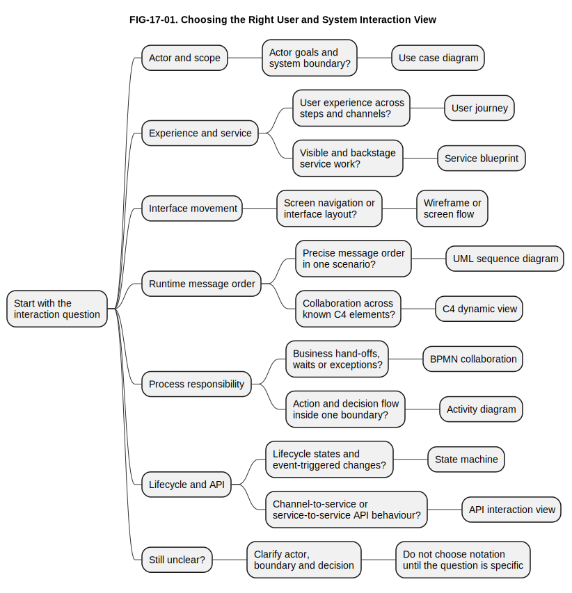

# 17. Modelling User and System Interaction

## Chapter purpose

Help beginner and practising architects choose the right interaction view when the main concern
is how users, external actors, channels, systems and services interact over time.

## Reader outcomes

By the end of this chapter, the reader should be able to:

- Explain why interaction modelling needs several views rather than one all-purpose diagram.
- Choose between use case diagrams, user journeys, service blueprints, wireframes, screen
  flows, sequence diagrams, C4 dynamic views, BPMN collaborations, activity diagrams, state
  machines and application programming interface (API) interaction views.
- Distinguish user experience, business process, software runtime collaboration and object
  lifecycle questions.
- Use the Simple Online Store and Horizon Bank examples to select a useful first interaction
  view.
- Review an interaction view for actor clarity, boundary, sequence, channel, responsibility,
  state, abstraction and common misuse.

## Prerequisites and dependencies

- Chapter 4: UML: Unified Modeling Language
- Chapter 5: The C4 Model
- Chapter 6: BPMN: Business Process Model and Notation
- Chapter 15: Modelling Business Processes
- Chapter 16: Modelling Software Structure

## Required models and artefacts

This chapter uses one original selection-guide figure and one manuscript selection table:

- FIG-17-01: Choosing the Right User and System Interaction View.
- User and system interaction view selection table.

The chapter also refers to earlier Unified Modeling Language (UML), C4 and Business Process
Model and Notation (BPMN) material, but it does not re-teach those notations.

## Worked examples

- Simple Online Store customer return and checkout interaction choices.
- Horizon Bank digital onboarding and payment interaction choices.

## Source requirements

- `[OMG-UML]` supports UML use case, sequence, activity and state machine terminology reused
  from Chapter 4.
- `[C4-OFFICIAL]` supports the C4 dynamic view framing reused from Chapter 5.
- `[OMG-BPMN]` supports BPMN collaboration terminology reused from Chapter 6.
- User journey, service blueprint, wireframe, screen flow and API interaction guidance is the
  author's practical interpretation for beginner architecture work.
- Existing source notes are sufficient for this chapter; no new source note is required.

## From software structure to interaction over time

Chapter 16 showed how software is structurally arranged. It separated system landscapes, system
context views, containers, components, packages, classes, dependencies and deployment views.
That structural discipline is essential, but it does not answer a different question: what
happens when a person, channel, system or service actually interacts with that structure?

Chapter 17 answers that interaction question. It looks at actor goals, user journeys, service
hand-offs, screen movement, message order, runtime collaboration, process responsibility, state
change and API behaviour. These are related, but they are not the same view.

The distinction matters because teams often draw one diagram and expect it to explain
everything. A use case diagram can show actor goals, but it cannot show the customer's emotional
journey. A user journey can show pain points, but it is not a precise software message sequence.
A sequence diagram can show message order, but it is not a business process model. A state
machine can show lifecycle rules, but it is not a screen flow.

The practical skill is to choose the smallest interaction view that answers the current question
without misleading the audience.

## Why interaction modelling needs more than one view

Interaction is a broad word. It may mean a customer trying to return a product, a support agent
moving through screens, a mobile channel calling an API, a bank process waiting for screening
evidence, or a payment instruction moving through states. Each of those concerns has a different
audience and a different level of precision.

For a product owner, the useful question may be: where does the user become confused or wait too
long? A user journey or service blueprint is more useful than a UML sequence diagram. For a
solution architect, the question may be: which systems collaborate when a payment is submitted?
A C4 dynamic view or UML sequence diagram is more useful. For a process analyst, the question
may be: which participant owns the hand-off and what happens when a response is late? A BPMN
collaboration is more useful.

The view must match the decision. Do not choose a notation because it is familiar. Choose it
because it answers the interaction question at the right boundary.

## Start with the interaction question

Before drawing, write the question in plain language. The question should name the actor, the
boundary and the decision.

Examples:

- What goals does the Customer need the Online Store to support?
- Where does the return journey become confusing or slow?
- Which screens does the Customer Support Agent move through while handling a return?
- What messages are sent when a payment is submitted?
- Which runtime elements collaborate in the target payment architecture?
- Which participant owns each hand-off during onboarding?
- What states can a return request or payment instruction enter?
- Which channel calls which API, and what response or event follows?

The wording usually points to the view. Goals and boundary point to a use case diagram.
Experience across steps points to a user journey or service blueprint. Screen navigation points
to a wireframe or screen flow. Message order points to a sequence diagram. Runtime collaboration
across C4 elements points to a C4 dynamic view. Business role hand-offs point to BPMN. Lifecycle
rules point to a state machine. Channel-to-service behaviour points to an API interaction view.

## Actor goals and system boundary

A use case diagram answers: **who interacts with the subject, and what goals do they pursue?**

Use it when the team needs to agree scope before discussing screens, processes, APIs or
implementation. UML use case diagrams show actors outside a subject boundary and use cases
inside the boundary [OMG-UML]. At architecture level, the value is boundary clarity: which goals
belong to the system, and which actors or external systems interact with it?

For the Simple Online Store, a returns use case view can show Customer, Customer Support Agent,
Payment Provider System and Delivery Partner System. The goals may include Request return, Check
return eligibility, Request refund and Arrange collection. This view does not show the order of
the return process or the screens used by the customer.

For Horizon Bank onboarding, a use case view can show Retail Customer, Relationship Manager,
Compliance Officer and Customer Onboarding Platform. Use cases may include Submit application,
Capture identity evidence, Review screening exception and Open customer profile. This is useful
before the team decides which channel, platform, workflow or case-management tool is involved.

Use case diagrams are weak when teams turn them into screen maps or internal function lists.
`Click submit` is usually a user-interface step, not a user goal. `Validate mandatory fields` is
usually internal system behaviour, not a goal an actor pursues. Keep use cases at goal level.

## User journeys and service blueprints

A user journey answers: **what does the user experience across steps, channels and pain
points?**

A service blueprint answers a related but wider question: **what front-stage and
behind-the-scenes work supports the user's journey?**

These views are useful when the main concern is experience, not notation precision. They help
product owners, service designers, business analysts and architects see where a person moves
between channels, waits for help, repeats information, receives unclear status or depends on
invisible backstage work.

For the Simple Online Store, a return journey might show the Customer discovering the return
policy, starting a return request, uploading evidence, waiting for approval, receiving refund
status and arranging collection. Pain points might include unclear policy wording, missing
delivery status, repeated order details or no refund progress message.

A service blueprint can add what the customer does not see. Behind the return request, the
Online Store checks order status, Customer Support Agent reviews exceptions, Payment Provider
System receives a refund request and Delivery Partner System receives a collection request. The
blueprint can show the line between customer-visible steps and backstage work.

For Horizon Bank onboarding, a user journey can show a Retail Customer starting an application
on Horizon Digital Channels, providing identity evidence, waiting for screening, responding to a
request for more information and receiving the onboarding outcome. A service blueprint can add
Relationship Manager support, operations checks, compliance review, Financial Crime Platform
screening and Party and Customer Platform record creation.

Do not treat a journey map as proof of system design. It is a user-centred view. It may lead to
BPMN, sequence, API, data or screen-flow models later, but it should not pretend to be all of
them.

## Screen flows and wireframes

A wireframe or screen flow answers: **what does the user see, and how does the user move through
visible interface steps?**

Use this view when the interaction concern is navigation, information layout, user input,
validation feedback or the visible sequence of screens. It is useful for product owners, user
experience designers, business analysts, developers and testers.

For the Simple Online Store return request, a screen flow might show Order history, Select item
to return, Return reason, Evidence upload, Review request and Confirmation. A wireframe might
show where the refund estimate, collection option and policy warning appear on a specific
screen. These views help the team review usability before implementation detail is fixed.

For Horizon Bank onboarding, a screen flow might show Start application, Personal details,
Identity evidence, Product selection, Consent, Review and Submit, then Application status. It
can also show staff screens for operations review or compliance exception review. The view
should state whether it is a customer channel flow, a staff operations flow or both.

Do not use wireframes to hide architecture questions. A screen flow can show that a customer
sees `Screening in progress`, but it does not explain which system owns the screening request,
how evidence is retained or what message sequence updates the status. Those are separate
architecture views.

## Sequence diagrams and dynamic views

A UML sequence diagram answers: **in one scenario, which participant sends which message, and in
what order?**

A C4 dynamic view answers: **how selected people, systems, containers or components collaborate
at runtime for one scenario?**

The two views overlap, but they are not identical. A UML sequence diagram is usually more
precise about lifelines, time order, alternatives, optional behaviour and return messages
[OMG-UML]. A C4 dynamic view is often lighter and works well when the team already has C4
context, container or component views [C4-OFFICIAL].

Use a sequence diagram when ordered messages, alternatives and responsibility need precision.
For the Simple Online Store checkout, a sequence diagram might show Customer, Web App, API
Application, Payment Provider System, Order Database and Delivery Partner System. It can show
payment accepted and payment rejected alternatives.

Use a C4 dynamic view when the audience needs a compact runtime collaboration over known C4
elements. For Horizon Bank payment submission, a dynamic view can show Retail Customer, Horizon
Digital Channels, Payments API, Payment Orchestration Service, Financial Crime Platform, Core
Deposit System and Event Platform collaborating for one selected path.

Both views should stay focused. Do not draw every possible path in one sequence diagram. Use
separate views or prose for important alternatives such as screening failure, posting failure,
timeout or retry. If the main concern is human hand-off and process ownership, use BPMN instead.

## BPMN collaboration and activity views

A BPMN collaboration answers: **which participants exchange messages, and how does
responsibility move across a business process?**

A UML activity diagram answers: **what flow of actions and decisions leads to an outcome, often
inside one system or service?**

BPMN collaboration is appropriate when the interaction crosses business roles, organisations,
platforms or process participants and the hand-off matters [OMG-BPMN]. It can show pools, lanes,
message flows, events, gateways, waits and exceptions. This is the right view when the concern
is operational responsibility and process behaviour.

For Horizon Bank onboarding, a BPMN collaboration can show Retail Customer, Horizon Bank and
Financial Crime Platform as participants. Horizon Bank receives an application, requests
screening, waits for a result, routes possible matches to compliance review and sends an
outcome. This is not the same as a sequence diagram. It is about process ownership, waiting,
exception paths and message exchange.

A UML activity diagram is better when the interaction is workflow logic rather than message
exchange. Chapter 4 used a payment validation activity diagram inside the Payments Platform.
That is system behaviour: validate fields, check limits, request screening, decide whether to
continue and publish status. It does not show the full business process or customer journey.

Do not use BPMN only because people are involved. Use it when process ownership, hand-offs,
events or exceptions are the question. Do not use activity diagrams as a lightweight substitute
when BPMN collaboration is the actual concern.

## State-based interaction

A state machine answers: **what states can an object, request or case be in, and which events
move it between states?**

Use a state machine when the interaction changes the lifecycle of something important. The
subject might be an Order, Return Request, Account Application, Payment Instruction, Fraud Case
or Customer Support Case. UML state machines show states and transitions triggered by events or
conditions [OMG-UML].

For the Simple Online Store, a Return Request might move through Requested, Eligibility Review,
Approved, Rejected, Refund Requested, Collection Arranged and Closed. The diagram helps the team
ask which transitions are valid. Can a rejected return be reopened? Can a refund be requested
before collection is arranged? Which states are visible to the customer?

For Horizon Bank, an Account Application might move through Draft, Submitted, Evidence Pending,
Screening Pending, Compliance Review, Approved, Rejected and Customer Created. A Payment
Instruction might move through Received, Validated, Screening Pending, Posting Pending,
Accepted, Failed or Rejected. These states can explain status displays, operations queues,
events and allowed actions.

Do not use a state machine for a simple linear task list. It is useful when the subject can wait
in a state, receive different events, reject invalid transitions or behave differently depending
on its current state.

## API and channel interaction views

An API interaction view answers: **which channel or service calls which API, with what request,
response, event or error behaviour?**

Use this view when the interaction is mainly channel-to-service or service-to-service behaviour.
It may be a small sequence diagram, a C4 dynamic view, an API call table, an event interaction
view or a contract-oriented diagram. The important point is to state the API boundary,
direction, operation, data responsibility and expected response.

For the Simple Online Store, a checkout API interaction view might show Web App calling `POST
/orders`, API Application requesting payment authorisation, storing the order and returning an
order confirmation. For returns, it might show Web App calling `POST /returns`, then the API
Application requesting refund and collection actions from external providers.

For Horizon Bank onboarding, an API interaction view might show Horizon Digital Channels
submitting an application to the Customer Onboarding Platform, the platform requesting screening
from Financial Crime Platform, and later publishing an onboarding-status event. For payments, it
might show Horizon Digital Channels calling the Payments API and receiving a payment status
reference, while the Payments Platform publishes later status events.

This view should not become a full integration chapter. Chapter 18 will go deeper into
synchronous, asynchronous and event-driven integration behaviour. In Chapter 17, the selection
point is narrower: use an API interaction view when the user or channel interaction is best
understood through API calls, responses, errors and status updates.

## How to choose the right interaction view

Use FIG-17-01 as a first filter. Start with the interaction question, then stop at the first
concern that matches the current decision. The figure is deliberately a selection guide, not a
notation lesson.

Figure FIG-17-01. Choosing the right user and system interaction view. It helps an architect
select an interaction view based on the actor, boundary, sequence, channel and level of detail
needed.

The figure does not say that only one view is ever needed. It helps the team choose the first
view. A real change may need several views in sequence: a use case diagram for scope, a user
journey for experience, a BPMN collaboration for operational hand-offs, a sequence diagram for
message order and a state machine for status rules.

Use the table below as the fuller companion to FIG-17-01.

| View | Main question | Best audience | Best time to use | Common mistake |
|---|---|---|---|---|
| Use case diagram | Who interacts with the subject, and what goals are in scope? | Product owners, analysts, architects and stakeholders | Early scope and boundary discussion | Turning user goals into screen clicks or internal functions |
| User journey | What does the user experience across steps and channels? | Product owners, service designers, analysts and architects | When user pain, waiting or channel movement matters | Treating the journey as system design proof |
| Service blueprint | What visible and backstage work supports the user journey? | Service designers, operations, analysts and architects | When front-stage and backstage responsibilities must be connected | Hiding detailed process or system behaviour inside one large map |
| Wireframe or screen flow | What does the user see, and how does the user navigate? | Product owners, user experience teams, developers and testers | Interface design, usability review and acceptance discussion | Using screens to avoid process, API or data ownership questions |
| UML sequence diagram | Which participants send which messages in one scenario? | Architects, developers and testers | When ordered interaction, alternatives and responsibility need precision | Trying to show every possible process path in one diagram |
| C4 dynamic view | How do known C4 elements collaborate at runtime? | Architects, developers and technical reviewers | After context, container or component structure is known | Treating it as a full business-process model |
| BPMN collaboration | Which business participants exchange messages and responsibility? | Analysts, process owners, operations, risk and architects | When hand-offs, waits, events and exceptions matter | Drawing software containers as BPMN pools without explaining why |
| Activity diagram | What flow of actions and decisions occurs inside a boundary? | Architects, developers, analysts and testers | System logic, compact workflow or validation flow | Using it when cross-participant collaboration needs BPMN |
| State machine | What states are valid, and what events change them? | Architects, developers, testers and operations | Lifecycle, status, case and request rules | Modelling task sequence as states |
| API interaction view | Which channel or service calls which API, and what response follows? | Architects, developers, integration teams and testers | Channel-to-service or service-to-service interaction design | Leaving ownership, error behaviour or status update rules implicit |

The table is not a ranking. A user journey is not less architectural than a sequence diagram. A
sequence diagram is not more rigorous than a service blueprint unless the question requires
message-order precision. Good architecture communication uses the right view at the right
moment.

## Worked example: Simple Online Store

The Simple Online Store return process is a useful practice case because the same feature can
require several interaction views.

If the question is "who is involved and what goals are in scope?", use a use case diagram. Show
Customer, Customer Support Agent, Payment Provider System and Delivery Partner System around the
Online Store. Keep the use cases at goal level: Request return, Check return eligibility,
Request refund and Arrange collection.

If the question is "where is the customer experience poor?", use a user journey. Show the
Customer finding the order, starting the return, choosing a reason, uploading evidence, waiting
for approval, receiving refund status and arranging collection. Mark pain points such as
repeated order details or unclear refund timing.

If the question is "what does the customer see?", use a screen flow or wireframe set. Show Order
history, Return request, Return reason, Evidence upload, Review and Confirmation. This helps the
team test navigation and visible feedback before code is written.

If the question is "what messages happen when an eligible return is submitted?", use a sequence
diagram. Show Customer, Web App, API Application, Order Database, Payment Provider System and
Delivery Partner System. Add a small alternative for eligible versus outside policy if it helps.
Do not include every later warehouse, settlement or delivery-provider detail.

If the question is "who owns exception review and collection hand-off?", use BPMN collaboration
or a responsibility view. This is where Customer Support Agent, Online Store, Payment Provider
System and Delivery Partner System responsibilities can be separated. If only the Online Store's
internal eligibility logic is in scope, a UML activity diagram may be enough.

If the question is "what status can a return request show?", use a state machine. States might
include Requested, Evidence Needed, Under Review, Approved, Rejected, Refund Requested,
Collection Arranged and Closed. This helps the team review customer status messages, support
actions and invalid transitions.

The important lesson is that the return feature does not have one correct diagram. It has
several possible interaction questions. The first diagram should match the decision the team
needs to make next.

## Worked example: Horizon Bank

Horizon Bank digital onboarding shows the same selection discipline at banking scale.

If the question is actor scope, start with a use case view. Show Retail Customer, Relationship
Manager, Compliance Officer and Customer Onboarding Platform. Goals may include Submit
application, Capture identity evidence, Review screening exception and Open customer profile.

If the question is experience, use a user journey. Show the Retail Customer starting an
application in Horizon Digital Channels, providing evidence, waiting for screening, responding
to a request for more information and receiving the outcome. If the bank needs to connect
visible and invisible work, extend it into a service blueprint that adds operations, compliance,
screening and party-record creation.

If the question is process hand-off, use BPMN collaboration. The collaboration can show Retail
Customer, Horizon Bank and Financial Crime Platform as participants. It can show that the bank
receives an application, requests screening, waits for a result, routes a possible match to
Compliance Officer and sends the final outcome. That view is better than a sequence diagram when
ownership, waiting and exception paths are central.

If the question is runtime collaboration, use a sequence diagram or C4 dynamic view. A sequence
diagram can show Horizon Digital Channels submitting the application to Customer Onboarding
Platform, the platform requesting screening, receiving the result, creating party and customer
records, and sending notification. A C4 dynamic view may be better if the team already has the
C4 system context and container views from Chapter 16.

If the question is status behaviour, use a state machine. An Account Application might move
through Draft, Submitted, Evidence Pending, Screening Pending, Compliance Review, Approved,
Rejected and Customer Created. That view helps channel teams and operations teams use the same
status language.

For Horizon Bank payments, the selection changes again. A use case view can show payment goals.
A sequence diagram can show one payment submission path. A C4 dynamic view can show
collaboration across Payments API, Payment Orchestration Service, Financial Crime Platform, Core
Deposit System and Event Platform. A state machine can show payment instruction status. A BPMN
collaboration is better when the topic is repair, customer correction, timeout or operations
ownership.

The bank does not need all views for every change. It needs enough views to avoid confusing user
experience, business process, software runtime collaboration and lifecycle rules.

## Common mistakes

The first mistake is using one diagram for every interaction concern. A journey, screen flow,
sequence diagram, BPMN collaboration and state machine answer different questions.

The second mistake is turning use cases into screen clicks. Use cases are actor goals inside a
boundary, not a script of interface actions.

The third mistake is treating a user journey as an architecture design. A journey reveals
experience and pain points, but it does not define system boundaries, API contracts or process
ownership by itself.

The fourth mistake is using a sequence diagram for a whole business process. Sequence diagrams
are strongest for one scenario or a small set of alternatives. BPMN is usually better for
business hand-offs, waits and exceptions.

The fifth mistake is using BPMN to show software structure. A BPMN pool is a process
participant, not automatically a C4 container or deployable service.

The sixth mistake is modelling every task as a state. A state is a meaningful lifecycle
condition where rules apply. It is not merely the next action in a flow.

The seventh mistake is hiding API error and status behaviour. For channel interactions, the
failure path and later status update are often more important than the first successful
response.

The eighth mistake is mixing user experience, process responsibility, runtime messages and
infrastructure placement in one view without stating the reason.

## Review checklist

- [ ] The interaction question is explicit before the view is selected.
- [ ] The actor, user, channel, system or service boundary is clear.
- [ ] User experience, business process, software runtime collaboration and lifecycle state are
      not conflated.
- [ ] Use cases describe actor goals, not screen clicks or internal functions.
- [ ] User journeys and service blueprints identify steps, channels, pain points and backstage
      work without pretending to be full system designs.
- [ ] Wireframes and screen flows focus on visible interface movement and feedback.
- [ ] Sequence diagrams and C4 dynamic views stay focused on one scenario or selected
      interaction path.
- [ ] BPMN collaboration is used when process participants, hand-offs, waits and exceptions
      matter.
- [ ] Activity diagrams are limited to action and decision flow inside a clear boundary.
- [ ] State machines use meaningful states and event-triggered transitions.
- [ ] API interaction views show direction, ownership, request, response, error or status
      behaviour.
- [ ] The Simple Online Store and Horizon Bank examples use controlled names from the
      repository.
- [ ] Source keys are registered and no unsupported standard wording is copied.

## Key takeaways

- Interaction modelling is a family of views, not one universal diagram.
- Start with the interaction question, then choose the boundary, audience and level of detail.
- Use case diagrams are good for actor goals and system scope.
- User journeys and service blueprints are good for experience, channels, pain points and
  backstage work.
- Wireframes and screen flows are good for visible interface navigation.
- UML sequence diagrams and C4 dynamic views are good for runtime message order and
  collaboration.
- BPMN collaboration is good for business hand-offs, waits, messages and exceptions.
- State machines are good when an object, request or case has meaningful lifecycle states.
- API interaction views are useful when channel-to-service or service-to-service behaviour is
  the main concern.

## Practical exercise

Horizon Bank is improving digital onboarding. A Retail Customer starts an application through
Horizon Digital Channels, provides identity evidence, waits for screening, may be asked for more
information and then receives an outcome. The bank also needs to show which systems collaborate
and which application statuses are valid.

Choose the first view for each question:

1. Which actors and goals are inside the Customer Onboarding Platform scope?
2. Where does the Retail Customer experience waiting, rework or unclear status?
3. Which customer screens are needed from start application to final outcome?
4. Which participants exchange messages during onboarding and possible screening review?
5. Which systems and services collaborate when an application is submitted?
6. Which statuses can an account application enter, and what events move it between them?
7. Which API call submits the application, and what response or later status update should the
   channel expect?

Suggested answer:

- Use a use case diagram for actor goals and platform scope.
- Use a user journey for customer experience, waiting and pain points.
- Use a screen flow or wireframes for visible channel navigation.
- Use a BPMN collaboration for participant hand-offs, waits and screening review.
- Use a UML sequence diagram or C4 dynamic view for runtime system collaboration.
- Use a state machine for account-application lifecycle states and transitions.
- Use an API interaction view for request, response, error and later status update behaviour.

Good review criteria are: each selected view answers the stated question; the view does not mix
user experience, process responsibility, runtime message order and state lifecycle without
explanation; and every important boundary is named.

## References and further reading

Chapter source notes are maintained in the repository under `research/uml/`, `research/c4/` and
`research/bpmn/`, and registered in `SOURCE_REGISTER.md`. Appendix H, [Glossary and Source
Notes](../appendices/appendix-h-glossary-sources.md), is the intended publication location for
the final source-key index.

- `[OMG-UML]`: Object Management Group, Unified Modeling Language specification, version 2.5.1.
- `[C4-OFFICIAL]`: Official C4 model documentation.
- `[OMG-BPMN]`: Object Management Group BPMN 2.0.2 specification.
