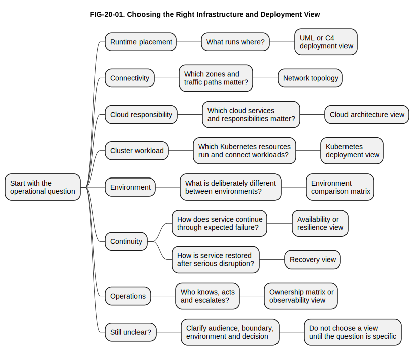

# 20. Modelling Infrastructure and Deployment

## Chapter purpose

Help readers select and combine views for runtime placement, network topology, cloud
services, Kubernetes, environments, availability, recovery and operational ownership.

## Reader outcomes

By the end of this chapter, the reader should be able to:

- explain what each infrastructure and deployment view answers in plain language;
- distinguish logical runtime placement from physical implementation detail;
- select an appropriate view for cloud, network, Kubernetes, environment, availability,
  recovery or ownership questions;
- combine focused views without mixing application, process, security and infrastructure
  concerns unnecessarily; and
- review infrastructure and deployment models critically using the Simple Online Store
  and Horizon Bank examples.

## Prerequisites and dependencies

- Chapter 11: Infrastructure and Deployment Modelling
- Chapter 19: Modelling Data Architecture
- Chapter 21: Modelling Security Architecture follows this chapter and adds trust,
  threat and control concerns.

## Required models and artefacts

- `FIG-20-01`: Choosing the Right Infrastructure and Deployment View, specification,
  PlantUML source and Scalable Vector Graphics (SVG) export completed and reviewed.

## Worked examples

- Simple Online Store production readiness.
- Horizon Bank payment recovery design.

## Source requirements

- The Object Management Group (OMG) source `[OMG-UML]` supports Unified Modeling
  Language (UML) deployment terminology.
- `[C4-OFFICIAL]` supports C4 deployment-diagram framing.
- National Institute of Standards and Technology (NIST) Special Publication 800-145,
  recorded as `[NIST-SP-800-145]`, supports cloud service and deployment-model
  terminology.
- `[KUBERNETES-DOCS-2026]` supports Kubernetes object terminology.
- Amazon Web Services (AWS) guidance, recorded as `[AWS-WA-RELIABILITY-2026]`, supports
  cloud reliability concerns and is used as vendor-specific guidance rather than a
  universal standard.
- `[NIST-SP-800-34R1]` is historical official guidance used informatively for recovery
  terminology and planning.
- `[OPENTELEMETRY-DOCS-2026]` supports observability terminology.

## Start with the operational question

An infrastructure model is useful when it helps somebody make or review an operational
decision. It should answer a question such as:

- Where does each runnable part of the solution execute?
- Which network zones and traffic paths are required?
- Which cloud services and responsibility boundaries matter?
- How are workloads represented on Kubernetes?
- What differs between development, test and production?
- How does the service remain available during ordinary failures?
- How is service recovered after a serious disruption?
- Who monitors, operates and restores each important dependency?

These questions are related, but one diagram rarely answers all of them well. Start with
the decision, audience, boundary and abstraction level. Then select the smallest view
that exposes the evidence needed for that decision.

Chapter 11 explains the modelling techniques and terminology. This chapter concentrates
on selection. It also keeps infrastructure concerns separate from process flow, software
structure, data structure and security analysis. Links between focused views are useful.
A single mixed diagram is useful only when the cross-cutting relationship is itself the
question.

## Runtime nodes

A runtime placement view answers: **what runs where, and which runtime dependencies
matter?**

Begin with a logical deployment view when the hosting technology is undecided or
unimportant. Show responsibilities such as an edge endpoint, application runtime,
background worker, database runtime and external provider. This helps architects,
developers and application owners agree placement and dependency boundaries without
prematurely choosing regions, subnets or products.

Use a physical deployment view when implementation or operations needs concrete
placement. It may show regions, availability zones, clusters, node pools, virtual
machines, managed services and deployed artefacts. State the environment and date because
physical deployment changes more frequently than logical responsibility.

Choose UML when nodes, execution environments, artefacts and deployment relationships
need formal expression. Choose a C4 deployment diagram when the team already models
software systems and containers with C4 and needs to map those containers onto deployment
nodes. A C4 container means a runnable or deployable unit or data store. It does not mean
a Docker container automatically.

For the Online Store, a logical view might place the web and application programming
interface (API) responsibilities in one application runtime, fulfilment work in a worker
runtime and Order data in a managed database. A later physical view could map those
responsibilities to Kubernetes and a managed database service.

## Network zones

A network topology answers: **which zones are connected, where does traffic cross a
boundary, and which paths are required?**

Use it when network engineers, platform teams or reviewers need to understand ingress,
egress, routing, network segmentation or administrative access. Show relevant zones and
directional paths. Label paths with a purpose or protocol where that information affects
the decision.

A network topology is not a deployment inventory. It may show an application zone and a
data zone without listing every artefact running inside them. It is also not a complete
security model. Chapter 21 adds trust boundaries, threats and controls. If the decision
is about individual firewall rules, use a rule table or configuration evidence alongside
the topology rather than crowding the diagram.

For the Online Store, a topology may show customer Hypertext Transfer Protocol Secure
(HTTPS) traffic entering an edge zone, inspected traffic reaching an application zone,
database traffic reaching a restricted data zone, and controlled outbound calls reaching
the Payment Provider System and Delivery Partner System.

## Cloud services

A cloud architecture view answers: **which cloud services support the workload, where
are they placed, and which responsibilities remain with the organisation?**

Use a vendor-neutral view early when the decision concerns service responsibilities,
portability or a comparison of options. Use official provider names and icons only when
the selected service or provider matters to the decision. A cloud icon does not explain
responsibility by itself. Label what the service does and who configures, monitors,
backs up and recovers it.

NIST distinguishes Infrastructure as a Service (IaaS), Platform as a Service (PaaS) and
Software as a Service (SaaS), and describes public, private, community and hybrid cloud
deployment models [NIST-SP-800-145]. These terms can frame a model, but they do not show
the exact responsibility split for a particular offering. Record that split explicitly.

For Horizon Bank, a hybrid placement view can show Horizon Digital Channels and the
Payments Platform in cloud environments while the Core Deposit System remains in a
retained core-banking environment. The view should expose connectivity and dependency,
not imply that every retained system is one physical server.

## Kubernetes

A Kubernetes view answers: **which Kubernetes resources run and connect the workload?**

Use it when the decision depends on cluster, namespace, routing, workload controller,
replica, service discovery, persistent storage or node placement. Keep Kubernetes words
precise. A Pod is a runtime unit. A Deployment manages declarative updates and normally
manages ReplicaSets. A ReplicaSet maintains the required number of replica Pods. A
Kubernetes Service provides stable network access to endpoints. A StatefulSet supports
workloads that need stable identity or ordered and persistent behaviour
[KUBERNETES-DOCS-2026].

Do not use a Kubernetes view when the audience only needs to know that an API and worker
run on a managed container platform. A logical deployment view is clearer at that level.
Conversely, do not use a box labelled `Kubernetes` when the review question concerns
replica placement, routing or persistent storage. Show the objects material to the
decision and omit manifest fields that belong in configuration.

## Environment differences

An environment view answers: **what is deliberately the same or different across
development, test, production and recovery environments?**

A comparison matrix is often better than a picture. Rows can cover deployed artefact,
configuration source, data class, scale, external dependency, network exposure,
observability, backup, recovery and owner. Columns can represent the environments.

Promote an immutable artefact between environments where practical. An immutable
artefact is built once and promoted unchanged; environment-specific settings and secrets
are supplied separately. The architecture model should not expose secret values.

Differences are not automatically defects. Production may have more replicas, stricter
access, real provider connections and stronger recovery arrangements. A test environment
may use synthetic data and provider simulators. Record why each material difference
exists and what risk it creates for testing or release confidence.

## Availability

An availability view answers: **how does the service continue through expected component
or dependency failures?**

Show failure domains, redundant instances, traffic distribution, health detection,
dependency behaviour and degraded modes. State assumptions such as service hours,
expected demand and dependency availability. Two identical boxes do not prove
availability if both share one database, network path or operational failure mode.

Capacity belongs in the discussion where overload can cause unavailability. Name the
expected peak, headroom, bottleneck and scaling signal. Autoscaling application replicas
does not solve a database connection limit, queue backlog or provider rate limit.

AWS reliability guidance is useful practical input for failure management, monitoring,
capacity and change, but a vendor-neutral architecture should treat it as guidance from
one cloud provider rather than a universal notation or guarantee
[AWS-WA-RELIABILITY-2026].

## Recovery

A recovery view answers: **how will the service be restored after serious disruption,
within what objectives, and by whom?**

Define Recovery Time Objective (RTO) as the target maximum time to restore service.
Define Recovery Point Objective (RPO) as the target maximum acceptable data loss measured
as time. They are objectives, not promises produced by drawing duplicate infrastructure.

A useful recovery view shows the primary and recovery environments, data replication or
backup path, traffic failover, dependencies, activation steps, responsible roles and
failback. If replication is asynchronous, include the possibility of data reconciliation.
A backup is a separate recoverable copy; replication alone is not a backup.

NIST Special Publication 800-34 Revision 1 is historical United States government
guidance that supports contingency-planning terminology and the importance of roles,
testing and maintenance [NIST-SP-800-34R1]. It is used here informatively, not as current
banking regulation.

## Operational ownership

An operational ownership view answers: **who watches, changes, supports and restores each
runtime service and dependency?**

Use an ownership matrix when boxes and arrows would obscure accountability. Record the
service owner, platform owner, monitoring responsibility, incident responder, dependency
contact, backup owner, recovery decision owner and escalation route. Distinguish the role
accountable for a service outcome from a central operations team that monitors several
services.

An observability architecture is a useful companion when the question is how teams know
what the system is doing. It may show instrumentation, traces, metrics, logs, collection,
processing, export, observability backends, dashboards, alerts and routing to an owner
[OPENTELEMETRY-DOCS-2026]. A dashboard without an actionable alert and owner is not an
operating model.

## Choosing the right view

| Architecture question | Start with | Useful elements | Main audience | Common companion |
|---|---|---|---|---|
| What runs where? | UML or C4 deployment view | Runtime nodes, execution environments, artefacts or containers, dependencies | Architects, developers, application owners | Network topology |
| Which network paths matter? | Network topology | Zones, boundaries, directional paths, entry and exit points | Network, platform and security teams | Rule table or trust-boundary view |
| Which cloud services and responsibilities apply? | Cloud architecture view | Regions, services, placement, connectivity, responsibility | Cloud, platform, operations and risk teams | Deployment or resilience view |
| How is the workload represented on Kubernetes? | Kubernetes deployment view | Cluster, namespaces, routing, Services, controllers, Pods and storage | Platform teams and developers | Logical deployment view |
| What differs between environments? | Environment comparison matrix | Artefact, configuration, data, scale, dependencies and controls | Delivery, test, operations and risk teams | Deployment pipeline view |
| How does service continue through expected failure? | Availability or resilience view | Failure domains, redundancy, health, routing, capacity and degraded modes | Service owners, operations, platform and risk teams | Capacity view |
| How is service restored after serious disruption? | Recovery view | RTO, RPO, replication, backup, failover, failback and owners | Service owners, continuity, operations and risk teams | Recovery runbook |
| Who monitors and restores it? | Ownership matrix or observability view | Owners, telemetry flow, alert routing and escalation | Service owners and operations teams | Service catalogue |

Figure `FIG-20-01` gives a compact visual route through these choices. The table remains
the detailed selection aid.

Figure FIG-20-01. Choosing the Right Infrastructure and Deployment View. Start with the
operational question, then choose the first view that exposes the required evidence.
Use separate linked views when several concerns apply.

Accessibility text: A mind map starts with the operational question. Eight branches map
runtime placement to a UML or C4 deployment view; connectivity to a network topology;
cloud responsibility to a cloud architecture view; cluster workloads to a Kubernetes
deployment view; environment differences to a comparison matrix; expected failure to
an availability or resilience view; serious disruption to a recovery view; and
operational action to an ownership matrix or observability view. A final branch tells the
reader to clarify the audience, boundary, environment and decision if the choice remains
unclear.

## Worked example

Horizon Bank is reviewing the recovery design for payment submission. The question is:
**which infrastructure and deployment views will show whether payment submission can be
restored within agreed objectives when the primary cloud region is unavailable?**

The audience includes the Payments Platform service owner, cloud platform team,
operations, business continuity, risk, Core Deposit System owner and payment operations.
The scope starts at the Horizon Digital Channels connection to the Payments Platform and
ends at the platform's critical connections to the Financial Crime Platform, Core Deposit
System and Event Platform. It excludes the detailed customer journey and payment-repair
process.

The primary view is a recovery view. It shows the primary region, warm standby region,
traffic failover, application activation, replicated payment state, backups, retained
Core Deposit System dependency and operational owners. It labels the agreed RTO and RPO
as objectives and identifies where reconciliation may be needed after asynchronous
replication.

Three focused companions answer different questions:

1. A logical deployment view maps Horizon Digital Channels, Payments Platform runtime,
   Financial Crime Platform, Core Deposit System and Event Platform without drowning the
   recovery discussion in cloud-product detail.
2. A network topology shows primary and recovery connectivity to retained bank systems
   and external routes. It makes clear whether failover has a usable network path.
3. An ownership matrix names who declares failover, activates the standby, validates
   payment state, reconciles uncertain instructions, communicates service status and
   approves failback.

An observability view may be added if the review cannot establish how regional failure,
replication lag or stalled payment processing will be detected and routed. A Kubernetes
view is added only if workload scheduling, replica placement or routing resources affect
the recovery decision.

Deliberately omit Business Process Model and Notation (BPMN) process detail, API payload
schemas, database table design,
individual firewall rules and a full threat model. Those belong in linked process,
integration, data and security artefacts. The review should ask whether every critical
dependency is available in recovery, whether the objectives have supporting tests,
whether data can be reconciled, and whether each activation and failback action has an
owner.

## Common mistakes

### Drawing the cloud as one box

Show the services, boundaries and dependencies material to the decision. A cloud label
alone hides placement and responsibility.

### Mixing logical and physical detail silently

Readers cannot tell whether a box is a stable responsibility or a specific instance.
State the level and explain any deliberate mixture.

### Treating Kubernetes as the whole architecture

Clusters still depend on databases, identity, networks, providers, observability and
owners. Keep external dependencies visible.

### Using duplicated boxes as proof of resilience

Show failure domains, health detection, routing, state, capacity, dependency behaviour
and recovery actions. Duplication without independence can preserve the same failure.

### Calling RTO and RPO guarantees

They are objectives. Link them to implementation, procedures, testing and evidence.

### Hiding environment drift

Record material differences and their rationale. Unexplained differences weaken test and
release confidence.

### Omitting operational ownership

Every important alert, backup, dependency and recovery action needs a responsible role
and escalation route.

### Mixing process, application, data, security and infrastructure

Use linked views with stable names and identifiers. Combine concerns only when the
cross-cutting dependency is the stated purpose.

## Chapter cheat sheet

| View | Question answered | Keep out |
|---|---|---|
| Deployment view | What runs where? | Business-process sequence |
| Network topology | Which zones and paths connect? | Complete application decomposition |
| Cloud architecture view | Which cloud services and responsibilities matter? | Unexplained provider icons |
| Kubernetes view | Which cluster resources run and connect workloads? | Every manifest field |
| Environment matrix | What is the same or different? | Secret values |
| Availability view | How does service continue through expected failure? | Unsupported availability claims |
| Recovery view | How is service restored? | Objectives without owners or procedures |
| Ownership or observability view | Who knows, acts and escalates? | Dashboards without action |

## Key takeaways

- Start with the operational question, audience, boundary and abstraction level.
- Use deployment views for runtime placement and topology views for network paths.
- Use cloud and Kubernetes detail only when it affects the decision.
- Record material environment differences and their rationale.
- Availability depends on failure domains, dependencies, capacity, detection and action.
- RTO and RPO are objectives supported by tested recovery arrangements.
- Make monitoring, incident, backup, recovery and failback ownership explicit.
- Prefer linked focused views to one mixed-concern infrastructure picture.

## Practical exercise

The Simple Online Store expects a seasonal sales peak. The team plans to add more API and
worker replicas, but the Order database, payment-provider limit and delivery queue have
not been reviewed. Production runs in one cloud region, while test uses provider
simulators and a smaller database. No role is named for declaring degraded service.

Prepare a short modelling proposal that:

1. states the primary architecture question, audience and scope;
2. selects one primary view and justifies it;
3. selects up to three companion views for placement, topology, capacity, environment
   difference or ownership;
4. identifies at least two bottlenecks or shared failure dependencies;
5. states what operational ownership must be recorded; and
6. states what the proposal deliberately excludes.

A strong response may choose an availability and capacity view as primary because the
immediate decision is whether the whole service, not only API replicas, can handle the
peak. A logical deployment view can expose the database and providers, an environment
matrix can reveal simulator and scale differences, and an ownership matrix can identify
who declares degraded service and contacts providers. Reasonable exclusions include
screen flow, Order table design, detailed payment sequence, individual firewall rules
and Kubernetes manifest fields.

Assess the answer by asking whether it exposes end-to-end bottlenecks, distinguishes test
and production evidence, names measurable signals such as queue depth or database
connections, and assigns action to a role.

## Review checklist

- [ ] The question answered by each view is explicit.
- [ ] The audience, boundary, environment and abstraction level are clear.
- [ ] Logical and physical placement are distinguished.
- [ ] UML, C4, network, cloud and Kubernetes views are selected for their proper concern.
- [ ] Kubernetes terms are used with their project meanings.
- [ ] Cloud services have labelled purpose and responsibility.
- [ ] Material environment differences and risks are recorded.
- [ ] Availability claims expose dependencies, failure domains, capacity and detection.
- [ ] RTO and RPO are objectives linked to recovery actions and evidence.
- [ ] Monitoring, incident, backup, failover, reconciliation and failback ownership is
      explicit where relevant.
- [ ] Process, data, software, security and infrastructure concerns are not mixed without
      a stated reason.
- [ ] Required sources and diagrams are registered or explicitly deferred.
- [ ] Terminology, link, diagram-register and word-count checks pass.

## References and further reading

Chapter source notes are maintained under `research/infrastructure/` and registered in
`SOURCE_REGISTER.md`. Appendix H, [Glossary and Source Notes](../appendices/appendix-h-glossary-sources.md),
is the intended publication location for the final source-key index once completed.

- `[OMG-UML]`: Object Management Group, UML specification, version 2.5.1.
- `[C4-OFFICIAL]`: official C4 model documentation.
- `[NIST-SP-800-145]`: NIST definition of cloud computing.
- `[KUBERNETES-DOCS-2026]`: Kubernetes official documentation.
- `[AWS-WA-RELIABILITY-2026]`: AWS Well-Architected Reliability Pillar.
- `[NIST-SP-800-34R1]`: historical NIST contingency-planning guidance.
- `[OPENTELEMETRY-DOCS-2026]`: OpenTelemetry official documentation.
- `[INFRA-DIAGRAM-TOOL-GUIDANCE-2026]`: infrastructure diagram tooling guidance.
