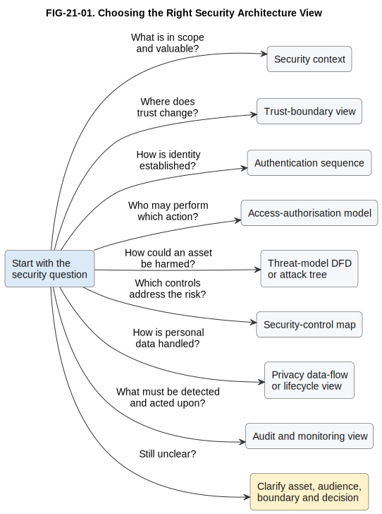

# 21. Modelling Security Architecture

## Chapter purpose

Help readers select and combine views for security context, trust, identity, threats,
controls, privacy, audit and monitoring without turning one diagram into a security
product inventory.

## Reader outcomes

By the end of this chapter, the reader should be able to:

- explain the question answered by each security view;
- distinguish authentication, access authorisation and business approval;
- select views for trust boundaries, threats, controls, privacy and monitoring;
- connect threats and controls to assets, flows, owners and evidence; and
- review a small, coherent security model set for the Simple Online Store or Horizon
  Bank.

## Prerequisites and dependencies

- Chapter 12: Security Modelling introduces the techniques used here.
- Chapter 20: Modelling Infrastructure and Deployment separates placement and network
  concerns from security analysis.
- Chapter 22: Modelling Transformation and Migration follows this chapter and addresses
  change between architecture states.

## Required models and artefacts

- `FIG-21-01`: Choosing the Right Security Architecture View, specification, PlantUML
  source, Scalable Vector Graphics (SVG) export and Portable Network Graphics (PNG)
  review preview completed.

## Worked examples

- Simple Online Store support-access exercise.
- Horizon Bank payment-release security review.

## Source requirements

The chapter reuses the registered security sources from Chapter 12. National Institute
of Standards and Technology (NIST) guidance supports risk, zero-trust, control and
privacy framing. Open Worldwide Application Security Project (OWASP) guidance supports
threat modelling and verifiable application-security concerns. Microsoft documentation
supports the STRIDE threat categories. These sources inform selection and review; they
do not prescribe one mandatory diagram set.

## Start with the security question

Security architecture modelling makes protection assumptions visible so that people can
challenge them. A useful view answers a question such as:

- What valuable asset or outcome is in scope?
- Where does information cross into a different trust context?
- How is an identity established?
- Where is permission decided and enforced?
- How could an asset be harmed?
- Which control reduces which threat, and what evidence shows it operates?
- What security-relevant activity must be recorded and acted upon?

These questions are connected, but they are not interchangeable. A network diagram can
show zones while hiding identity decisions. An authentication sequence can show login
while saying nothing about what the authenticated person may do. A control catalogue can
name safeguards while hiding where they apply.

State the audience, scope, assets, assumptions and decision before choosing a view.
Chapter 12 teaches the notation and techniques. This chapter concentrates on selecting
the smallest useful view and linking it to companion evidence.

## Security context

A security context view answers: **what is being protected, from whom, across which
boundary and with which important dependencies?**

Use it early with architects, security reviewers, service owners and risk specialists.
Show the system in scope, external actors and systems, important information or service
assets, entry points and major trust contexts. Record assumptions, exclusions and the
consequence of failure. A context view creates a shared frame for deeper analysis. It is
not proof that the design is secure.

For the Online Store, the context includes the Customer, Customer Support Agent, Online
Store, Payment Provider System and Delivery Partner System. Assets include customer
accounts, Orders and payment-related information. The view should distinguish the
store's responsibility from external-provider responsibilities.

Choose a C4 system context or a simple security context when the main question is scope
and external dependency. Add a data-flow or trust-boundary view when movement and trust
changes matter. Do not add every server or control product to the context.

## Trust boundaries

A trust-boundary view answers: **where does data or control pass between contexts that
have different trust assumptions?**

A trust boundary is not decorative grouping. It marks a change in the basis on which an
actor, component, device, network or organisation is trusted. The change may concern
identity strength, administrative ownership, data sensitivity, device posture or
external-party responsibility.

Show directional flows across the boundary and label what crosses. Then ask what must be
authenticated, authorised, validated, protected or recorded at the crossing. NIST zero
trust guidance warns against granting implicit trust solely because of network location
[NIST-SP-800-207]. Therefore, an internal network edge can be relevant without being the
only trust decision.

Use a network topology when routing and connectivity are the question. Use a
trust-boundary view when the question is why a crossing changes security treatment. A
threat-model data-flow diagram (DFD) often combines flows, processes, data stores,
external entities and trust boundaries for systematic review.

## Authentication

An authentication sequence answers: **how is the claimed identity of a person, service
or device established, and how is that identity carried into later interactions?**

Use a Unified Modeling Language (UML) sequence diagram when order, participants,
credentials, challenges, tokens, sessions, failure paths or timeouts matter. Show the
identity provider, relying application and enforcement point where relevant. Label
messages by purpose without including real secrets.

Authentication does not decide every permitted action. It establishes or proves an
identity. Session handling preserves an authenticated context across interactions.
Access authorisation decides whether that subject may perform an action on a resource.
OWASP Application Security Verification Standard (ASVS) 5.0.0 provides verifiable
application-security requirements, including identity, authentication and access-control
concerns [OWASP-ASVS-5.0.0]. A model should link to applicable requirements and evidence
rather than copy the requirements table.

For the Online Store, an authentication sequence may show a Customer submitting a login
request, the Online Store relying on an identity service, a failed and successful result,
and creation of a protected session. It should not imply that login alone permits access
to any Order.

## Authorisation

An access-authorisation model answers: **who may do what to which resource, under which
conditions, and where is the decision enforced?**

A compact subject-action-resource-condition table is often clearer than a diagram. A
structural view helps when the architecture question concerns the policy decision point,
which evaluates policy, and the policy enforcement point, which applies the result.
Show identity and attribute sources when they affect the decision.

Keep three meanings separate:

- **Access authorisation** decides whether a user, service or device may act on a
  resource.
- **Business approval** records a business decision, such as a second person approving
  a high-value payment.
- **Payment-provider authorisation** is a transaction decision made by a payment
  provider or network.

One activity may require all three. For Horizon Bank, the Retail Customer may be
authenticated, access-authorised to submit from an owned account and still require a
separate business or risk decision before release. Model decision and enforcement
separately when bypass or inconsistent enforcement is a concern.

## Threats

A threat model answers: **how could a threat cause harm to an asset or security
objective, and which mitigations or open questions follow?**

Start with assets, objectives, flows, boundaries and assumptions. Then choose a form:

- Use a threat-model DFD when reviewers need to inspect processes, data stores, external
  entities, flows and trust boundaries [OWASP-THREAT-MODELLING-2026].
- Use an attack tree when the question is how alternative or combined paths could reach
  one harmful goal. `OR` branches are alternatives; `AND` branches require combined
  steps [SCHNEIER-ATTACK-TREES-1999].
- Use a threat register when ownership, likelihood, impact, mitigation and residual risk
  need structured tracking.

STRIDE is a mnemonic for Spoofing, Tampering, Repudiation, Information Disclosure,
Denial of Service and Elevation of Privilege [MICROSOFT-STRIDE-2026]. Use it as a prompt
to inspect model elements and flows. It is not a complete security architecture, risk
assessment or penetration test.

A safe architecture model describes threat scenarios at the level needed for design and
review. It need not provide exploit instructions. Link each material scenario to an
asset, consequence, affected flow or boundary, mitigation, owner and residual question.

## Control mapping and privacy

A security-control map answers: **which safeguard addresses which security objective or
threat, where is it implemented, who owns it and what evidence supports review?**

A matrix is usually effective. Rows can represent threats or objectives, while columns
record control intent, implementation location, owner, verification case, evidence and
residual risk. NIST Special Publication 800-53 Revision 5 supplies a broad catalogue of
security and privacy controls, but it is not itself an architecture diagram or a
universal baseline [NIST-SP-800-53R5]. NIST Cybersecurity Framework 2.0 can frame wider
risk outcomes and responsibilities [NIST-CSF-2.0]. Applicability remains an
organisational decision.

Avoid a line from one threat to a box labelled `encryption` with no explanation. State
which data is protected, at which point, against which scenario, who manages the
relevant mechanism and what evidence will be reviewed.

Privacy needs a related but distinct view. A privacy data-flow or lifecycle view asks
why personal data is collected, who accesses it, where it is shared, how long it is
retained and whether it can be minimised. Data classification helps, but privacy risk
can arise from processing even when confidentiality controls operate as designed
[NIST-PRIVACY-FRAMEWORK-1.0].

## Audit and monitoring

An audit and security-monitoring view answers: **which security-relevant events are
produced, protected, correlated, reviewed and acted upon?**

Show event sources, collection, protected transport, processing, storage, alert rules,
response owner and retention requirements. Distinguish an audit record used for
accountability from operational telemetry used to understand service behaviour, even
when both share a platform.

For payment release, relevant events might include identity verification, access-policy
decisions, business approval, payment state change and administrative configuration
change. The view should identify who receives an actionable alert and what evidence is
retained. Do not place passwords, tokens or unnecessary personal data in logs. A
dashboard alone is not a monitoring and response design.

## Choosing the right view

| Security question | Start with | Useful elements | Main audience | Common companion |
|---|---|---|---|---|
| What is in scope and valuable? | Security context | Actors, systems, assets, entry points, assumptions and consequences | Architects, service owners, security and risk teams | Asset or data classification register |
| Where does trust change? | Trust-boundary view | Trust contexts, directional crossings, data and trust assumptions | Security, architecture, platform and integration teams | Network topology or threat-model DFD |
| How is identity established? | Authentication sequence | Participants, messages, challenges, tokens, sessions and failures | Identity teams, developers, testers and security reviewers | Session or requirement table |
| Who may perform an action? | Access-authorisation model | Subject, action, resource, condition, decision and enforcement points | Application owners, identity teams, developers and auditors | Policy table |
| How could an asset be harmed? | Threat-model DFD, attack tree or threat register | Assets, flows, boundaries, scenarios, consequences and mitigations | Security, architecture, risk and delivery teams | Control map |
| Which controls address the risk? | Security-control map | Objective, threat, intent, location, owner, evidence and residual risk | Control owners, security, risk and audit teams | Verification plan |
| How is personal data handled? | Privacy data-flow or lifecycle view | Purpose, collection, access, sharing, retention and minimisation | Privacy, data, security and service owners | Data classification and lineage views |
| What must be detected and acted upon? | Audit and monitoring view | Event source, collection, storage, alert, response owner and retention | Operations, security operations, audit and service owners | Incident-response procedure |

Figure `FIG-21-01` provides a compact first filter. The table provides the detail needed
to choose an audience and companion evidence.

Figure FIG-21-01. Choosing the Right Security Architecture View. Begin with the security
question and choose the first focused view that exposes reviewable evidence. Link views
through stable asset, flow, threat and control identifiers when several questions apply.

Accessibility text: A left-to-right decision guide begins with a security question.
Eight labelled arrows point to first-choice views: scope and assets to security context;
trust change to trust-boundary view; identity establishment to authentication sequence;
permission to access-authorisation model; harm paths to threat-model DFD or attack tree;
mitigation traceability to security-control map; personal-data handling to privacy
data-flow or lifecycle view; and detection and response to audit and monitoring view. A
final reminder says to clarify the asset, audience, boundary and decision if the question
is still unclear.

## Worked example: Horizon Bank payment release

Horizon Bank is reviewing the release of a high-value payment. The question is: **which
views will show whether an authenticated customer request can be released only after the
required access decision, screening and approval, with reviewable evidence?**

The audience includes the Payments Platform owner, Horizon Digital Channels team,
Financial Crime Platform owner, Compliance Officer, Operations Analyst, identity team,
security architect, auditor and risk reviewer. The scope starts when Horizon Digital
Channels submits a payment instruction and ends when the Payments Platform records a
release or rejection. The Core Deposit System and Financial Crime Platform are external
dependencies within this review boundary.

The team selects four linked views:

1. A security context names the payment instruction, customer account, approval record
   and audit record as assets. It shows the main systems and organisational owners.
2. An authentication and access-authorisation sequence shows how customer identity is
   established, how ownership and action are checked, where policy is decided and where
   it is enforced. It marks business approval and financial-crime screening as separate
   decisions.
3. A threat-model DFD shows the instruction and status flows across channel, platform and
   external-system trust boundaries. STRIDE prompts help identify scenarios such as a
   spoofed service identity, tampered instruction, missing evidence or unavailable
   screening dependency.
4. A control map links each material threat to validation, access enforcement, approval,
   integrity protection, monitoring and recovery controls. It records owner, verification
   evidence and residual questions.

Stable identifiers connect the views. For example, asset `A-PAYMENT-INSTRUCTION`, flow
`F-SUBMIT`, threat `T-TAMPER-INSTRUCTION` and control `C-INTEGRITY-VERIFY` appear in the
relevant models and review record. This traceability is more useful than squeezing every
element into one picture.

The model set deliberately omits detailed network routes, cryptographic configuration,
provider-specific products, scoring logic and operational procedures. Those belong in
focused design, configuration or runbook artefacts. The architecture review records them
as dependencies where they affect the decision.

## Common mistakes

### Starting with products

Boxes labelled firewall, vault or security information and event management do not
explain the asset, threat or control intent. Start with the decision and protection need.

### Treating every network edge as the trust model

Network zones matter, but identity, ownership, device posture and external-party
responsibility can change trust independently of location.

### Confusing authentication and authorisation

Successful login does not grant every action. Show permission decision and enforcement,
and keep business approval separate.

### Listing threats without context

A STRIDE checklist with no asset, flow, consequence, mitigation or owner is difficult to
act upon. Tie scenarios to model elements and decisions.

### Claiming that controls remove all risk

Controls reduce likelihood, impact or exposure. Record assumptions, verification
evidence and residual risk instead of drawing a false guarantee.

### Mixing security detail into every architecture view

Security is cross-cutting, but that does not require one unreadable picture. Use linked
views with stable identifiers and consistent scope.

### Relying on colour or confidential detail

Use labels as well as colour for classifications and trust contexts. Do not publish real
secrets, sensitive weaknesses or personal data in architecture diagrams.

## Key takeaways

- Start with an asset, security question, audience and boundary.
- Use a security context for scope and a trust-boundary view for changes in trust basis.
- Authentication establishes identity; access authorisation permits an action; business
  approval is a separate business decision.
- Choose threat-model DFDs for flows and boundaries, attack trees for paths to one harmful
  goal, and registers for ownership and tracking.
- Map controls to objectives or threats, implementation locations, owners and evidence.
- Model privacy purpose, sharing, retention and minimisation, not only classification.
- Link focused views with stable identifiers instead of creating one overloaded diagram.

## Practical exercise: secure Online Store support access

The Online Store plans to let a Customer Support Agent view limited customer and Order
information for an active support case. This is different from the Horizon Bank payment
release example.

Select two or three security views that would support design review. For each view, state
its question, audience, scope and companion evidence. Include at least one privacy or
monitoring concern.

A strong response might use:

- a security context to identify Customer, Customer Support Agent, Online Store, Customer
  and Order information, the active case and external dependencies;
- an access-authorisation model to show subject, permitted fields, action, active-case
  condition, decision source and enforcement point; and
- an audit and privacy view to show purpose, viewed fields, access event, retention,
  alerting and responsible owner.

Review the answer by asking whether it distinguishes authentication from permission,
minimises exposed data, records exceptional access, names enforcement and ownership,
and avoids unnecessary implementation detail. A threat-model DFD is also valid if the
chosen question concerns flows and trust boundaries.

## Review checklist

- [ ] The asset, question, audience, scope and abstraction level are explicit.
- [ ] Authentication, access authorisation, business approval and payment-provider
  authorisation are not confused.
- [ ] Trust boundaries represent a change in trust basis and crossings are directional.
- [ ] Threats link to assets, flows, boundaries, consequences, mitigations and owners.
- [ ] STRIDE is used as a prompt rather than presented as a complete architecture.
- [ ] Controls record intent, implementation location, owner, evidence and residual risk.
- [ ] Privacy covers purpose, access, sharing, retention and minimisation.
- [ ] Audit and monitoring show action ownership, not only event storage.
- [ ] Colour is not the only carrier of meaning and sensitive detail is excluded.
- [ ] The worked example and exercise use stable repository names.
- [ ] Required sources, diagram assets and reviews are registered.

## References and further reading

Source notes are maintained under `research/security/` and registered in
`SOURCE_REGISTER.md`.

- `[NIST-CSF-2.0]`: NIST Cybersecurity Framework 2.0.
- `[NIST-SP-800-207]`: NIST Special Publication 800-207, Zero Trust Architecture.
- `[NIST-SP-800-53R5]`: NIST Special Publication 800-53 Revision 5.
- `[NIST-PRIVACY-FRAMEWORK-1.0]`: NIST Privacy Framework 1.0.
- `[OWASP-THREAT-MODELLING-2026]`: OWASP threat-modelling guidance.
- `[OWASP-ASVS-5.0.0]`: OWASP Application Security Verification Standard 5.0.0.
- `[MICROSOFT-STRIDE-2026]`: Microsoft STRIDE threat-category documentation.
- `[SCHNEIER-ATTACK-TREES-1999]`: Bruce Schneier, Attack Trees.
