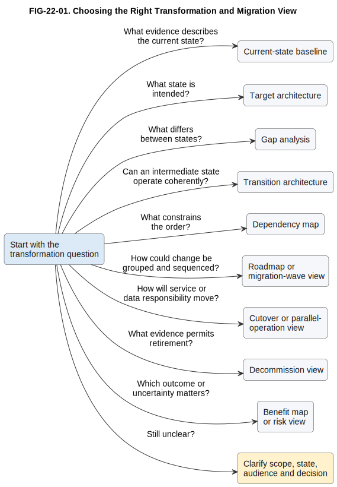

# 22. Modelling Transformation and Migration

## Chapter purpose

Help readers choose and combine views that explain where an architecture is now, where it might go, which intermediate states are viable, and what dependencies, risks and evidence influence the route.

## Reader outcomes

By the end of this chapter, the reader should be able to:

- distinguish current, transition and target architecture states;
- select views for gaps, roadmaps, dependencies, migration waves, cutover, decommissioning, benefits and risks;
- show uncertainty without presenting an architecture roadmap as a guaranteed delivery commitment;
- connect change items to owners, evidence and review points; and
- review a coherent transformation model set for the Simple Online Store or Horizon Bank.

## Prerequisites and dependencies

- Chapter 7: ArchiMate introduces implementation and migration concepts.
- Chapter 13: Other Useful Modelling Approaches introduces roadmaps, landscapes and heat maps.
- Chapter 21: Modelling Security Architecture precedes this chapter.
- Chapter 23: Modelling Decisions and Business Rules follows this chapter.
- Chapter 30: Change and Migration will apply these views during the architecture lifecycle.

## Required models and artefacts

- `FIG-22-01`: Choosing the Right Transformation and Migration View, specification, PlantUML source, Scalable Vector Graphics (SVG) export and Portable Network Graphics (PNG) review preview completed.

## Worked examples

- Horizon Bank payment modernisation model set.
- Simple Online Store fulfilment migration exercise.

## Source requirements

The chapter reuses the registered ArchiMate 4 source for formal implementation and migration concepts. The focused source note under `research/transformation/` records the practical interpretation used here. Roadmaps, dependency maps, wave plans, cutover views and benefit maps are presented as architecture viewpoints or local planning conventions unless a named notation is stated.

## Start with the change question

Transformation modelling makes a proposed journey reviewable. It should reveal what exists, what is intended, what must change, which intermediate arrangements can operate safely, and what evidence would justify continuing. A useful model answers one question clearly:

- What exists now and why is it difficult?
- What outcome and architecture are sought?
- What is different between the two?
- Which intermediate state can operate coherently?
- What must happen before something else can change?
- How could change be grouped into manageable waves?
- How will services and data move during cutover?
- What can be retired, and what proves retirement is safe?
- Which benefit or risk should influence sequencing?

These questions need linked views, not one overloaded diagram. State the audience, scope, effective date, assumptions and decision before drawing. Label states as current, transition, target or option. A target describes an intended direction under stated assumptions. It is not a promise that delivery, benefit or date is guaranteed.

## Current-state baseline

A current-state baseline answers: **what relevant architecture exists now, and which constraints must a change plan respect?**

Use a focused landscape, process, data, deployment or capability view depending on the concern. Add ownership, lifecycle status, known pain points and evidence date. The baseline should be sufficiently accurate for the decision, not an attempt to document the whole organisation.

For Horizon Bank payment modernisation, a current landscape might show Horizon Digital Channels, the Payments Platform, Core Deposit System, Financial Crime Platform, Enterprise Integration Platform and Event Platform. It should distinguish confirmed interfaces from assumptions and identify operational responsibilities. A current-state view is not merely a picture labelled `legacy`. Existing elements may remain valuable, constrained or authoritative.

## Target architecture

A target architecture answers: **what intended capabilities, responsibilities, structures and qualities would support the desired outcome?**

Choose the target view from the decision. A target application landscape helps rationalisation. A target integration view shows intended interaction patterns. A capability or outcome map keeps business purpose visible. A deployment or security view is needed when operational or control changes are material.

Record assumptions, unresolved decisions and a planning horizon. Avoid drawing every target box in a reassuring colour. A target may include retained components, new components and deliberately removed relationships. It should explain why the state is preferable and which measures would test that claim.

## Gap analysis

A gap analysis answers: **what must be introduced, changed, retained or removed to move between two stated architectures?**

A simple matrix is often clearest:

| Stable ID | Concern | Current evidence | Intended change | Disposition | Owner or decision |
|---|---|---|---|---|---|
| `G-API` | Payment submission | Several channel-specific interfaces | Governed payment-submission interface | Change | Payments Platform owner |
| `G-EVENT` | Payment status distribution | Point-to-point notifications | Governed payment-status events | Introduce | Event Platform owner |
| `G-LEDGER` | Account posting | Core Deposit System is authoritative | Retain authority during current horizon | Retain | Core banking owner |
| `G-OLD-ROUTE` | Legacy payment route | Used by remaining channel | Remove after traffic and reconciliation criteria pass | Remove | Migration lead |

The matrix does not prove feasibility. Link important gaps to requirements, decisions, work packages, dependencies, risks and verification evidence. This book uses `plateau` as a convenient label for a relatively stable current, transition or target architecture state, following the repository convention established in Chapter 7. It uses `work package` and `deliverable` as practical change-planning terms. The accessible official ArchiMate 4 release material checked for this chapter confirms that the separate Implementation Event element was replaced by the generic Event element and lists Gap among removed elements [OPEN-GROUP-ARCHIMATE-4]. It does not provide accessible public definitions for Work Package, Deliverable or Plateau, so this chapter does not attribute those definitions normatively to ArchiMate 4.

## Transition architectures

A transition architecture answers: **what intermediate arrangement can operate coherently while the target is incomplete?**

An intermediate state deserves architecture attention because it may run for months or years. Show which components coexist, which source is authoritative, how traffic is routed, how data is reconciled, how controls operate, who supports the state and what exit criteria apply.

Useful transition views include side-by-side state comparisons, plateau views and temporary deployment or integration views. Explicitly label temporary adapters, duplicated data, parallel processing and manual controls. Temporary does not mean ungoverned. If no viable transition exists, the proposed route needs revision.

## Roadmaps and dependencies

An architecture roadmap answers: **in what intended sequence might architecture change become available?** It groups outcomes, architecture states, work packages or capabilities across time horizons. Use dates only when they are governed commitments. Otherwise use horizons such as `now`, `next` and `later`, and record confidence and assumptions.

A dependency map answers: **what must be available, decided or proven before another change can proceed?** Label the relationship precisely: `requires interface`, `requires data reconciliation`, `requires operational readiness` or `requires decision`. Avoid a dense web of unlabelled arrows. A dependency is not automatically a schedule. It explains constraint and order.

Roadmaps are stronger when each item has an outcome, owner, dependency, evidence and review point. They are weaker when they show activity bars without architecture states or when distant dates appear certain despite unresolved assumptions.

## Migration waves

A migration-wave view answers: **which users, products, data, locations or capabilities could move together, in what order, and why?**

Wave boundaries should follow risk and operational logic rather than arbitrary calendar periods. A table can record scope, entry criteria, exit criteria, rollback boundary, support owner and evidence. For example, Horizon Bank might begin with one low-volume payment route, then selected retail channels, and later higher-volume or operationally complex routes. That is an illustrative option, not a guaranteed plan.

Use a roadmap for strategic sequence. Use a wave plan when the grouping and readiness criteria matter. Use a dependency map when prerequisites are the primary concern. A Gantt chart may support delivery scheduling, but it does not replace architecture state or dependency views.

## Cutover and parallel operation

A cutover view answers: **how will responsibility move from one operating arrangement to another while service, control and data integrity are protected?**

A sequence diagram, activity view or cutover table can show readiness checks, data preparation, routing change, verification, decision point and fallback. Model who has authority to proceed or stop. For parallel operation, identify which path is authoritative, how results are compared, how divergence is handled and when dual running ends.

Do not treat rollback as a single backwards arrow. Some changes, especially data transformations and external communications, may not be fully reversible. State the recoverable boundary, restoration method and decision window. Detailed commands and runbooks belong in operational artefacts, not the architecture selection view.

## Decommissioning

A decommission view answers: **what evidence permits an architecture element and its obligations to be retired?**

Retirement can depend on zero or accepted residual traffic, completed data retention or migration, reconciled records, removed credentials, updated support arrangements, terminated supplier obligations and an accountable approval. A decommission checklist or dependency view is usually clearer than deleting a box from the target diagram.

Record retained archives and regulatory or audit obligations. Removing an application from a landscape does not prove that its interfaces, data, costs or risks have disappeared.

## Benefits, measures and risks

A benefit map answers: **which architecture change is expected to contribute to which measurable outcome?** Link drivers and outcomes to enabling changes, measures, owners and review dates. Use cautious language such as `expected to contribute` because architecture change is rarely the only cause of a business result.

A risk view answers: **which uncertainty could disrupt the route, what exposure does it create, and what response or evidence affects the decision?** A risk matrix or register is often better than a diagram. Keep delivery risk, operational risk, security risk and benefit uncertainty distinct where different owners or evidence apply.

Measures should include a baseline, target or threshold, observation period, source and owner. Examples include payment status latency, repair rate, reconciliation exceptions, volume moved from an old route and confirmed retirement cost. A metric without a baseline or owner is not yet useful evidence.

## Choosing the right view

| Transformation question | Start with | Useful elements | Main audience | Common companion |
|---|---|---|---|---|
| What exists now? | Current-state baseline | Scope, dated evidence, owners, relationships and pain points | Architects, service owners and operations | Inventory or evidence register |
| What state is intended? | Target architecture | Outcomes, retained and changed elements, assumptions and horizon | Sponsors, architects and owners | Motivation or measure map |
| What must change? | Gap analysis | Introduce, change, retain, remove, owner and decision | Architecture and portfolio teams | Current and target views |
| Can an intermediate state operate? | Transition architecture | Coexistence, authority, temporary controls, support and exit criteria | Delivery, operations, security and architecture | Deployment or integration view |
| What constrains order? | Dependency map | Prerequisite, dependent item, relationship and owner | Transformation and delivery leads | Decision log |
| How could change be grouped? | Roadmap or migration-wave view | Horizons, waves, scope, readiness and review points | Sponsors, portfolio, delivery and operations | Dependency map |
| How does responsibility move? | Cutover or parallel-operation view | Readiness, sequence, authority, verification and fallback | Operations, delivery, data and risk teams | Runbook and reconciliation plan |
| What may be retired? | Decommission view | Usage, data, interfaces, access, contracts and approval evidence | Service owners, operations, data and finance | Asset register |
| Which outcome or uncertainty matters? | Benefit map or risk view | Change, outcome, measure, baseline, exposure, owner and evidence | Sponsors, risk, finance and architecture | Roadmap |

Figure `FIG-22-01` is a compact first filter. The table supplies the audience and companion evidence.

Figure FIG-22-01. Choosing the Right Transformation and Migration View. Begin with the change question and choose the first focused view that exposes a state, constraint, movement or outcome for review. Use stable identifiers to connect separate views.

Accessibility text: A left-to-right decision guide begins with a transformation question. Nine labelled arrows point to first-choice views: current evidence to current-state baseline; intended state to target architecture; differences to gap analysis; viable intermediate operation to transition architecture; ordering constraints to dependency map; grouping and timing to roadmap or migration-wave view; movement of service or data to cutover or parallel-operation view; retirement evidence to decommission view; and outcomes or uncertainty to benefit map or risk view. A reminder says to clarify scope, state, audience and decision when the question remains unclear.

## Worked example: Horizon Bank payment modernisation

Horizon Bank wants to reduce point-to-point payment integrations and publish governed payment-status events while protecting daily payment processing. The review question is: **which views show a credible route from the current integration estate to the intended platform-mediated arrangement without assuming a big-bang replacement?**

The audience includes the Payments Platform, Horizon Digital Channels, Core Deposit System, Financial Crime Platform, Enterprise Integration Platform and Event Platform owners, plus operations, security, data, finance and transformation representatives.

The team selects six linked artefacts:

1. A dated current-state landscape identifies channel-specific routes, current authorities, operational owners and known support pain points.
2. A target integration view shows governed submission interfaces and payment-status events. It retains the Core Deposit System as an authoritative dependency for the planning horizon rather than implying its automatic replacement.
3. A gap matrix classifies interfaces, event distribution, operational monitoring and legacy routes as introduce, change, retain or remove.
4. A transition plateau shows old and new routes coexisting. Routing rules identify which traffic follows each path; reconciliation evidence and monitoring cover temporary duplication.
5. A dependency and wave view shows that an agreed event contract, consumer readiness, operational monitoring and reconciliation must exist before selected traffic moves. Later waves remain conditional on evidence from earlier waves.
6. A cutover and decommission checklist records the proceed or stop authority, verification window, fallback boundary, residual traffic threshold, data obligations and approval needed before an old route is retired.

Stable identifiers connect the views, for example gap `G-EVENT`, dependency `D-CONSUMER-READY`, wave `W-RETAIL-PILOT`, risk `R-STATUS-DIVERGENCE` and measure `M-REPAIR-RATE`. The roadmap states assumptions and confidence. It does not claim that dates or benefits are guaranteed.

The model set omits detailed interface schemas, security control configuration, programme schedules and cutover commands. Those belong in linked design, delivery and runbook artefacts. Chapter 30 will return to how such evidence is governed through change and migration.

## Common mistakes

### Treating the target as a promise

A target is an intended state under assumptions. Record decisions, confidence, dependencies and review points.

### Calling the current state obsolete

Document responsibilities, constraints and value. A dismissive `legacy` label hides why migration is difficult.

### Jumping directly from current to target

Long-running change needs viable intermediate states with authority, support, controls and exit criteria.

### Using a roadmap as a Gantt chart

Show architecture outcomes and states. Link to delivery schedules rather than copying task detail.

### Drawing unlabelled dependency webs

Name what is required and who owns the prerequisite. Remove relationships that do not affect a decision.

### Ignoring cutover and retirement

Deployment is not migration completion. Model data, routing, verification, fallback and decommission evidence.

### Claiming benefits without evidence

Connect changes to measurable outcomes cautiously, with baselines, sources, owners and observation periods.

### Mixing every concern into one picture

Use linked views with stable identifiers. Keep business outcomes, application change, data movement and infrastructure detail separate unless the decision requires their relationship.

## Key takeaways

- Start with the state, movement, constraint or outcome question.
- Date the current baseline and distinguish evidence from assumptions.
- Treat a target as intended direction, not guaranteed commitment.
- Give transition architectures the same operational and control attention as target states.
- Use dependency maps for prerequisites, roadmaps for intended sequence and wave views for migration grouping.
- Model cutover, parallel operation and decommissioning explicitly when responsibility or data moves.
- Link benefits and risks to owners, measures and evidence.
- Connect focused views through stable identifiers rather than overloading one diagram.

## Practical exercise: Online Store fulfilment migration

The Simple Online Store plans to replace manual delivery-partner file uploads with an interface to the Delivery Partner System. Historic Orders remain in the existing store database. Customer checkout must continue during the change, and support staff need a reliable delivery status.

Choose three or four transformation views. For each, state the question, audience, scope and evidence needed. Include one transition concern and one retirement condition. This exercise differs from the Horizon Bank example because it concerns a small fulfilment change rather than a multi-platform payment transformation.

A strong response might use:

- a current and target interaction comparison for manual upload versus the intended interface;
- a gap matrix for interface, status mapping, support workflow and retained historic Orders;
- a transition or cutover view showing which new Orders use the interface, how failures return to controlled handling, and how delivery status is reconciled; and
- a decommission checklist requiring no remaining file-dependent Orders, completed support training, retained audit evidence and owner approval before upload access is removed.

Review whether the answer states authority for delivery status, labels assumptions, protects checkout continuity, avoids pretending that the date is guaranteed, and links retirement to evidence.

## Review checklist

- [ ] Each view answers an explicit transformation question for a stated audience.
- [ ] Current, transition, target and optional states are labelled and dated where relevant.
- [ ] The current baseline distinguishes evidence, constraints and assumptions.
- [ ] The target records outcomes, horizon, unresolved decisions and retained elements.
- [ ] Gaps distinguish introduce, change, retain and remove.
- [ ] Transition states identify authority, coexistence, controls, support and exit criteria.
- [ ] Dependencies are directional, labelled and owned.
- [ ] Roadmaps and waves do not imply guaranteed dates or benefits.
- [ ] Cutover, fallback, reconciliation and decommission evidence are addressed where relevant.
- [ ] Benefits and risks link to owners, baselines, measures and evidence.
- [ ] The worked example and exercise use stable repository names and are materially different.
- [ ] Required sources, diagram assets and reviews are registered.

## References and further reading

- `[OPEN-GROUP-ARCHIMATE-4]`: The Open Group, ArchiMate 4 Specification and public release materials. See `research/archimate/open-group-archimate-4.md` and `research/transformation/archimate-transformation-view-selection-2026.md`.
