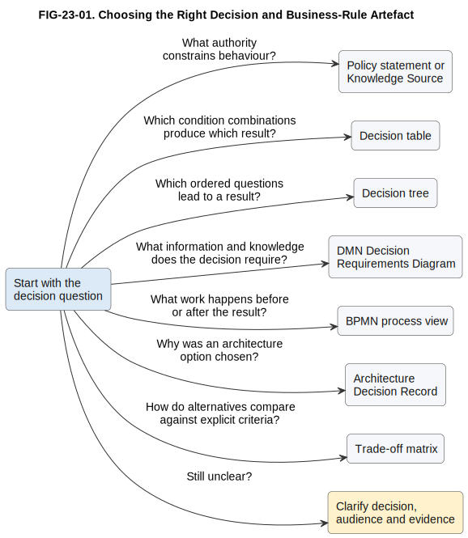

# 23. Modelling Decisions and Business Rules

## Chapter purpose

Help readers choose a focused artefact for a policy, repeatable business decision, rule set, decision dependency, architecture choice or downstream process action.

## Reader outcomes

By the end of this chapter, the reader should be able to:

- distinguish policy, business rule, decision, decision logic, decision result and process action;
- choose among a decision table, decision tree, Decision Requirements Diagram (DRD), Business Process Model and Notation (BPMN) view, Architecture Decision Record (ADR) and trade-off matrix;
- connect decision authority, inputs, logic, results, implementation and evidence without duplicating rules; and
- review a decision model set for clarity, ownership and traceability.

## Prerequisites and dependencies

- Chapter 9 introduces Decision Model and Notation (DMN), decision tables, decision trees, DRDs and the relationship between BPMN and DMN.
- Chapter 15 explains process-model selection.
- Chapter 22 explains transformation and migration views.
- Chapter 24 follows with discovery and problem definition.

## Required models and artefacts

- `FIG-23-01`: Choosing the Right Decision and Business-Rule Artefact, specification, PlantUML source, Scalable Vector Graphics (SVG) export and Portable Network Graphics (PNG) review preview completed.

## Worked examples

- Simple Online Store delivery-option decision.
- Horizon Bank payment-repair decision exercise.

## Source requirements

This chapter uses the Object Management Group (OMG) DMN 1.5 and BPMN 2.0.2 specifications for formal terminology. It uses Michael Nygard's original ADR article for the lightweight record pattern. Decision trees and trade-off matrices are presented as general techniques, not OMG notations. Detailed source notes are under `research/dmn/`, `research/bpmn/` and `research/other-modelling/`.

## Start with the question

A decision model is useful only when its question is clear. Teams often draw a flowchart when they need rules, write rules when they need policy authority, or create an ADR when they need repeatable operational logic. Begin by asking what must become reviewable:

- Which authority constrains behaviour?
- Which conditions produce which result?
- In what order should questions be asked?
- What information and knowledge does a decision require?
- What work happens before and after the result?
- Which architecture option was selected, and why?
- Which criteria help compare alternatives?

One artefact rarely answers all of these well. Use stable identifiers and links to connect focused artefacts.

## Keep the concepts separate

A **policy** is a governing statement or constraint approved by an authority. A **business rule** turns policy or operating practice into a specific condition. A **decision** is the question whose answer is needed. **Decision logic** evaluates inputs and rules. A **decision result** is the answer produced. A **process action** is work performed because of that result.

For example, an online-store policy may say that expedited delivery is offered only where fulfilment capacity and destination coverage permit it. Rules can state the permitted combinations. `Determine Delivery Option` is the decision. A table contains its logic. `Standard`, `Express` or `Manual Review` is its result. Booking a courier is a later process action.

This separation prevents a dangerous shortcut: treating a result such as `Manual Review` as if it described the review procedure. It does not identify the reviewer, steps, time limit or escalation. Those belong in a process model.

## Operational decisions and business rules

An operational decision is repeatable and occurs during normal business activity. Examples include determining a delivery option, selecting a payment route or deciding whether an order needs review. Model it when the result needs consistent application, explanation, testing or controlled change.

Use plain business names for inputs and outputs. Confirm that each input is available when the decision is made. Record its source, quality expectation and meaning. Do not begin with database columns unless implementation mapping is the question.

Rules need ownership and authority. Each important rule set should identify the policy or operating source, owner, effective date and test examples. A rule is not automatically correct because it is executable. It may be outdated, contradictory or based on unavailable data.

## Decision tables

A decision table answers: **which result applies to a combination of input conditions?** It is usually the best starting point when several conditions combine and the rules should be checked systematically.

| Rule | Destination covered? | Express capacity? | Order value | Delivery option | Reason code |
|---|---|---|---|---|---|
| R1 | Yes | Yes | GBP 50 or more | Express | `EXPRESS_AVAILABLE` |
| R2 | Yes | No | Any | Standard | `NO_EXPRESS_CAPACITY` |
| R3 | Yes | Yes | Below GBP 50 | Standard | `BELOW_EXPRESS_THRESHOLD` |
| R4 | No | Any | Any | Manual Review | `DESTINATION_NOT_COVERED` |

State how multiple matches are handled. In DMN this is the **hit policy**. Check for gaps, overlaps, contradictions and unreachable rules. Include missing or unknown inputs deliberately. A compact table is stronger than prose when reviewers need to compare combinations or derive tests. It is weaker when the logic is mainly a long ordered conversation or when human judgement cannot be reduced to stable conditions.

## Decision trees

A decision tree answers: **which ordered path through questions leads to a result?** It is easy to read when the order matters, such as asking about destination coverage before capacity. It can also support a guided conversation.

Trees become awkward when branches repeat the same conditions or when combinations multiply. Repeated logic can drift. Convert a large tree into a table, or separate reusable decisions in a DRD. A decision tree is a general technique, not a formal DRD element.

## DMN and decision requirements

DMN answers: **how can repeatable decision requirements and logic be expressed with standard concepts?** Chapter 9 explains the notation in detail. For selection, distinguish two levels:

- A DRD shows decisions, Input Data, Business Knowledge Models and Knowledge Sources, plus their requirements relationships.
- A decision table or another DMN expression shows how a particular result is derived.

Choose a DRD when reviewers need to see dependencies, reuse or authority. Choose a table when they need the rules. Often both views are needed. A DRD does not show process order, elapsed time or responsibility. Arrows express requirements, not a sequence of work.

A Knowledge Source can identify the authority behind logic. A Business Knowledge Model can identify reusable logic. A Decision Service may expose decisions, but a service boundary is optional and should not be invented merely because a decision exists.

## BPMN and decision logic

BPMN answers: **what work happens, who performs it and what happens next?** A BPMN Business Rule Task can identify the point at which a process obtains a decision result. The process can then branch on the named result.

Keep detailed rule conditions in the decision model. If the same thresholds appear in BPMN gateways, a DMN table and code, the team has competing sources of truth. The technical binding between a BPMN task and a DMN decision depends on the chosen platform; OMG does not define one universal executable binding for every engine.

Use BPMN when the concern is responsibility, waiting, messages, exceptions or escalation. Use DMN when the concern is how a repeatable result is derived. Use both, linked by stable names, when both concerns matter.

## Architecture decisions and ADRs

An ADR answers: **which consequential architecture choice was made in a stated context, and why?** It is suited to choices such as selecting an integration pattern, defining a system boundary or accepting a deployment trade-off. It is not suited to thousands of order or payment decisions at runtime.

A lightweight ADR normally records a title, status, context, decision and consequences. This repository also records related files where useful. Keep rejected alternatives and decisive criteria concise. Do not rewrite history silently; supersede an earlier record when a later decision changes it.

An ADR and DMN model serve different time scales and audiences. An ADR preserves design rationale. A DMN model represents repeatable business decision requirements or logic. An ADR may record why DMN was chosen, but it should not contain the operational rule set.

## Trade-off matrices

A trade-off matrix answers: **how do named alternatives compare against explicit criteria?** It can support an architecture decision by making assumptions visible.

State who selected the criteria, what each score means, whether any criterion is mandatory and how evidence was obtained. Avoid false precision. A weighted total can inform discussion, but it does not make the choice objective. Record the final choice and consequences in an ADR when the decision is significant.

Use a matrix for comparison, not for repeatable business-rule execution. If options change materially, date or version the matrix.

## Governance and traceability

Good decision governance answers who owns the authority, logic and result, who may change or override it, and what evidence supports review. Proportionate records include:

- policy or knowledge source and owner;
- decision and rule-set owner;
- effective and review dates;
- input definitions and lineage;
- model and implementation versions;
- representative and boundary test cases;
- result and reason code;
- override authority and human-review conditions; and
- audit evidence and downstream use.

Traceability should form a useful chain: policy to rule, rule to decision logic, input to source, decision result to process use, model to implementation, and change to tests and approval. Do not claim that links prove correctness. They support navigation, impact analysis and review.

Reason codes help people understand results without exposing sensitive internal detail. Overrides should record who acted, why, under what authority and whether the rule needs review. High-impact decisions may also require fairness, privacy, legal or risk review beyond the modelling guidance in this chapter.

## Choosing the right artefact

| Question | Start with | Main strength | Common companion |
|---|---|---|---|
| What authority constrains behaviour? | Policy statement or Knowledge Source | Ownership and authority | Rule catalogue or DRD |
| Which conditions produce which result? | Decision table | Systematic combinations and tests | DRD and test cases |
| Which ordered questions lead to a result? | Decision tree | Readable branching path | Decision table for validation |
| What does a decision depend on? | DMN DRD | Inputs, decisions, knowledge and authority | Decision logic |
| What work surrounds the result? | BPMN process view | Flow, responsibility and exceptions | DMN decision |
| Why was an architecture option chosen? | ADR | Context, choice and consequences | Trade-off matrix |
| How do alternatives compare? | Trade-off matrix | Explicit criteria and evidence | ADR |

Figure `FIG-23-01` provides a compact first filter.

Figure FIG-23-01. Choosing the Right Decision and Business-Rule Artefact. Start with the question and select the smallest artefact that makes the concern reviewable. Link separate artefacts rather than mixing authority, logic, process and design rationale in one view.

Accessibility text: A left-to-right selection guide begins with a decision question. Seven labelled arrows lead to policy or Knowledge Source, decision table, decision tree, DMN DRD, BPMN process view, ADR and trade-off matrix. A final arrow asks the reader to clarify the decision, audience and evidence if the question is unclear.

## Worked example: Simple Online Store delivery option

The Simple Online Store needs a consistent delivery option before checkout confirms an order. The team first separates the concerns. The fulfilment policy is the authority. `Determine Delivery Option` is the decision. Destination coverage, express capacity and order value are inputs. The table shown earlier is the logic. The result contains a delivery option and reason code. The fulfilment process uses that result to offer delivery or create manual review work.

The business analyst and fulfilment owner begin with the decision table because rule combinations are the immediate review question. They add a small DRD when reviewers need to see that destination coverage comes from the delivery-coverage dataset and that the fulfilment policy governs the reusable delivery rules. They link the decision from the checkout BPMN process rather than copying thresholds into gateways.

The team tests boundary values below and at GBP 50, unavailable capacity, uncovered destinations and missing coverage data. Missing coverage produces `Manual Review`; it is not silently treated as `No`. Each result includes a reason code. If the team later chooses an external decision engine, that architecture choice belongs in an ADR, not in the delivery decision table.

## Common mistakes

- Drawing one flowchart that mixes policy, rule logic, process work and system calls.
- Treating `Approve`, `Reject` or `Manual Review` as a complete process.
- Leaving table hit policy, gaps, overlaps or missing inputs unresolved.
- Using a DRD arrow as if it showed time or task sequence.
- Copying thresholds into BPMN, spreadsheets and code without a governed source.
- Turning uncertain expert judgement into rigid rules merely to automate it.
- Giving a weighted matrix more authority than its assumptions and evidence justify.
- Recording an ADR without consequences, ownership or supersession.
- Claiming a drawing is executable or standard-conformant without semantic validation.

## Key takeaways

- Separate policy, rule, decision, logic, result and process action.
- Select an artefact from the question, audience and required evidence.
- Use tables for combinations, trees for ordered questions and DRDs for dependencies.
- Use BPMN for surrounding work and ADRs for architecture rationale.
- Link artefacts with stable identifiers instead of duplicating logic.
- Govern important decisions with owners, versions, tests, reason codes and traceability.
- Treat matrices as transparent decision support, not mathematical proof.

## Practical exercise

Horizon Bank must decide whether an outgoing payment continues automatically, goes to repair, needs manual review or is rejected. Inputs include account status, screening result, cut-off status and instruction completeness.

Select an artefact for each need: rule combinations; dependency on screening and account-status decisions; operational repair steps; the choice between two decision platforms; and comparison criteria for those platforms. Then sketch four representative rules and identify owner, authority, missing-input behaviour, hit policy, reason codes and two boundary tests.

Suggested answer: use a decision table for routing rules, a DRD for dependencies, BPMN for repair work, an ADR for the platform choice and a trade-off matrix as supporting evidence. Keep screening logic separate if another owner governs it. Treat an unavailable screening result explicitly, probably as manual review or a controlled stop according to policy, rather than guessing `clear`. Test each result and at least one missing-input case. The exercise deliberately differs from the worked delivery example by requiring linked banking decisions and an architecture choice.

## Review checklist

- [ ] The decision question, audience and scope are explicit.
- [ ] Policy, business rule, decision, logic, result and process action are distinct.
- [ ] The selected artefact matches the question it must answer.
- [ ] Inputs are defined and available at decision time.
- [ ] Tables state hit policy and address gaps, overlaps and missing values.
- [ ] DRD arrows mean requirements, not process sequence.
- [ ] BPMN does not duplicate governed decision logic.
- [ ] ADRs record context, decision, consequences and supersession.
- [ ] Matrices expose criteria, evidence and assumptions.
- [ ] Ownership, versions, tests, reason codes, overrides and traceability are proportionate.
- [ ] Sources, terminology and diagrams are registered and checked.

## References and further reading

- `[OMG-DMN-1.5]`: OMG Decision Model and Notation 1.5 formal specification.
- `[OMG-BPMN-2.0.2]`: OMG Business Process Model and Notation 2.0.2 formal specification.
- `[NYGARD-ADR-2011]`: Michael Nygard, *Documenting Architecture Decisions*.
