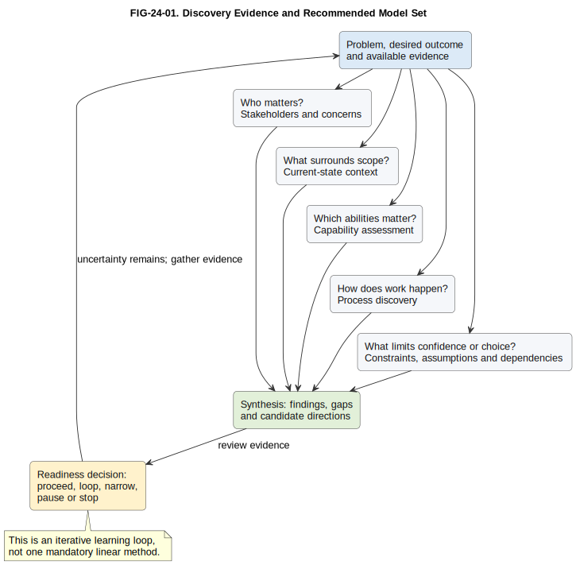

# 24. Discovery and Problem Definition

## Chapter purpose

Use models to establish why change may be needed, whose concerns matter, what exists now, where the problem lies and what evidence is still missing. Discovery reduces uncertainty before a team commits to detailed requirements or a solution.

## Reader outcomes

By the end of this chapter, the reader should be able to:

- frame an architecture problem without assuming its solution;
- identify stakeholders, concerns, scope, constraints and assumptions;
- select focused current-state, capability and process discovery models;
- assemble a proportionate discovery model set and evidence pack; and
- judge whether the work is ready to proceed, needs another discovery loop or should stop.

## Prerequisites and dependencies

- Chapter 2 explains stakeholders, concerns, views and viewpoints.
- Chapters 14 to 23 explain how to select models for particular architecture needs.
- Chapter 23 separates policy, business rules and decisions.
- Chapter 25 follows with requirements and analysis.

Discovery can revisit earlier work at any point. These chapters describe a useful lifecycle, not one mandatory linear method.

## Required models and artefacts

- `FIG-24-01`: Discovery Evidence and Recommended Model Set, specification, PlantUML source, Scalable Vector Graphics (SVG) export and Portable Network Graphics (PNG) review preview completed.

## Worked examples

- Simple Online Store checkout-delay discovery.
- Horizon Bank customer-onboarding discovery.

## Source requirements

This chapter uses ISO/IEC/IEEE 42010:2022 for architecture-description concepts, official C4 guidance for system context, The Open Group business-capability guidance, and Object Management Group (OMG) Business Process Model and Notation (BPMN) 2.0.2 for process terminology. The recommended discovery pack and gate are author guidance, not requirements imposed by those sources.

## What discovery is

Discovery is structured learning about a change situation. It asks: **what problem or opportunity deserves attention, for whom, within what boundary, and on what evidence?** Architects use interviews, observation, data, workshops and existing records to build models that people can challenge.

The users include sponsors, product owners, enterprise and solution architects, business analysts, domain experts, operations, security, risk, data specialists, developers and affected users. Their concerns differ. A sponsor may need the outcome and investment boundary. An operations team may need failure patterns. A customer-support agent may reveal workarounds hidden from management reports.

Discovery is useful when a problem crosses teams or systems, the current state is disputed, the cost or risk of a wrong direction is material, or several options remain plausible. It is less useful as a ceremonial phase for a tiny, well-understood correction. Even then, write down the problem, owner and evidence.

## Problem framing

A problem statement answers: **what undesirable situation occurs, who experiences it, what consequence follows and what evidence supports the claim?** A useful form is:

> [Stakeholder] experiences [observable problem] in [context], causing [measurable consequence], as shown by [evidence].

For the Simple Online Store: “Customers using checkout experience delayed order confirmation during peak periods, increasing abandonment and support contacts, as shown by checkout timing and support-case data.” This does not prescribe a queue, cache or new service.

Add the desired outcome, scope and measures separately. An outcome might be faster, dependable confirmation without duplicate orders. Measures might include confirmation time, abandonment rate and duplicate-order incidents. A target needs an owner, baseline and measurement method before it can become a credible requirement.

A motivation view can connect stakeholders, drivers, assessments, goals, outcomes, principles and requirements. It helps when people disagree about why change matters. It should not become a decorative web of vague ambitions.

Avoid solution-shaped framing such as “the problem is that we do not have microservices”. That is an option disguised as evidence. Also distinguish symptoms from causes. Slow confirmation is observable. A database bottleneck is a hypothesis until evidence supports it.

## Stakeholder map

A stakeholder map answers: **who affects or is affected by the change, what do they care about, and how will they participate?** Start with roles, not names. Include external users, business owners, delivery roles, operations, control functions and owners of dependent systems or data.

A compact map or table can record:

| Stakeholder | Concern | Influence | Evidence or contribution | Engagement |
|---|---|---|---|---|
| Customer | Reliable confirmation | Medium | Research and support cases | Test findings |
| Fulfilment owner | Orders ready for fulfilment | High | Process measures | Working sessions |
| Support agent | Clear order status | Medium | Case themes and workarounds | Interview and playback |
| Platform operations | Peak stability | High | Telemetry and incidents | Evidence review |

Influence is not importance. People with little organisational power can be heavily affected. Record dissent and missing representation. A stakeholder map does not replace a responsibility model, communications plan or privacy assessment.

## Current-state context

A current-state context view answers: **what is inside the investigation boundary, who interacts with it and which external systems or organisations matter?** Date the view and state its evidence. The official C4 model describes a System Context diagram as a view of a software system, its users and neighbouring systems [C4-OFFICIAL]. A plain context diagram can serve the same discovery question without claiming C4 notation.

Keep the view wide and simple. Show major actors and systems, labelled relationships and the boundary under investigation. Add an application landscape only when several systems and owners must be compared. Add a data-flow or trust-boundary view only when information movement or security is the question.

“Current state” means evidenced state within a stated scope, not every historical component in the organisation. Validate it with system owners, logs, operational records and people doing the work. Mark unknown ownership, uncertain interfaces and contradictory evidence as open questions rather than inventing precision.

## Capability assessment

A business capability describes what an organisation is able to do. A capability map answers: **which abilities are relevant to the outcome, and where is there pain, risk or a gap?** The Open Group guidance treats capabilities as useful building blocks for business architecture [OPEN-GROUP-BIZARCH-GUIDES-2022].

Assess only the relevant slice. State the rating dimension, scale, date, evidence and owner. “Red” is meaningless unless it says whether the concern is maturity, performance, cost, risk or strategic importance. Do not infer that a weak capability automatically requires a new application. Capability assessment identifies where to investigate or invest, not the implementation answer.

## Business process discovery

A process discovery view answers: **how does work happen today, across which participants, with what waits, decisions, hand-offs and exceptions?** Begin with a short end-to-end narrative or value-stream view. Use a BPMN collaboration when participant responsibilities, messages and exceptions require formal expression [OMG-BPMN]. Use a simpler flow when that detail would distract.

Observe real work where possible. Compare documented procedure with actual cases. Capture normal flow, failure paths, manual workarounds, queues, rework, control points and measures. Do not mix detailed system deployment into the process view. Link to a context or runtime model when systems matter.

EventStorming can help domain experts and delivery roles discover events, commands, policies and unresolved questions together. Its workshop board is discovery material, not automatically a governed process or solution model.

## Constraints and assumptions

A **constraint** limits acceptable choices. An **assumption** is treated as true for now but needs confirmation. A **dependency** is something outside the immediate control of the work that affects progress or outcome. Record each with an identifier, owner, source, effect, review date and status.

Examples include a regulatory deadline, an immovable external interface, assumed peak demand and dependency on a vendor release. Separate genuine constraints from preferences. “We always use product X” may be a principle or local convention, not an unavoidable limit.

An assumption log is active work, not a parking place. Link important assumptions to affected models and decisions. Test high-impact, low-confidence assumptions early. If an assumption fails, update the problem, boundary or options.

## Discovery deliverables

Discovery should produce a small, connected evidence pack rather than a large document whose claims cannot be traced. A proportionate pack contains:

- problem statement, desired outcomes, scope and measures;
- stakeholder and concern map;
- dated current-state context;
- focused capability and process findings where relevant;
- evidence register with provenance and limitations;
- constraints, assumptions, dependencies and open questions;
- risks, candidate options and decisions explicitly deferred; and
- recommendation to proceed, loop, narrow, pause or stop.

Models should identify title, purpose, audience, scope, date, owner and evidence. Stable identifiers allow a finding to link to a model, assumption, decision and later requirement. Discovery does not need to produce detailed requirements, component design or a target deployment view. Those artefacts may be premature.

## Recommended model set

There is no universal mandatory set. Choose the smallest combination that makes the important concerns reviewable.

| Discovery question | Start with | Add when needed | Do not use it for |
|---|---|---|---|
| Why might change be needed? | Problem statement | Motivation view | Predetermining the solution |
| Who matters and what concerns them? | Stakeholder map | Concern or engagement table | Detailed responsibility assignment |
| What surrounds the scope? | Context diagram | Application landscape or data-flow view | Process order |
| Which organisational abilities matter? | Capability map or assessment | Evidence-based heat map | Application design |
| How does work happen? | Process narrative or flow | BPMN collaboration or EventStorming | Infrastructure topology |
| What limits confidence or choice? | Constraint and assumption log | Risk and dependency register | Hiding unresolved questions |

Figure FIG-24-01. Discovery Evidence and Recommended Model Set. Begin with the problem and evidence, select focused views for the concerns that matter, synthesise findings, then make a governed readiness decision. New evidence can send the team around another discovery loop.

Accessibility text: A top-to-bottom portrait flow starts with problem and evidence. Five labelled `informs` arrows branch to separate stakeholder, current-state context, capability assessment, process discovery, and constraints, assumptions and dependencies nodes. Five labelled `contributes` arrows lead from those nodes to synthesis, followed by the readiness decision. A labelled feedback arrow returns from the decision to the starting evidence when uncertainty remains.

## Worked example: Horizon Bank customer onboarding

Horizon Bank sees slow and inconsistent retail customer onboarding. The initial request is “replace the onboarding platform”. The discovery team reframes it: retail customers and onboarding staff experience repeated information requests and unpredictable completion times, contributing to abandonment and manual follow-up. Journey data, case samples, complaints and operational queues are the evidence to test.

The stakeholder map includes Retail Customer, Onboarding Analyst, Customer Support Agent, Compliance Officer, Financial Crime Operations Analyst, product owner, data owner, platform owner and risk reviewer. The team records concerns, decision authority and gaps in representation.

The current-state context shows the Customer Onboarding Platform and relevant neighbouring systems from the Horizon Bank landscape. It labels customer interactions and key dependencies without proposing containers or microservices. The capability assessment focuses on Customer Onboarding and its Document Capture, Identity Verification and Risk Assessment capabilities. Financial Crime Screening remains a separate level-one capability contributing at the appropriate control point, consistent with the case-study catalogue.

Process discovery follows several real applications. It finds repeated document requests after incomplete capture, manual hand-offs and unclear status ownership. These are findings, not proof that one system is the root cause. The team records constraints such as applicable control obligations, assumptions such as expected demand, and dependencies such as external identity-verification availability.

The synthesis distinguishes evidence from hypotheses. Candidate directions include improving status and document handling, simplifying policy or process, changing integrations, and replacing part or all of the platform. The discovery gate authorises requirements analysis for the bounded onboarding problem while deferring solution selection. Chapter 25 can now derive requirements and quality-attribute scenarios from traceable findings rather than from the original product request.

## Stage-gate checklist

This is a readiness conversation, not a universal governance standard.

- [ ] The problem and desired outcome are stated without assuming a solution.
- [ ] Scope, exclusions, affected stakeholders and decision owner are clear.
- [ ] Current-state claims are dated and linked to credible evidence.
- [ ] Capability, process, system and data concerns use separate views where needed.
- [ ] Constraints, assumptions, dependencies, risks and open questions have owners.
- [ ] Important dissent and evidence limitations are visible.
- [ ] Measures have baselines or an explicit plan to establish them.
- [ ] Candidate directions and deferred decisions are distinguished from commitments.
- [ ] The recommendation is proceed, loop, narrow, pause or stop, with reasons.

A gate can pass with documented uncertainty when the next activity is designed to resolve it. It should not pass merely because workshops occurred or diagrams exist.

## Common mistakes

- Starting with a preferred product or architecture style and looking for supporting evidence.
- Treating the loudest or most influential stakeholders as the complete audience.
- Drawing a current-state model from memory without date, owner or provenance.
- Mixing process, applications, deployment and controls on one unreadable diagram.
- Treating a capability rating as an application replacement instruction.
- Documenting only the happy path and ignoring queues, exceptions and workarounds.
- Calling preferences constraints and leaving assumptions without owners or review dates.
- Producing so many models that findings and decisions cannot be found.
- Treating the discovery gate as proof that the problem or solution is certain.
- Assuming discovery finishes permanently when requirements or design begins.

## Key takeaways

- Discovery turns an initial request into a reviewable problem, boundary and evidence base.
- Frame observable consequences before selecting a solution.
- Include affected stakeholders as well as influential decision-makers.
- Use separate, focused models for context, capability and process concerns.
- Date current-state views and expose uncertainty.
- Govern constraints, assumptions, dependencies and open questions actively.
- Proceed, loop, narrow, pause or stop according to evidence.
- Revisit discovery whenever later work reveals material uncertainty.

## Practical exercise

The Simple Online Store reports delayed checkout confirmation during peaks. Create a one-sentence problem statement without naming a solution. Identify six stakeholders and one concern each. Sketch the minimum discovery model set, then list two constraints, three assumptions and evidence needed to test each assumption. Finish with a gate recommendation.

Suggested answer: begin with customers experiencing delayed confirmation, supported by timings, abandonment and support data. Include customer, fulfilment owner, support agent, payment provider owner, platform operations and product owner. Use a stakeholder map, dated system context and focused checkout process view. Add a capability assessment only if organisational ability is genuinely in question. Treat peak demand, payment-provider response and inventory-reservation behaviour as assumptions until measured. Recommend another loop if the baseline or boundary is still uncertain; otherwise proceed to requirements without selecting a technical design.

## Review checklist

- [ ] Each model states its question, audience, scope and evidence.
- [ ] Formal terms follow a simple explanation.
- [ ] Stakeholder, capability, process and system concerns remain distinct.
- [ ] The examples use repository actors, capabilities and systems consistently.
- [ ] Recommendations are distinguished from standards requirements.
- [ ] Common mistakes are concrete and actionable.
- [ ] Required sources and diagrams are registered.
- [ ] Terminology, links, structure, diagrams and word count pass repository checks.

## References and further reading

- [ISO/IEC/IEEE 42010:2022 source note](../../research/fundamentals/iso-iec-ieee-42010-2022.md)
- [Official C4 model source note](../../research/c4/c4-model-official.md)
- [The Open Group business architecture guides source note](../../research/other-modelling/open-group-business-architecture-guides-2022.md)
- [OMG BPMN source note](../../research/bpmn/omg-bpmn-2.0.2.md)
- [EventStorming source note](../../research/domain-event/eventstorming-brandolini-2026.md)
