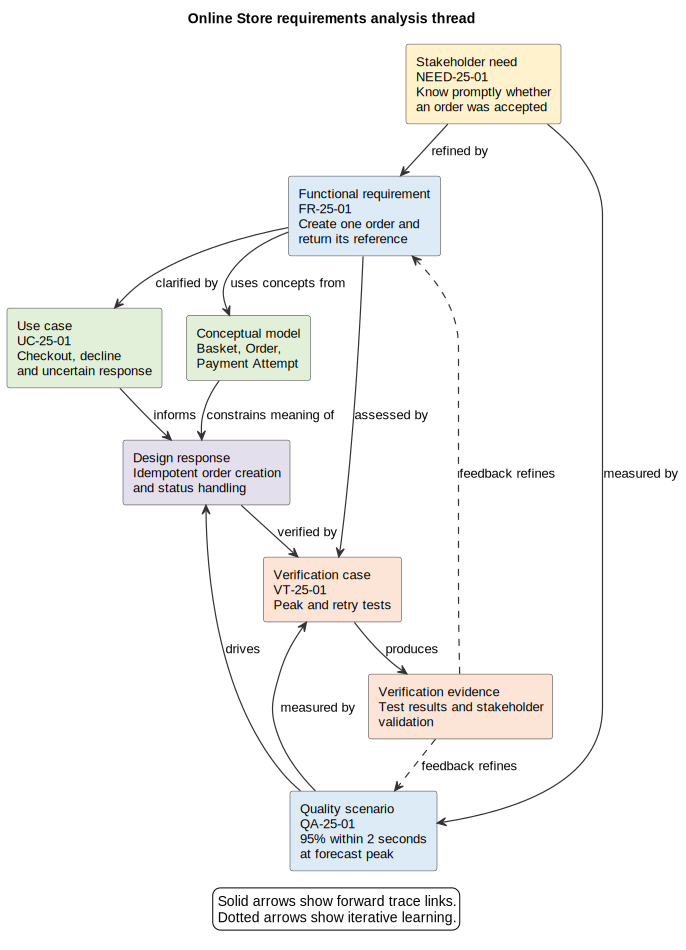

# 25. Requirements and Analysis

## Chapter purpose

Discovery establishes why change may be worthwhile. Requirements analysis turns that evidence into a shared, testable account of what a solution must achieve and the conditions it must respect. The work is not a single hand-off before design. Analysts, architects, product people, engineers, testers, operators and stakeholders refine requirements and architecture together as they learn.

## Reader outcomes

By the end of this chapter, the reader should be able to:

- distinguish stakeholder needs, functional requirements, quality attributes, constraints and assumptions;
- express behaviour through scenarios, use cases and process models;
- make quality expectations measurable;
- trace needs to requirements, models, decisions and verification evidence;
- prioritise requirements without disguising uncertainty; and
- assemble a proportionate analysis model set and assess its readiness for solution design.

## Prerequisites and dependencies

Read Chapter 24 first. Chapters 4, 6, 8, 10, 13 and 17 provide deeper guidance on Unified Modeling Language (UML), Business Process Model and Notation (BPMN), data, domain, requirements and interaction models. Chapter 26 uses the outputs created here.

## Required models and artefacts

A useful analysis baseline normally includes a system context, prioritised requirement catalogue, selected scenarios or use cases, process view, conceptual information or domain model, quality attribute scenarios, constraints and assumptions log, and traceability view. The set should remain proportionate to risk.

## Worked examples

The Online Store checkout provides the detailed thread in this chapter. Horizon Bank cross-border payments show how the same reasoning scales to regulated, multi-party change.

## Source requirements

Formal claims use current primary material from ISO, the Object Management Group (OMG), the Software Engineering Institute and the National Institute of Standards and Technology (NIST). Practical model-set and stage-gate guidance is the author's recommendation.

## From stakeholder need to testable requirement

A stakeholder need describes an outcome or concern in the stakeholder's language. A requirement states a necessary capability, behaviour, quality or condition precisely enough to guide design and assessment. A solution idea describes how the team might satisfy it. Keeping these apart prevents a preferred technology from masquerading as a need.

For example, "customers need confidence that checkout has succeeded" is a need. "After payment authorisation, the store shall display and email an order confirmation containing the order reference" is a functional requirement. "Use product X" is neither unless a genuine constraint requires that product.

Requirements engineering continues throughout the life cycle. ISO/IEC/IEEE 29148:2018 specifies requirements processes and information items across systems and software life cycles. The standard was confirmed in 2024, although revision work is under way. This chapter offers practical author guidance rather than reproducing the standard.

## Requirement types

### Business and stakeholder requirements

Business requirements describe the outcomes that justify investment, such as reducing abandoned purchases or meeting a regulatory obligation. Stakeholder requirements translate those outcomes into the needs of customers, operations, finance, risk, support and other affected groups. Link both to discovery evidence and measurable outcomes.

### Functional requirements

Functional requirements state behaviour the solution must provide. They can concern user goals, calculations, decisions, notifications, interfaces or exception handling. A useful statement has an identifier, subject, required behaviour, relevant conditions and a reason or parent need. Avoid vague verbs such as "support" unless the supported behaviour is explained.

### Data and information requirements

These state which concepts and facts are needed, where they originate, who owns them, their quality expectations, allowed use and retention conditions. Begin with business concepts rather than tables. A conceptual data or domain model can expose disagreements such as whether a basket, order and payment are the same thing. They are not.

### Quality attributes

Quality attributes describe how well a solution must behave. Availability, performance, security, accessibility, usability, modifiability, recoverability and observability are examples. Calling a system "fast", "secure" or "highly available" is not testable.

A quality attribute scenario makes the expectation concrete by naming the source, stimulus, environment, affected artefact, response and response measure. For example: during the normal peak hour, when an authenticated customer submits an order, the checkout service confirms acceptance for at least 95 per cent of requests within two seconds, measured at the public interface. The Software Engineering Institute (SEI) uses this six-part structure to turn broad qualities into assessable architectural drivers.

### Constraints and assumptions

A constraint limits the solution space, for example a mandated data-residency boundary, contract date or retained core interface. An assumption is believed to be true but is not yet proven, for example expected peak volume. Record each with an owner, rationale, review date and consequence if false. Validate assumptions early. Do not silently rewrite a preference as a constraint.

## Scenarios, use cases and process requirements

A scenario is a concrete story about an actor or event interacting with the system. It is often the fastest way to clarify normal behaviour and exceptions. A use case groups related scenarios around an actor goal and the system boundary. A use case diagram gives a concise scope view, while a textual use case carries preconditions, trigger, main success flow, alternatives and outcome. UML 2.5.1 is the current formal UML specification recorded for this book.

A process model answers a different question: how does work progress across roles or organisations? Use BPMN when sequence, hand-offs, messages, timers and exceptions matter. Do not use a use case diagram as a process flow, and do not force a complete end-to-end process into a single functional requirement.

Select representative scenarios, including a normal path, a high-value exception, a failure or recovery path, and a boundary case. Connect each scenario to requirements it clarifies. This provides behavioural coverage without pretending that every possible story must be modelled.

## Analysing the information and domain

A context diagram defines the system under consideration and its external people and systems. It prevents requirements from drifting across an unstated boundary. Add a conceptual data model when shared information matters, and a domain model when behaviour, rules and ownership around domain concepts need explanation.

Keep these models conceptual during analysis. A database schema, API payload or deployment product is usually premature. Record unanswered ownership, lifecycle, privacy and quality questions beside the model rather than inventing physical detail.

## Traceability without bureaucracy

Traceability is a discernible association between logical entities such as requirements, system elements, verification activities or tasks. Give important items stable identifiers, then preserve useful links in both directions:

`need -> requirement -> scenario or model -> design response -> verification case -> evidence`

Traceability helps a reviewer ask why a design element exists, whether a need has been covered, what is affected by a change, and how satisfaction will be demonstrated. It does not require a giant spreadsheet. A lightweight table, repository links or a SysML-style requirements view may be enough. Trace decisions and high-risk requirements first; links with no review question create maintenance cost without value.

Figure 25-01 shows the analysis thread for the Online Store. Relationships are labelled because "related to" is too weak to support impact analysis.

*Figure 25-01. A stakeholder need is refined into functional and quality requirements, clarified by analysis models, addressed by a design response and assessed through verification evidence and stakeholder validation. Feedback links keep refinement iterative.*

## Prioritisation and negotiation

Priority is a decision about relative value, urgency, risk and dependency, not an adjective added by the author. A simple Must, Should, Could and Won't-for-now scheme, commonly called MoSCoW, can support conversation if the decision period and decision owner are explicit. Ranking or value-versus-effort approaches may be better where too many items become "Must".

Prioritise quality scenarios and constraints as well as functions. Record conflicts openly. A two-second response target, a low operating-cost target and a dependency on a slow retained system may require a design trade-off. The requirement set should expose that tension for Chapter 26 rather than claim all qualities can be maximised.

## Acceptance, verification and validation

Acceptance criteria state observable conditions under which a stakeholder or product representative will accept an item. Verification asks whether the specified requirement has been implemented correctly, using test, analysis, inspection or demonstration. Validation asks whether the resulting solution meets stakeholder needs in its intended context.

Write the assessment approach while refining the requirement. If no credible evidence could show whether it is satisfied, the statement probably needs more work. NIST lists completeness, consistency, correctness, modifiability, ranking, traceability, unambiguity, understandability and verifiability among useful characteristics for requirements analysis.

## Analysis deliverables and recommended model set

The following is a starting set, not a compulsory document pack.

| Question | Recommended artefact | Use when |
|---|---|---|
| What outcome and boundary matter? | problem statement, outcome measures and context diagram | always, at proportionate depth |
| Who needs what? | stakeholder map and needs catalogue | concerns or ownership differ |
| What must users or systems do? | use cases, scenarios or interaction view | actor goals and behaviour matter |
| How does work cross responsibilities? | process or collaboration model | hand-offs, timing or exceptions matter |
| What information must be understood? | conceptual data or domain model | shared concepts, ownership or rules matter |
| How well must it work? | prioritised quality attribute scenarios | architecture choices could be affected |
| What limits or threatens the work? | constraints, assumptions and risks log | always |
| How will coverage and change be assessed? | traceability view and verification map | important or risky requirements |

Small changes may need only a context sketch, short catalogue and acceptance examples. Regulated, safety-critical or cross-organisation change needs stronger baselines, ownership and evidence. The measure is decision coverage, not page count.

## Worked example: Online Store checkout

Discovery found that customers abandon checkout when confirmation is slow or ambiguous. The product owner, customer support lead, payment provider owner, security lead and operations team are key stakeholders.

The team records need `NEED-25-01`: customers need to know promptly whether an order was accepted. It refines this into `FR-25-01`: after successful payment authorisation, the store shall create one order and provide its reference to the customer. Scenario `UC-25-01` describes checkout, including declined payment and a lost response from the payment provider. A process sketch makes the provider hand-off explicit. A conceptual model separates Basket, Order, Payment Attempt and Payment Authorisation.

Quality scenario `QA-25-01` states that during the forecast peak hour, 95 per cent of accepted checkout requests receive a response within two seconds at the public interface. Constraint `CON-25-01` requires continued use of the contracted payment provider for the first release. Assumption `ASM-25-01` records the forecast peak of 50 checkout submissions per second and assigns validation to the product analyst.

The team prioritises `FR-25-01` and duplicate-order prevention as Must for the release. Acceptance examples cover successful payment, decline and retry after an uncertain provider response. Verification case `VT-25-01` will exercise the peak scenario, while a customer usability session validates whether confirmation is understandable. Chapter 26 can now explore idempotency, asynchronous confirmation and resilience trade-offs without treating one as a predetermined requirement.

The same approach scales to Horizon Bank. For a cross-border payment, stakeholder needs, sanctions-screening obligations, cut-off constraints, payment-status scenarios, information concepts and measurable availability or recovery expectations must be connected. The analysis should not declare that one BIAN Service Domain equals one microservice. That is a later design decision requiring explicit justification.

## Stage-gate checklist

Use this as a readiness conversation, not as a waterfall sign-off. Uncertainty can remain when it is visible, owned and safe to carry.

- [ ] Business outcomes and stakeholder needs are linked to discovery evidence.
- [ ] Scope, system boundary and external dependencies are explicit.
- [ ] Functional, data, quality, constraint and assumption items are distinguishable.
- [ ] Important normal, exception and failure scenarios have been explored.
- [ ] Quality attributes include measurable response criteria and context.
- [ ] Priorities, decision owners and conflicts are recorded.
- [ ] Important requirements trace to analysis models and planned assessment.
- [ ] Acceptance criteria and verification approaches are credible.
- [ ] Open questions, risks and assumptions have owners and review dates.
- [ ] Solution options remain open unless a genuine constraint closes them.

## Common mistakes

- Starting with a product or architecture pattern, then reverse-engineering requirements to justify it.
- Treating every stakeholder statement as equally precise or equally authoritative.
- Writing only happy-path use cases and ignoring decline, timeout, retry and recovery.
- Using "non-functional requirement" as a bucket of vague adjectives. Prefer measurable quality scenarios.
- Mixing business concepts with database or API design too early.
- Calling preferences constraints and leaving assumptions invisible.
- Giving every requirement the highest priority.
- Building trace links that nobody reviews or maintains.
- Delaying acceptance and verification thinking until implementation.
- Freezing analysis at a gate instead of refining it when design evidence changes understanding.

## Key takeaways

- Requirements analysis translates discovery evidence into testable design inputs.
- Needs, requirements, solution ideas, constraints and assumptions are different things.
- Scenarios, use cases, process models and conceptual models answer complementary questions.
- Quality attributes become useful when their context and response measures are explicit.
- Traceability supports coverage, rationale, assessment and change impact.
- Prioritisation reveals trade-offs; it does not make every conflict disappear.
- Acceptance, verification and validation should be considered before solution design.
- Analysis and architecture evolve iteratively.

## Practical exercise

For an Online Store returns feature, define one stakeholder need, two functional requirements, one conceptual information requirement, one quality attribute scenario, one constraint and one assumption. Add a normal return scenario and an exception in which the parcel is not received. Draw a trace from the need to a requirement, an analysis model and a verification case.

Review your work by asking: Are the boundary and actor clear? Is the quality scenario measurable? Could the constraint actually be a preference? Does the assumption have an owner? Can each Must item be assessed? A strong answer keeps refund timing separate from how the refund service will be implemented.

## Review checklist

- [ ] Each model states its question, audience, scope and abstraction level.
- [ ] Acronyms are defined at first use.
- [ ] Requirements use stable identifiers and clear required behaviour.
- [ ] Models agree on actors, boundary, concepts and terminology.
- [ ] Quality scenarios contain a measurable response.
- [ ] Constraints and assumptions are separately recorded.
- [ ] Important requirements have priority, ownership and assessment links.
- [ ] Examples cover normal and exceptional behaviour.
- [ ] The analysis does not prescribe unsupported solution detail.
- [ ] Open issues and trade-offs are visible.

## References and further reading

- ISO, [ISO/IEC/IEEE 29148:2018, Systems and software engineering, Life cycle processes, Requirements engineering](https://www.iso.org/standard/72089.html), edition 2, confirmed 2024, accessed 11 July 2026.
- Object Management Group, [Unified Modeling Language 2.5.1](https://www.omg.org/spec/UML/2.5.1), December 2017, accessed 11 July 2026.
- Carnegie Mellon University Software Engineering Institute, [Eliciting and Specifying Quality Attribute Requirements](https://resources.sei.cmu.edu/asset_files/Webinar/2013_018_101_60984.pdf), 2013, accessed 11 July 2026.
- National Institute of Standards and Technology, [Traceability glossary entry](https://csrc.nist.gov/glossary/term/traceability), accessed 11 July 2026.
- National Institute of Standards and Technology, [Requirements Verification Tools](https://www.nist.gov/itl/csd/secure-systems-and-applications/requirements-verification-tools), updated 1 May 2026, accessed 11 July 2026.
