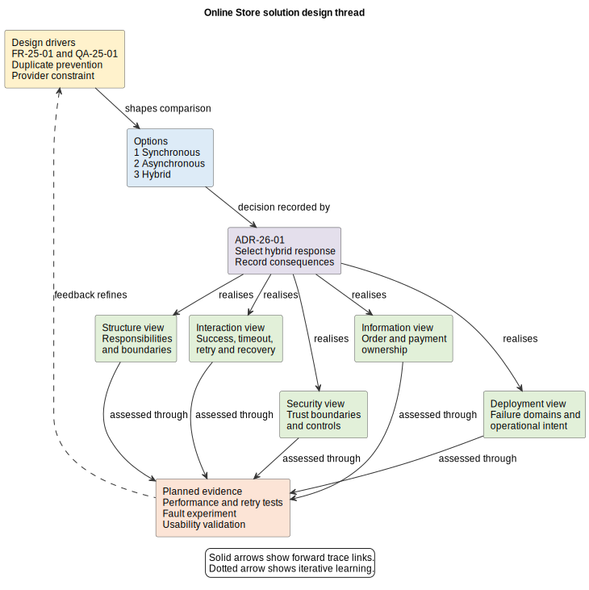

# 26. Solution Design

## Chapter purpose

Solution design turns analysed needs into a coherent explanation of how a solution could work. It identifies important boundaries, responsibilities, interactions, information, controls and deployment choices. It also preserves alternatives and trade-offs. Design is iterative: models expose questions, experiments provide evidence and requirements are refined when learning changes what is feasible.

## Reader outcomes

By the end of this chapter, the reader should be able to:

- identify architectural drivers and compare credible solution options;
- assign responsibilities to clear boundaries without assuming a mandatory method;
- connect interaction, data, security and deployment views;
- explain how quality attributes influence design choices;
- record significant choices in an Architecture Decision Record (ADR);
- trace requirements through design responses to planned evidence; and
- assemble a proportionate model set and assess readiness for detailed design.

## Prerequisites and dependencies

Read Chapter 25 first. Chapters 5, 8, 10, 11, 12, 16, 18, 19, 20, 21 and 23 provide deeper guidance on C4, data, domain, deployment, security, software structure, runtime behaviour and decisions. Chapter 27 takes the architectural intent established here into implementable detail.

## Required models and artefacts

A useful solution design baseline normally includes the design drivers, evaluated options, selected boundaries and responsibilities, important interactions, logical information ownership, security and trust considerations, deployment intent, ADRs, risks and traceability. The set is tailored to the decision and its risk.

## Worked examples

The Online Store checkout continues the trace from Chapter 25. Horizon Bank cross-border payments show how the reasoning scales to regulated, multi-party change.

## Source requirements

Formal notation claims rely on the official C4 guidance and Object Management Group (OMG) Unified Modeling Language (UML) specification. Quality attribute reasoning uses primary Software Engineering Institute guidance. ADR guidance uses Michael Nygard's original article. The model-set, option-assessment and gate guidance are the author's practical recommendations.

## Start with drivers, not a favourite solution

Architectural drivers are the small set of requirements, quality scenarios, constraints, risks and business priorities that materially shape the solution. Begin by restating them in decision-ready language. A two-second response target, prevention of duplicate orders, continued use of a payment provider and a fixed launch date are drivers only when they affect choices.

Separate a genuine constraint from a preference. Then identify uncertainties that could reverse a decision, such as whether a provider supports an idempotency key. Use a prototype, measurement, threat analysis or vendor clarification to reduce important uncertainty. Do not create detailed diagrams merely to make an untested assumption look settled.

Design principles can guide repeated choices. Examples include assigning one authoritative owner for each important business fact, protecting sensitive data at every boundary and degrading safely when an external dependency fails. A principle needs a reason and observable implications. It is not a slogan.

## Explore options and trade-offs

An option is a coherent response to the drivers, not a product name in isolation. Compare at least two credible options when the consequences are significant. Use the same criteria for each, record evidence and make uncertainty visible.

For Online Store checkout, three options might be:

1. wait synchronously for payment and order creation;
2. accept the checkout request, process it asynchronously and expose status; or
3. use a short synchronous attempt, then continue asynchronously after a timeout.

The first is simple but couples customer response time to the provider. The second improves tolerance of slow dependencies but changes the customer journey and needs status handling. The third balances fast normal responses with recovery complexity. No option maximises simplicity, speed, availability and consistency simultaneously.

A small decision matrix can support discussion, but scores do not make the decision. Explain why a criterion matters, how evidence supports each assessment and which negative consequences remain. Record the selected option and meaningful alternatives in an ADR. ADRs are lightweight text records for architecturally significant decisions. A useful local form includes status, context, options, decision, consequences and links. Supersede an obsolete ADR rather than silently rewriting history.

## Define boundaries and responsibilities

A boundary states what is inside, what is outside and where responsibility changes. Start with the system context, then decompose only far enough to answer current decisions. In C4 terminology, a container is an application or data store that executes code or stores data. It does not necessarily mean a Docker container.

For the Online Store, the Web Application supports the customer journey, the API Application coordinates checkout and the Order Database holds the store's order record. A Notification Worker can send confirmation after acceptance. The external Payment Provider System authorises payment. Each responsibility should have an owner and a reason for its placement.

Boundaries are not automatically microservices. A modular application may satisfy the drivers with less operational complexity. Likewise, a Horizon Bank BIAN Service Domain identifies a semantic business responsibility; it is not automatically one deployable service. Deployment boundaries require separate justification.

Use a context view to answer who uses the solution and which external systems matter. Use a C4 container or UML component view to answer where major responsibilities sit and how they depend on one another. Add a deeper component view only where internal responsibility or change risk cannot be understood at the higher level.

## Model interactions and failure behaviour

Static structure is not enough. A sequence, dynamic or process view explains how responsibilities collaborate for an important scenario. Model a normal path and the failures that influence architecture: decline, timeout, duplicated request, partial completion and recovery.

For checkout, label whether an arrow is a request, response, command or event. State whether communication is synchronous or asynchronous and what happens when acknowledgement is uncertain. An idempotency key can allow repeated submissions to refer to the same intended operation, but the design must define where it is checked and how long the record remains meaningful. Do not claim that a message queue alone creates reliability.

Process and interaction views answer different questions. A Business Process Model and Notation (BPMN) collaboration can show work across business participants. A UML sequence diagram or C4 dynamic diagram can show runtime calls among software elements. Keep their actors, boundaries and outcomes consistent.

## Design information ownership and movement

Move from Chapter 25's business concepts to a logical view of information responsibilities. Identify which boundary is authoritative for each important fact, which consumers receive copies, what identifiers connect records and where consistency may be delayed.

For checkout, distinguish Payment Attempt, Payment Authorisation and Order. The Payment Provider is authoritative for its authorisation result; the Online Store is authoritative for its order. The design must explain how an uncertain provider response is reconciled before another order is created. A logical data model, ownership table and data-flow or lineage view may be more useful than a physical schema at this stage.

Record classification, retention, residency, quality and lifecycle needs where they affect architecture. Avoid table definitions, index choices and complete payload schemas unless they are needed to resolve an architectural risk. Those details normally belong in Chapter 27.

## Build security into the design

Security architecture is not a final overlay. Identify assets, actors, trust boundaries, threats and required controls while choosing boundaries and interactions. Show where identity is established, where authorisation is enforced, how data is protected in transit and at rest, and how security-relevant activity becomes auditable.

For Online Store checkout, card details should remain within the approved payment-provider flow, customer sessions must not authorise another customer's order and callbacks require authentication and replay protection. A trust-boundary data-flow view and threat model can expose risks that a container diagram hides.

At Horizon Bank, screening, approval, segregation of duties, privacy and audit obligations affect process, data and deployment choices. Refer to the relevant policy or requirement rather than writing "secure" beside every box. Controls must trace to threats or obligations and have a planned means of assessment.

## Express deployment and operational intent

A deployment view maps software responsibilities to execution environments and infrastructure boundaries. At solution-design level, show only choices that matter to qualities such as availability, resilience, latency, data residency, recoverability, scalability and operability.

Ask where components run, how failure domains are separated, how traffic crosses network or trust boundaries, which dependencies are external and how the solution is observed and recovered. For checkout, asynchronous continuation needs durable work, correlation and operational visibility. Multiple instances may improve capacity, but only if state and duplicate handling support them.

Do not turn the architecture view into a cloud catalogue or deployment manifest. Exact resource names, Kubernetes objects, configuration values and physical database definitions belong in detailed design. The solution view should constrain implementation without pretending every implementation choice is already known.

## Keep the views coherent and traceable

No single diagram is the solution design. The model set should behave as several views of one design. Names, boundaries, responsibilities, data ownership and interaction directions must agree. If a sequence view calls an element `Order Service`, the structure view should identify that responsibility or explain the different level of abstraction.

Extend the Chapter 25 trace:

`need -> requirement -> design driver -> option -> ADR -> design element or interaction -> verification case -> evidence`

Trace the decisions and high-risk drivers first. Link an ADR to the requirements it addresses, the models it changes and the evidence that could confirm or challenge it. Maintain a risk and assumption log alongside the model set. Traceability is useful when it supports coverage, rationale or change impact, not when it counts links.

Figure 26-01 shows the Online Store design thread. It deliberately includes a feedback link because implementation evidence can cause the architecture or requirement to change.

*Figure 26-01. Drivers shape option assessment and an ADR, which is realised through consistent structure, interaction, information, security and deployment views. Planned evidence and feedback keep the design iterative.*

## Recommended model set

The following is a starting point, not a mandatory method or document pack.

| Question | Possible artefact | Use when |
|---|---|---|
| What shapes the design? | driver, constraint, risk and assumption summary | always, at proportionate depth |
| Which response is preferred and why? | option assessment and ADR | consequences are significant |
| Where do responsibilities sit? | context, container or component view | boundaries and dependencies matter |
| How does an important scenario run? | sequence, dynamic or process view | ordering, failure or recovery matters |
| Who owns and receives information? | logical data, flow, lifecycle or ownership view | shared information matters |
| Where are trust and controls? | threat model and trust-boundary view | security or privacy risk matters |
| Where does it run and fail? | deployment, resilience and observability view | operational qualities affect design |
| How is intent connected to evidence? | traceability map and verification plan | important decisions need assurance |

A low-risk change may need an annotated context sketch, one interaction and an ADR. A regulated, distributed or high-availability solution needs more viewpoints and stronger evidence. Add a model only when it answers a review question.

## Worked example: Online Store checkout

Chapter 25 established `FR-25-01`, one order after successful authorisation; `QA-25-01`, 95 per cent response within two seconds at forecast peak; retained-provider constraint `CON-25-01`; and uncertain-volume assumption `ASM-25-01`. The team adds duplicate prevention, understandable status and recovery after an uncertain response as design drivers.

It compares synchronous, asynchronous and hybrid options. Provider measurements show that most authorisations are fast, but timeout outcomes can be uncertain. The team selects the hybrid option in `ADR-26-01`: attempt authorisation within a short response budget, then return a pending status and reconcile by provider query or authenticated callback when the outcome remains unknown. Consequences include a more complex customer state, durable correlation and operational handling of stuck payments.

The container view assigns customer interaction to the Web Application, checkout coordination and idempotency checking to the API Application, authoritative orders to the Order Database and later confirmations to the Notification Worker. The Payment Provider System remains external. A sequence view covers success, decline, timeout, callback and customer retry. The logical information view separates Order, Payment Attempt and provider Authorisation.

The security view marks the public and provider trust boundaries, session authorisation, callback authentication, replay protection and audit events. The deployment view requires at least two API instances across a failure boundary, durable pending work, encrypted connections, health signals and alerts for unreconciled attempts. It does not choose exact instance types or write manifests.

`VT-25-01` is extended to measure response time and duplicate prevention under retry. A fault experiment will simulate provider timeout and delayed callback. A usability session will validate pending and confirmed messages. If the evidence shows unacceptable confusion or recovery time, the team revisits the ADR, model set or requirement. Detailed API contracts, event schemas, tables and deployment configuration remain for Chapter 27.

For Horizon Bank cross-border payments, the same approach adds payment initiation, screening, routing, ledger, messaging and operations responsibilities. Quality, privacy, audit, recovery and segregation-of-duties drivers demand stronger evidence. BIAN vocabulary can help describe business responsibilities, but it does not dictate deployable boundaries.

## Stage-gate checklist

Use this gate as a readiness conversation, not a one-way hand-off.

- [ ] Drivers link to prioritised requirements, constraints, risks and assumptions.
- [ ] Credible options were compared using explicit criteria and evidence.
- [ ] Significant choices, alternatives and consequences are recorded in ADRs.
- [ ] System, responsibility and trust boundaries are clear.
- [ ] Important normal, failure, retry and recovery interactions are modelled.
- [ ] Information ownership, movement and consistency expectations are explicit.
- [ ] Security controls trace to threats, assets or obligations.
- [ ] Deployment intent addresses relevant quality attributes and operations.
- [ ] Views use consistent names, scopes, directions and abstraction levels.
- [ ] High-risk design responses trace to planned verification or validation evidence.
- [ ] Open risks and assumptions have owners and next actions.
- [ ] Detail deferred to Chapter 27 is explicit and safe to defer.

## Common mistakes

- Selecting a fashionable pattern before identifying drivers.
- Presenting only the preferred option and hiding negative consequences.
- Treating a C4 container, BIAN Service Domain or business capability as automatically one microservice.
- Drawing structure without modelling timeout, retry and recovery behaviour.
- Letting several systems appear authoritative for the same fact.
- Adding security after boundaries and interfaces have been fixed.
- Claiming redundancy solves availability without considering state, dependencies and recovery.
- Mixing business process, application and infrastructure detail in one unreadable view without a stated reason.
- Producing physical schemas and deployment manifests before architectural uncertainty is resolved.
- Allowing ADRs, models and requirements to contradict one another.
- Treating a gate as permission to stop learning.

## Key takeaways

- Drivers focus design on the choices that materially affect outcomes and risk.
- Options make trade-offs visible; an ADR preserves rationale and consequences.
- Boundaries should express responsibility before they express technology.
- Structure, interaction, information, security and deployment views must agree.
- Quality attributes shape design and need planned evidence.
- A proportionate model set answers decisions; it is not a mandatory method.
- Traceability connects needs, decisions, design responses and evidence.
- Solution design is iterative and stops short of unnecessary implementation detail.

## Practical exercise

Design an Online Store returns solution. Use Chapter 25's return requirements or create a small baseline. Identify three drivers, including refund timing and a lost-parcel exception. Compare two options for initiating refunds. Record one ADR with consequences. Sketch a context or container view and one interaction covering a missing parcel. Add an information-ownership note, one threat and control, one deployment concern and two planned evidence items.

Review your work by asking: Do the options address the same drivers? Are responsibilities and authoritative facts clear? Does the interaction show failure and recovery? Does the control address a named threat? Have you avoided tables, payload schemas and infrastructure configuration that are not yet needed? A strong answer explains trade-offs and leaves implementable detail for Chapter 27.

## Review checklist

- [ ] Each view states its question, audience, scope and abstraction level.
- [ ] Acronyms are defined at first use.
- [ ] Drivers and option criteria are explicit.
- [ ] ADRs record alternatives, rationale and consequences.
- [ ] Boundaries have clear responsibilities and ownership.
- [ ] Runtime views cover relevant failure and recovery paths.
- [ ] Data, security and deployment concerns connect to structure and behaviour.
- [ ] Quality attributes have design responses and planned evidence.
- [ ] Models agree on names, directions and authoritative information.
- [ ] No unsupported method, product or premature physical detail is prescribed.

## References and further reading

- C4 model, [Official C4 model documentation](https://c4model.com/), accessed 11 July 2026.
- Object Management Group, [Unified Modeling Language 2.5.1](https://www.omg.org/spec/UML/2.5.1), December 2017, accessed 11 July 2026.
- Carnegie Mellon University Software Engineering Institute, [Eliciting and Specifying Quality Attribute Requirements](https://resources.sei.cmu.edu/asset_files/Webinar/2013_018_101_60984.pdf), 2013, accessed 11 July 2026.
- Michael Nygard, [Documenting Architecture Decisions](https://cognitect.com/blog/2011/11/15/documenting-architecture-decisions), 15 November 2011, accessed 11 July 2026.
