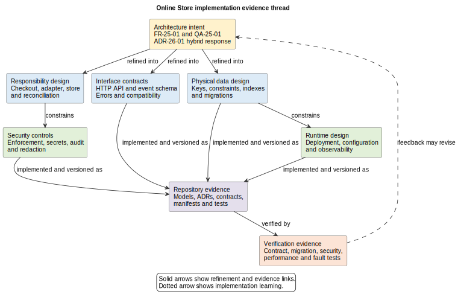

# 27. Detailed Design and Implementation

## Chapter purpose

Detailed design turns architectural intent into information that a team can build, configure, test and operate. It refines responsibilities, interfaces, data structures and controls while preserving their reasons. Implementation is also a source of learning. Measurements, tests and operational discoveries can change detailed design, an Architecture Decision Record (ADR), or even a requirement.

## Reader outcomes

By the end of this chapter, the reader should be able to:

- refine architectural responsibilities into implementable components;
- specify application programming interface (API) and event contracts at useful depth;
- connect physical data, security, deployment and observability design;
- keep implementation evidence traceable in a repository;
- use ADRs when implementation reveals a significant choice; and
- assess readiness for architecture review without claiming that design is frozen.

## Prerequisites and dependencies

Read Chapter 26 first. Chapters 4, 8, 10, 11, 12, 18, 19, 20, 21 and 23 provide deeper guidance on structure, data, events, deployment, security and decisions. Chapter 28 explains architecture review.

## Required models and artefacts

A proportionate set may include component responsibilities, interface contracts, event schemas, a physical data model, control specifications, deployment and configuration definitions, observability design, test cases, ADRs and trace links. It is not a mandatory document pack.

## Worked examples

Online Store checkout continues the trace from Chapters 25 and 26. Horizon Bank cross-border payment illustrates stronger control and evidence needs.

## Source requirements

Contract terminology uses official OpenAPI and AsyncAPI specifications. Deployment and observability statements use official Kubernetes and OpenTelemetry documentation. The stage gate and repository practice are the author's recommendations.

## Refine responsibilities before writing code

Detailed design asks, "What must each implementation element do, and what may it rely on?" Start from the responsibilities and boundaries selected in Chapter 26. Decompose only where separate behaviour, ownership, change, testing or failure handling needs to be understood.

For checkout, the API Application might contain a Checkout component, Payment Adapter, Idempotency Store and Reconciliation Worker. Record each component's purpose, inputs, outputs, state, dependencies and failure responsibilities. A Unified Modeling Language (UML) component diagram can show dependencies. A class or package view can explain internal concepts and allowed dependencies where that detail helps implementation.

Avoid producing a class for every code type. Architecture models should expose consequential structure, not duplicate an integrated development environment. Packages need a dependency rule, such as domain logic not depending on provider-specific adapters. Tests or build rules can then check that constraint.

Detailed design is not a licence to change the architecture silently. If the Payment Adapter needs durable state, the team checks whether ownership and deployment views still agree. A significant change receives an ADR or supersedes an earlier one.

## Specify interfaces as contracts

An interface contract states what participants may send, receive and expect. For a Hypertext Transfer Protocol (HTTP) API, include operation purpose, path and method, authentication, request and response schemas, status meanings, validation, error representation, idempotency and versioning expectations. The OpenAPI Specification provides a machine-readable description format for HTTP APIs. A contract is still incomplete if its prose and runtime behaviour disagree.

For `POST /checkouts`, define the customer context, basket reference and idempotency key. Distinguish accepted, declined, pending and invalid outcomes. State which fields are required, which identifiers remain stable and whether a retry returns the existing outcome. Include examples for difficult cases, but do not fill the chapter with complete payloads.

An event contract answers a different question. It describes a message, the channel or address, producer and consumer expectations, event identity, subject, time, schema and compatibility. AsyncAPI can describe message-driven APIs through channels, operations and messages. `PaymentOutcomeRecorded` should be an event about something that happened, not a disguised request named `ProcessPayment`.

Specify delivery assumptions honestly. A broker may deliver a message more than once. Define duplicate handling, ordering scope, retry, dead-letter or quarantine handling, retention and sensitive-data rules where relevant. Schema compatibility must be tested against consumers rather than asserted with the word "versioned".

## Design physical data structures

A logical model explains business meaning and ownership. A physical model chooses tables, columns, keys, indexes, constraints, partitions or document structures for a particular implementation. The physical design should preserve the earlier meaning while addressing volume, access paths, integrity, retention and recovery.

Online Store might use `checkout_attempt`, keyed by an internal attempt identifier with a unique idempotency key and customer scope. It stores provider correlation, outcome state and timestamps. An `order` references the successful attempt. A uniqueness constraint supports duplicate prevention, but it does not replace transaction and retry design.

Record which component may write each structure, how migrations are applied and reversed or made forward-compatible, how personal data is minimised, and how retention is enforced. Indexes should follow measured queries and volumes. Avoid presenting a speculative schema as permanent truth.

## Make security controls implementable

Turn each selected control into a reviewable statement: control intent, enforcement point, configuration, owner and evidence. "Use authentication" is too vague. "The API gateway validates the customer token; the Checkout component checks that the basket belongs to that customer; automated tests cover cross-customer access" is assessable.

Define secret handling, encryption settings, service identity, access authorisation, input validation, audit events and sensitive-data redaction. Keep payment-card data outside Online Store boundaries where the provider flow permits it. For callbacks, specify provider authentication, replay detection, timestamp tolerance and idempotent processing.

Threats can change during implementation. A newly introduced administrative endpoint or telemetry field changes the attack surface. Update the threat model and control mapping, then record residual risk rather than assuming the earlier review still covers the solution.

## Define deployment, configuration and observability

Deployment detail maps built artefacts to runtime resources. It may include container images, workloads, services, routes, databases, queues, policies, resource requests and scaling rules. Kubernetes manifests are one possible representation, not a universal requirement. Keep an immutable artefact the same across environments and supply environment-specific configuration and secrets separately.

Configuration is architecture when it changes safety, capacity or behaviour. Record defaults, valid ranges, ownership and rollout. A timeout must fit the end-to-end response budget. Retry counts must consider provider load and duplicate effects. Feature flags need removal criteria. Secrets must not be committed with ordinary configuration.

Observability design identifies the questions operators must answer, then the telemetry needed. OpenTelemetry supports traces, metrics and logs and can route telemetry through a Collector. For checkout, propagate a correlation identifier, measure response latency and pending-attempt age, trace provider calls, log state transitions without card data, and alert on unreconciled attempts. State the service owner and response action. A dashboard without ownership is not an operational design.

## Keep tests and traceability close to implementation

Extend the trace from Chapter 26:

`requirement -> ADR -> design element -> repository artefact -> verification case -> evidence`

Stable identifiers make links searchable. A contract test can reference `FR-25-01`; a performance scenario can reference `QA-25-01`; a migration script can link to its physical model and ADR. Evidence may include test results, security scans, review records, deployment dry runs and operational exercises. A link supports judgement; it does not prove satisfaction by itself.

Keep diagrams as code, contracts, configuration, ADRs and tests under version control where practical. Review changes together when they express one decision. Generated exports should be reproducible from editable sources. Repository history then shows what changed and why, while automated checks catch broken references or invalid definitions.

Figure 27-01 shows the refinement thread. Separate boxes prevent a contract, schema or manifest from being mistaken for the whole design. Verification evidence feeds back because implementation can expose a false assumption.

*Figure 27-01. Requirements and ADR-26-01 are refined into complementary detailed-design artefacts and repository evidence. Verification can confirm the response or trigger a change to intent.*

## Implementation feedback and ADRs

Use an ADR when a discovered choice has lasting architectural consequences. Examples include changing the transaction boundary, adopting an event for recovery, accepting a schema-compatibility constraint or selecting a secrets mechanism. Record context, options, decision and consequences. Do not create an ADR for every local coding choice.

A failed load test may show that the synchronous response budget is infeasible. The correct response is not to hide the result. Revisit the timeout, interaction design, ADR or quality requirement with the relevant stakeholders. This is controlled learning, not design failure.

## Recommended model set

| Question | Possible artefact | Useful evidence |
|---|---|---|
| What does each element implement? | component, package or responsibility view | dependency checks and unit tests |
| What may participants exchange? | OpenAPI or event contract | contract and compatibility tests |
| How is information stored? | physical model and migration design | migration and integrity tests |
| Where is a control enforced? | control specification and threat-model update | security tests and audit records |
| What runs where and with what settings? | deployment and configuration definition | deployment validation and rollback exercise |
| How will behaviour be understood? | telemetry and alert design | trace, metric, log and alert evidence |
| Why was a consequential choice made? | ADR | linked review and test results |
| Does implementation realise intent? | traceability map | verification evidence |

## Worked example: Online Store checkout

`ADR-26-01` selected a hybrid checkout response. The team assigns request validation and orchestration to Checkout, provider translation to Payment Adapter, uniqueness to Idempotency Store and uncertain-outcome recovery to Reconciliation Worker.

The OpenAPI contract defines `POST /checkouts` with an idempotency key and confirmed, declined, pending and validation outcomes. The event contract defines `PaymentOutcomeRecorded`, including attempt identifier, provider correlation, outcome and event time. Consumer compatibility tests guard schema evolution.

The physical model adds a unique scoped idempotency key and explicit attempt states. A database migration is tested against production-like data. Callback controls include authenticated provider identity, replay protection and audit events. Deployment configuration defines timeout and retry budgets, two application replicas, durable reconciliation work and secrets supplied outside the image.

Telemetry links customer request, provider attempt and reconciliation. Tests cover simultaneous retries, delayed callbacks, provider timeout, unauthorised basket access and telemetry redaction. A fault test finds that the original retry interval creates provider bursts. The team changes configuration and records the consequential rate-control decision rather than pretending the original design was final.

At Horizon Bank, a cross-border payment needs similarly linked contracts, ledger and screening data structures, segregation-of-duties controls, deployment definitions and evidence. Banking Industry Architecture Network (BIAN) Service Domains can clarify semantic responsibilities, but they are not automatically deployable microservices.

## Stage-gate checklist

- [ ] Responsibilities and allowed dependencies implement the architecture intent.
- [ ] API and event contracts cover normal, invalid, duplicate and failure cases.
- [ ] Physical structures preserve ownership, integrity, lifecycle and recovery needs.
- [ ] Controls identify enforcement points, owners and evidence.
- [ ] Deployment and configuration address capacity, failure and rollback.
- [ ] Observability supports named operational questions and actions.
- [ ] Significant implementation choices are recorded in ADRs.
- [ ] Requirements, design artefacts, repository files, tests and evidence are traceable.
- [ ] Diagrams, contracts and generated outputs are reproducible and reviewed together.
- [ ] Open risks and assumptions have owners; learning can reopen design.

## Common mistakes

- Treating detailed design as code documentation for every class.
- Freezing architecture before prototypes, tests or deployment reveal evidence.
- Publishing an API schema without behavioural, error or compatibility rules.
- Assuming a queue guarantees ordering, uniqueness or successful processing.
- Designing tables without ownership, migration, retention or recovery rules.
- Writing "secure" without an enforcement point and testable control.
- Committing secrets or rebuilding artefacts for each environment.
- Collecting telemetry without privacy rules, ownership or response actions.
- Allowing diagrams, contracts, manifests and runtime behaviour to drift apart.
- Treating a BIAN Service Domain as automatically one microservice.

## Key takeaways

- Detailed design makes architectural intent buildable and testable.
- Responsibilities matter more than exhaustive class diagrams.
- Contracts include behaviour and compatibility, not only field shapes.
- Data, controls, deployment, configuration and observability form one coherent design.
- Repository artefacts and tests provide reviewable implementation evidence.
- ADRs preserve consequential implementation choices.
- Feedback from implementation can change design or requirements.

## Practical exercise

Design the detailed implementation for an Online Store return-status feature. Define three component responsibilities, one HTTP operation with success and error outcomes, one event with duplicate-handling expectations, and a small physical structure. Add one access control, one configuration value, one metric and two verification cases. Create a trace from a requirement to each evidence item.

A strong answer keeps customer identity checks at an explicit enforcement point, gives the return record one authoritative writer, states compatibility and retry expectations, keeps secrets out of configuration files and explains what evidence would cause the design to change.

## Review checklist

- [ ] Each model states its question, audience and level of detail.
- [ ] Acronyms are defined at first use.
- [ ] Responsibilities, interfaces and data ownership agree across artefacts.
- [ ] Failure, retry, duplicate and recovery behaviour is explicit.
- [ ] Security, configuration and telemetry are testable and owned.
- [ ] ADRs and trace links preserve rationale and evidence.
- [ ] Detail is sufficient for implementation without reproducing the codebase.
- [ ] No model implies a false design freeze or unsupported product guarantee.

## References and further reading

- OpenAPI Initiative, [OpenAPI Specification 3.1.1](https://spec.openapis.org/oas/v3.1.1.html), accessed 11 July 2026.
- AsyncAPI Initiative, [AsyncAPI Specification 3.1.0](https://www.asyncapi.com/docs/reference/specification/latest), accessed 11 July 2026.
- Kubernetes project, [Kubernetes documentation](https://kubernetes.io/docs/concepts/), accessed 11 July 2026.
- OpenTelemetry project, [OpenTelemetry documentation](https://opentelemetry.io/docs/), accessed 11 July 2026.
- Michael Nygard, [Documenting Architecture Decisions](https://cognitect.com/blog/2011/11/15/documenting-architecture-decisions), 15 November 2011, accessed 11 July 2026.
