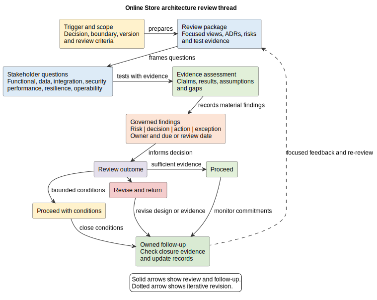

# 28. Architecture Review

## Chapter purpose

An architecture review is a structured examination of a proposed or implemented architecture. It asks whether the design addresses its stated needs, risks and constraints, using appropriate evidence. A useful review improves a decision and makes follow-up visible. It is not a ceremonial gate, a search for perfect diagrams or an opportunity for a committee to redesign the solution.

## Reader outcomes

By the end of this chapter, the reader should be able to:

- choose an appropriate review type and time;
- define scope, stakeholders, questions and evidence;
- review functional fit and important quality attributes;
- distinguish a risk, decision, action and exception;
- reach a proportionate outcome without claiming certainty; and
- follow findings through implementation and operations.

## Prerequisites and dependencies

Read Chapter 27 first. Chapters 12, 18, 19, 20 and 21 provide deeper security, integration, data, deployment and security-review techniques. Chapter 29 continues into operations and support.

## Required models and artefacts

A proportionate review package may contain a scope statement, stakeholder concerns, selected architecture views, requirements and Architecture Decision Records (ADRs), risk and assumption records, interface and data evidence, verification results, and an action log. This is a menu, not a compulsory document pack.

## Worked examples

Online Store checkout continues the thread from Chapters 25 to 27. Horizon Bank cross-border payment shows how stronger regulatory, control and operational concerns widen participation and evidence.

## Source requirements

Architecture-description terminology follows ISO/IEC/IEEE 42010:2022. Quality-attribute questions build on the Software Engineering Institute scenario structure introduced in Chapter 25. Cybersecurity governance and risk treatment are informed by the National Institute of Standards and Technology (NIST) Cybersecurity Framework 2.0. The review workflow and outcome labels are the author's recommendations.

## Review for a decision, not for ceremony

The first question is, "What decision will this review support?" Examples include selecting an option, allowing implementation to start, accepting a release condition, or deciding whether evidence justifies moving to the next stage. Without a decision, a meeting can collect opinions but cannot define useful scope.

Review does not mean that architecture happens once at a gate. Short reviews can occur during discovery, option selection, detailed design, implementation and before a material operational change. Early reviews expose false assumptions cheaply. Later reviews compare intent with test and runtime evidence. A major change can reopen an earlier conclusion.

Nor does review transfer design ownership to the room. The accountable design owner explains the proposal and responds to findings. Reviewers challenge from relevant perspectives. A decision authority decides within a stated mandate. Specialists contribute evidence, but the loudest participant does not become the architect by default.

## Choose the review type and timing

Review depth should follow consequence and uncertainty. Useful review types include:

- an informal peer review of an emerging model;
- a focused specialist review, such as security, data or operability;
- an option or significant-decision review before commitment;
- an implementation-conformance review using repository and test evidence;
- a stage-gate review supporting a governed proceed or stop decision; and
- a post-implementation review using operational learning.

These types can be combined, but not every change needs a large board. A low-risk internal adjustment may need peer review and automated checks. A cross-border payment change affecting screening, customer data, ledgers and recovery needs business, risk, security, data, integration, operations and delivery perspectives.

Schedule the review when evidence is mature enough to assess but change is still practical. A context and option review can happen before detailed contracts exist. A release-readiness review cannot rely only on a target diagram. It needs implementation, test, deployment and operational evidence.

## Define scope and prepare the review package

A review scope should state the decision, architecture boundary, lifecycle point, included changes, excluded concerns, assumptions, applicable constraints and required outcome. Record the baseline or version being reviewed. "Review checkout" is too broad. "Assess whether checkout release candidate 3 can proceed to controlled production use, considering duplicate payment, customer access, provider failure and support readiness" is reviewable.

Select views by stakeholder concern. ISO/IEC/IEEE 42010 treats an architecture description as addressing stakeholder concerns through views governed by viewpoints. In practice, the package might include context, component, runtime interaction, data, threat, deployment and operational views. Each view should state its question, audience, boundary, level and important omissions.

Include evidence, not only presentation slides. Useful evidence includes requirements, ADRs, interface contracts, data ownership, threat analysis, test results, deployment validation, capacity measurements, recovery exercises and open risks. Identify evidence age, environment and limitations. A successful test with unrealistic volume is still useful, but it does not support a production-capacity claim.

Send a short package early enough for reviewers to examine it. Name the questions on which each reviewer is expected to contribute. This reduces meeting narration and gives missing evidence time to surface.

## Ask from stakeholder concerns

The review chair or facilitator keeps the discussion tied to scope. The design owner explains intent, alternatives and known weaknesses. Reviewers should ask questions that can change a decision, not demonstrate vocabulary.

### Functional fit

Ask whether responsibilities and interactions deliver the required outcomes. Trace important functional requirements to design elements and verification. Walk through normal, invalid, duplicate, timeout and recovery paths. Check that ownership is explicit and that an external dependency is not treated as guaranteed.

### Security and privacy

Identify assets, identities, trust boundaries, threats, control enforcement points and residual risk. Ask who can perform each sensitive action, how service identity is established, where access authorisation is enforced, how secrets are handled and what audit evidence exists. Review data minimisation, disclosure, retention and telemetry redaction. A product name is not evidence that a control works.

### Data

Ask what information is authoritative, who may create or change it, and how meaning remains consistent across interfaces. Check classification, integrity, retention, lineage, reconciliation, migration and deletion. A database diagram alone does not explain ownership or lifecycle.

### Integration

Review protocols, contracts, direction, dependency behaviour and failure handling. Ask about timeouts, retries, idempotency, ordering, duplicate delivery, compatibility and reconciliation. Trace one end-to-end interaction. Avoid an unlabelled "integrates with" arrow when the integration style affects risk.

### Performance and resilience

Use measurable quality-attribute scenarios. State the source of a stimulus, environment, affected element, response and response measure. Compare capacity evidence with expected peaks and headroom. Explore dependency slowdown, partial failure, retry amplification, loss of an availability zone and recovery from uncertain outcomes. Redundant boxes do not prove resilience.

### Operability

Ask how an operator knows the service is healthy, degraded or failing. Review telemetry, service-level indicators, alerts, ownership, runbooks, deployment, rollback, backup, recovery and reconciliation. Confirm that alerts lead to named actions. Chapter 29 develops these topics further.

### Business and governance fit

Check whether the architecture supports the intended business outcome, cost and delivery constraints. Identify policy, regulatory, contractual and organisational obligations. Confirm that an exception is accepted by someone with authority and that temporary arrangements have an expiry or review date.

## Assess evidence and uncertainty

Review is an argument supported by evidence. For each important concern, connect the claim, the model or decision that explains the response, and the evidence that tests it. For example:

`duplicate payment must be prevented -> idempotency design -> concurrency and retry test results`

Evidence has limits. A model shows intended structure. A test shows behaviour under stated conditions. A production measure shows observed behaviour over a period. None proves every future situation. Record assumptions, confidence and gaps rather than replacing uncertainty with "compliant".

Use sampling deliberately. A reviewer cannot inspect every class, rule and log line. Select high-consequence scenarios, boundaries and changes. Automated checks can cover consistent rules; human review concentrates on meaning, trade-offs and risks.

## Record risks, decisions, actions and exceptions

Do not put every finding into one vague action list.

| Record | Meaning | Minimum useful content |
|---|---|---|
| Risk | An uncertain event or condition that could affect an objective | cause, consequence, likelihood or exposure, treatment and owner |
| Decision | A consequential choice among alternatives | context, options, choice, rationale and consequences |
| Action | Work needed to obtain evidence or change an artefact | deliverable, owner, due point and closure evidence |
| Exception | An authorised departure from a rule or expected control | scope, rationale, risk, authority, compensating measure and review date |

A comment such as "check resilience" is not an actionable finding. State what evidence is absent or what scenario fails. Severity should reflect consequence and urgency, not reviewer seniority. Link each item to affected requirements, ADRs, views, controls and tests where useful.

Close an action only when its acceptance evidence is examined. If an action changes the architecture materially, update the affected models and ADRs and consider a focused re-review. Do not close a diagram comment while leaving the implementation unchanged.

## Reach a proportionate outcome

The decision authority should use explicit criteria announced in advance. A practical set of outcomes is:

- **Proceed:** evidence is sufficient for the stated decision and no blocking finding remains.
- **Proceed with conditions:** bounded actions or exceptions have owners, dates and follow-up, and the authority accepts the remaining exposure.
- **Revise and return:** a material risk, contradiction or evidence gap prevents the decision.

These are not universal standard terms. Organisations may use different labels. Whatever the labels, record scope, version, decision authority, rationale, findings and follow-up. "Approved architecture" should not imply that every future change is safe or that implementation automatically conforms.

Figure 28-01 shows the review thread. Questions lead to evidence assessment, while findings become governed records rather than disappearing into meeting notes. Follow-up can revise the architecture and return with better evidence.

*Figure 28-01. A scoped review assesses stakeholder questions against evidence, records findings and reaches a proportionate outcome. Follow-up may revise the architecture and evidence; the figure is a teaching workflow, not a mandatory governance method.*

## Recommended model set

| Review question | Possible artefact | Supporting evidence |
|---|---|---|
| What decision and boundary are in scope? | review brief and context view | versioned change and stakeholder record |
| Does the solution meet needs? | requirement trace and scenario views | functional and acceptance results |
| Are responsibilities coherent? | component and interaction views | dependency and contract checks |
| Is information governed? | data ownership, lifecycle and lineage views | integrity, migration and reconciliation results |
| Are threats and controls addressed? | threat and control views | security test and audit evidence |
| Can it meet quality attributes? | quality-attribute scenarios and deployment view | capacity, fault and recovery results |
| Can teams operate it? | observability and operational context views | alerts, runbooks and exercises |
| What remains unresolved? | risk, decision, action and exception records | closure evidence and follow-up review |

## Worked example: Online Store checkout

The review decision is whether the hybrid checkout response from `ADR-26-01` is ready for controlled production use. Scope includes the API Application, payment-provider interaction, idempotency state, reconciliation, customer access and operational support. Product, architecture, engineering, testing, security, data and operations representatives receive the package.

The package contains `FR-25-01`, `QA-25-01`, the ADR, component and interaction views, OpenAPI and event contracts, physical data design, threat controls, deployment configuration and results from concurrency, timeout, access and fault tests. The design owner states that provider timeout may produce a pending response and that reconciliation owns uncertain outcomes.

The functional walkthrough confirms normal and declined paths. A duplicate-payment scenario shows that the scoped idempotency key and uniqueness constraint are exercised by simultaneous-retry tests. Security evidence shows customer ownership checks at the Checkout component and redaction of payment data. The integration reviewer finds that callback replay testing covers duplicate messages but not a delayed callback after reconciliation has closed an attempt.

The finding becomes a medium risk and a test action, not an immediate redesign by the review group. Operations also requests evidence that an alert for old pending attempts reaches the service owner. The authority chooses **Proceed with conditions** for a limited release: add the delayed-callback test, prove alert routing before wider rollout and review both results in five working days. If the test exposes a state-transition defect, the team updates the design and returns for focused review.

At Horizon Bank, a cross-border payment review adds sanctions screening, ledger integrity, segregation of duties, regulatory reporting, data residency and recovery evidence. Business control owners and risk specialists participate. Banking Industry Architecture Network (BIAN) concepts may clarify semantic responsibilities, but the review does not presume that each Service Domain is one microservice.

## Stage-gate checklist

- [ ] The review supports a named decision at a stated lifecycle point.
- [ ] Scope, boundary, version, exclusions and criteria are explicit.
- [ ] Stakeholders cover the material business and technical concerns.
- [ ] The package contains focused views, rationale, risks and relevant evidence.
- [ ] Functional, data, integration, security, performance, resilience and operability questions are proportionate to risk.
- [ ] Evidence environment, age, assumptions and limitations are visible.
- [ ] Risks, decisions, actions and exceptions are distinguished and owned.
- [ ] The outcome and decision authority are recorded.
- [ ] Conditions have closure evidence, dates and follow-up.
- [ ] Material findings can reopen architecture rather than being hidden to pass the gate.

## Common mistakes

- Holding the first review after implementation choices are expensive to change.
- Inviting every specialist to every review without naming their question.
- Reviewing a slide deck without versioned models or evidence.
- Treating checklist completion as proof of quality.
- Allowing the meeting to become design-by-committee.
- Accepting product names as security, resilience or operability evidence.
- Mixing risks, decisions, actions and exceptions in one unowned list.
- Closing findings because prose changed while code, configuration or tests did not.
- Calling an architecture universally approved when the decision covered one scope and version.
- Treating a BIAN Service Domain as automatically one deployable service.

## Key takeaways

- A review exists to support a named decision.
- Timing and depth should follow consequence, uncertainty and available evidence.
- Stakeholder concerns determine the useful model set.
- Claims need evidence with visible limits.
- Risks, decisions, actions and exceptions require different records.
- A proportionate outcome can include bounded conditions.
- Follow-up is part of review, and new evidence can reopen architecture.

## Practical exercise

Prepare a review for an Online Store returns feature that issues refunds through an external payment provider. Define the review decision, boundary, exclusions, five stakeholders and one question for each. Select no more than six artefacts. Write one measurable performance or resilience scenario, one security question and one data-lifecycle question. Classify four sample findings as a risk, decision, action or exception, then choose an outcome and justify it.

A strong answer reviews before broad release, includes customer access, refund idempotency, provider failure, authoritative refund state and support ownership, and requests test or operational evidence rather than only diagrams. An exception names authority, compensating measure and review date. Conditions are bounded and do not disguise a blocking defect.

## Review checklist

- [ ] Plain language precedes formal terminology.
- [ ] Acronyms are defined at first use.
- [ ] Review purpose, type, timing, scope and authority are explicit.
- [ ] Each view answers a stakeholder question at a clear abstraction level.
- [ ] Quality attributes use scenarios or measurable evidence.
- [ ] Findings and outcomes do not imply certainty beyond the reviewed scope.
- [ ] Review remains challenge and governance, not collective design ownership.
- [ ] The Online Store and Horizon Bank examples agree with earlier chapters.

## References and further reading

- ISO/IEC/IEEE, *Systems and software engineering, Architecture description*, ISO/IEC/IEEE 42010:2022, 2022, accessed 11 July 2026.
- National Institute of Standards and Technology, [The NIST Cybersecurity Framework 2.0](https://doi.org/10.6028/NIST.CSWP.29), February 2024, accessed 11 July 2026.
- Carnegie Mellon University Software Engineering Institute, [Eliciting and Specifying Quality Attribute Requirements](https://www.sei.cmu.edu/library/eliciting-and-specifying-quality-attribute-requirements/), 2013, accessed 11 July 2026.
