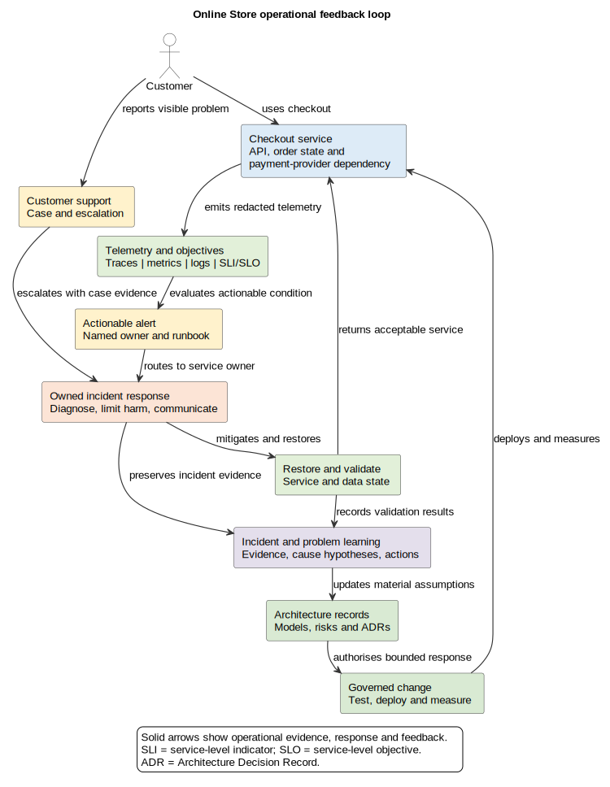

# 29. Operations and Support

## Chapter purpose

Architecture continues after release. Runtime evidence, support experience and recovery exercises reveal how a design behaves under real demand, dependency failure and human intervention. This chapter shows how operational models connect service ownership, observability, response, continuity and learning back to architecture change.

## Reader outcomes

By the end of this chapter, the reader should be able to:

- define operational readiness and service ownership;
- select a small operational model set;
- distinguish telemetry, indicators, objectives, alerts and dashboards;
- model incidents, problems, changes, recovery and reconciliation; and
- use operational feedback to revise architecture deliberately.

## Prerequisites and dependencies

Read Chapter 28 first. Chapters 11, 12, 18, 19 and 20 provide deeper deployment, security, runtime, data and infrastructure techniques. Chapter 30 uses operational evidence when planning change and migration.

## Required models and artefacts

A proportionate operational set can include an operational context, service ownership record, deployment and dependency view, observability view, service objectives, alert catalogue, runbooks, incident sequence, recovery view, data lineage and reconciliation procedure. This is a menu, not a compulsory pack.

## Worked examples

Online Store checkout continues the lifecycle thread. Horizon Bank outgoing payments illustrates stronger integrity, continuity, security and support concerns.

## Source requirements

Service-level indicator and objective guidance is based on Google's official Site Reliability Engineering material. Incident response follows National Institute of Standards and Technology (NIST) Special Publication 800-61 Revision 3 at a high level. Recovery terminology uses NIST SP 800-34 Revision 1 informatively. Observability concepts use official OpenTelemetry documentation. The model set and stage gate are author recommendations.

## Operations is part of architecture

Operations asks whether a service can be understood, supported and restored while it is running. Support connects customers and staff to that work. Neither begins after architecture ends. If operators cannot identify a failing dependency, reconcile uncertain data or perform a safe recovery, the design is incomplete.

Operational evidence can disprove design assumptions. A queue may grow sooner than capacity tests predicted. A technically successful retry may create duplicate business work. Support cases may reveal an inaccessible customer journey that telemetry does not detect. These findings can change interfaces, data ownership, deployment, controls or service boundaries.

## Establish operational readiness

Operational readiness means that the people, models, controls and evidence needed to operate a change are sufficiently prepared for its stated release scope. It is not a claim that failure is impossible.

Before release, confirm:

- a named service owner and response responsibilities;
- supported hours, users and critical journeys;
- runtime dependencies and failure assumptions;
- telemetry, objectives, alerts and access controls;
- deployment, rollback and configuration procedures;
- runbooks for likely and high-consequence conditions;
- backup, restore, failover and reconciliation needs;
- support escalation and customer communication paths; and
- known risks, exceptions and review dates.

Evidence should match the claim. A runbook review checks clarity. A recovery exercise shows what happened under stated conditions. Neither guarantees future recovery.

## Make service ownership visible

A **service owner** is accountable for service health, change and operational outcomes. An operations team may monitor many services, while product, engineering, security, data and support roles retain distinct responsibilities.

Record the service boundary, owner, technical responders, business contact, data owner, dependency contacts, support route and decision authority. Define who may declare an incident, approve emergency change, communicate externally and accept residual risk. Avoid a diagram whose only owner is "IT".

Ownership must cover third-party dependencies without pretending to control them. The Online Store owner cannot repair the payment provider, but can define timeouts, fallback behaviour, escalation, customer messaging and reconciliation.

## Observe behaviour, not merely components

**Observability** is the ability to understand system behaviour from telemetry such as traces, metrics and logs. A trace follows a request across components. A metric is a numeric measurement over time. A log records an event or message. Health checks, business events and synthetic journeys can add evidence.

An observability view should show instrumentation, collection, processing, storage, access and alert routing. It should also show where sensitive-data redaction occurs. Telemetry is operational data, so define access, retention, integrity and privacy handling. Account references, tokens and payment details should not leak into broad logs or dashboards.

Dashboards help people see trends and current state. They do not replace alerts, ownership or diagnosis. Collecting every signal is also not the goal. Start from important user journeys, failure modes and decisions.

## Use indicators and objectives carefully

A **service-level indicator (SLI)** is a measured aspect of service behaviour, such as the proportion of valid checkout requests completed successfully. A **service-level objective (SLO)** is a target for an SLI over a stated period. These definitions follow Google's official Site Reliability Engineering guidance, but the choice of indicator and target remains contextual.

For example: "During a rolling 28-day window, at least 99.5 per cent of valid checkout attempts receive an accepted, declined or pending result within three seconds." The definition must state valid requests, result states, measurement point, exclusions and data source. It is an objective, not a guarantee.

Do not choose only infrastructure measures. CPU usage may help diagnose saturation but does not directly describe whether customers can complete checkout. Combine user-centred indicators with dependency, queue, capacity and data-integrity signals.

## Design actionable alerts

An alert should identify a condition that needs timely action. Record its signal, threshold or rule, severity, routing, owner, runbook and expected response. Alerts should cover important symptoms and selected causes without waking responders for every harmless variation.

Useful checkout alerts might include a sustained fall in valid completion rate, growing payment-confirmation backlog, old pending attempts, reconciliation differences or failed telemetry collection. Test alert routing. A rule in configuration is not evidence that a person can receive and act on it.

## Write runbooks for decisions

A runbook gives a responder a safe starting point. Include purpose, trigger, prerequisites, access, diagnostic steps, decision points, safe actions, rollback or stop conditions, escalation, communication and evidence to preserve. Link commands to their environment and authority rather than encouraging blind copying.

Review runbooks after exercises and incidents. Automate repeatable low-risk steps where appropriate, but retain visible safeguards for destructive, security-sensitive or financially significant actions.

## Model incidents, problems and changes separately

An **incident** is an unplanned interruption or reduction in service, or another condition requiring coordinated response. Immediate work aims to limit harm and restore acceptable service. NIST SP 800-61 Revision 3 organises incident response around preparation and ongoing Detect, Respond and Recover activities, with lessons informing improvement.

A **problem** is the underlying cause, or potential cause, of one or more incidents. Problem work may continue after restoration. A **change** modifies the service or its operating environment. An emergency change can reduce incident impact, but it still needs authority, traceability and later review.

An incident sequence or timeline should show detection, triage, ownership, containment or mitigation, restoration, validation, communication and evidence preservation. A problem record can connect recurring symptoms to hypotheses, analysis, corrective options and architecture decisions. Do not use an incident review to assign blame. Examine system conditions, decisions and safeguards.

## Plan capacity and resilience

Capacity models connect workload assumptions to resources and bottlenecks. Record expected normal and peak demand, growth, service objectives, headroom and limiting dependencies. Observe saturation, queue depth, connection pools, storage and third-party limits. Autoscaling one component does not scale a shared database or provider.

Resilience models show failure modes, degraded behaviour and recovery paths. Ask what happens when a dependency slows, a zone fails, messages duplicate or telemetry is unavailable. Redundant boxes alone do not show whether traffic shifts, state remains consistent or responders know what to do.

## Model disaster recovery and reconciliation

**Disaster recovery (DR)** is planned restoration after serious disruption. A **Recovery Time Objective (RTO)** is the target maximum restoration time. A **Recovery Point Objective (RPO)** is the target maximum acceptable data loss measured as time. Targets need design, procedures and exercises; they are not promises merely because they appear in a document.

A recovery view should show primary and recovery environments, data replication or backup, triggers, authority, dependency readiness, validation and failback. Replication is not a backup by itself. Recovery can leave uncertain business state, particularly with asynchronous messages or external payments.

**Data reconciliation** compares records and corrects or governs differences. Identify authoritative sources, comparison keys, time windows, tolerated differences, investigation ownership, correction authority and audit evidence. For checkout, reconcile provider outcomes, payment attempts and order state before telling a customer that an uncertain payment is settled.

## Protect operations and support paths

Operational access is powerful. Model individual identity, least privilege, separation of duties, emergency access, secrets, audit events and periodic access review. Support staff should see only the customer and transaction data needed for a case. Mask sensitive values in screens and telemetry, and record justified access.

Privacy remains relevant during diagnosis. A larger log retention period can help investigations but increases exposure. Record purpose, access, retention and deletion. Incident urgency does not make uncontrolled copying of production data acceptable.

## Close the support feedback loop

Support contacts provide evidence about customer-visible failure, confusing status and accessibility. Classify and aggregate themes without hiding severe individual cases. Link recurring contacts to incidents, problems, requirements and architecture decisions.

Figure 29-01 shows two paths into response: telemetry alerts and customer reports. Restoration returns service, while learning can revise models and controlled change. Not every incident changes architecture, but material evidence must be able to do so.

*Figure 29-01. Runtime signals and customer reports reach owned response and restoration. Incident and problem learning updates architecture records, which can govern a change back into the service. The loop does not imply that every failure is detected automatically or requires redesign.*

## Recommended operational model set

| Question | Useful model or record | Evidence |
|---|---|---|
| What is operated and by whom? | operational context and ownership record | rota, contacts and authority check |
| Where does it run and depend? | deployment and dependency view | deployment inventory and dependency test |
| How is behaviour understood? | observability and telemetry-flow view | sampled traces, metrics, logs and access review |
| What acceptable service is targeted? | SLI and SLO definition | measured series with exclusions |
| What requires action? | alert catalogue and routing map | alert exercise |
| How is service restored? | runbook and incident sequence | exercise or incident evidence |
| How is serious disruption handled? | recovery view and continuity plan | restore, failover and failback exercise |
| How is data made trustworthy? | lineage and reconciliation procedure | comparison and correction evidence |
| What should architecture learn? | problem record, ADR and updated views | reviewed change and follow-up measures |

## Worked example: Online Store checkout

Checkout depends on the API Application, Order Database and external payment provider. The service owner defines valid completion and old pending attempts as user-centred indicators. Traces correlate one checkout attempt across components; metrics cover completion, latency, backlog and saturation; logs record state transitions without tokens or full payment data.

A provider slowdown causes pending attempts to rise. The alert routes to the responder with a checkout-dependency runbook. Support also reports customers retrying because the pending message is unclear. The responder confirms that the store remains available, limits retry amplification and changes customer communication under approved operational authority. Reconciliation compares provider outcomes with payment attempts and orders before final status is issued.

Service is restored before the root cause is known. Problem analysis finds that the provider timeout, retry guidance and queue capacity assumptions interact badly. The team updates the runtime interaction, capacity assumptions, customer-state model and an Architecture Decision Record (ADR). A controlled change improves pending-status polling and queue protection. Later measures test whether old pending attempts and repeat contacts fall.

For Horizon Bank outgoing payments, the same pattern adds ledger integrity, financial-crime dependencies, maker-checker controls, regulatory communication, recovery sites and stricter reconciliation authority. Banking Industry Architecture Network (BIAN) Service Domains may clarify semantic responsibilities, but they do not automatically define deployable services or operational ownership.

## Operational-readiness stage gate

- [ ] The release scope, critical journeys, service hours and dependencies are stated.
- [ ] Service, data, security, support and response ownership is named.
- [ ] Indicators and objectives have definitions, windows, exclusions and sources.
- [ ] Alerts are actionable, routed and exercised.
- [ ] Runbooks include authority, safe actions, stop conditions and escalation.
- [ ] Capacity assumptions and bottlenecks are recorded.
- [ ] Failure, degraded-mode and recovery behaviour is modelled.
- [ ] Backup, restore, RTO, RPO, failback and reconciliation needs are addressed.
- [ ] Operational access, telemetry privacy and audit controls are reviewed.
- [ ] Support and incident learning can update architecture records.
- [ ] Open risks and exceptions have owners and review dates.

## Common mistakes

- Treating operations as a handover instead of a design stakeholder.
- Naming a team but no accountable service owner.
- Collecting telemetry without a question, retention rule or privacy control.
- Calling a dashboard an observability strategy.
- Defining an SLO without a measurement point, window or exclusions.
- Alerting on every fluctuation without an action or runbook.
- Mixing restoration, root-cause analysis and permanent change into one step.
- Assuming autoscaling removes database and dependency bottlenecks.
- Drawing duplicate infrastructure without triggers, authority or failback.
- Treating replication as backup or recovery as proof of reconciled data.
- Giving support broad production access for convenience.
- Closing an incident without feeding material evidence into architecture.

## Key takeaways

- Operations and support are part of architecture.
- Ownership, objectives and response authority must be explicit.
- Observability combines useful telemetry with processing, access and action.
- SLOs are measurable objectives, not guarantees.
- Incidents restore service; problem work investigates underlying causes.
- Recovery must include data validation and reconciliation.
- Runtime and support evidence can change architecture.

## Practical exercise

Design an operational model set for Online Store returns and refunds. Define the service owner, critical journey, two dependencies, one SLI and a cautious SLO. Specify two actionable alerts and outline one runbook. Model a provider timeout that leaves a refund uncertain, including customer communication, reconciliation, restoration and problem learning. Then identify one architecture model and one ADR that operational evidence might update.

A strong answer distinguishes an accepted refund request from confirmed provider settlement, avoids promising an unsupported objective, limits support access, names reconciliation authority and shows controlled architecture change after learning.

## Review checklist

- [ ] Plain language precedes formal terminology.
- [ ] Acronyms are defined at first use.
- [ ] Operational readiness and ownership are explicit.
- [ ] Telemetry, indicators, objectives, dashboards and alerts are distinguished.
- [ ] Incident, problem and change responsibilities are separated.
- [ ] Capacity, resilience, recovery and reconciliation are modelled proportionately.
- [ ] Security, privacy and support paths are visible.
- [ ] Operational learning can revise models and decisions.
- [ ] Examples agree with earlier chapters and avoid false guarantees.
- [ ] `FIG-29-01` remains no further than Review pending author approval.

## References and further reading

- Google, [Service Level Objectives](https://sre.google/sre-book/service-level-objectives/), *Site Reliability Engineering*, accessed 11 July 2026.
- National Institute of Standards and Technology, [Incident Response Recommendations and Considerations for Cybersecurity Risk Management: A CSF 2.0 Community Profile](https://doi.org/10.6028/NIST.SP.800-61r3), NIST SP 800-61 Revision 3, April 2025, accessed 11 July 2026.
- National Institute of Standards and Technology, [Contingency Planning Guide for Federal Information Systems](https://doi.org/10.6028/NIST.SP.800-34r1), NIST SP 800-34 Revision 1, May 2010, accessed 11 July 2026.
- OpenTelemetry project, [What is OpenTelemetry?](https://opentelemetry.io/docs/what-is-opentelemetry/), accessed 11 July 2026.
