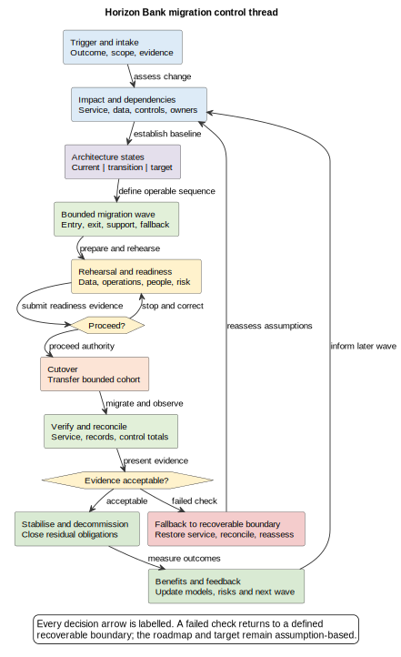

# 30. Change and Migration

## Chapter purpose

Turn an intended architecture change into a controlled, learnable migration. This chapter explains how architects connect evidence, intermediate states, delivery waves, cutover decisions and retirement obligations without pretending that a roadmap guarantees delivery.

## Reader outcomes

By the end of this chapter, you should be able to:

- turn a change trigger into a scoped migration intake;
- relate current, transition and target architecture;
- group dependencies into migration waves with entry and exit criteria;
- plan data movement, reconciliation, cutover, fallback and decommissioning;
- assess readiness across technology, people, operations and governance; and
- use post-change evidence to revise models, risks and expected benefits.

## Prerequisites and dependencies

Chapter 22 explains how to choose transformation and migration views. This chapter uses those views to govern real change. Chapters 24 to 29 provide the evidence thread from discovery, requirements and design through implementation, review and operations. Change may revisit any of those activities. It is not necessarily the final step in a waterfall.

## Required models and artefacts

A useful migration package normally includes a dated current-state baseline, target architecture, one or more transition architectures, dependency map, wave plan, data migration and reconciliation plan, cutover runbook, fallback plan, readiness evidence, communication and training plan, risk and benefit records, and decommissioning checklist.

The package should be proportionate. A configuration change may need only a short decision record and runbook. A bank-platform migration needs several linked views and named authorities.

## Worked examples

The main worked example follows one Horizon Bank payment-platform migration wave. A separate Online Store identity-service exercise asks you to transfer the method to different constraints.

## Source requirements

Official ArchiMate, National Institute of Standards and Technology (NIST) contingency-planning and risk-governance sources establish the factual boundaries. The chapter's intake fields, stage gates, wave template and model-set recommendations are author guidance, not requirements from those sources.

## Change drivers, triggers and intake

Change starts with a reason, not with a preferred product. A trigger may be an operational incident, expiring contract, regulatory obligation, security exposure, capacity limit, business opportunity, unacceptable cost or new customer need. Record the trigger, affected outcome, urgency, evidence owner and decision deadline.

Intake turns that signal into a bounded question. Ask what is changing, what must remain stable, who may be harmed, which services and data are in scope, and what would count as success. Separate facts from assumptions. For example, "the payment platform contract expires in twelve months" is evidence. "A replacement will reduce payment failures" is a hypothesis to test.

An early impact assessment identifies affected capabilities, processes, applications, interfaces, information, controls, infrastructure, suppliers and operating teams. It should also expose dependencies outside programme control. The result is not a complete design. It is enough shared understanding to decide whether to investigate, defer, reject or proceed.

## Current, transition and target architecture

The **current-state baseline** is a dated, evidence-based view of the relevant architecture. It includes actual workarounds, ownership gaps and constraints, not merely the intended design. Calling everything old "legacy" hides useful distinctions.

The **target architecture** describes the intended future arrangement under stated assumptions. It gives direction and review criteria. It is not a delivery guarantee. Funding, regulation, evidence or priorities may change.

A **transition architecture** is a coherent intermediate arrangement that can operate while change is incomplete. It must show coexistence, data authority, temporary interfaces, controls, support ownership and exit criteria. A diagram that simply places current and target boxes side by side misses the difficult middle.

Keep the three states comparable. Use consistent boundaries and names, mark additions, removals and retained elements, and date each view. Record why the transition can operate safely and how temporary elements will be removed.

## Dependencies, waves and sequencing

A dependency map explains what must be available before something else can change. Dependencies may concern data, interfaces, environments, suppliers, skills, approvals, customer communications or operational capacity. Direction and owner matter. "Payments depends on customer data" is too vague unless the required data, timing and authority are stated.

A **migration wave** is a governed grouping of users, products, data, locations or capabilities intended to move together. It is not merely a month on a roadmap. Each wave needs:

- scope and exclusions;
- entry criteria and evidence;
- dependency assumptions;
- migration and verification steps;
- support and communication ownership;
- stop and fallback conditions; and
- exit criteria, including residual work.

Sequence waves to reduce uncertainty and contain harm. A small representative cohort may expose assumptions before wider movement, but a pilot is useful only if its evidence transfers to later waves. Avoid choosing an unrepresentative easy group merely to report success.

Common migration patterns include phased movement, parallel operation, a single cutover, duplication with gradual traffic shift, and a strangler-style replacement around bounded capabilities. None is universally safest. Parallel operation can aid comparison but creates synchronisation and dual-support risk. A single cutover shortens coexistence but concentrates risk. Select a pattern from service, data, recovery and organisational constraints.

## Data migration and reconciliation

Data migration is not just copying rows. First identify data scope, system of record, quality rules, retention duties, privacy controls, lineage and allowable downtime. Then define extraction, transformation, loading, validation, exception handling and reconciliation.

Reconciliation compares expected and observed results using agreed control totals or business invariants. Counts alone are rarely enough. A payment migration might compare instruction count, total value by currency, status distribution, duplicate identifiers and unresolved exceptions. Name who investigates differences and who may accept a documented residual variance.

Decide how changes made during migration are handled. Options include a write freeze, change capture, dual writes or replay from an authoritative journal. Each option changes consistency and recovery risk. Test with representative volume and difficult records, not only clean samples. Protect production data in rehearsal environments.

## Cutover, fallback and rollback

**Cutover** is the controlled transfer of service, data or operational responsibility. A cutover runbook should state sequence, timestamps, owners, dependencies, communication points, verification checks, recoverable boundaries and proceed or stop authority.

Rollback is often used casually to mean "put it back". Some changes are reversible by redeployment. Others alter data, customer behaviour or external messages and cannot be undone cleanly. Use **fallback** for the broader plan to restore an acceptable service state. Describe the recoverable boundary honestly, including data reconciliation and manual operation where required.

The decision authority needs current evidence, not optimism. Readiness checks should cover successful rehearsal, unresolved defects, capacity, security, data quality, monitoring, runbooks, staffing, supplier confirmation and communications. A stop decision is a controlled outcome, not a project failure.

After cutover, use a defined stabilisation period. Observe service, business and data measures; handle exceptions; communicate status; and retain evidence. Exit stabilisation only when named acceptance conditions are met.

## Decommissioning

Removing an old box from the target view does not retire it. **Decommissioning** closes the remaining technical, data, access, support, financial and contractual obligations.

Confirm that consumers have moved, retained data remains accessible and lawful, records are archived or destroyed appropriately, interfaces and scheduled jobs are stopped, accounts and secrets are revoked, monitoring and support queues are removed, licences and contracts are closed, assets are disposed of safely, and repository models are updated. Keep an owner for every exception and temporary dependency.

Premature retirement can remove the only source needed for reconciliation or audit. Endless coexistence also costs money and preserves attack surface. Use explicit exit criteria rather than either extreme.

## Readiness, communication and training

Architecture readiness includes people and operations. Identify who performs new tasks, who supports the transition state, which procedures change and how competence will be demonstrated. Training attendance is input evidence, not proof that a team can operate the service. Exercises, supervised practice and runbook walkthroughs provide stronger evidence.

Communication should be audience-specific. Customers need service impact and help routes. Operations need timing, ownership and escalation. Reviewers need risks, controls and evidence. Suppliers need interface and support expectations. Record message owner, channel, timing and feedback route.

## Governance, risks and benefits

Migration governance connects decisions to evidence. Maintain named owners for scope, architecture, service, data, security, risk, cutover and benefits. Record material assumptions and decision rights. A stage gate is useful only when it can stop or reshape work; it should not become a ceremonial meeting.

Risk records should cover both change risk and the risk of delay. State cause, event, consequence, likelihood basis, treatment, owner, trigger and residual exposure. Temporary transition controls need expiry or review dates.

Benefits are hypotheses until evidence supports them. Define a baseline, measure, owner, target range and review date. Include adverse indicators so that apparent improvement in one measure does not hide harm elsewhere. If faster processing increases unreconciled payments, the change is not simply successful.

Post-change review compares results with the intended outcomes and assumptions. Feed operational incidents, support cases, reconciliation differences, user feedback, costs and benefit measures back into architecture models, decision records and later waves. This is how the lifecycle becomes iterative.

## Recommended model set

| Question | Useful model or artefact | Review concern |
|---|---|---|
| Why change? | Driver and outcome map | Evidence versus assumption |
| What is affected? | Impact and dependency map | Scope, direction and owner |
| How can the middle operate? | Current, transition and target views | Coexistence and exit criteria |
| What moves together? | Wave plan | Entry, exit, support and fallback |
| How will data remain trustworthy? | Migration flow and reconciliation controls | Authority, exceptions and totals |
| Can we transfer safely? | Cutover runbook and readiness record | Decision authority and recoverable boundary |
| What can be retired? | Decommissioning checklist | Data, interface, access and contract residue |
| Did value arrive? | Benefit and post-change review | Baseline, owner and adverse effects |

These artefacts should link to one another rather than repeat inconsistent lists. Chapter 22 helps select the view. Here, the important test is whether the set supports a real decision and remains current as evidence changes.

## Worked example: Horizon Bank payment migration

Horizon Bank must move a cohort of domestic payments from its existing payment engine to a new platform before vendor support ends. The bank does not begin by declaring a full replacement date. Intake records the contract trigger, recent failure evidence, affected customer journeys and the obligation to preserve payment records.

The current-state baseline identifies the existing engine as system of record for payment instructions, several batch consumers and a manual repair queue. The target places new instructions on the new platform. A transition architecture keeps historical enquiries on the existing engine, introduces a temporary status adapter and assigns the operations team ownership of cross-platform repair.

The first wave contains staff accounts and a bounded group of low-value domestic payments. Entry criteria include successful volume rehearsal, reconciled test migrations, trained support staff, alert coverage and supplier availability. The bank captures new changes during the migration window and reconciles instruction count, value by currency, statuses and duplicates.

At the readiness decision, the cutover authority may proceed or stop. If verification fails before the new platform accepts customer traffic, the runbook restores routing to the existing engine. After new instructions have been accepted, fallback requires a controlled service mode and reconciliation rather than a fictional instant rollback.

The bank stabilises the wave, reviews incidents and customer contacts, and updates the next wave. It decommissions the temporary adapter only after all consumers move and retained records remain accessible. Expected benefits, fewer repair cases and lower vendor cost, are measured against the baseline. The roadmap changes if evidence does not support expansion.

*Figure FIG-30-01. A bounded migration wave uses readiness evidence, explicit authority, verification, fallback, reconciliation, retirement and feedback. The route is controlled, but it is not guaranteed.*

## Stage-gate checklist

Before authorising a wave, confirm:

- the trigger, outcome, scope and exclusions are current;
- current, transition and target views agree;
- dependencies and owners are named;
- data authority, validation and reconciliation are defined;
- rehearsal represents expected scale and difficult cases;
- security, privacy, capacity and operational checks have evidence;
- communication, training, support and supplier coverage are ready;
- proceed, stop and fallback authorities understand the recoverable boundary;
- benefit and adverse-effect measures have baselines; and
- decommissioning obligations and temporary-control expiry are owned.

## Common mistakes

- Treating a roadmap date as a promise while hiding assumptions.
- Showing only current and target states, with no operable transition.
- Calling a calendar period a wave without entry, exit and fallback criteria.
- Assuming parallel operation is automatically safer.
- Validating migrated data with row counts alone.
- Promising rollback after irreversible data or external effects.
- Training users without testing operational competence.
- Declaring success at cutover and ignoring stabilisation or benefits.
- Removing a system from a diagram while leaving data, access and contracts active.
- Freezing architecture models while runtime evidence changes.

## Key takeaways

- Start with evidence and outcomes, not a preferred solution.
- A transition architecture must be safe and supportable in its own right.
- Waves are governed scopes with evidence and fallback, not dates alone.
- Data migration requires authority, exception handling and reconciliation.
- Cutover needs explicit decision rights and an honest recoverable boundary.
- Decommissioning closes obligations that a target diagram cannot show by itself.
- Benefits and operational feedback should change later decisions and models.

## Practical exercise

A retailer must move customer accounts to a new identity service before a seasonal peak. Some customers have duplicate email addresses, the mobile application cannot be upgraded at once, and support staffing is limited.

Create a one-page migration control outline. Define one transition architecture, two possible wave boundaries, three entry criteria, three reconciliation checks, a fallback boundary and four decommissioning checks. Add one benefit measure and one adverse indicator. Explain why your wave design is safer than grouping customers only by calendar month.

A strong answer makes the old and new identity authorities explicit, supports the older mobile application during transition, isolates duplicate-account exceptions, names decision authority and avoids promising full rollback after account changes begin.

## Review checklist

- [ ] The change trigger, intended outcome and evidence owner are explicit.
- [ ] Current, transition and target states use comparable scope and names.
- [ ] Dependencies have direction, owner and consequence.
- [ ] Every wave has entry, exit, verification, support and fallback criteria.
- [ ] Data authority, exceptions and reconciliation are defined.
- [ ] Cutover authority and recoverable boundaries are realistic.
- [ ] Readiness includes people, operations, security and communications.
- [ ] Decommissioning covers data, interfaces, access, assets and contracts.
- [ ] Benefits have baselines, owners and adverse indicators.
- [ ] Post-change evidence updates models, decisions and later waves.

## References and further reading

- [OPEN-GROUP-ARCHIMATE-4] The Open Group, *ArchiMate 4 Specification*, 2026. Used for implementation and migration concepts; the chapter's governance procedure is author guidance.
- [NIST-SP-800-34R1] National Institute of Standards and Technology, *Contingency Planning Guide for Federal Information Systems*, NIST SP 800-34 Revision 1, 2010. Historical official guidance used informatively for recovery and contingency concepts.
- [NIST-CSF-2.0] National Institute of Standards and Technology, *The NIST Cybersecurity Framework (CSF) 2.0*, 2024. Used for governance and risk context, not as a prescribed migration method.
