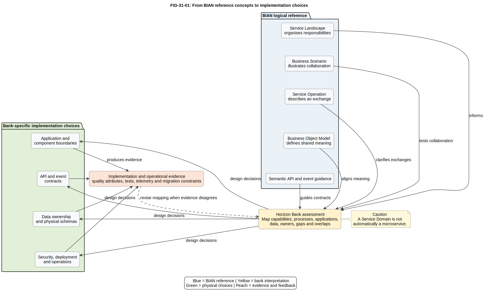

# 31. Introduction to BIAN

## Chapter purpose

This chapter introduces the Banking Industry Architecture Network (BIAN) as a banking reference architecture and semantic standard. It explains the main reference concepts and, equally importantly, the design decisions that remain the bank's responsibility.

## Reader outcomes

By the end of this chapter, you should be able to:

- explain why BIAN exists and what question its main artefacts answer;
- navigate from Business Areas and Business Domains to Service Domains;
- distinguish a Business Scenario, Service Operation and Business Object Model (BOM);
- explain how semantic application programming interfaces (APIs) and events use shared meaning;
- separate a logical BIAN reference from physical applications and deployment; and
- challenge the mistaken claim that one Service Domain must become one microservice.

## Prerequisites and dependencies

Chapter 30 explained how architecture guides change and migration. Chapters 4 to 13 introduced the modelling languages used later to express a BIAN-aligned bank. Chapter 32 compares those techniques with BIAN directly.

## Required models and artefacts

The chapter uses an original BIAN reference-to-implementation teaching flow, the Horizon Bank controlled application landscape and recorded official BIAN source notes.

## Worked examples

Horizon Bank provides the banking example. The exercise applies the concepts to its cross-border payment change.

## Source requirements

Version-sensitive statements use BIAN's official Service Landscape 14.0 page. Separately versioned official introduction and semantic API guides support terminology. No copied BIAN diagram or standards text is used.

## Why BIAN exists

Banks perform many similar kinds of work, yet often describe that work differently. A payment function might be named, divided and implemented differently in two banks. Even teams inside one bank may disagree about where a responsibility begins, what an interface means or who owns exchanged information. This makes comparison, integration and transformation harder.

BIAN provides a shared banking frame of reference. It gives architects a structured vocabulary for business responsibilities, interactions and information. Teams can use that vocabulary to assess a bank, find duplicated responsibilities, discuss target boundaries and align interface meaning.

BIAN is maintained by an industry association rather than by one bank or technology supplier. The current public Service Landscape at the time of writing is release 14.0, published in February 2026. BIAN says this release rationalised Service Domain definitions, removed unnecessary Service Operations and strengthened links to ISO 20022. Version matters because names and content can change between releases.

The practical question is: **How can different banking teams describe comparable responsibilities and exchanges consistently enough to make informed design choices?** BIAN supplies reference concepts. It does not make those choices for the bank.

## Service Landscape

The BIAN Service Landscape is a reference structure that categorises and organises Service Domains. Think of it as an indexed map of banking responsibilities. A map helps you find and relate places, but it is not the organisation chart, application estate or process of a particular bank.

The landscape answers: **Where should we look for a standard description of this banking responsibility?** It can support current-state assessment, target-state discussion, gap analysis and portfolio mapping. It should not be copied and relabelled as a finished enterprise architecture.

Different views can arrange the same responsibilities for different purposes. Therefore, position on the landscape is a navigation aid, not proof that two responsibilities must be owned, deployed or funded together.

## Business Areas and Business Domains

The landscape uses grouping levels to make a large catalogue navigable:

- A **Business Area** is a broad grouping of related banking activity.
- A **Business Domain** is a more focused grouping within an area.
- A **Service Domain** identifies a discrete business responsibility.

The first two levels answer progressively narrower forms of the question, **Which part of banking contains the responsibility we need?** They help readers browse the catalogue and communicate scope. They are not automatically divisions, departments or value-stream stages.

For Horizon Bank, an architect investigating payments can use the groupings to locate relevant Service Domains. The bank must then test each candidate against its real capabilities, processes, information and systems. A similar name is a starting hypothesis, not conformance evidence.

## Service Domains

A Service Domain is a logical functional building block with a distinct banking responsibility. BIAN's design guidance describes it as performing a dominant function for instances of a type of asset or entity through their relevant life cycle. This definition focuses on responsibility and behaviour rather than technology.

A Service Domain answers: **What discrete banking responsibility is being performed, and what services does it offer to collaborators?** It helps architects discuss separation of concerns, ownership and interaction without committing to application topology.

This point is essential: **a BIAN Service Domain is not automatically one microservice**. The mapping may be one-to-one, but only when evidence justifies it. Other valid mappings include:

- one existing application supports several Service Domains;
- several applications or components collaborate to realise one Service Domain;
- one Service Domain is realised differently by region, product or migration stage; or
- a logical boundary is preserved in a modular monolith rather than a distributed service.

Physical boundaries must consider transactions, data consistency, security, latency, team ownership, operational support and change coupling. Calling every Service Domain a microservice avoids these decisions instead of resolving them.

## Business Scenarios

A Business Scenario is an archetypal sequence of interactions between Service Domains in response to a business event. It answers: **Which responsibilities collaborate, and what exchanges could occur, when this banking event is handled?**

For example, Horizon Bank could model a customer submitting a cross-border payment. The scenario might identify responsibilities for customer agreement, payment initiation, sanctions screening, routing and settlement. The scenario exposes collaboration without assuming that these responsibilities are separate production services.

BIAN's official guidance warns that a Business Scenario is one viable example. It is not necessarily exhaustive and does not prescribe the process every bank must execute. Horizon Bank must add its channels, controls, exception paths, timing, roles and jurisdictional obligations. Later chapters use Business Process Model and Notation (BPMN), sequence and event views when that detail is needed.

## Service Operations

A Service Operation describes a business service exposed by a Service Domain. It expresses an action and the business information exchanged. It answers: **What can another responsibility ask this Service Domain to do or report?**

Service Operations make a Business Scenario more precise. Instead of drawing an unlabelled arrow between two domains, the modeller identifies the intended exchange. This supports consistent analysis and provides a semantic starting point for interface design.

A Service Operation is still logical. It is not automatically an HTTP endpoint, message topic, user-interface action or database procedure. An implementation team must choose interaction style, protocol, security, versioning, error behaviour, service levels and operational ownership.

## Business Object Model

The Business Object Model provides a conceptual vocabulary for business information shared in BIAN exchanges. It answers: **What business meaning must participants share when they exchange information?**

The BOM is valuable because identical field names do not guarantee identical meaning, and different field names may represent the same concept. A shared conceptual definition gives teams a basis for mapping local schemas and reviewing ambiguity.

BIAN's Semantic API Practitioner Guide distinguishes shared exchange information from the richer internal information a Service Domain may use. Horizon Bank can retain local storage structures while mapping exchanged information to agreed concepts. The BOM is therefore not a mandatory enterprise database schema, physical table design or master-data solution.

The bank still decides authoritative sources, identifiers, data quality rules, privacy classification, retention, lineage and reconciliation. Chapter 47 develops those decisions.

## Semantic APIs and events

A semantic API uses the shared meaning of Service Domains, Service Operations and business information to make an interface understandable in banking terms. The emphasis is on what the exchange means, not merely how bytes are transported.

BIAN publishes semantic API material that can accelerate analysis and interface alignment. A bank may use it as a reference for an HTTP API, but must still design deployable contracts, authentication, authorisation, idempotency, errors, performance, compatibility and monitoring. Copying a reference operation unchanged is not automatically appropriate or conformant.

Events apply the same semantic discipline to facts communicated asynchronously. A bank should distinguish a command requesting action from an event recording something that has happened. It must define the producer, business meaning, schema, timing, ordering assumptions, consumer responsibilities, privacy controls and replay behaviour. BIAN alignment does not select a broker, topic structure or delivery guarantee.

## From reference concepts to implementation choices

*Figure 31.1 (`FIG-31-01`). BIAN reference concepts inform Horizon Bank's assessment. The bank then makes explicit application, contract, data, security and deployment decisions, and uses implementation evidence to revise mappings. A Service Domain is not automatically a microservice.*

The figure separates three kinds of reasoning. First, BIAN supplies reusable reference concepts. Second, Horizon Bank interprets them against its capabilities, processes and current landscape. Third, accountable teams make physical design choices. Evidence can reveal that an initial mapping was wrong, so the flow includes feedback rather than a one-way translation.

## What BIAN does not prescribe

BIAN does not by itself prescribe:

- a bank's organisation chart, reporting lines or team structure;
- one mandatory end-to-end business process;
- a product catalogue, customer journey or operating model;
- application, component or microservice boundaries;
- vendor products, programming languages or cloud platforms;
- physical database schemas or master-data ownership;
- API protocols, event brokers or deployment patterns;
- security controls, regulatory interpretation or operational service levels; or
- a migration sequence or guaranteed business outcome.

These exclusions are not weaknesses. A reference model remains reusable partly because it leaves institution-specific choices open. The architecture repository should record each choice, its owner, assumptions and evidence.

## Logical reference versus physical implementation

Beginners often jump directly from a named Service Domain to a box on a deployment diagram. A safer method uses four steps.

1. **Understand the responsibility.** Read the Service Domain role, associated information and exchanges in the recorded BIAN version.
2. **Map the bank.** Compare that responsibility with Horizon Bank's capabilities, processes, applications, data and owners. Record gaps, overlap and uncertainty.
3. **Choose a design.** Decide application and component boundaries, synchronous or asynchronous exchanges, information ownership, controls and deployment.
4. **Test the mapping.** Use scenarios, quality attributes, operational evidence and migration constraints. Revise the logical-to-physical mapping when evidence disagrees.

Suppose Horizon Bank's Core Banking Platform currently performs agreement administration, account fulfilment and posting. The current-state map may associate one application with several Service Domains. A target design might separate some responsibilities, retain others in a modular platform and expose an adapter during migration. None of those outcomes follows automatically from the landscape.

## When to use BIAN

Use BIAN when a banking-specific reference vocabulary improves comparison or design, such as capability assessment, application portfolio mapping, scenario analysis, interface semantics and transformation planning. It is especially useful when teams disagree because they use different names for similar responsibilities.

Do not use BIAN as decoration, as a substitute for stakeholder discovery, or when a small non-banking problem needs only a simple domain model. Do not force every local concept into a BIAN label when the fit is poor. Record the gap and decide deliberately.

## Common mistakes

- **Copying the landscape as the target architecture.** Add bank-specific ownership, interactions and implementation views.
- **Treating grouping as organisation design.** Business Areas and Business Domains primarily aid navigation.
- **Equating Service Domain with microservice.** Test physical boundaries against quality and operational evidence.
- **Treating a Business Scenario as mandatory process.** Add local roles, controls, exceptions and timing.
- **Using the BOM as a physical schema.** Map conceptual shared meaning to governed logical and physical models.
- **Claiming alignment from names alone.** Demonstrate responsibility, interaction and information mappings.
- **Ignoring versions.** Record the BIAN release and separately versioned guides used.

## Chapter summary

BIAN gives banking teams a common logical reference for responsibilities, interactions and shared information. The Service Landscape organises Service Domains through Business Areas and Business Domains. Business Scenarios illustrate collaboration, Service Operations describe offered exchanges, and the BOM supports shared meaning. Semantic APIs and events carry that meaning towards interface design.

The bank remains responsible for organisation, process, application, data, security, deployment, operations and migration choices. BIAN informs architecture. It does not replace architecture.

## Completion checklist

- [ ] The BIAN release and guide versions used are recorded.
- [ ] Candidate Service Domains are mapped to real responsibilities, not names alone.
- [ ] Business Scenarios are labelled as archetypal examples.
- [ ] Service Operations are separated from physical endpoints or topics.
- [ ] BOM concepts are mapped rather than copied as a database schema.
- [ ] API and event implementation decisions have owners and evidence.
- [ ] No unjustified Service Domain to microservice equivalence appears.
- [ ] Logical and physical views are explicitly separated and traceable.

## Key takeaways

- BIAN is a banking reference architecture and semantic standard, not a deployable product.
- The Service Landscape is a navigation and classification structure.
- A Service Domain describes a logical business responsibility.
- A Business Scenario illustrates one possible collaboration, not a mandatory process.
- Service Operations and the BOM provide semantic starting points for exchanges.
- A Service Domain is not automatically a microservice.
- Bank-specific design decisions need owners, rationale and evidence.

## Practical exercise

Horizon Bank wants to modernise cross-border payments. Its Payments Platform initiates payments, the Financial Crime Platform performs screening, the Core Banking Platform posts entries and the Integration Platform connects external networks.

Create a one-page assessment with four rows: candidate BIAN responsibility, current application mapping, unresolved design question and evidence needed. Then sketch one Business Scenario containing labelled exchanges. Do not redraw the applications as Service Domains.

A sound answer distinguishes logical responsibility from current applications, identifies possible many-to-many mappings and asks about ownership, screening timing, posting consistency, external-network failure and audit evidence. It does not conclude that each candidate Service Domain requires a new microservice.

## Review checklist

- [ ] The purpose, audience and question of each BIAN artefact are clear.
- [ ] Plain explanations precede formal terms.
- [ ] Official BIAN statements are separated from author recommendations.
- [ ] Current and historical source versions are labelled accurately.
- [ ] Horizon Bank names agree with the controlled example files.
- [ ] Process, application and deployment detail are not mixed without explanation.
- [ ] The figure is readable, original and at `Review`, not `Approved`.
- [ ] No em dashes or unexplained acronyms remain.

## References and further reading

- BIAN, [Service Landscape 14.0](https://bian.org/deliverables/service-landscape/), February 2026, accessed 11 July 2026.
- BIAN, [How-to Guide, Introduction to BIAN, version 7.0](https://bian.org/wp-content/uploads/2018/11/BIAN-How-to-Guide-Introduction-to-BIAN-V7.0-Final-V1.0.pdf), 2018, accessed 11 July 2026.
- BIAN, [Semantic API Practitioner Guide, version 8.1](https://bian.org/wp-content/uploads/2024/12/BIAN-Semantic-API-Pactitioner-Guide-V8.1-FINAL.pdf), accessed 11 July 2026.
