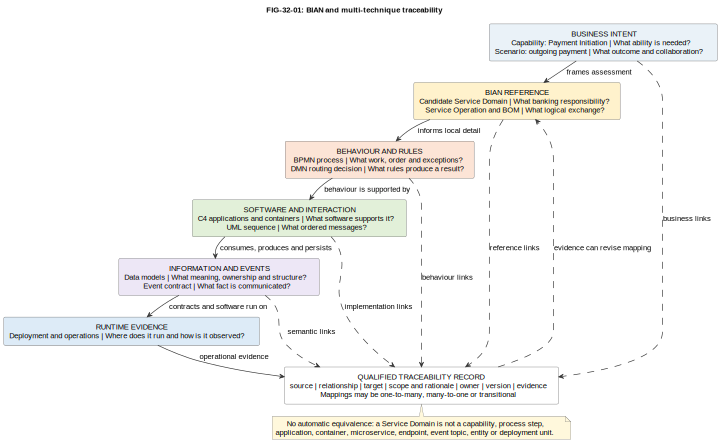

# 32. How BIAN Relates to Other Modelling Techniques

## Chapter purpose

This chapter explains how the Banking Industry Architecture Network (BIAN) complements ArchiMate, Business Process Model and Notation (BPMN), the C4 model, Unified Modeling Language (UML), data modelling, Decision Model and Notation (DMN), domain and event modelling, and deployment modelling. It shows how to connect their answers without pretending that unlike model elements are equivalent.

## Reader outcomes

By the end of this chapter, you should be able to:

- state the question BIAN and each complementary technique answers;
- choose a model when BIAN alone does not provide the detail a stakeholder needs;
- create qualified, many-to-many mappings between banking responsibilities and local models;
- trace a change from capability and scenario to application, interface, data, event and deployment evidence;
- explain when not to use a particular technique; and
- recognise common mapping mistakes, especially one-Service-Domain-to-one-application or microservice assumptions.

## Prerequisites and dependencies

Chapter 31 introduced BIAN's Service Landscape, Service Domains, Business Scenarios, Service Operations and Business Object Model (BOM). Chapters 4 to 11 introduced the complementary techniques. Chapter 33 uses them to describe Horizon Bank's operating model.

## Required models and artefacts

The chapter uses a cross-reference matrix, a qualified traceability record and `FIG-32-01`, an original multi-technique relationship view.

## Worked examples

Horizon Bank's outgoing-payment change provides one continuous example. Controlled capability and application names come from the repository's Horizon Bank example.

## Source requirements

Official BIAN sources support BIAN terminology. Existing official Object Management Group (OMG), The Open Group and C4 records support the other techniques. The mappings and selection advice are the author's practical recommendations, not mappings published by those organisations.

## One architecture, several questions

A bank cannot explain a significant change with one diagram. BIAN can provide a common banking vocabulary for responsibilities and exchanges, but it does not show every local process, application, decision, data store or runtime node. The other techniques do not replace BIAN either. They answer different questions.

The useful principle is: **map answers, do not rename boxes**. Begin with the concern, choose the model that answers it, and record how its elements relate to the rest of the architecture. A relationship may be partial, conditional or many-to-many.

For example, a candidate Service Domain describes a logical banking responsibility. An ArchiMate application component, C4 container or UML component describes a different kind of thing. One application can support several Service Domains. Several applications can collaborate to realise one Service Domain. The mapping becomes credible only when its rationale, scope and evidence are recorded.

## What BIAN answers

BIAN answers banking-reference questions such as:

- What discrete banking responsibility should we examine?
- Which responsibilities may collaborate in an archetypal banking scenario?
- What logical service is offered, and what business meaning is exchanged?
- Which shared business concepts can reduce semantic disagreement?

These answers help teams compare responsibilities and discuss boundaries consistently. They do not prescribe Horizon Bank's capabilities, end-to-end process, organisation, application topology, physical interface, data ownership, decision rules or deployment.

Use BIAN when banking-specific reference semantics improve a discussion. Do not use it merely to relabel an existing diagram or to avoid investigating local reality.

## BIAN and ArchiMate

ArchiMate answers: **How do strategy, capabilities, business behaviour, applications, technology and change relate across the enterprise?** BIAN answers: **Which reusable banking responsibilities and exchanges can inform that enterprise model?**

Horizon Bank might associate its Payment Initiation capability with several candidate Service Domains. In an ArchiMate view, those responsibilities can inform business-service or business-function analysis. Application components can then be shown as supporting the business layer, and technology elements can show runtime support.

This is a correspondence, not a formal equivalence. A bank capability describes an ability the organisation needs. A Service Domain describes a logical banking responsibility. An ArchiMate application component represents application structure. Their scopes and life cycles differ.

Use ArchiMate when stakeholders need cross-layer impact, ownership or transformation views. Do not use it for detailed task sequence or message timing. Keep the view selective because placing every BIAN and ArchiMate element on one page creates an unreadable landscape.

## BIAN and BPMN

BPMN answers: **What work happens, in what order, by whom, with which messages, decisions and exceptions?** A BIAN Business Scenario answers: **Which Service Domains might collaborate for a banking event or objective?**

A Business Scenario can seed process discovery. Horizon Bank can take its participating responsibilities and exchanges, then model the bank-specific payment process in BPMN. Pools and lanes add participants. Events add triggers and timeouts. Tasks add work. Gateways add routing. Exception paths add repair and escalation.

Do not turn each Service Domain into a BPMN lane or each Service Operation into a task automatically. A lane represents a participant or responsibility in that process view. A task represents work at the chosen level. One task may use several responsibilities, and one responsibility may participate in many tasks.

Use BPMN when sequence, hand-offs, exceptions or accountability matter. Do not use it as an application or deployment diagram. Label any connection to a Business Scenario as an interpretation for the local process, not as the only BIAN-compliant process.

## BIAN and C4

C4 answers: **What software systems, containers and components implement or support the solution, and how do they interact?** BIAN answers the logical banking responsibility before those software boundaries are chosen.

For Horizon Bank, the Payments Platform may support payment initiation and orchestration responsibilities. The Financial Crime Platform supports screening responsibilities. The Enterprise Integration Platform may mediate exchanges with the retained Core Deposit System. A C4 container view makes those software responsibilities and dependencies reviewable.

A C4 container is a separately runnable or deployable application or data store. It is not a BIAN Service Domain and it is not necessarily a Docker container. A Service Domain may be realised within a modular monolith, distributed across several containers or supported temporarily by legacy and target applications together.

Use C4 for software scope, ownership and structural communication. Do not use it to describe a complete business process, conceptual information model or detailed infrastructure. A dynamic C4 view can illustrate one runtime scenario, but a UML sequence diagram may be preferable when message order and responses need more precision.

## BIAN and UML

UML answers several software and behaviour questions. A use case diagram can show actor goals and subject scope. A component diagram can show software responsibilities. A sequence diagram can show ordered messages. A state machine can show the life cycle of a payment instruction. A deployment diagram can show artefacts on runtime nodes.

BIAN can inform the banking meaning in those models. A Service Operation can suggest a meaningful interaction to explore in a UML sequence diagram. BOM concepts can inform a conceptual class model. A Business Scenario can identify participants for an interaction. The UML model then adds local design detail.

Do not equate a Service Operation with one UML operation, HTTP endpoint or message. The logical operation may require several messages, or several logical operations may share one physical interface. Similarly, a UML class is not automatically a BOM concept or database table.

Use UML when reviewers need precise software structure, interaction, state or placement. Do not add UML notation merely to make a conceptual BIAN discussion appear formal.

## BIAN and data modelling

Data modelling answers: **What information does the bank manage, how is it structured, where is it authoritative, and how does it move or change?** The BIAN BOM provides shared conceptual vocabulary for information exchanged in banking services.

Horizon Bank can use BOM concepts as semantic inputs, then create its own conceptual and logical data models. Those models add identifiers, relationships, optionality, ownership, classification, lineage, quality rules and retention. Physical models then reflect the chosen database and performance needs.

The BOM is not a physical enterprise schema. A candidate business object can map to several local entities. Several reference concepts may be combined in one exchange schema. The same concept may have different physical representations in the Payments Platform and Core Deposit System while retaining governed semantic mappings.

Use BIAN semantics when shared banking meaning reduces interface ambiguity. Use data models when structure, authority, quality or storage matters. Do not copy a reference payload into production without analysing local meaning, privacy and lifecycle requirements.

## BIAN and DMN

DMN answers: **What decision is required, which information and knowledge does it depend on, and what rules produce the result?** BIAN can identify the responsibility requesting or providing a decision, but it does not prescribe Horizon Bank's decision logic.

In payment handling, a BPMN task may request a routing decision. A DMN Decision Requirements Diagram (DRD) can show that the decision depends on destination, currency, amount, cut-off time and route availability. A decision table can express the governed rules. The resulting route then informs the next process action.

Do not turn a Service Operation into a decision or place a full decision table inside a Business Scenario. A decision result is also not the operational process that follows it.

Use DMN for explicit, reviewable business decisions and reusable rules. Do not use it when the concern is process order, application structure or deployment. Record the policy owner, version and test evidence because BIAN naming does not validate local rules.

## BIAN and domain and event modelling

Domain modelling asks: **Which concepts, behaviours and boundaries make sense in Horizon Bank's problem domain?** Event modelling asks: **What significant facts occur, who produces them, who consumes them and what happens before and after?**

BIAN provides a useful external reference, while domain modelling tests that reference against local language and behaviour. A bounded context is a boundary within which a domain model has a consistent meaning. It is not automatically a Service Domain. Similar names can hide different boundaries, and different names can hide related responsibilities.

A BIAN semantic exchange can inform an event contract. Horizon Bank might publish `PaymentInstructionAccepted` after acceptance. The event model must still define meaning, producer, schema, identifiers, timing, ordering, privacy, replay and consumer expectations. A Service Operation is not automatically an event topic, and a command requesting action is not an event recording a fact.

Use domain and event modelling when local language, ownership, temporal behaviour or asynchronous collaboration needs discovery. Do not force every event-storming note into a BIAN label. Record gaps where local obligations or products have no clean reference fit.

## BIAN and infrastructure and deployment modelling

Deployment modelling answers: **Where does software run, how is it connected, and how will it meet operational needs?** BIAN does not answer that question.

After Horizon Bank chooses application and interface boundaries, deployment views can show cloud and retained environments, runtime nodes, network paths, resilience, observability and recovery. Quality attributes such as latency, availability, security and data residency can change the logical-to-physical mapping.

Do not draw a Service Domain directly as a Kubernetes Deployment, namespace, server or cloud service. Those are implementation choices. One deployment unit may host several logical responsibilities, and one responsibility may span several regions or runtime units.

Use deployment models when platform, operations, security or resilience reviewers need physical evidence. Do not use them to decide banking responsibility or process sequence.

## Cross-reference matrix

| Technique | Main question | BIAN contribution | Mapping limit |
|---|---|---|---|
| ArchiMate | How do enterprise layers and change relate? | Banking responsibility and exchange reference | Capability, business element and Service Domain are not identical |
| BPMN | What work occurs, in what order and with which exceptions? | Scenario participants and candidate exchanges | Service Domain is not automatically a lane; Service Operation is not automatically a task |
| C4 | What software systems, containers and components support the solution? | Logical responsibility to assess | Service Domain is not automatically a system, container or microservice |
| UML | What software structure, interaction, state or deployment detail matters? | Banking semantics for selected elements and messages | Reference operations and objects do not translate one-to-one |
| Data modelling | What information exists, is owned, structured and stored? | Shared conceptual vocabulary through the BOM | BOM is not a logical or physical enterprise schema |
| DMN | What decision and rules produce a result? | Responsibility and exchange context | BIAN does not prescribe local decision logic |
| Domain and event modelling | What local concepts, boundaries and facts matter? | Reference vocabulary for comparison | Bounded context or event topic is not a Service Domain |
| Deployment modelling | Where does software run and how is it operated? | No automatic physical design; responsibility remains traceable | Service Domain is not a node, namespace or deployment unit |

## Building qualified traceability

Traceability is more useful than a giant diagram. Create a record for each meaningful relationship with these fields:

| Field | Example |
|---|---|
| Source | Payment Initiation capability |
| Relationship | is supported in part by |
| Target | candidate payment-handling Service Domain responsibility |
| Scope and rationale | Outgoing retail payments; responsibility match based on accepted instruction lifecycle |
| Owner and version | Payments architect; BIAN Service Landscape 14.0 |
| Evidence | Scenario review, application assessment, interface contract and operational test |

Avoid the relationship word `equals`. Prefer precise phrases such as `realises in part`, `participates in`, `exchanges meaning through`, `supports`, `persists as` or another relationship defined for the model set.

Useful traceability can follow this chain:

1. A capability states the business ability Horizon Bank needs.
2. A process or scenario shows behaviour that exercises that ability.
3. Candidate Service Domains provide reference responsibilities and exchanges.
4. Applications and components support those responsibilities under recorded scope.
5. Interfaces and events implement selected exchanges with local contracts.
6. Data models govern shared meaning, authority and physical representation.
7. Deployment views show runtime placement, controls and operational ownership.
8. Tests, telemetry and review evidence confirm or challenge the mapping.

This chain is not a mandatory delivery sequence. Teams can move in either direction. Operational evidence may reveal that an application boundary, process assumption or Service Domain mapping needs revision.

## Worked example: trace an outgoing payment

Horizon Bank wants to improve outgoing retail payments. The Payment Initiation capability provides the business starting point. A customer payment scenario identifies acceptance, screening, routing, posting and status responsibilities.

The team uses BIAN to find candidate Service Domains and semantic exchanges. It records candidates rather than declaring a match from names. BPMN then models Horizon Bank's actual process, including screening rejection, route unavailability and repair. DMN separates the payment-routing rules from the process.

The C4 view shows Horizon Digital Channels calling the Payments Platform. The Payments Platform collaborates with the Financial Crime Platform, Enterprise Integration Platform, Core Deposit System and Event Platform. A UML sequence view adds ordered calls and responses for one successful scenario.

A conceptual information model defines Payment Instruction, Party, Account and Routing Decision. Logical models add ownership and identifiers. An event contract defines `PaymentInstructionAccepted` as a fact, not a command. Finally, a deployment view shows where the platforms run and how monitoring detects delayed screening or posting.

*Figure 32.1 (`FIG-32-01`). Three bands trace one Horizon Bank payment thread from business need and BIAN reference concepts through application and exchange choices to runtime placement. Exact relationship labels qualify every arrow. No arrow asserts that a Service Domain equals a capability, process step, application, interface, data entity, event topic or deployment unit.*

Accessibility text: Three horizontal bands trace Horizon Bank's outgoing-payment change. The first moves from the need to improve outgoing retail payments through the Payment Initiation capability and outgoing customer payment Business Scenario to a candidate payment-handling Service Domain responsibility. The second shows the Payments Platform, Outgoing Payment API, Payment Instruction and `PaymentInstructionAccepted` event. The third shows the Payments runtime and a warning that mappings may be one-to-many, many-to-one or transitional. Every arrow uses a qualified relationship label rather than equivalence.

The result is a connected model set. It is not one mixed diagram presented as the architecture. Each view retains its notation, audience, purpose and abstraction level.

## When to combine techniques

Combine techniques when a decision crosses concerns. A payment change that affects process, applications, rules, information and operations needs several views. Keep a small shared vocabulary, identifiers and traceability records so reviewers can move between them.

Do not combine techniques merely because they are available. A simple responsibility discussion may need BIAN and a mapping table only. A detailed process workshop may need BPMN without a C4 diagram. A production incident may begin with deployment and sequence evidence before a BIAN mapping becomes relevant.

## Common mapping mistakes

- **Equating a Service Domain with a microservice or application.** Test logical and physical boundaries independently.
- **Mapping by name alone.** Compare responsibility, behaviour, information and scope.
- **Turning a Business Scenario into the mandatory process.** Add local roles, order, exceptions, controls and timing.
- **Turning every Service Domain into a BPMN lane.** Model actual participants at the chosen process level.
- **Turning every Service Operation into one endpoint or event.** Design interaction style and contract deliberately.
- **Copying the BOM as a database schema.** Govern conceptual, logical and physical mappings separately.
- **Equating bounded context with Service Domain.** Test local language and consistency boundaries.
- **Skipping decision ownership.** DMN rules need policy authority, versioning and tests.
- **Jumping from reference to deployment.** Insert application, contract, data and quality-attribute decisions.
- **Drawing everything together.** Use a model set and traceability records instead of an unreadable mixed-notation poster.
- **Hiding uncertainty.** Record candidate, partial and transitional mappings explicitly.
- **Ignoring versions.** Record the BIAN release and local model versions used by each mapping.

## Chapter summary

BIAN provides banking reference semantics. ArchiMate connects enterprise layers. BPMN models process. C4 and UML model software structure and behaviour. Data models govern information. DMN models decisions. Domain and event modelling explore local meaning and facts. Deployment models show runtime reality.

These techniques complement one another because they answer different questions. Their elements should be related through qualified, evidence-backed mappings, never automatic one-to-one translation.

## Completion checklist

- [ ] Every view states its question, audience, scope and notation.
- [ ] BIAN and local model versions are recorded.
- [ ] Candidate mappings include relationship, rationale, owner and evidence.
- [ ] Many-to-many and transitional mappings are allowed.
- [ ] Process, software, information, decision and deployment concerns remain distinct.
- [ ] No Service Domain is automatically mapped to a capability, process step, application, microservice, endpoint, event topic, entity or deployment unit.
- [ ] Operational evidence can revise earlier mappings.
- [ ] `FIG-32-01` remains at `Review`, not `Approved`.

## Key takeaways

- Start with the stakeholder question, not a favourite notation.
- BIAN contributes banking responsibilities and semantics, not a complete local architecture.
- Complementary techniques add enterprise, process, software, decision, data, event and runtime detail.
- Similar-looking boxes from different models are not necessarily equivalent.
- Qualified traceability is more reliable than renaming elements.
- One-to-many, many-to-one and transitional mappings are normal.
- Owners, versions, rationale and evidence make mappings reviewable.
- Implementation and operational evidence should feed back into logical models.

## Practical exercise

Horizon Bank plans to notify customers when an outgoing payment is rejected after screening. Create eight separate entries for capability, process, candidate Service Domain responsibility, application, interface, information, event and deployment concern. For each entry, write the question it answers. Then create five qualified relationships using `realises in part`, `participates in`, `invokes`, `consumes or produces` or `runs on`. Add an owner and evidence source to each relationship.

A sound answer might use Payment Initiation and Notification Management capabilities, a BPMN rejection path, candidate payment and notification responsibilities, the Payments Platform and Horizon Digital Channels, a governed notification request, Payment Instruction and Rejection Reason concepts, a past-tense rejection event, and an operational view showing delivery monitoring. It will not claim that any Service Domain equals a process task, application, endpoint, topic or deployment unit.

## Review checklist

- [ ] The question answered by each model is explicit.
- [ ] Acronyms are defined at first use and British English is used.
- [ ] Official definitions are separated from practical mapping recommendations.
- [ ] Horizon Bank capability and application names match controlled examples.
- [ ] Comparisons do not imply that one notation is universally superior.
- [ ] Mapping limits and common mistakes are concrete.
- [ ] The figure is page-readable, original and at `Review`.
- [ ] No em dashes or unsupported one-to-one claims remain.

## References and further reading

- BIAN, [Service Landscape 14.0](https://bian.org/deliverables/service-landscape/), February 2026, accessed 11 July 2026.
- BIAN, [How-to Guide, Introduction to BIAN, version 7.0](https://bian.org/wp-content/uploads/2018/11/BIAN-How-to-Guide-Introduction-to-BIAN-V7.0-Final-V1.0.pdf), 2018, accessed 11 July 2026.
- BIAN, [Semantic API Practitioner Guide, version 8.1](https://bian.org/wp-content/uploads/2024/12/BIAN-Semantic-API-Pactitioner-Guide-V8.1-FINAL.pdf), accessed 11 July 2026.
- The Open Group, *ArchiMate 3.2 Specification*, recorded under `research/archimate/`.
- Object Management Group, *Business Process Model and Notation 2.0.2*, *Unified Modeling Language 2.5.1* and *Decision Model and Notation 1.5*, recorded in the repository source notes.
- C4 model, [official documentation](https://c4model.com/), recorded under `research/c4/`.
