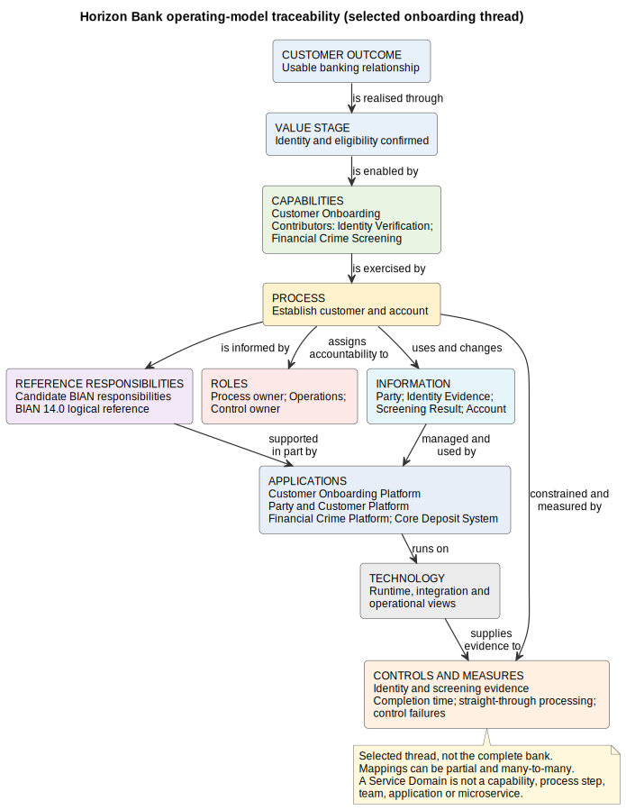

# 33. Defining the Full Banking Operating Model

## Chapter purpose

This chapter explains how to describe the way a full-service bank creates value, performs work, allocates responsibility and uses information and technology under control. It builds Horizon Bank's operating-model baseline and shows where the Banking Industry Architecture Network (BIAN) can provide reference responsibilities and semantics.

An operating model is not one enormous organisation chart or architecture diagram. It is a governed set of connected models. Each view answers a particular question, while traceability links the answers.

## Reader outcomes

By the end of this chapter, you should be able to:

- explain the purpose and scope of a banking operating model;
- distinguish value streams, capabilities, processes, BIAN Service Domains and organisation units;
- connect roles, information, applications, technology, controls and measures without mixing them into one unreadable view;
- distinguish a logical reference from a bank-specific implementation;
- choose a practical operating-model set and maintain traceability between its layers; and
- review a worked Horizon Bank example for gaps, false equivalences and unclear ownership.

## Prerequisites and dependencies

Chapter 31 introduced BIAN. Chapter 32 explained how BIAN relates to other modelling techniques. Chapters 14 and 15 introduced capability, value-stream and process modelling. Chapter 34 will expand the process architecture introduced here.

## Required models and artefacts

The chapter uses a stakeholder-and-outcome view, value-stream map, capability map, process catalogue, responsibility mapping, organisation and role model, information model, application and technology views, control catalogue, measurement scorecard and traceability register. `FIG-33-01` illustrates a selected traceability thread across this model set.

## Worked examples

Horizon Bank's retail customer onboarding thread provides the worked example. Names come from the controlled capability and system landscape files.

## Source requirements

Registered official BIAN sources support BIAN terminology and the Service Landscape 14.0 version claim. The operating-model composition, mappings, measures and governance guidance are the author's practical recommendations.

## What is a banking operating model?

In plain language, an operating model explains **how a bank intends to work**. It connects what the bank is trying to achieve with the abilities, behaviour, people, information and technology needed to achieve it safely.

Its scope is broader than application architecture and more stable than a detailed procedure. It can cover the whole bank at catalogue level, then provide selected detail for a product, journey or change. A useful operating model answers:

- Which customers and stakeholders receive which outcomes?
- Through which value streams does the bank create those outcomes?
- Which capabilities and processes are required?
- Which logical banking responsibilities participate?
- Who owns decisions and performs work?
- Which information, applications and technology enable it?
- Which controls constrain it, and how is performance measured?

No single diagram can answer all these questions at a readable level. “Full” means that the model set covers the relevant dimensions and business areas. It does not mean placing every bank element on one page.

## Start with outcomes and scope

An operating-model initiative needs a boundary. Horizon Bank is a fictional full-service bank covering retail, business and corporate banking, lending, payments and cards, trade finance, wealth, treasury and supporting functions. This breadth belongs in a catalogue. Detailed views should follow one question or scenario.

Horizon Bank's stated goals include better digital journeys, more straight-through processing, a trusted party and customer view, modular governed capabilities, simpler integration and improved compliance traceability. These goals are local choices, not BIAN definitions.

A stakeholder model records parties such as customers, regulators, employees, partners, shareholders and suppliers, together with their concerns and expected outcomes. A customer may value a usable account and clear status. Operations may value manageable exceptions. Compliance may require evidence that controls operated. Technology teams may need supportable services. The model should record tensions rather than hide them.

## The business spine: value streams, capabilities and processes

Three model types form a useful business spine, but they are not interchangeable.

| Model | Question answered | Example | Important limit |
|---|---|---|---|
| Value stream | How is value created from a stakeholder's perspective? | Establish a banking relationship | Not a detailed workflow |
| Capability | What ability must the bank possess? | Customer Onboarding | Not an organisation unit or process step |
| Process | What work occurs, in what order, with which decisions and exceptions? | Verify identity and establish records | Not an application landscape |

A value stream describes stages of value, not departments. A capability describes an enduring ability, not who performs it. A process describes behaviour and hand-offs. The same capability may support several value streams, and a process may exercise several capabilities.

Horizon Bank maintains controlled capability names including Customer Onboarding, Party Management, Identity Verification, Financial Crime Screening, Account Opening, Payment Initiation and Data Governance. A heat map may overlay maturity, pain or change priority on that stable structure. Its legend must state the scoring basis, date and owner. A red box without criteria is decoration, not analysis.

Chapter 34 will catalogue the bank's end-to-end process families. Here, the process catalogue acts as a bridge: it records process name, trigger, outcome, owner, participating roles, capabilities used, principal information, controls and measures. Detailed Business Process Model and Notation (BPMN) views are created only where sequence and exceptions matter.

## Add BIAN reference responsibilities

BIAN's Service Landscape 14.0, released in February 2026, provides current reference material for logical banking responsibilities. A Service Domain is a discrete logical banking responsibility in that reference architecture. It is not automatically a capability, process, team, application, microservice or organisation unit.

Use candidate Service Domains to test whether Horizon Bank's responsibility boundaries and exchanges are clear. Record the BIAN version, the local scope and why a candidate responsibility is relevant. The relationship is often many-to-many. One local application may support parts of several Service Domains, while several applications and teams may collaborate to support one responsibility.

BIAN also does not prescribe Horizon Bank's organisation, detailed workflow, deployment, risk appetite, performance targets or transformation sequence. Those are bank-specific design and governance decisions. Calling a local arrangement “BIAN-aligned” should mean that its mappings and semantics are explicit and reviewable, not that reference labels have been pasted onto existing boxes.

## Organisation, roles and accountability

The organisation model answers who is accountable and how authority is arranged. It can show business lines, functions and governance forums. A separate role model states who performs, approves, advises or receives information for a process or decision.

Keep three ideas separate:

- an organisation unit groups people and formal accountability;
- a role describes responsibility in a context; and
- a Service Domain describes a logical banking responsibility.

They can be related, but none automatically defines the others. Horizon Bank might assign a process owner for customer onboarding, a capability owner for Party Management, a data owner for party records, an application owner for the Party and Customer Platform and a control owner for identity evidence. One person may hold several roles, or several units may contribute to one responsibility.

A responsibility matrix can use accountable, responsible, consulted and informed labels where they help. It should not replace a clear statement of decision rights. For material changes, record who may approve a target state, accept residual risk, authorise release and stop unsafe operation.

## Information, applications and technology

Information architecture identifies the concepts the bank manages, their meaning, ownership, classification, quality and lifecycle. For onboarding, important concepts include Party, Customer Relationship, Identity Evidence, Screening Result and Account. A BIAN Business Object Model (BOM) concept may inform shared meaning, but the BOM is not Horizon Bank's physical enterprise schema.

Application views show which software supports the work. Horizon Bank's controlled landscape includes Horizon Digital Channels, Customer Onboarding Platform, Party and Customer Platform, Financial Crime Platform, Core Deposit System, Enterprise Integration Platform and Event Platform. The mapping to capabilities and candidate Service Domains must state scope. It must not imply that one application is the unique implementation of one Service Domain.

Technology and deployment views then show runtime placement, connectivity, resilience, security boundaries and operational ownership. They are created after the logical responsibility and application choices are understood. A Service Domain is not a Kubernetes namespace, server or cloud service.

Together these models answer a progression of questions: what information is needed, which application responsibility manages or uses it, how exchanges are implemented, and where the software runs. Data authority, interface contracts and runtime evidence should be traceable back to the business outcome.

## Controls and measures

Controls are part of the operating model, not a final compliance overlay. A control model records the obligation or risk addressed, control objective, control activity, point of operation, owner, evidence and testing arrangement. Onboarding controls might include identity-evidence checks, screening, access authorisation, segregation of duties and record retention.

Do not confuse a control with a product name or a policy statement. A policy can require an outcome. A control is the safeguard that helps achieve it. Its operation needs evidence.

Measures show whether the model produces intended outcomes. Horizon Bank might monitor onboarding completion time, straight-through processing rate, manual referral rate, screening false-positive rate, customer abandonment, data-quality exceptions and control failures. Every measure needs a definition, owner, data source, frequency and target or decision threshold. A target is a local management choice unless an authoritative obligation sets it.

Balance measures across customer outcome, process performance, risk and control, information quality, technology reliability and change progress. Optimising one measure alone can damage another. Faster onboarding is not a success if control failures or customer complaints increase.

## Governance keeps the model set coherent

Governance establishes who may change each model, how relationships are reviewed and which evidence supports a status. Useful governance records include:

- a model owner and review cycle for every catalogue;
- controlled identifiers and definitions for reused elements;
- versioned mappings to BIAN and other references;
- architecture decisions for significant local choices;
- change impact analysis across linked models; and
- exceptions, uncertainty and transitional mappings rather than invented certainty.

The architecture repository is the authoritative model set. Presentation diagrams are views of it. When a process, application or control changes, maintainers should be able to find affected capabilities, information, owners, interfaces, measures and evidence.

## A minimum operating-model set

| Artefact | Minimum content | Typical owner |
|---|---|---|
| Outcomes and stakeholder view | Stakeholders, concerns, outcomes, scope | Strategy or enterprise architecture |
| Value-stream map | Value stages, stakeholders, outcomes | Business architecture |
| Capability map and heat map | Defined abilities, levels, assessment criteria | Capability owners |
| Process architecture | Process families, owners, triggers and outcomes | Process owners |
| BIAN responsibility mapping | Candidate Service Domains, version, rationale, gaps | Banking or domain architecture |
| Organisation and role model | Units, roles, decision rights and accountability | Business leadership |
| Information model | Concepts, authority, quality, classification and lifecycle | Data owners |
| Application and integration views | Systems, responsibilities and exchanges | Application and integration architecture |
| Technology and operational views | Runtime placement, boundaries and ownership | Technology and operations |
| Control and measure catalogues | Control evidence, indicators, definitions and targets | Risk, control and performance owners |
| Traceability register | Qualified links, scope, owner, version and evidence | Architecture governance |

This is a practical recommendation, not a BIAN-prescribed package. A small initiative can use selected entries. A bank-wide baseline needs catalogue coverage plus detailed views for priority journeys.

## Traceability across the layers

`FIG-33-01` follows one Horizon Bank thread. It is deliberately selective and does not claim to be the complete bank.

**Figure 33.1: Horizon Bank operating-model traceability view.** A compact, page-readable thread connects customer outcome, value stage, capabilities, process, candidate BIAN responsibility, roles, information, applications, technology, controls and measures. Relationship labels prevent unlike elements from appearing equivalent.

A traceability register should give each link a source, relationship, target, scope, owner, version and evidence. Prefer phrases such as `is enabled by`, `is exercised by`, `participates in`, `is supported in part by`, `uses`, `runs on`, `is constrained by` and `is measured by`. Avoid `equals`.

Traceability is bidirectional. A new obligation can reveal affected processes, applications and measures. A production incident can reveal that a logical mapping or ownership assumption was wrong. The operating model should change when evidence changes.

## Worked example: establish a Horizon Bank relationship

Consider a retail customer who wants a usable current account.

1. **Outcome and value:** the customer receives a usable banking relationship. The “identity and eligibility confirmed” value stage contributes to that outcome.
2. **Capabilities:** Customer Onboarding is exercised, with contributions from Identity Verification, Financial Crime Screening, Party Management and Account Opening.
3. **Process:** a local onboarding process captures the application, verifies identity, performs screening, resolves referrals, creates party and account records and confirms access. Chapter 34 will place this within the wider process architecture.
4. **Reference responsibilities:** architects assess candidate BIAN Service Domains against responsibility, behaviour and information. They record BIAN 14.0 and gaps. They do not turn candidates into mandatory process lanes or microservices.
5. **Organisation and roles:** the onboarding process owner is accountable for end-to-end performance. Operations handles referrals. Data owners govern party and evidence data. Control owners define and test control evidence.
6. **Information:** Party, Identity Evidence, Screening Result and Account have defined authority, classification, quality rules and retention.
7. **Applications:** Horizon Digital Channels captures intent; Customer Onboarding Platform orchestrates the journey; Party and Customer Platform maintains party data; Financial Crime Platform supports screening; Core Deposit System establishes the deposit account. The Enterprise Integration Platform supports transitional exchanges.
8. **Technology and operations:** deployment views identify runtime ownership, security boundaries, monitoring and recovery for the selected applications.
9. **Controls and measures:** identity and screening controls produce evidence. Completion time, straight-through processing, referrals, abandonment, data exceptions and control failures reveal whether the outcome is being achieved safely.

The result is not one implementation blueprint. It is a logical and physical model set with qualified links. Horizon Bank can change an application boundary without pretending that the customer outcome, capability or reference responsibility has become the same kind of element.

## Common mistakes

- **Trying to draw the full bank on one page.** Use catalogues, focused views and traceability.
- **Starting with the organisation chart.** Begin with stakeholders, outcomes and value, then allocate responsibility.
- **Treating capabilities as departments or process steps.** Capabilities state abilities and can cross both.
- **Using a heat map without criteria.** Record dimension, scale, date, evidence and owner.
- **Calling a Service Domain a microservice, application or team.** It is a logical reference responsibility.
- **Copying BIAN as the bank's target operating model.** Add local organisation, process, information, technology, controls and measures.
- **Assuming one-to-one mappings.** Permit partial, many-to-many and transitional relationships.
- **Mixing process, application and infrastructure detail.** Separate views unless a stated question requires a traceability slice.
- **Adding controls at the end.** Connect controls and evidence to the work they constrain.
- **Measuring only speed or cost.** Balance customer, risk, data, technology and control outcomes.
- **Leaving links ownerless.** A stale mapping can mislead impact analysis.

## Chapter summary

A banking operating model connects outcomes to the business and technology arrangements that produce them. Value streams, capabilities, processes, Service Domains, organisation, information, applications, technology, controls and measures answer different questions. The full picture comes from a governed model set and qualified traceability, not one universal diagram.

## Completion checklist

- [ ] The bank scope, stakeholders and intended outcomes are explicit.
- [ ] Value streams, capabilities and processes are defined separately.
- [ ] BIAN version, candidate responsibilities, rationale and gaps are recorded.
- [ ] No Service Domain is treated as an application, microservice, team or organisation unit.
- [ ] Organisation, role and decision rights are clear.
- [ ] Information authority, quality, classification and lifecycle are covered.
- [ ] Applications and technology are mapped through qualified relationships.
- [ ] Controls include owners and evidence; measures include definitions and sources.
- [ ] Traceability links have scope, owner, version and evidence.
- [ ] Detailed views remain readable and do not mix layers without a stated reason.

## Key takeaways

- An operating model explains how a bank works to produce outcomes safely.
- “Full bank” describes coverage across a model set, not one giant diagram.
- Value streams, capabilities and processes are related but different.
- BIAN supplies logical reference responsibilities and semantics, not a deployable target model.
- Service Domains do not equal applications, microservices, teams or organisation units.
- Controls, measures and governance belong in the model from the beginning.
- Qualified, evidence-backed traceability connects unlike model elements.
- Local implementation and operational evidence may revise logical assumptions.

## Practical exercise

Choose Horizon Bank's Payment Initiation capability. Create a one-page operating-model traceability table with one customer outcome, one value stage, one process, two candidate BIAN responsibilities, two roles, two information concepts, two controlled applications, one technology concern, two controls and three measures.

For every relationship, use a precise verb and record scope, owner and evidence. Mark candidate or transitional mappings. Then test your model against these questions:

- Have you accidentally made a Service Domain equal a capability, process step, application, microservice or team?
- Can a control owner find the process and evidence affected by a change?
- Can an application owner find the outcome and capabilities supported?
- Does every measure have a definition and data source?
- Would splitting the table into focused views improve readability?

A sound answer will use Payments Platform and, where appropriate, Financial Crime Platform or Core Deposit System. It will allow several applications to support logical responsibilities and will not invent BIAN names from memory. Candidate Service Domains must be checked against the registered BIAN 14.0 source.

## Review checklist

- [ ] The chapter explains simply before introducing formal language.
- [ ] Each model's question, audience and abstraction level are clear.
- [ ] Logical reference and bank-specific implementation are separated.
- [ ] Horizon Bank names match the controlled example files.
- [ ] Common mistakes are concrete and actionable.
- [ ] Acronyms are defined at first use and British English is used.
- [ ] No em dashes or unsupported version claims remain.
- [ ] `FIG-33-01` is original, page-readable and remains at `Review`.

## References and further reading

- BIAN, [Service Landscape 14.0](https://bian.org/deliverables/service-landscape/), February 2026, accessed 11 July 2026.
- BIAN, [How-to Guide, Introduction to BIAN, version 7.0](https://bian.org/wp-content/uploads/2018/11/BIAN-How-to-Guide-Introduction-to-BIAN-V7.0-Final-V1.0.pdf), 2018, accessed 11 July 2026.
- BIAN, [Semantic API Practitioner Guide, version 8.1](https://bian.org/wp-content/uploads/2024/12/BIAN-Semantic-API-Pactitioner-Guide-V8.1-FINAL.pdf), accessed 11 July 2026.
- Existing official ArchiMate, BPMN and architecture source notes registered under `research/` support the complementary modelling guidance.
