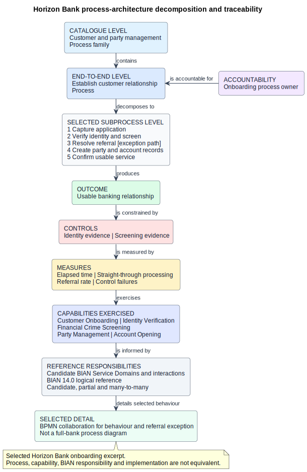

# 34. Complete Bank Business Process Architecture

## Chapter purpose

This chapter explains how to catalogue and govern the major processes of a full-service bank. It develops a bank-wide process architecture for Horizon Bank, then follows one process from family level to selected detail.

Complete coverage does not mean one enormous Business Process Model and Notation (BPMN) diagram. It means that every material process is represented at an appropriate level, has an owner and outcome, and can be traced to controls, measures and related architecture.

## Reader outcomes

By the end of this chapter, you should be able to:

- explain the purpose and scope of enterprise process architecture;
- build a process hierarchy and catalogue without confusing value streams, capabilities and processes;
- distinguish customer-facing, end-to-end, support and control processes;
- record ownership, measures, controls and exception responsibility;
- relate local processes to Banking Industry Architecture Network (BIAN) Business Scenarios and Service Domains through qualified mappings;
- choose a suitable modelling level and govern change impact in a repository; and
- review a Horizon Bank process-architecture excerpt for gaps and false equivalences.

## Prerequisites and dependencies

Chapter 33 defined Horizon Bank's operating model. Chapters 6 and 15 introduced BPMN and process-model selection. Chapter 35 will return to value streams, and Chapter 36 will develop BIAN-aligned Business Scenarios.

## Required models and artefacts

The chapter uses a process hierarchy, process catalogue, ownership and measurement records, control traceability, selected BPMN views and `FIG-34-01`, a process-architecture decomposition and traceability view.

## Worked examples

Horizon Bank's retail customer onboarding process provides the detailed thread. A bank-wide catalogue preserves the breadth of the full-service bank.

## Source requirements

The Object Management Group (OMG) BPMN 2.0.2 specification supports BPMN terminology. Official BIAN 14.0 and portal material supports the descriptions of the Service Landscape, Service Domains and Business Scenario Designer. The process taxonomy, hierarchy, ownership fields and governance method are the author's practical recommendations.

## What is enterprise process architecture?

In plain language, enterprise process architecture is a map and catalogue of how an organisation performs work. It provides stable navigation from broad process families to the selected flows that people analyse, improve, control or automate.

It answers questions such as:

- What work does the bank perform from trigger to outcome?
- Which processes cross products, channels, functions or legal entities?
- Who is accountable for the outcome and the exceptions?
- Which controls and measures apply?
- Where does detailed process evidence live?
- What else may be affected when a process changes?

The principal audiences are business leaders, process owners, operations, risk and control teams, architects, analysts and change teams. Executives usually need catalogue coverage and performance. Analysts need decomposition, hand-offs and exceptions. Implementation teams may need selected executable detail. One model cannot serve all of them equally well.

## Value streams, capabilities and processes

These three models are connected, but they are not alternative names for the same thing.

| Model | Question | Horizon Bank example | Limit |
|---|---|---|---|
| Value stream | How does value progress for a stakeholder? | Establish a banking relationship | Does not prescribe detailed work |
| Capability | What ability must the bank possess? | Customer Onboarding | Is not a task, team or application |
| Process | What work happens from a trigger to an outcome? | Establish customer relationship | Does not by itself describe software structure |

A value-stream stage may be realised through several processes. A process may exercise several capabilities. The same capability may support processes in several value streams. Preserve these many-to-many relationships in a traceability register rather than forcing one hierarchy to perform all three jobs.

## Build a process hierarchy

A hierarchy makes a large catalogue navigable. Use levels consistently, but do not pretend that one levelling convention is universal. Horizon Bank uses this practical convention:

| Level | Content | Example |
|---|---|---|
| 0 | Enterprise process landscape | Horizon Bank process architecture |
| 1 | Process family | Customer and party management |
| 2 | End-to-end process | Establish customer relationship |
| 3 | Subprocess | Verify identity and screen |
| 4 | Procedure or task detail | Review possible screening match |

Each parent should have a defined scope. Child processes together should explain the parent's work without accidental gaps or duplication. Not every branch needs the same depth. Decompose where risk, complexity, hand-offs, change or operational evidence justify it.

A catalogue is more useful than a picture alone. Give every process a stable identifier and record at least its name, purpose, trigger, outcome, boundary, accountable owner, participating roles, customer or stakeholder, classification, parent, controls, measures, information and links to detailed models. Add version, status, review date and evidence source so that readers can judge freshness.

Use verb and object names such as `Establish customer relationship` or `Execute payment`. Avoid department names such as `Operations`, vague labels such as `Processing`, and technology names such as `Run onboarding platform` unless the process really concerns technology management.

## Process classifications

Classification offers several useful lenses. It must not create separate, conflicting inventories.

**Customer-facing processes** involve a customer or deliver a visible customer outcome, such as opening an account or resolving a service request. **End-to-end processes** cross the boundaries needed to achieve an outcome, whether or not every step is customer-visible. A regulatory-reporting process can be end to end without being customer-facing.

**Support processes** enable other work, such as recruitment, procurement, finance and technology operations. **Control processes** set constraints, monitor adherence, test evidence or respond to risk, such as financial-crime monitoring, control testing and internal audit. A control can also operate inside another process. Classification should therefore be an attribute, not a claim that every process fits only one box.

Channel is another attribute. A mobile application, branch or contact centre may initiate or participate in a process, but the channel should not define three duplicate end-to-end processes unless their work genuinely differs. Likewise, product variants should reuse a common process where possible and document justified variations.

## The full-bank process catalogue

The following catalogue is a Level 1 starting point for Horizon Bank. It gives coverage, not detailed sequence.

| Process family | Representative end-to-end scope | Classification |
|---|---|---|
| Strategy and governance | Set direction, govern portfolio, policies and architecture | Direction and control |
| Market and business development | Understand markets, manage propositions and partnerships | Customer and enterprise |
| Product and pricing | Design, approve, price, launch and retire products | Enterprise |
| Party and customer management | Establish, maintain and end party or customer relationships | Customer-facing |
| Onboarding and know your customer | Collect evidence, verify identity, assess and approve onboarding | Customer-facing and control |
| Sales and origination | Identify need, advise, quote, apply and decide | Customer-facing |
| Deposits and accounts | Open, service, fulfil and close deposit accounts | Customer-facing and operational |
| Lending | Originate, fulfil, service, amend and close lending | Customer-facing and operational |
| Payments | Initiate, validate, screen, execute, settle, reconcile and repair payments | Customer-facing and operational |
| Cards | Issue, authorise, clear, settle, service and dispute card activity | Customer-facing and operational |
| Corporate banking and cash management | Establish and operate corporate liquidity and transaction services | Customer-facing and operational |
| Trade finance | Issue, advise, amend, examine and settle trade instruments | Customer-facing and operational |
| Wealth and investments | Advise, onboard investments, transact, custody and report | Customer-facing and controlled |
| Treasury and capital markets | Manage liquidity, funding, market activity and positions | Enterprise and operational |
| Fraud management | Detect, assess, decide, investigate and resolve fraud events | Control and operational |
| Financial crime compliance | Screen, monitor, investigate, report and retain evidence | Control |
| Enterprise risk | Identify, assess, treat, monitor and report risk | Control |
| Regulatory reporting | Interpret obligations, assemble, attest and submit reports | Control |
| Finance and accounting | Record, reconcile, close, report and plan finances | Support and control |
| Banking operations | Fulfil work, manage queues, exceptions and reconciliations | Operational support |
| Collections and recovery | Detect arrears, engage, agree treatment and recover or close | Customer-facing and controlled |
| Channel management | Operate branch, contact-centre, digital and partner channels | Support |
| Human resources | Recruit, develop, reward and exit workers | Support |
| Procurement and suppliers | Source, contract, onboard, monitor and exit suppliers | Support and control |
| Legal, audit and corporate support | Advise, assure, investigate and manage corporate obligations | Support and control |
| Technology management | Plan, build, release, operate, secure and retire technology services | Support and control |

Several families overlap in a real event. A cross-border payment may involve payments, customer management, fraud, financial-crime compliance, accounting and operations. Do not duplicate the whole payment process inside every family. Give the end-to-end process one accountable owner, identify participating processes and link their responsibilities.

## Ownership, measures and controls

The process owner is accountable for the defined end-to-end outcome. This does not mean that the owner performs every activity or manages every contributing team. It means that someone can resolve boundary disputes, approve the process design, review performance and sponsor improvement.

Subprocess owners may govern local detail. Task performers, control owners, data owners, application owners and risk acceptors remain distinct roles. A responsibility matrix can clarify participation, but it does not replace explicit decision rights.

Measure the process across the whole outcome, not only one team's queue. Useful dimensions include:

- outcome quality, such as a usable account established correctly;
- elapsed time and waiting time;
- straight-through processing and manual referral;
- customer abandonment, complaints or rework;
- control failures and overdue exceptions;
- data-quality defects; and
- cost or effort per completed outcome.

Every measure needs a definition, owner, source, frequency and threshold. A local target is a management decision, not an industry fact.

Controls need equal discipline. Record the risk or obligation, control objective, activity, point in the process, owner, frequency, evidence and testing approach. Do not merely attach `KYC complete` to the happy path. Know Your Customer (KYC) obligations vary by jurisdiction and policy, so the chapter does not invent universal checks or thresholds.

## Exceptions are part of the architecture

Failures, referrals, cancellations, timeouts and recovery work often determine cost and risk. Record which process owns an exception, how it enters a work queue, who may decide, what evidence is retained, when it escalates and how it rejoins or ends the main path.

At catalogue level, an exception category and owner may be enough. At subprocess level, show the alternative outcome and hand-off. Use BPMN when events, messages, timers, escalation and participant boundaries need precise communication. Do not crowd every exception for the bank into one diagram.

## Relationship to BIAN

BIAN's Service Landscape 14.0 organises Service Domains as a reference structure. The official BIAN portal also provides a Business Scenario Designer for choosing relevant Service Domains and developing workflows. These resources can inform a local process architecture, but they do not replace it.

A BIAN Business Scenario represents interactions between selected Service Domains in response to a business event. It is useful for exploring logical responsibilities and service exchanges. A local bank process also needs its actual participants, sequence, rules, controls, organisational ownership and exceptions. Chapter 36 develops this distinction further.

Never turn each Service Domain into a process step or BPMN lane. A Service Domain is a logical functional partition, not automatically a task, process, team, application or microservice. The mapping may be partial and many-to-many. Record the BIAN version, candidate relationship, rationale, local gap and reviewer.

Use BIAN as a question generator: which logical responsibility owns this behaviour and information, and what interactions are needed? Then validate the answer against Horizon Bank's process evidence. Do not copy a reference sequence and call it the bank's operating process.

## Choose the right modelling level

Use the smallest model that answers the stakeholder's question.

| Need | Suitable artefact | Avoid |
|---|---|---|
| Understand bank coverage | Process landscape and catalogue | Giant BPMN model |
| Navigate decomposition | Hierarchy and process relationship view | Mixing tasks from several levels |
| Agree scope and accountability | Process definition sheet and responsibility view | Organisation chart as process |
| Analyse hand-offs and exceptions | BPMN process or collaboration | Application landscape |
| Govern repeatable decision logic | Decision Model and Notation (DMN) | Large gateway trees |
| Explain internal software behaviour | UML activity or sequence view | Calling it the business process |

An enterprise process model may show five to ten broad subprocesses. An operational model may show roles, decisions and exceptions. An executable workflow may add technical messages, variables and engine semantics. Label the level and purpose. Detail that helps one audience can make another audience's model unusable.

## Governance and change impact

The architecture repository should hold controlled process objects and relationships, not only exported pictures. A presentation diagram is a view. The catalogue and linked source models are the maintained evidence.

Set naming, levelling, identifier and modelling conventions. Assign catalogue stewards and process owners. Require review of material boundary, control, information and ownership changes. Preserve effective dates and superseded versions when audit or migration work needs them.

Change impact should follow relationships in both directions. If identity policy changes, find affected controls, subprocesses, roles, data, applications, measures and detailed models. If an onboarding application is replaced, check which process activities it supports without assuming the business process itself must change. Record uncertainty and transitional mappings rather than inventing certainty.

## Horizon Bank worked example

Horizon Bank's `Customer and party management` family contains the end-to-end process `Establish customer relationship`. Its trigger is an accepted customer intent to apply. Its outcome is a usable banking relationship or an explicit, evidenced alternative outcome such as decline, withdrawal or unresolved expiry.

The selected decomposition is:

1. Capture the application and evidence.
2. Verify identity and perform financial-crime screening.
3. Resolve missing evidence or a possible match.
4. Create authoritative party, customer relationship and account records.
5. Confirm that the customer can use the agreed service.

The onboarding process owner is accountable across the boundary. Operations owns referral handling within defined authority. Control owners govern identity and screening evidence. Party and customer data owners govern the authoritative records. The process exercises Customer Onboarding, Identity Verification, Financial Crime Screening, Party Management and Account Opening capabilities.

Measures include elapsed time, straight-through processing, referral rate, abandonment, data defects and control failures. These measures are balanced: increasing automation is not success if evidence quality falls.

Architects may examine candidate BIAN Service Domains and interactions against the process. They qualify each mapping and retain the local sequence and ownership separately. A selected BPMN collaboration can then detail the screening referral because its messages and exception path matter. It does not attempt to model the full bank.

**Figure 34.1: Horizon Bank process-architecture decomposition and traceability view.** A compact, portrait thread links a process family, end-to-end process and selected subprocesses to outcome, accountable owner, controls, measures, capabilities, candidate BIAN responsibilities and a detailed BPMN pointer. The owner-to-process arrow and other relationship labels keep accountability, decomposition and traceability distinct.

## Common mistakes

- **Drawing one universal bank process.** Use a catalogue and selected detail.
- **Using departments as process names.** Name work by verb and object, then map participants.
- **Mixing levels.** Do not place a process family, procedure and interface call in one sequence.
- **Treating value stages as tasks.** Value streams show progress in value; processes show work.
- **Duplicating processes by product or channel.** Reuse a common process and record genuine variations.
- **Optimising a local queue.** Measure the end-to-end outcome and waiting between teams.
- **Leaving exceptions ownerless.** Model referral, timeout, recovery and termination responsibility.
- **Adding controls as annotations.** Link each control to objective, point of operation, owner and evidence.
- **Making a Service Domain a process step or microservice.** Use qualified, many-to-many mappings.
- **Keeping only pictures.** Maintain controlled objects and relationships in a governed repository.

## Chapter summary

A complete bank process architecture combines broad catalogue coverage with selected, governed detail. Its hierarchy provides navigation. Its catalogue defines boundaries, owners, outcomes, controls and measures. BPMN explains behaviour only where that detail is useful. Value streams, capabilities, BIAN Service Domains and applications remain related but distinct.

## Completion checklist

- [ ] Every material banking area has catalogue coverage.
- [ ] Process levels and parent boundaries are defined consistently.
- [ ] End-to-end processes have triggers, outcomes and accountable owners.
- [ ] Customer-facing, support and control classifications are used as attributes.
- [ ] Measures include definitions, sources and owners.
- [ ] Controls link to objectives, operating points, evidence and testing.
- [ ] Exception ownership, escalation and terminal outcomes are visible.
- [ ] Detailed models state purpose, audience, scope and abstraction level.
- [ ] BIAN mappings are versioned, candidate and qualified.
- [ ] Repository relationships support change-impact analysis.

## Key takeaways

- Process architecture gives navigable coverage of how the bank performs work.
- Complete coverage is a catalogue plus selected detail, not one giant BPMN diagram.
- Value streams, capabilities, processes and Service Domains answer different questions.
- Process owners are accountable for outcomes across organisational boundaries.
- Controls, measures and exceptions belong in the process definition.
- Detail should increase only where a stakeholder question justifies it.
- BIAN Business Scenarios inform logical interactions but do not replace local processes.
- Governed relationships make change impact reviewable.

## Practical exercise

Create a Level 1 to Level 3 process-architecture excerpt for Horizon Bank's `Execute payment` process. Include the parent family, five to seven subprocesses, trigger, successful and alternative outcomes, accountable owner, two participating roles, two controls, four measures and five controlled capabilities or systems.

Then add a candidate BIAN relationship without inventing a Service Domain name. State how you would verify it against BIAN 14.0 and why it is not a process step or microservice.

Review the result using these criteria:

- names use verb and object consistently;
- subprocesses have comparable scope and collectively explain the parent;
- screening, repair, timeout and rejection or return are not hidden;
- measures balance time, automation, customer outcome and control quality;
- capability, application and reference-responsibility links use qualified verbs; and
- a detailed BPMN view is proposed only for a question involving sequence, messages or exceptions.

## Review checklist

- [ ] The purpose of enterprise process architecture is explained before formal structure.
- [ ] The bank-wide catalogue covers customer, operational, support and control work.
- [ ] Value streams, capabilities, processes and BIAN concepts are distinguished.
- [ ] Ownership, measures, controls and exceptions are actionable.
- [ ] Model levels and audiences are explicit.
- [ ] Horizon Bank names match controlled examples.
- [ ] The figure is original, page-readable and remains at `Review`.
- [ ] British English is used, acronyms are defined and no em dashes remain.
- [ ] Current claims use official sources and local recommendations are identified.

## References and further reading

- BIAN, [Service Landscape 14.0](https://bian.org/deliverables/service-landscape/), February 2026, accessed 12 July 2026.
- BIAN, [BIAN Portal](https://bian.org/bian-portal/), including the Business Scenario Designer and Service Domain overview, accessed 12 July 2026.
- Object Management Group, [Business Process Model and Notation 2.0.2](https://www.omg.org/spec/BPMN/), January 2014, accessed 12 July 2026.
- Chapter 15, [Modelling Business Processes](../part-03-diagram-selection/15-business-processes.md), provides detailed model-selection guidance.
