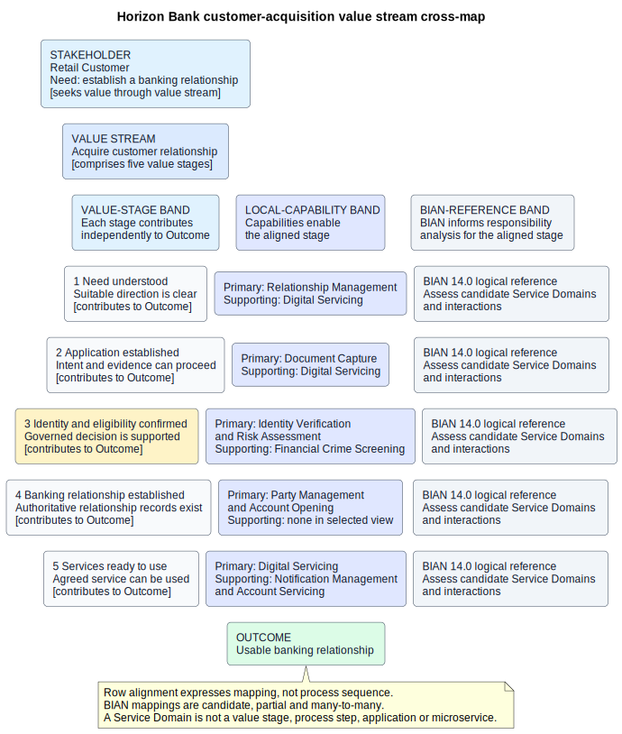

# 35. Modelling Bank Value Streams with BIAN

## Chapter purpose

This chapter shows how to model the way value accumulates for banking customers and other stakeholders, then use the Banking Industry Architecture Network (BIAN) to examine the logical responsibilities that may contribute. It develops a practical Horizon Bank portfolio of value streams and a detailed customer-acquisition cross-map.

A value stream is not a process flow, customer journey or application design. BIAN Service Domains do not become value stages. The useful result is a set of qualified relationships between different model types.

## Reader outcomes

By the end of this chapter, you should be able to:

- explain a banking value stream and the question it answers;
- distinguish a value stream from a capability, process and customer journey;
- identify stakeholders, triggering needs, value stages and outcomes;
- outline customer acquisition, product acquisition, payment, lending, servicing and risk-management value streams;
- map capabilities and candidate BIAN responsibilities to value stages without false equivalence;
- add measures, controls and ownership at the correct level; and
- review a Horizon Bank cross-map for gaps, invented mappings and mixed abstraction.

## Prerequisites and dependencies

Chapter 33 established Horizon Bank's operating model. Chapter 34 catalogued its processes. Chapters 13 and 14 introduced value streams and capability cross-maps. Chapter 36 will create BIAN-aligned Business Scenarios for selected events.

## Required models and artefacts

The chapter uses a value-stream portfolio, a value-stream definition record, a stage-to-capability cross-map and `FIG-35-01`, which adds a separate candidate BIAN responsibility band.

## Worked examples

Horizon Bank's retail customer acquisition value stream provides the detailed example. Shorter examples cover product acquisition, payment, lending, servicing and risk management.

## Source requirements

The Open Group's official public guides support value streams and capabilities as related business-architecture elements. Official BIAN Service Landscape 14.0 material supports the description of Service Domains as a reference structure. Stage names, mappings, measures and governance are original Horizon Bank teaching recommendations.

## What is a banking value stream?

In plain language, a value stream shows how value grows from a stakeholder's need to a worthwhile outcome. It describes meaningful stages of value, not every task used to produce that value.

For a retail customer, the need might be to manage everyday money. The outcome might be a usable banking relationship. Between them, value increases as the need is understood, an application is established, eligibility is confirmed, the relationship is established and services become ready to use.

A value-stream model answers:

- Who receives the value?
- What need or event starts the stream?
- What outcome is valuable to that stakeholder?
- Through which stable stages does value accumulate?
- Which capabilities enable each stage?
- Where do delay, failure, risk or poor experience reduce value?

Sponsors, product managers, business architects, process owners and transformation teams use the model. It helps them discuss outcomes across organisational boundaries before debating detailed workflow or software.

## Value stream, capability, process and journey

Four nearby models must remain distinct.

| Model | Question answered | Example | Not shown |
|---|---|---|---|
| Value stream | How does value accumulate for a stakeholder? | Establish a banking relationship | Detailed task sequence |
| Capability | What ability must the bank possess? | Identity Verification | Customer progress or workflow |
| Process | What work occurs from trigger to outcome? | Establish customer relationship | The stakeholder's experience alone |
| Customer journey | What does the customer experience across interactions and channels? | Apply on mobile, wait, supply evidence | The bank's full operating process |

A stage such as `Identity and eligibility confirmed` is a state of increased value. `Identity Verification` is an ability that helps create it. `Verify identity and screen` is process work. `Upload identity evidence` may be a customer-journey step. They relate, but none equals another.

This distinction prevents a common modelling trap: turning a high-level value stream into a disguised flowchart. If gateways, hand-offs, timers and exception paths are the concern, move to Business Process Model and Notation (BPMN). If emotions, channel changes and waiting are the concern, add a customer journey. Keep the value-stream stages stable enough for strategic comparison.

## Define a value stream before drawing it

Start with a short definition record:

| Field | Question |
|---|---|
| Name | What valuable outcome does the stream create? |
| Stakeholder | Who receives or recognises the value? |
| Triggering need | What need or event starts the stream? |
| Outcome | What condition makes the stream worthwhile? |
| Scope | Which products, segments, channels and legal entities are included? |
| Stages | What material increments of value occur? |
| Owner | Who stewards the definition and end-to-end improvement? |
| Measures | How will value, time, quality and risk be assessed? |
| Assumptions | Which local choices or uncertainties shape the model? |

Use outcome-oriented stage names. `Eligibility confirmed` is clearer than `Compliance department`. Avoid application names and tiny task verbs. Five to seven stages are often enough for an enterprise view, although this is guidance rather than a rule.

Each stage needs entry and exit meaning. A reviewer should be able to explain what additional value exists after the stage. The model may show a normal value path while recording that rejection, withdrawal and expiry are legitimate alternative outcomes. It should not imply that every case succeeds.

## A portfolio for a full-service bank

Horizon Bank needs more than one customer journey. Its value-stream portfolio provides navigation across major outcomes.

| Value stream | Primary stakeholder | Triggering need | Intended outcome |
|---|---|---|---|
| Acquire customer relationship | Prospective customer | Need for a banking relationship | Usable, appropriately established relationship |
| Acquire banking product | Existing or prospective customer | Need for a suitable product | Product available under agreed terms |
| Make payment | Payer and intended recipient | Need to transfer value | Payment outcome known and appropriately recorded |
| Obtain and use credit | Borrower | Need for finance | Suitable credit available and responsibly serviced |
| Receive ongoing service | Customer | Need, query or change | Need resolved with clear status |
| Protect bank and stakeholders | Customers, bank and authorities | Exposure or obligation arises | Risk understood and treated within authority |

Other streams may cover investing, trade, corporate liquidity and colleague or supplier value. The portfolio should not mirror departments. One value stream may cross sales, operations, compliance, data and technology.

## Customer acquisition

Horizon Bank's acquisition stream begins when a retail prospect seeks a banking relationship and ends when the agreed services are usable.

1. **Need understood.** The customer understands the proposition and the bank understands the broad need.
2. **Application established.** Required intent and evidence are captured sufficiently to proceed.
3. **Identity and eligibility confirmed.** Identity, risk and relevant screening outcomes support a governed decision.
4. **Banking relationship established.** Authoritative party, relationship and product records are created as appropriate.
5. **Services ready to use.** Access and status are communicated, and the customer can begin the agreed use.

Controlled capabilities contribute at different stages. Relationship Management and Digital Servicing enable need discovery. Document Capture enables application establishment. Identity Verification, Risk Assessment and Financial Crime Screening enable eligibility confirmation. Party Management and Account Opening enable relationship establishment. Digital Servicing, Notification Management and Account Servicing enable first use.

`FIG-35-01` keeps these contributions separate from the candidate BIAN band.

**Figure 35.1: Horizon Bank value-stream and BIAN responsibility cross-map.** Five customer-acquisition stages show the added stakeholder value, controlled enabling capabilities and a separately qualified BIAN 14.0 assessment point. Candidate mappings are partial and many-to-many; no Service Domain is presented as a stage, process step, application or microservice.

## Product acquisition

Product acquisition can begin with an understood need and progress through option understood, suitability or eligibility established, terms agreed, product established and product ready to use. For a current account, acquisition overlaps customer acquisition when the customer is new. For an existing customer it may reuse party information and focus on product-specific evidence and terms.

Product Management, Relationship Management, Risk Assessment, Account Opening and Digital Servicing may contribute. The corresponding process architecture supplies actual work, approvals and exceptions. Do not duplicate onboarding stages merely because a different product team owns part of the process.

## Payment

A payment value stream can be expressed as intent established, instruction accepted, execution assured, value transferred and outcome communicated. These names describe value to the payer and recipient, not internal messages.

Payment Initiation and Payment Screening contribute, together with Fraud Management, Notification Management and Account Servicing where relevant. A detailed cross-border payment process may include validation, screening, routing, settlement, repair and reconciliation. Those are process concerns. The value stream stays focused on whether the stakeholder can initiate a valid transfer and understand its outcome.

Measure the time to a meaningful status, completion or return, not merely the speed of the first interface response. A quick acceptance followed by an unexplained delay is not good stakeholder value.

## Lending

A lending value stream might progress through need understood, application established, affordability and risk assessed, offer agreed, funds available and credit responsibly serviced. Decline may be a valid alternative outcome if it is timely, explainable within policy and properly evidenced.

The `Lending Platform` is an application, not a capability or value stage. Risk Assessment and Relationship Management are controlled capabilities; additional lending capabilities should be added to the catalogue before repeated use. Detailed affordability rules belong in a governed decision model, while tasks and hand-offs belong in a process model.

## Customer servicing

The servicing stream begins when a customer has a need, question or problem. Stages might be need recognised, context understood, action agreed, change completed and outcome confirmed. Digital Servicing, Relationship Management, Account Servicing and Notification Management contribute.

Customer journeys are particularly useful alongside this stream because channel movement, waiting and repeated explanation affect perceived value. Process models remain necessary for operational ownership and repair. The value stream holds the shared outcome above both.

## Risk management

Not every stream has an external customer as its sole stakeholder. A risk-management stream may serve customers, the bank, shareholders and authorities. It can progress through exposure identified, significance understood, response agreed, treatment applied and residual position monitored.

Risk does not create customer value by merely adding checks. It protects sustainable value by making decisions and obligations explicit. Measures should balance loss, control quality, false positives, customer impact and response time. Financial Crime Screening, Payment Screening, Fraud Management and Data Governance may contribute in different scopes.

## Mapping stages to capabilities

A capability cross-map records which abilities contribute to each stage. Use `primary` for a capability central to creating the stage's value and `supporting` for a material contributor. Define these markers locally so reviewers do not interpret them as ownership or importance scores.

Do not double count a parent capability and all its children. In the onboarding example, `Customer Onboarding` is represented by its controlled children Document Capture, Identity Verification and Risk Assessment where detailed contribution is needed. Financial Crime Screening is a contributing level-one peer, not a child invented for the diagram.

The cross-map can reveal shared abilities. Digital Servicing contributes to acquisition, payment and servicing. Party Management supports several product journeys. Such reuse can guide investment, but the map does not decide organisation or application boundaries.

## Mapping stages to BIAN

BIAN's Service Landscape organises Service Domains as a logical reference structure. Use it after defining stakeholder value and local capabilities, not as a source of value-stage names.

For each stage:

1. write the stage outcome and local scope;
2. identify the capabilities and information involved;
3. examine BIAN 14.0 for candidate Service Domains whose responsibilities may contribute;
4. examine candidate interactions where collaboration matters;
5. record the BIAN version, rationale, scope and gaps; and
6. have a banking subject-matter reviewer confirm or reject the mapping.

The relationship is commonly many-to-many. One stage can need several logical responsibilities. One Service Domain may contribute to several stages or value streams. A candidate label is not evidence of alignment.

A BIAN Business Scenario shows selected Service Domain interactions in response to a business event. It can help test how responsibilities collaborate, but it is not the value stream and does not prescribe Horizon Bank's detailed process. Chapter 36 develops that model.

Never make a Service Domain a value stage, process step, organisation lane, application or microservice. BIAN can inform responsibility partitioning and shared semantics. Horizon Bank still decides customer outcomes, controls, organisation, implementation and measures.

## Ownership, controls and measures

A value-stream owner stewards the stakeholder outcome and cross-boundary improvement. Process owners remain accountable for the work that realises parts of the stream. Capability owners steward abilities. These roles may be held by the same person, but the accountabilities are different.

Attach controls at the stage whose value they protect, using a link to the underlying process control and evidence. Do not turn a stage into a list of checks. For eligibility confirmation, the value-stream view may state that identity and screening evidence constrain the stage; the process model shows where evidence is created and exceptions handled.

Use balanced measures:

- outcome completion and abandonment;
- end-to-end elapsed and waiting time;
- customer effort and complaints;
- quality, rework and data defects;
- control failures, referrals and false positives; and
- time until the stakeholder receives a meaningful status.

Every measure needs scope, definition, owner and source. Stage measures diagnose where value stalls; end-to-end measures prevent local optimisation.

## Governance and change impact

Store value streams as governed model elements with stable identifiers, definitions, owners and versions. Maintain explicit relationships to capabilities, processes, controls, measures and candidate BIAN references. Presentation diagrams remain views of that repository content.

Review a stream when customer needs, products, obligations or operating boundaries change. If a capability deteriorates, find every affected stage. If a Service Domain changes between BIAN releases, reassess the qualified mappings without renaming local stages automatically. If a process changes, test whether stakeholder value or only the method of delivery changed.

## Common mistakes

- **Writing tasks as value stages.** Name increments of stakeholder value.
- **Starting with departments.** Start with stakeholder, need and outcome.
- **Treating a customer journey as the full process.** Add operational and behavioural views separately.
- **Making every capability primary.** Distinguish central from supporting contribution.
- **Double counting capabilities.** Do not list a parent alongside all represented children.
- **Copying process metrics onto stages.** Define value and stage measures deliberately.
- **Ignoring alternative outcomes.** Decline, withdrawal, return and expiry can be governed outcomes.
- **Pasting BIAN names onto stages.** Assess candidate responsibilities with rationale and version.
- **Equating a Service Domain with a microservice.** Deployment remains a local design choice.
- **Using the map once.** Govern relationships so impact analysis stays useful.

## Chapter summary

Bank value streams describe how value grows for a stakeholder. Capabilities enable stages, processes perform work, customer journeys describe experience and BIAN can inform logical responsibilities. A governed cross-map connects these views without making them equivalent.

## Completion checklist

- [ ] The stakeholder, triggering need, scope and intended outcome are explicit.
- [ ] Stage names describe increased value rather than tasks, units or systems.
- [ ] Alternative outcomes are acknowledged.
- [ ] Controlled capabilities map as primary or supporting contributors.
- [ ] Parent and child capabilities are not double counted.
- [ ] Processes and journeys remain separate linked models.
- [ ] Controls and balanced measures have owners and sources.
- [ ] BIAN version, candidate status, rationale and gaps are recorded.
- [ ] No Service Domain is treated as a stage, process step, application or microservice.
- [ ] Repository relationships support change-impact analysis.

## Key takeaways

- A value stream shows increasing stakeholder value, not detailed workflow.
- Stakeholder, need, outcome and scope come before stage names.
- Capabilities enable stages; processes perform the work.
- Customer journeys explain experience and channels.
- BIAN informs candidate logical responsibilities and interactions.
- Stage-to-BIAN mappings are qualified and often many-to-many.
- Balanced measures keep local speed from hiding poor outcomes or controls.
- Governed links make the model reusable during change.

## Practical exercise

Model Horizon Bank's `Make payment` value stream in five stages. State the payer's need and intended outcome. Map Payment Initiation, Payment Screening, Fraud Management, Notification Management and Account Servicing as primary or supporting contributors.

For each stage, add a candidate BIAN assessment placeholder rather than inventing a Service Domain name. Explain how you would verify candidates against BIAN 14.0. Add one alternative outcome, two controls and four balanced measures.

A sound answer will describe value such as instruction accepted and outcome communicated, not tasks such as call API. It will separate the detailed payment process and customer journey, qualify every BIAN mapping, and avoid making a Service Domain a stage or microservice.

## Review checklist

- [ ] Plain language precedes formal terminology.
- [ ] Every stream answers a stakeholder-value question.
- [ ] Capability, value stream, process, journey and BIAN concepts are distinct.
- [ ] Horizon Bank capability names match the controlled example.
- [ ] Customer, product, payment, lending, servicing and risk examples remain at comparable abstraction.
- [ ] The figure is original, page-readable and remains at `Review`.
- [ ] Recommendations are identified as local guidance.
- [ ] British English is used, acronyms are defined and no em dashes remain.

## References and further reading

- The Open Group, [TOGAF Series Guide: Value Streams](https://publications.opengroup.org/g178), 25 April 2022, accessed 2 July 2026.
- The Open Group, [TOGAF Series Guide: Business Capabilities V2](https://publications.opengroup.org/g211), 25 April 2022, accessed 2 July 2026.
- BIAN, [Service Landscape 14.0](https://bian.org/deliverables/service-landscape/), February 2026, accessed 12 July 2026.
- Chapter 14, [Modelling Business Strategy and Capabilities](../part-03-diagram-selection/14-business-strategy-capabilities.md), explains capability cross-maps.
